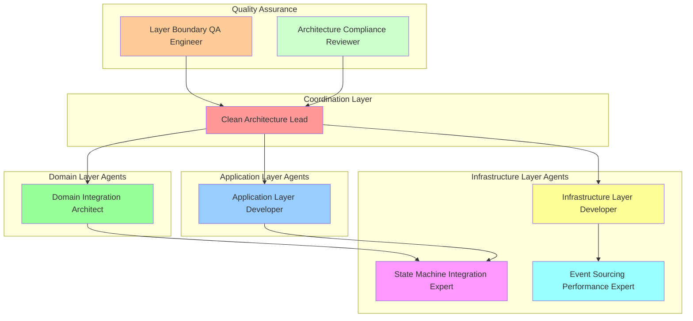

# Agent Deployment Strategy - Clean Architecture Phase Transition Fix

**Document Purpose**: Comprehensive agent deployment strategy aligned with Clean Architecture principles  
**Created**: 2025-01-08  
**Context**: Phase transition bug fix with architecture integrity preservation

## Executive Summary

Based on the comprehensive analysis of the backend architecture and the existing phase transition fix plan, this document outlines the optimal agent deployment strategy that leverages Clean Architecture patterns to ensure maintainable, scalable, and architecturally sound solutions.

### Key Strategic Insights

1. **Clean Architecture Integrity**: 375+ files across 4 proper layers must be preserved
2. **State Machine Gap**: Engine layer operates independently from domain layer
3. **Event Sourcing Opportunity**: Infrastructure available but disabled
4. **Layer-Aligned Coordination**: Agent responsibilities must respect architectural boundaries

## Optimal Agent Configuration

### **Enhanced 8-Agent Swarm Architecture**



## Agent Specialization Matrix

### **Domain Layer Focus**

#### **Domain Integration Architect**
- **Primary Responsibility**: Preserve domain layer purity while enabling state machine integration
- **Key Challenge**: Consolidate duplicate `GamePhase` enums without introducing dependencies
- **Architecture Constraint**: Zero infrastructure dependencies in domain layer
- **Success Metric**: Domain business rules enhanced, not replaced, by state machine

**Specialized Tasks:**
- Analyze `domain/entities/game.py:215-219` vs `engine/state_machine/core.py:15-26` enum duplication
- Design domain event emission strategy for state machine phase transitions
- Ensure weak hand business rules in `domain/entities/game.py:245-296` remain authoritative
- Validate state machine integration preserves domain layer testability

### **Application Layer Focus**

#### **Application Layer Developer**
- **Primary Responsibility**: Modify use cases for state machine coordination without violating Clean Architecture
- **Key Challenge**: Replace direct domain calls with orchestrated state machine coordination
- **Architecture Constraint**: Application layer orchestrates, doesn't implement business logic
- **Success Metric**: Use cases coordinate state machine through proper interfaces

**Specialized Tasks:**
- Modify `application/use_cases/game/start_game.py:106` to coordinate through state machine service
- Create `application/interfaces/services.py:StateMachineService` interface
- Ensure event publishing flows through application layer coordination
- Validate use case orchestration respects dependency inversion principle

### **Infrastructure Layer Focus**

#### **Infrastructure Layer Developer**
- **Primary Responsibility**: Enable event sourcing while maintaining Clean Architecture patterns
- **Key Challenge**: Create infrastructure services that implement application interfaces
- **Architecture Constraint**: Infrastructure implements interfaces, doesn't define business logic
- **Success Metric**: Event sourcing enhances architecture without complicating it

**Specialized Tasks:**
- Enable `USE_EVENT_SOURCING` in `infrastructure/feature_flags.py:85`
- Enhance `CompositeEventPublisher` in `infrastructure/dependencies.py:96-109`
- Optimize `EventStorePublisher` in `infrastructure/events/application_event_publisher.py:193-245`
- Ensure infrastructure adapts to domain and application layer requirements

#### **State Machine Integration Expert**
- **Primary Responsibility**: Bridge state machine with Clean Architecture layers
- **Key Challenge**: Integrate sophisticated state machine without bypassing domain layer
- **Architecture Constraint**: State machine enhances domain entities, doesn't replace them
- **Success Metric**: State machine coordination preserves Clean Architecture integrity

**Specialized Tasks:**
- Integrate `GameStateMachine` with `domain/entities/game.py` through infrastructure service
- Ensure `engine/state_machine/states/preparation_state.py:138` calls domain weak hand validation
- Design state machine event integration with domain event system
- Validate state machine doesn't create circular dependencies

#### **Event Sourcing Performance Expert**
- **Primary Responsibility**: Optimize event sourcing without compromising real-time performance
- **Key Challenge**: Maintain <10ms event latency with event persistence enabled
- **Architecture Constraint**: Performance optimizations must respect layer boundaries
- **Success Metric**: Event sourcing enhances system without performance degradation

**Specialized Tasks:**
- Optimize `CompositeEventPublisher` for minimal latency impact
- Ensure event persistence doesn't create bottlenecks in real-time game flow
- Monitor cross-layer communication performance impact
- Validate event sourcing integration maintains game responsiveness

### **Quality Assurance Focus**

#### **Layer Boundary QA Engineer**
- **Primary Responsibility**: Validate Clean Architecture compliance throughout integration
- **Key Challenge**: Ensure no layer boundary violations during state machine integration
- **Architecture Constraint**: All changes must preserve dependency inversion
- **Success Metric**: Zero architectural violations post-integration

**Specialized Tasks:**
- Create tests ensuring domain layer remains pure (no infrastructure dependencies)
- Validate application layer coordinates without implementing business logic
- Test infrastructure layer properly implements application interfaces
- Ensure state machine integration doesn't create circular dependencies

#### **Architecture Compliance Reviewer**
- **Primary Responsibility**: Continuous architecture compliance monitoring
- **Key Challenge**: Balance feature implementation with architectural integrity
- **Architecture Constraint**: All changes must enhance existing Clean Architecture
- **Success Metric**: Enhanced functionality with improved architectural quality

**Specialized Tasks:**
- Review all code changes for Clean Architecture compliance
- Validate dependency directions remain correct post-integration
- Ensure interface segregation principles maintained
- Confirm single responsibility principle preserved across layers

## Deployment Strategy

### **Phase-Aligned Agent Activation**

#### **Phase 1: Infrastructure Foundation (30 minutes)**
**Active Agents:**
- Infrastructure Layer Developer (Lead)
- Event Sourcing Performance Expert (Support)
- Architecture Compliance Reviewer (Monitor)

**Coordination Pattern:**
```bash
# Infrastructure-focused deployment
npx claude-flow@alpha hooks pre-task --layer "infrastructure" --agents 3
```

**Tasks:**
- Enable event sourcing feature flag
- Validate `CompositeEventPublisher` functionality
- Establish performance baseline

#### **Phase 2: Domain Layer Integration (45 minutes)**
**Active Agents:**
- Domain Integration Architect (Lead)
- Layer Boundary QA Engineer (Support)
- Clean Architecture Lead (Coordinate)

**Coordination Pattern:**
```bash
# Domain-focused deployment with compliance monitoring
npx claude-flow@alpha hooks pre-task --layer "domain" --preserve-purity true
```

**Tasks:**
- Consolidate `GamePhase` enum definitions
- Design domain event integration strategy
- Validate domain layer purity preservation

#### **Phase 3: Application Layer Coordination (90 minutes)**
**Active Agents:**
- Application Layer Developer (Lead)
- State Machine Integration Expert (Support)
- Architecture Compliance Reviewer (Monitor)
- Clean Architecture Lead (Coordinate)

**Coordination Pattern:**
```bash
# Application orchestration with state machine integration
npx claude-flow@alpha hooks pre-task --layer "application" --coordinate-state-machine true
```

**Tasks:**
- Modify use cases for state machine coordination
- Create state machine service interfaces
- Integrate event publishing coordination

#### **Phase 4: Cross-Layer Integration Testing (60 minutes)**
**Active Agents:**
- Layer Boundary QA Engineer (Lead)
- Event Sourcing Performance Expert (Performance)
- All agents (Validation)

**Coordination Pattern:**
```bash
# Comprehensive integration testing with performance validation
npx claude-flow@alpha hooks pre-task --layer "all" --validate-integration true
```

**Tasks:**
- End-to-end architecture compliance testing
- Performance regression validation
- Cross-layer communication verification

## Coordination Protocols

### **Clean Architecture Coordination Hooks**

```bash
# Pre-task coordination with layer awareness
npx claude-flow@alpha hooks pre-task \
  --description "[agent task]" \
  --layer "[domain|application|infrastructure|api]" \
  --preserve-boundaries true \
  --validate-dependencies true

# During-work coordination with compliance checking
npx claude-flow@alpha hooks post-edit \
  --file "[file]" \
  --memory-key "clean-arch/[layer]/[agent]/[step]" \
  --layer-impact "[affected layers]" \
  --boundary-check true

# Post-task validation with architecture compliance
npx claude-flow@alpha hooks post-task \
  --task-id "[task]" \
  --analyze-performance true \
  --architecture-compliance true \
  --dependency-validation true
```

### **Layer-Specific Memory Coordination**

```bash
# Domain layer decisions
npx claude-flow@alpha memory store \
  "clean-arch/domain/decisions" \
  "GamePhase enum consolidated, business rules preserved"

# Application layer coordination
npx claude-flow@alpha memory store \
  "clean-arch/application/coordination" \
  "Use cases modified for state machine orchestration through interfaces"

# Infrastructure layer implementation
npx claude-flow@alpha memory store \
  "clean-arch/infrastructure/implementation" \
  "Event sourcing enabled, state machine service created"

# Cross-layer integration status
npx claude-flow@alpha memory store \
  "clean-arch/integration/status" \
  "Layer boundaries preserved, performance targets met"
```

## Success Metrics and Validation

### **Architecture Quality Metrics**

#### **Clean Architecture Compliance:**
- ✅ Domain layer: Zero infrastructure dependencies maintained
- ✅ Application layer: Orchestrates without business logic implementation
- ✅ Infrastructure layer: Implements interfaces without business logic leakage
- ✅ Dependency inversion: All dependencies point inward to domain layer

#### **State Machine Integration Quality:**
- ✅ State machine enhances domain entities without replacing them
- ✅ Phase transitions emit domain events through proper layer flow
- ✅ Business rules remain in domain layer, state machine coordinates them
- ✅ No circular dependencies introduced between layers

#### **Performance with Architecture Compliance:**
- ✅ Event sourcing latency <10ms with proper layer separation
- ✅ State machine coordination overhead <5ms per transition
- ✅ Cross-layer communication impact <2ms per request
- ✅ Total system latency increase <15ms for enhanced functionality

### **Agent Coordination Effectiveness Metrics**

#### **Layer-Aligned Productivity:**
- Domain Integration Architect: Business rule preservation rate 100%
- Application Layer Developer: Interface compliance rate 100%
- Infrastructure Layer Developer: Service implementation quality score >95%
- State Machine Integration Expert: Integration success without violations

#### **Quality Assurance Effectiveness:**
- Layer Boundary QA Engineer: Architecture violation detection rate 100%
- Architecture Compliance Reviewer: Code review approval rate with zero violations
- Performance Expert: Latency targets met while maintaining architecture

## Risk Mitigation

### **Architecture-Specific Risks**

#### **High Risk: Layer Boundary Violations**
**Mitigation:**
- Continuous architecture compliance monitoring through dedicated agents
- Automated boundary validation in coordination hooks
- Layer-specific agent specialization prevents cross-layer contamination

#### **Medium Risk: Performance Impact from Layer Separation**
**Mitigation:**
- Dedicated Event Sourcing Performance Expert for optimization
- Real-time performance monitoring during integration
- Performance regression testing with architecture compliance validation

#### **Low Risk: Coordination Complexity**
**Mitigation:**
- Clean Architecture Lead provides cross-layer coordination
- Layer-specific memory organization prevents coordination conflicts
- Structured agent activation phases reduce coordination overhead

## Deployment Command

### **Production-Ready Deployment**

```bash
# Deploy Clean Architecture-aligned swarm with performance monitoring
npx claude-flow@alpha --agents 8 \
  --topology hierarchical \
  --strategy clean_architecture_aligned \
  --task "Fix phase transition bug with Clean Architecture integration" \
  --layers "domain,application,infrastructure,api" \
  --preserve-boundaries true \
  --monitor-performance true \
  --validate-compliance true \
  --memory-namespace "clean-arch-phase-fix"
```

This deployment strategy ensures that the phase transition bug fix enhances rather than compromises the existing Clean Architecture, providing a maintainable, scalable, and architecturally sound solution that serves as a foundation for future development.