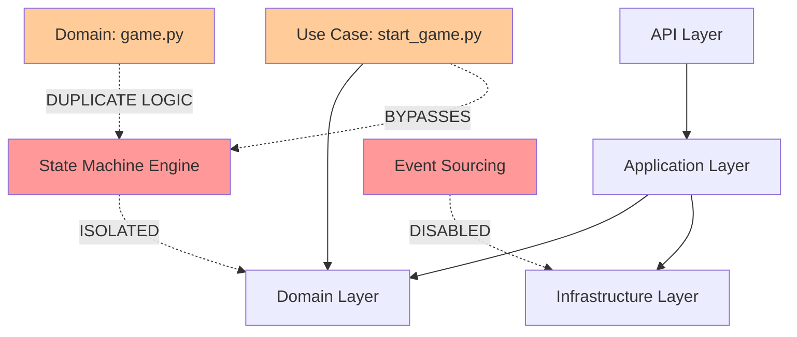
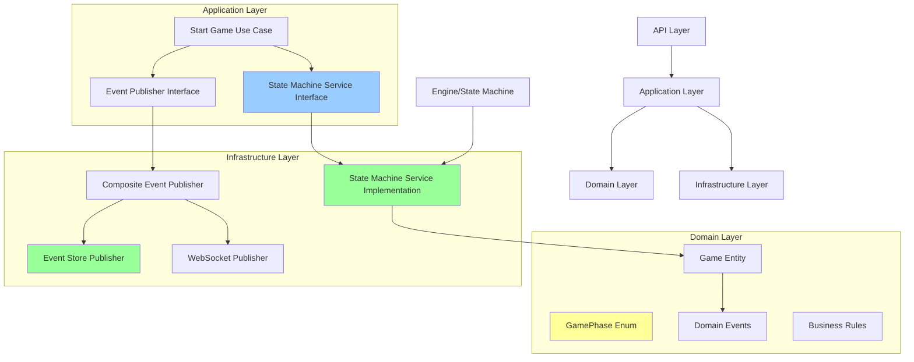
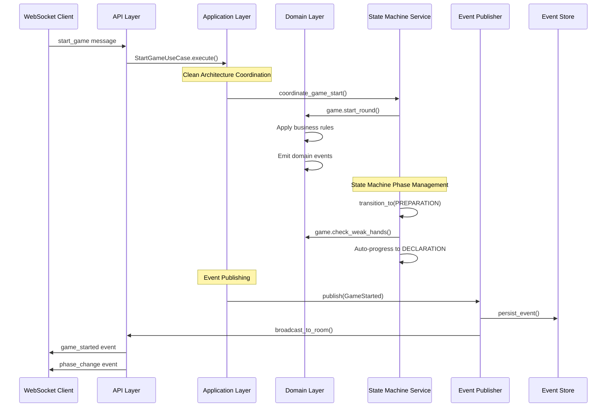
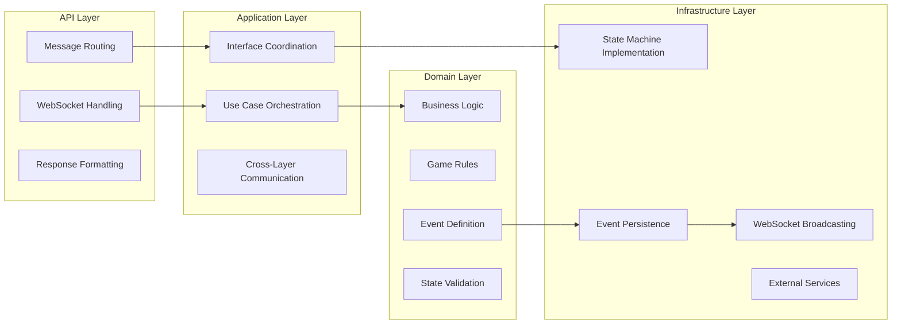
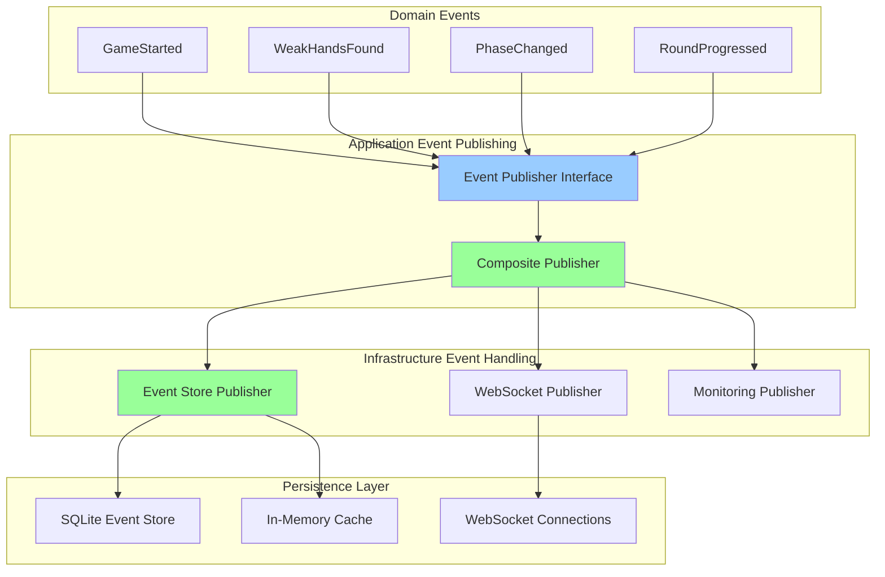
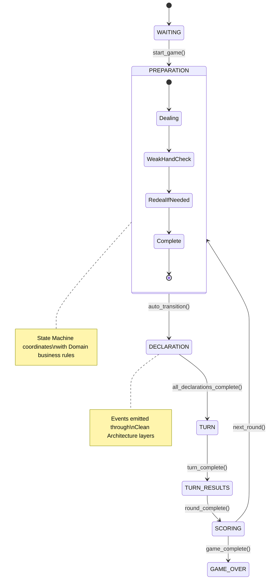
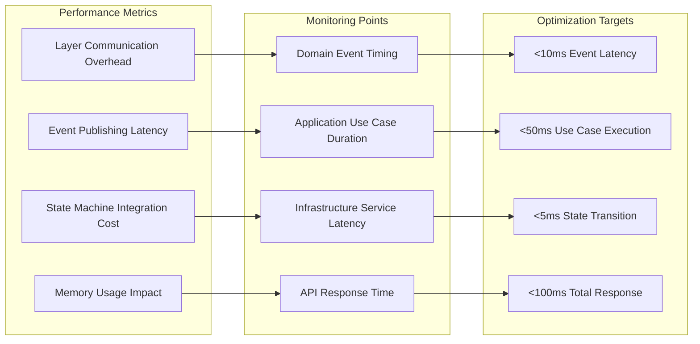
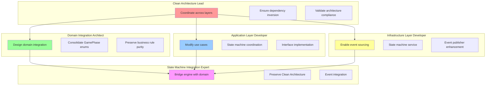

# Clean Architecture Integration Diagrams

**Document Purpose**: Visual representation of state machine integration with Clean Architecture patterns  
**Created**: 2025-01-08  
**Context**: Phase transition bug fix with Clean Architecture preservation

## Current vs Enhanced Architecture

### **Current Architecture Issue**



**Problems:**
- State Machine operates independently from Clean Architecture
- Application layer bypasses state machine logic
- Domain logic duplicated between layers
- Event sourcing disabled breaks persistence chain

### **Enhanced Clean Architecture Integration**



**Solutions:**
- State Machine integrated as Infrastructure Service
- Application layer coordinates through interfaces
- Single source of truth for domain concepts
- Event sourcing enabled with proper flow

## State Machine Integration Flow

### **Clean Architecture Message Flow**



### **Layer Responsibility Matrix**



## Event Sourcing Integration

### **Event Flow with Clean Architecture**



### **State Machine Phase Transitions**



## Performance and Monitoring

### **Clean Architecture Performance Impact**



### **Agent Deployment Architecture**



## Implementation Phases with Clean Architecture

### **Phase Progression with Layer Alignment**

```mermaid
gantt
    title Clean Architecture Phase Transition Fix
    dateFormat X
    axisFormat %s
    
    section Phase 1: Infrastructure
    Enable Event Sourcing: 0, 30m
    CompositeEventPublisher: 15m, 30m
    
    section Phase 2: Domain Layer
    Consolidate GamePhase: 30m, 60m
    Domain Event Integration: 45m, 75m
    
    section Phase 3: Application Layer
    Use Case Modification: 60m, 120m
    State Machine Interface: 90m, 150m
    
    section Phase 4: Integration
    Cross-Layer Testing: 120m, 180m
    Architecture Validation: 150m, 210m
    
    section Phase 5: Production
    Performance Validation: 180m, 240m
    Documentation Update: 210m, 270m
```

This integration approach ensures that the phase transition bug fix enhances rather than compromises the existing Clean Architecture implementation, providing a maintainable and scalable solution.