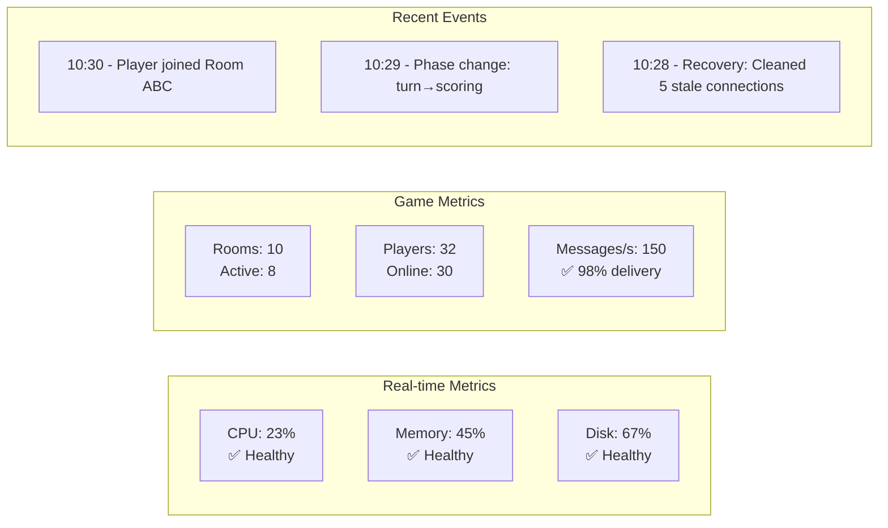
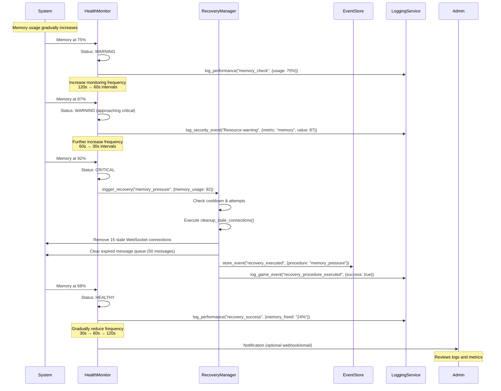
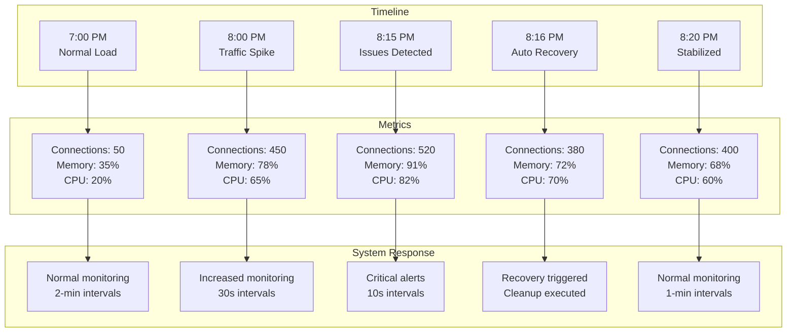
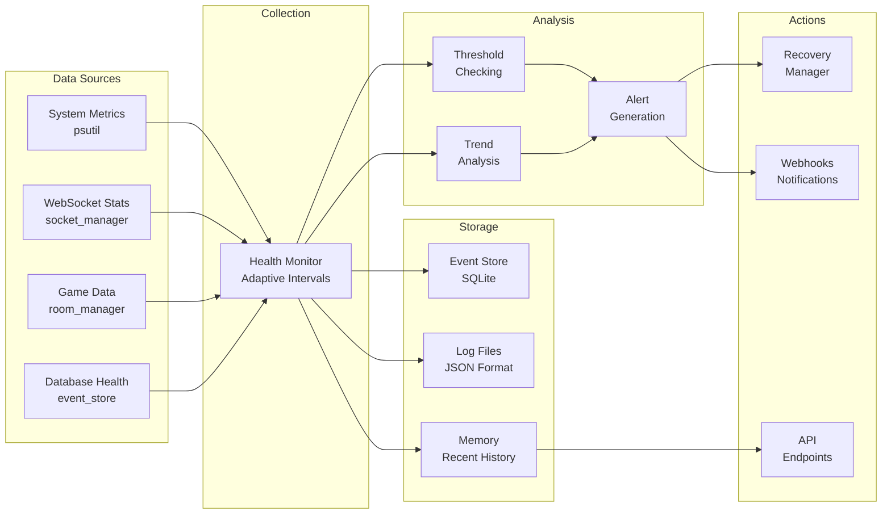

# Liap Tui Monitoring & Observability System Explained

## Overview

The Liap Tui system implements a comprehensive monitoring and observability infrastructure that provides real-time health monitoring, automatic recovery, event sourcing, and structured logging. This enterprise-grade system ensures high availability and maintainability.

## Architecture Diagram

```mermaid
graph TB
    subgraph "Monitoring Components"
        HM[Health Monitor<br/>System Health]
        RM[Recovery Manager<br/>Auto Recovery]
        ES[Event Store<br/>Event Sourcing]
        LS[Logging Service<br/>Structured Logs]
    end
    
    subgraph "Data Collection"
        SM[System Metrics<br/>CPU/Memory/Disk]
        WM[WebSocket Metrics<br/>Connections/Messages]
        GM[Game Metrics<br/>Rooms/Players]
        DM[Database Metrics<br/>Response Times]
    end
    
    subgraph "Endpoints"
        HE[/health<br/>Basic Health]
        HD[/health/detailed<br/>Full Status]
        HME[/health/metrics<br/>Prometheus Format]
        RS[/recovery/status<br/>Recovery Info]
        ESS[/event-store/stats<br/>Event Stats]
    end
    
    subgraph "Actions"
        AR[Automatic Recovery<br/>Procedures]
        AL[Alerting<br/>Notifications]
        CL[Cleanup<br/>Old Data]
    end
    
    SM --> HM
    WM --> HM
    GM --> HM
    DM --> HM
    
    HM --> RM
    HM --> HE
    HM --> HD
    HM --> HME
    
    RM --> AR
    ES --> ESS
    LS --> AL
    
    HM -.-> LS
    RM -.-> LS
    ES -.-> LS
```

## 1. Health Monitoring System

The `HealthMonitor` class provides comprehensive system health tracking with **adaptive, event-driven monitoring** instead of fixed polling intervals.

### Key Features:

#### **Adaptive Monitoring Intervals**
```python
# Example from _monitor_system_resources()
if has_warnings:
    check_interval = max(10, check_interval / 2)  # More frequent on issues
    consecutive_healthy = 0
else:
    consecutive_healthy += 1
    if consecutive_healthy > 5:
        check_interval = min(120, check_interval * 1.2)  # Less frequent when healthy
```

The system adapts monitoring frequency based on conditions:
- **Healthy**: Checks every 30s → 120s (gradually increasing)
- **Issues Detected**: Checks every 10s → 30s (more frequent)
- **After Errors**: Resets to default interval

#### **Monitored Metrics**

1. **System Resources**
   - CPU usage (threshold: 80%)
   - Memory usage (threshold: 85%)
   - Disk usage (threshold: 90%)
   - Available memory in GB
   - Free disk space in GB

2. **WebSocket Health**
   - Active connections (threshold: 1000)
   - Pending messages (threshold: 100)
   - Message delivery rate (threshold: 95%)
   - Message failure rate (threshold: 10%)

3. **Database Health**
   - Connection availability
   - Response time (threshold: 500ms)
   - Query performance

4. **Game Performance**
   - Total rooms
   - Active games
   - Total players
   - Room/game ratios

### Health Status Levels

```python
class HealthStatus(Enum):
    HEALTHY = "healthy"     # All metrics within thresholds
    WARNING = "warning"     # Some metrics approaching limits
    CRITICAL = "critical"   # Critical thresholds exceeded
    UNKNOWN = "unknown"     # Unable to determine status
```

### Health Check Endpoints

#### **Basic Health Check** (`/health`)
```json
{
  "status": "healthy",
  "timestamp": 1735234567.89,
  "uptime_seconds": 3600,
  "uptime_formatted": "01:00:00",
  "version": "1.0.0",
  "service": "liap-tui-backend"
}
```
Returns HTTP 200 for healthy, 503 for critical/unknown.

#### **Detailed Health Check** (`/health/detailed`)
```json
{
  "success": true,
  "health": {
    "overall_status": "healthy",
    "metrics": {
      "memory": {
        "name": "memory_usage",
        "status": "healthy",
        "value": 45.2,
        "threshold": 85.0,
        "message": "Memory usage: 45.2%"
      },
      "websocket": {
        "name": "websocket",
        "status": "healthy",
        "value": {"connections": 42, "pending": 3},
        "message": "WebSocket: 42 connections, 3 pending"
      }
    }
  }
}
```

#### **Prometheus Metrics** (`/health/metrics`)
```text
liap_memory_usage_percent 45.2
liap_cpu_usage_percent 23.5
liap_disk_usage_percent 67.8
liap_websocket_connections_total 42
liap_websocket_pending_messages_total 3
liap_rooms_total 10
liap_active_games_total 8
liap_health_status 0
liap_uptime_seconds 3600
```

## 2. Recovery Management System

The `RecoveryManager` implements automatic recovery procedures triggered by health issues.

### Recovery Procedures

1. **Stale Connections Cleanup**
   - Trigger: WebSocket failure rate > 15%
   - Action: Remove dead connections
   - Max attempts: 5, Cooldown: 30s

2. **High Pending Messages**
   - Trigger: Pending messages > 100
   - Action: Clear old messages (> 5 minutes)
   - Max attempts: 3, Cooldown: 60s

3. **Room State Corruption**
   - Trigger: Invalid room state detected
   - Action: Restart room, notify players
   - Max attempts: 2, Cooldown: 120s

4. **Client Desynchronization**
   - Trigger: Client sequence gap > 10
   - Action: Force client sync
   - Max attempts: 3, Cooldown: 30s

5. **Memory Pressure**
   - Trigger: Memory usage > 90%
   - Action: Cleanup connections, clear caches
   - Max attempts: 3, Cooldown: 60s

6. **System Overload**
   - Trigger: CPU > 95% AND Memory > 95%
   - Action: Emergency protection mode
   - Max attempts: 1, Cooldown: 300s

### Recovery Status Endpoint (`/recovery/status`)

```json
{
  "is_active": true,
  "total_procedures": 7,
  "recent_attempts": 3,
  "success_rate": 66.7,
  "procedures": {
    "memory_pressure": {
      "description": "Clean up to reduce memory usage",
      "max_attempts": 3,
      "cooldown_seconds": 60,
      "severity": "high",
      "recent_attempts": 2
    }
  },
  "recent_history": [
    {
      "procedure_name": "high_pending_messages",
      "action": "clear_pending_messages",
      "timestamp": 1735234567.89,
      "success": true,
      "context": {"pending_messages": 150}
    }
  ]
}
```

## 3. Event Sourcing System

The `EventStore` provides complete event history for debugging, auditing, and client recovery.

### Features:

1. **Persistent Storage**
   - SQLite database with indexed queries
   - Automatic sequence numbering
   - Timestamp tracking

2. **Event Types Tracked**
   - Phase changes
   - Player actions
   - Game state updates
   - Room events
   - System events

3. **Client Recovery**
   ```python
   # Get events since last known sequence
   events = await event_store.get_events_since(room_id, last_sequence)
   ```

4. **State Reconstruction**
   ```python
   # Rebuild game state from events
   state = await event_store.replay_room_state(room_id)
   ```

### Event Store Endpoints

- `/rooms/{room_id}/events/{since_sequence}` - Get missed events
- `/rooms/{room_id}/state` - Get reconstructed state
- `/event-store/stats` - Event statistics
- `/event-store/cleanup` - Remove old events

## 4. Structured Logging System

The `GameLogger` provides JSON-formatted structured logging with correlation IDs.

### Log Categories:

1. **Game Events**
   ```json
   {
     "timestamp": "2025-06-27T10:30:00Z",
     "level": "INFO",
     "message": "Game event: phase_change",
     "context": {
       "correlation_id": "abc123",
       "room_id": "ROOM123",
       "player_id": "Alice"
     },
     "event_type": "phase_change",
     "old_phase": "preparation",
     "new_phase": "declaration"
   }
   ```

2. **WebSocket Events**
   - Connection events
   - Message delivery tracking
   - Client sync operations

3. **Performance Metrics**
   - Operation durations
   - Slow operation warnings
   - Resource usage

4. **Security Events**
   - Authentication attempts
   - Suspicious activities
   - Access violations

5. **Error Tracking**
   - Exception details
   - Stack traces
   - Context information

### Correlation IDs

Every operation gets a unique correlation ID for tracing:
```python
with game_logger.log_context(room_id="ABC123", player_id="Alice") as ctx:
    # All logs within this context share the correlation ID
    game_logger.log_game_event("player_joined")
```

## 5. Monitoring Best Practices

### Event-Driven Architecture Benefits

1. **Resource Efficiency**
   - No wasted CPU on polling unchanged data
   - Adaptive intervals based on system state
   - Immediate response to critical issues

2. **Scalability**
   - Monitoring overhead scales with activity
   - Quiet systems use minimal resources
   - Busy systems get more attention

3. **Responsiveness**
   - Critical issues detected within seconds
   - Automatic recovery triggered immediately
   - No waiting for next poll cycle

### Integration with External Tools

The system is designed to integrate with standard monitoring tools:

1. **Prometheus**
   - `/health/metrics` endpoint provides Prometheus-format metrics
   - Can be scraped by Prometheus server
   - Compatible with Grafana dashboards

2. **ELK Stack**
   - JSON logs ready for Elasticsearch ingestion
   - Structured format for easy querying
   - Correlation IDs for distributed tracing

3. **Alerting**
   - Health status changes can trigger alerts
   - Recovery failures logged as critical
   - Integration hooks for PagerDuty, Slack, etc.

## 6. Monitoring Dashboard Example



## Summary

The monitoring and observability system provides:

1. **Proactive Health Monitoring** - Adaptive intervals, not fixed polling
2. **Automatic Recovery** - Self-healing for common issues
3. **Complete Audit Trail** - Event sourcing for debugging
4. **Structured Logging** - JSON format with correlation IDs
5. **Standard Integrations** - Prometheus metrics, JSON logs
6. **Performance Tracking** - Operation timing and slow query detection

This comprehensive system ensures the Liap Tui game platform maintains high availability, quick issue detection, and easy debugging capabilities in production environments.

# Monitoring System in Action - Example Scenario

## Scenario: Memory Pressure Leading to Automatic Recovery

This diagram shows how the monitoring system detects and automatically recovers from a memory pressure situation.



## Real-World Example: Game Night Traffic Spike



## Monitoring Data Flow



## Key Monitoring Features in Action

### 1. **Adaptive Monitoring**
The system automatically adjusts monitoring frequency based on conditions:
- **Healthy System**: Checks every 2-5 minutes
- **Warning State**: Checks every 30-60 seconds  
- **Critical State**: Checks every 10-30 seconds
- **During Recovery**: Continuous monitoring

### 2. **Automatic Recovery Chain**
When issues are detected:
1. Health monitor detects threshold breach
2. Recovery manager checks if action is allowed (cooldown, max attempts)
3. Appropriate recovery procedure is executed
4. Results are logged and stored
5. System health is re-evaluated
6. Monitoring frequency adjusts accordingly

### 3. **Comprehensive Logging**
Every step is logged with:
- Correlation IDs for tracing
- Structured JSON format
- Contextual information
- Performance metrics
- Error details with stack traces

### 4. **Client Impact Mitigation**
During recovery:
- Stale connections cleaned without affecting active users
- Clients automatically reconnect with event recovery
- Game state preserved through event sourcing
- Players notified of any disruptions

## Benefits of This Architecture

1. **Self-Healing**: System recovers from common issues without manual intervention
2. **Proactive**: Issues detected and addressed before users notice
3. **Efficient**: Event-driven approach minimizes resource usage
4. **Transparent**: Complete visibility into system behavior
5. **Scalable**: Monitoring overhead scales with system load

This monitoring and observability system ensures the Liap Tui platform maintains high availability even during peak usage or unexpected issues.