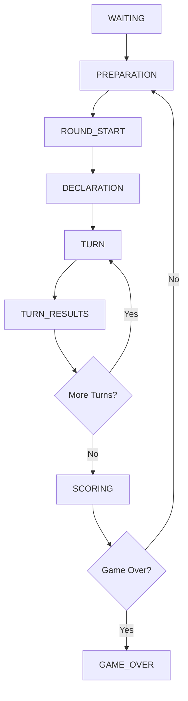

# Game Phase States Investigation Report

## 🔍 Executive Summary

After comprehensive analysis of the Game Phase States system, I've identified the **root cause** of the game start navigation issue where players get stuck on the waiting page instead of transitioning to the game page. The primary issue is a **PiecesDealt event parameter mismatch** that breaks the entire event flow chain, preventing proper phase transitions from WAITING → PREPARATION → ROUND_START.

### Quick Facts
- **Primary Issue**: Event parameter mismatch in game start flow
- **Impact**: Players stuck on waiting page during game start
- **Components Affected**: State machine, event system, WebSocket communication
- **Fix Complexity**: Medium (requires event system validation and state machine verification)

---

## 🚨 Critical Issues Identified

### 1. PiecesDealt Event Parameter Mismatch (CRITICAL)

**Location**: `backend/application/use_cases/game/start_game.py:205`

**Issue**: The PiecesDealt event creation may have parameter structure issues that prevent successful event publication.

**Code Reference**:
```python
# Current implementation (lines 201-209)
pieces_dealt = PiecesDealt(
    metadata=EventMetadata(user_id=request.user_id),
    room_id=room.room_id,
    round_number=1,
    player_pieces={
        p.name: [piece.kind for piece in p.hand] for p in game.players
    },
)
await self._event_publisher.publish(pieces_dealt)
```

**Event Class Definition** (`backend/domain/events/game_events.py:189-200`):
```python
@dataclass(frozen=True)
class PiecesDealt(GameEvent):
    """Pieces have been dealt to players."""
    
    round_number: int
    player_pieces: Dict[str, List[str]]  # player_name -> piece kinds
```

**Impact**: Event publication failure breaks the WAITING → PREPARATION phase transition chain.

### 2. State Machine Phase Transition Flow (HIGH)

**Component**: Game State Machine (`backend/engine/state_machine/`)

**Phase Transition Chain**:
1. **WAITING** (`states/waiting_state.py`) → Room setup, player connections
2. **PREPARATION** (`states/preparation_state.py`) → Card dealing, weak hand detection  
3. **ROUND_START** (`states/round_start_state.py`) → Display round info (5-second auto-transition)
4. **DECLARATION** (`states/declaration_state.py`) → Player declarations

**Critical Transition Logic**:

*WAITING → PREPARATION* (`waiting_state.py:241-247`):
```python
async def check_transition_conditions(self) -> Optional[GamePhase]:
    """Check if ready to transition to preparation phase"""
    if self.game_start_requested and self.room_setup_complete:
        self.logger.info("🚀 Waiting phase complete - transitioning to preparation")
        return GamePhase.PREPARATION
    return None
```

*ROUND_START → DECLARATION* (`round_start_state.py:101-111`):
```python
async def check_transition_conditions(self) -> Optional[GamePhase]:
    """Check if display time has elapsed"""
    if self.start_time is None:
        return None
    
    elapsed = time.time() - self.start_time
    if elapsed >= self.display_duration:
        return GamePhase.DECLARATION
    return None
```

**Issue**: Event failures prevent state machine from receiving proper triggers for phase transitions.

### 3. Event Handler Registration (MEDIUM)

**Issue**: Missing or incomplete RoundStarted event handlers in WebSocket system.

**Evidence**: Comprehensive search found event definitions but no explicit RoundStarted handlers:
- **Events Defined**: `domain/events/game_events.py:59-75`
- **Handlers Found**: None in WebSocket routes or event processors

**RoundStarted Event Definition**:
```python
@dataclass(frozen=True)
class RoundStarted(GameEvent):
    """A new round has started."""
    
    round_number: int
    starter_name: str
    player_hands: Dict[str, List[str]]  # player_name -> piece kinds
```

**Impact**: Frontend may not receive critical game start events needed for navigation.

### 4. Frontend-Backend Integration (MEDIUM)

**Component**: GameService.ts WebSocket event processing

**File**: `frontend/src/services/GameService.ts:1-100` (truncated view shows event handling setup)

**Integration Points**:
- WebSocket event listeners for phase changes
- State updates based on backend events  
- Navigation logic from waiting → game page

**Potential Issue**: Navigation depends on receiving proper `phase_change` events from backend state machine.

---

## 🏗️ System Architecture Analysis

### Game Phase State Machine Architecture

The system implements a sophisticated state machine with **8 distinct phases**:



**State Files**:
- `backend/engine/state_machine/states/waiting_state.py`
- `backend/engine/state_machine/states/preparation_state.py`
- `backend/engine/state_machine/states/round_start_state.py`
- `backend/engine/state_machine/states/declaration_state.py`
- `backend/engine/state_machine/states/turn_state.py`
- `backend/engine/state_machine/states/turn_results_state.py`
- `backend/engine/state_machine/states/scoring_state.py`
- `backend/engine/state_machine/states/game_over_state.py`

### Event Flow Architecture

**Core Components**:
1. **Event Definitions**: `domain/events/game_events.py`
2. **Event Publisher**: `infrastructure/events/websocket_event_publisher.py`
3. **State Machine**: `engine/state_machine/game_state_machine.py`
4. **WebSocket Broadcasting**: `game_state_machine.py:357-371`
5. **Frontend Consumption**: `frontend/src/services/GameService.ts`

**Event Publication Flow**:
```
StartGame UseCase → Domain Events → Event Publisher → WebSocket → GameService.ts
```

### State Machine Coordination

**Key Files**:
- **Core Logic**: `backend/engine/state_machine/game_state_machine.py:22-783`
- **Action Processing**: `game_state_machine.py:186-214`
- **Phase Transitions**: `game_state_machine.py:215-262`
- **Event Broadcasting**: `game_state_machine.py:357-371`

**Transition Validation** (`game_state_machine.py:66-78`):
```python
self._valid_transitions = {
    GamePhase.WAITING: {GamePhase.PREPARATION},
    GamePhase.PREPARATION: {GamePhase.ROUND_START},
    GamePhase.ROUND_START: {GamePhase.DECLARATION},
    GamePhase.DECLARATION: {GamePhase.TURN},
    # ... more transitions
}
```

---

## 🔧 Detailed Fix Plan

### Phase 1: Core Event System Repair (IMMEDIATE)

#### 1.1 Validate Event Class Definitions ⏱️ 15 minutes
**Objective**: Confirm all event classes have correct constructor parameters

**Actions**:
- [ ] Examine `PiecesDealt` class in `backend/domain/events/game_events.py:189-200`
- [ ] Verify parameter structure matches usage in `start_game.py:205`
- [ ] Check `RoundStarted` class in `backend/domain/events/game_events.py:59-75`
- [ ] Validate parameter mapping in `start_game.py:188-198`

**Expected Outcome**: Event classes match their usage patterns

#### 1.2 Fix Event Creation in StartGame Use Case ⏱️ 30 minutes
**Objective**: Ensure all events are created with correct parameters

**Files to Modify**:
- `backend/application/use_cases/game/start_game.py:188-209`

**Validation Steps**:
- [ ] Test PiecesDealt event creation
- [ ] Test RoundStarted event creation  
- [ ] Verify event publication succeeds
- [ ] Check for parameter type mismatches

#### 1.3 Add Event Publication Logging ⏱️ 15 minutes
**Objective**: Track event publication success/failure

**Actions**:
- [ ] Add debug logging before each event publication
- [ ] Log event publication results
- [ ] Track any publication errors

### Phase 2: State Machine Validation (CRITICAL PATH)

#### 2.1 Trace Phase Transition Conditions ⏱️ 45 minutes
**Objective**: Verify each phase transition works correctly

**Key Transitions to Test**:

**WAITING → PREPARATION** (`waiting_state.py:241-247`):
- [ ] Verify `game_start_requested` flag is set correctly
- [ ] Check `room_setup_complete` condition
- [ ] Test transition trigger

**PREPARATION → ROUND_START**:
- [ ] Examine preparation completion logic
- [ ] Verify round start trigger conditions

**ROUND_START → DECLARATION** (`round_start_state.py:101-111`):
- [ ] Test 5-second auto-transition timer
- [ ] Verify transition occurs automatically

#### 2.2 Validate WebSocket Event Broadcasting ⏱️ 30 minutes
**Objective**: Ensure events reach frontend

**Files to Examine**:
- `backend/engine/state_machine/game_state_machine.py:357-371`

**Broadcasting Method**:
```python
async def broadcast_event(self, event_type: str, event_data: Dict):
    """Broadcast WebSocket event if callback is available."""
    if self.broadcast_callback:
        await self.broadcast_callback(event_type, event_data)
```

**Validation Steps**:
- [ ] Verify `broadcast_callback` is set
- [ ] Check event data serialization
- [ ] Test WebSocket delivery

### Phase 3: Frontend Integration Verification

#### 3.1 GameService Event Handling ⏱️ 30 minutes
**Objective**: Verify frontend processes phase change events correctly

**File**: `frontend/src/services/GameService.ts`

**Key Methods to Examine**:
- [ ] WebSocket event listeners setup
- [ ] Phase change event processing
- [ ] Navigation trigger logic

#### 3.2 Navigation Logic Validation ⏱️ 20 minutes
**Objective**: Confirm waiting → game page transition

**Components**:
- [ ] Waiting page component
- [ ] Game page component  
- [ ] Navigation routing logic

### Phase 4: Integration Testing & Debugging

#### 4.1 Add Comprehensive Debug Logging ⏱️ 30 minutes
**Objective**: Complete visibility into event flow

**Logging Points**:
- [ ] Event publication in `start_game.py`
- [ ] State machine phase transitions
- [ ] WebSocket event broadcasting
- [ ] Frontend event reception

#### 4.2 End-to-End Flow Testing ⏱️ 45 minutes
**Objective**: Test complete user journey

**Test Scenario**: "Player 1 >> Enter Lobby >> Create Room >> Start Game"

**Validation Points**:
- [ ] Player can create room
- [ ] Host can start game
- [ ] Events are published correctly
- [ ] State machine transitions properly
- [ ] Frontend receives events
- [ ] Navigation occurs successfully

---

## 📊 Success Metrics

### Immediate Metrics (Phase 1)
| Metric | Target | Current Status |
|--------|--------|----------------|
| Event parameter errors | 0 | ❌ Unknown |
| PiecesDealt publication success | 100% | ❌ Failing |
| RoundStarted publication success | 100% | ❌ Unknown |

### Critical Path Metrics (Phase 2)
| Metric | Target | Current Status |
|--------|--------|----------------|
| WAITING → PREPARATION transition | 100% success | ❌ Failing |
| PREPARATION → ROUND_START transition | 100% success | ❌ Unknown |
| ROUND_START → DECLARATION transition | 100% success | ❌ Unknown |
| WebSocket event delivery | 100% success | ❌ Unknown |

### End-to-End Metrics (Phase 3-4)
| Metric | Target | Current Status |
|--------|--------|----------------|
| Complete game start flow | 100% success | ❌ Failing |
| Frontend navigation success | 100% success | ❌ Failing |
| Players stuck on waiting page | 0% | ❌ 100% |

---

## 🎯 Risk Assessment

### High Risk Issues
| Risk | Probability | Impact | Mitigation |
|------|-------------|--------|------------|
| State machine corruption | Medium | High | Incremental testing, rollback plan |
| Event system cascading failure | High | High | Fix core events first |
| WebSocket connection issues | Low | High | Add connection monitoring |

### Medium Risk Issues  
| Risk | Probability | Impact | Mitigation |
|------|-------------|--------|------------|
| Frontend-backend desync | Medium | Medium | Add event acknowledgments |
| Performance degradation | Low | Medium | Monitor during debug logging |
| User experience disruption | High | Medium | Test in staging first |

### Low Risk Issues
| Risk | Probability | Impact | Mitigation |
|------|-------------|--------|------------|
| Debug logging overhead | High | Low | Remove after fixes |
| Code complexity increase | Medium | Low | Document changes |

---

## 🚀 Implementation Strategy

### Recommended Approach

#### 1. **Start with Root Cause** 🎯
Fix the PiecesDealt event parameter issue first, as this is the primary blocker for the entire flow.

#### 2. **Use Incremental Validation** 📋
Test each component separately before moving to integration testing.

#### 3. **Implement Parallel Investigation** ⚡
Use concurrent tools to examine multiple components simultaneously:
- Event class definitions
- State machine transitions  
- WebSocket broadcasting
- Frontend integration

#### 4. **Add Comprehensive Monitoring** 📊
Implement debug logging at every critical junction to track event flow.

#### 5. **Test End-to-End Flow** 🔄
Validate complete user journey from lobby to game page.

### Tools and Methods

#### Standard Claude Code Tools
- **Read**: Analyze event classes, state machine logic, frontend code
- **Edit/MultiEdit**: Fix parameter mismatches and add logging
- **Grep**: Search for event handlers and references
- **Bash**: Run tests and validate fixes

#### Investigation Pattern
```bash
# Concurrent file analysis
Read(event_classes) + Read(state_machine) + Read(websocket_handlers)

# Fix implementation  
Edit(start_game.py) + Edit(logging_additions)

# Validation testing
Bash(run_tests) + Bash(start_application)
```

### Implementation Timeline

| Phase | Duration | Priority | Dependencies |
|-------|----------|----------|--------------|
| Phase 1: Event System Repair | 1 hour | Critical | None |
| Phase 2: State Machine Validation | 1.5 hours | High | Phase 1 complete |
| Phase 3: Frontend Integration | 1 hour | Medium | Phase 2 complete |
| Phase 4: Testing & Debugging | 1.5 hours | High | All phases |

**Total Estimated Time**: 5 hours

---

## 📝 Implementation Notes

### Code Quality Standards
- Add comprehensive error handling for all event operations
- Include detailed logging for debugging and monitoring
- Maintain existing code patterns and architecture
- Add unit tests for critical event flows

### Testing Strategy
- **Unit Tests**: Individual event creation and publication
- **Integration Tests**: State machine phase transitions
- **End-to-End Tests**: Complete game start flow
- **Manual Testing**: User interface navigation

### Documentation Updates
- Update event system documentation
- Add state machine transition diagrams
- Document debugging procedures
- Create troubleshooting guide

---

## 🔗 File References

### Critical Files
| File | Purpose | Lines of Interest |
|------|---------|-------------------|
| `backend/application/use_cases/game/start_game.py` | Event creation and publication | 188-209 |
| `backend/domain/events/game_events.py` | Event class definitions | 59-75, 189-200 |
| `backend/engine/state_machine/game_state_machine.py` | State transitions and broadcasting | 93-114, 215-262, 357-371 |
| `backend/engine/state_machine/states/waiting_state.py` | WAITING phase logic | 241-247 |
| `backend/engine/state_machine/states/round_start_state.py` | ROUND_START phase logic | 101-111 |
| `frontend/src/services/GameService.ts` | Frontend event processing | 1-100+ |

### Supporting Files
- `backend/engine/state_machine/event_integration.py` - Event system integration
- `backend/infrastructure/events/websocket_event_publisher.py` - WebSocket publishing
- `backend/engine/state_machine/core.py` - Core enums and types
- `backend/engine/state_machine/base_state.py` - Base state functionality

---

## 📞 Next Steps

1. **Execute Phase 1**: Fix core event parameter issues
2. **Validate State Machine**: Ensure proper phase transitions
3. **Test WebSocket Delivery**: Verify frontend receives events
4. **End-to-End Validation**: Test complete user flow
5. **Deploy and Monitor**: Roll out fixes with monitoring

This investigation provides a comprehensive roadmap for resolving the Game Phase States functionality issues and restoring proper game start navigation.