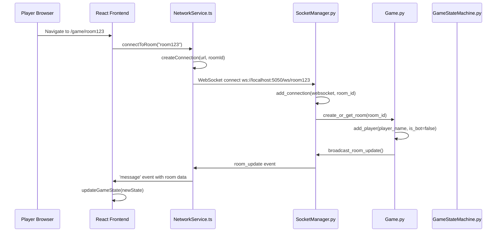
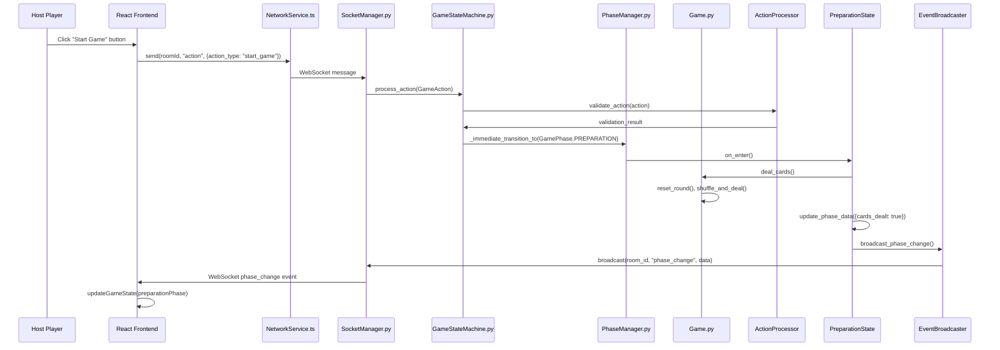
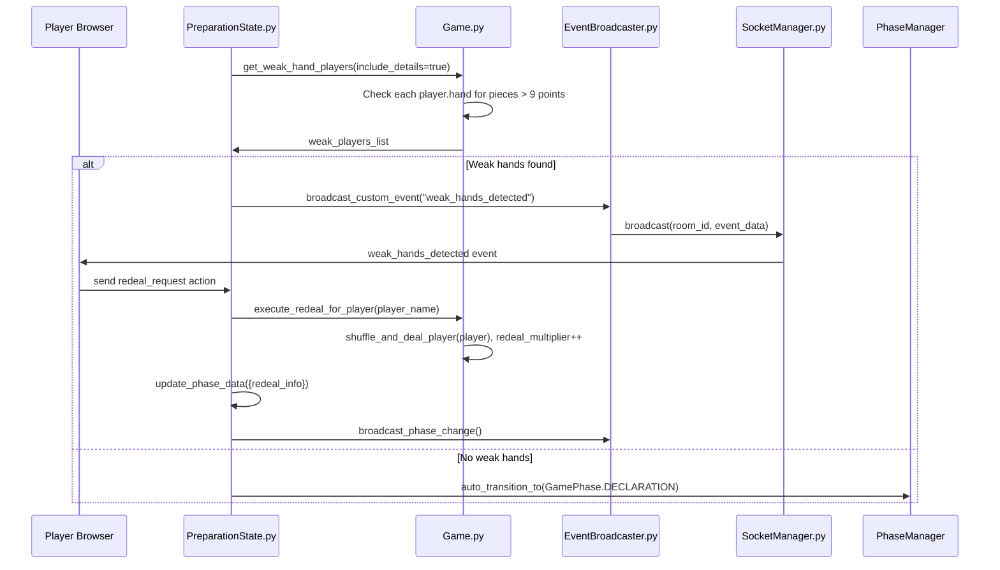
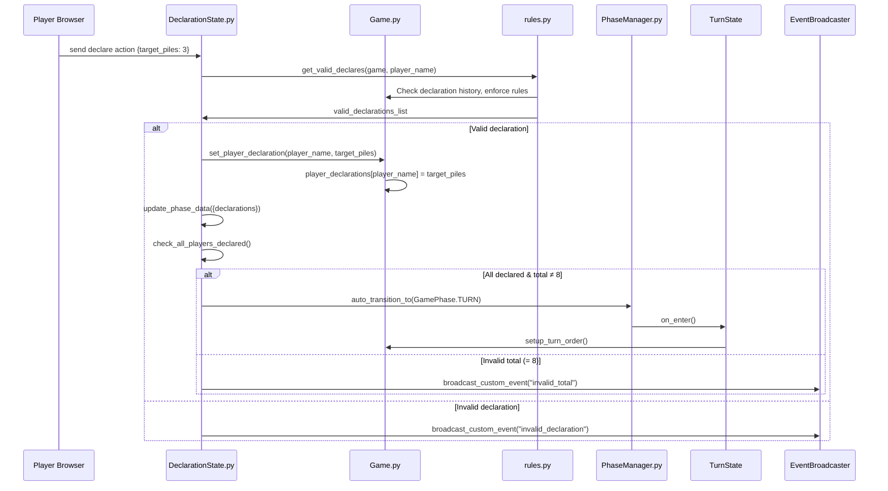
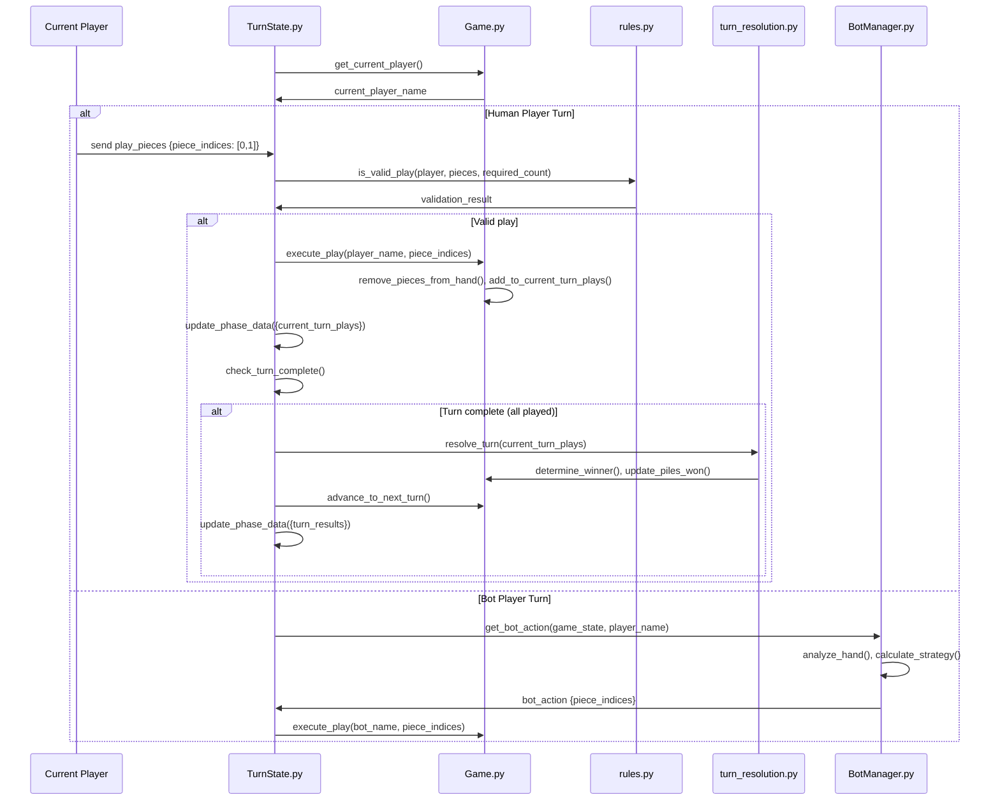
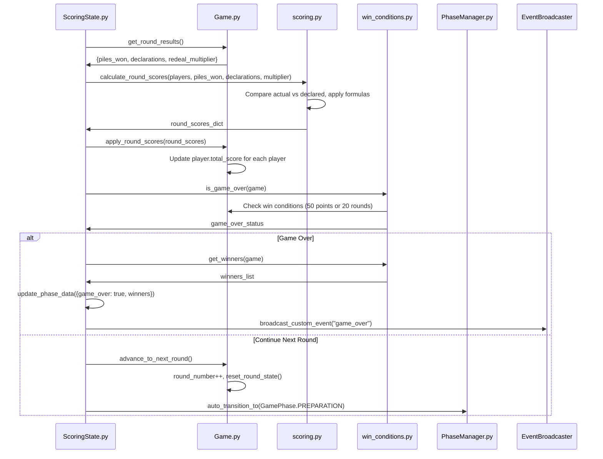
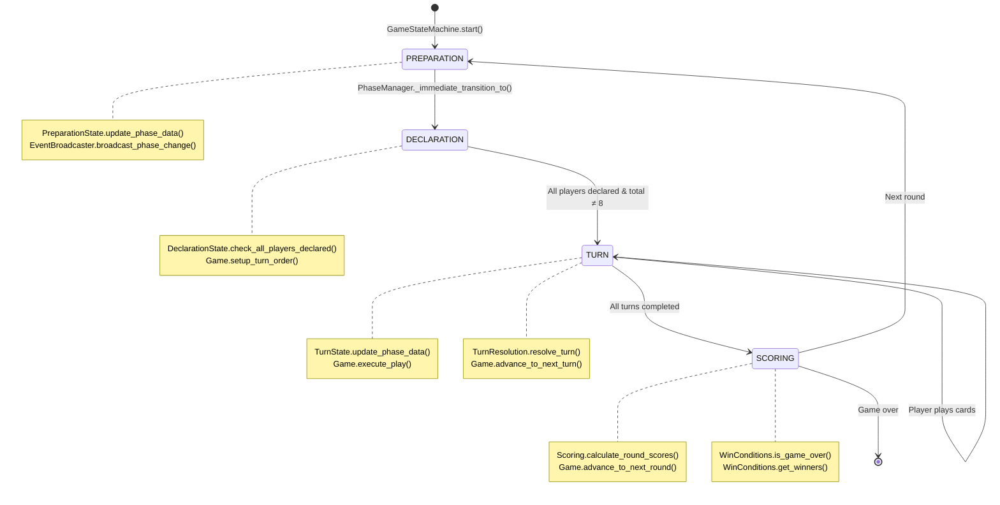
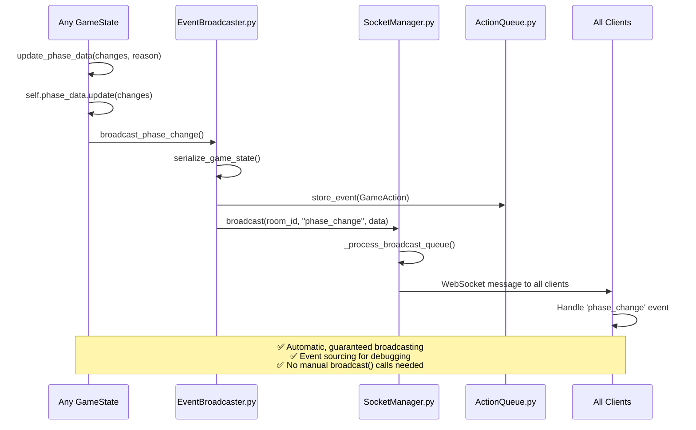

# 🎮 How Liap Tui Works - Complete System Overview

## Table of Contents
1. [Game Overview](#game-overview)
2. [System Architecture](#system-architecture)
3. [Game Flow](#game-flow)
4. [State Management](#state-management)
5. [Network Communication](#network-communication)
6. [Bot System](#bot-system)
7. [Monitoring & Recovery](#monitoring--recovery)
8. [Common Issues & Solutions](#common-issues--solutions)

## Game Overview

Liap Tui is a real-time multiplayer card game where 4 players compete to match their declared pile counts.

### Game Rules Summary
- **Players**: Always 4 (humans or bots)
- **Cards**: 32 total, 8 per player per round
- **Objective**: Declare how many piles you'll win, then achieve it
- **Scoring**: Points based on matching declaration (with multipliers)
- **Winner**: First to 50 points or highest after 20 rounds

## System Architecture

### High-Level Overview
```
┌─────────────────┐     WebSocket      ┌──────────────────┐
│                 │ ←---------------→   │                  │
│  React Frontend │                     │  Python Backend  │
│   (Browser)     │     Events/State    │    (FastAPI)     │
│                 │ ←---------------→   │                  │
└─────────────────┘                     └──────────────────┘
        ↓                                        ↓
   Local State                            State Machine
   UI Updates                             Event Sourcing
                                         Bot Management
```

### Backend Architecture

#### Core Components

1. **FastAPI Application** (`main.py`)
   - REST endpoints for room management
   - WebSocket endpoint for real-time gameplay
   - Health monitoring endpoints

2. **State Machine** (`backend/engine/state_machine/`)
   - Controls game flow through 4 phases
   - Handles all game actions
   - Ensures valid state transitions

3. **Game Engine** (`backend/engine/`)
   - Core game logic and rules
   - Player and card management
   - Score calculation

4. **Socket Manager** (`socket_manager.py`)
   - WebSocket connection handling
   - Message broadcasting
   - Connection recovery

### Frontend Architecture

1. **React 19 Application**
   - Single-page application
   - Real-time UI updates
   - WebSocket integration

2. **Service Layer** (`frontend/src/services/`)
   - `NetworkService`: WebSocket management
   - `GameService`: Game state management
   - `ServiceIntegration`: Coordinates services

3. **Component Structure**
   - Pages: Top-level routing
   - Components: Reusable UI elements
   - Phases: Game phase-specific UI

## Game Flow

### 1. Room Creation & Joining


### 2. Game Start (Host Action)


### 3. Game Phases (Detailed Interactions)

#### PREPARATION Phase - Weak Hand Detection & Redeal


#### DECLARATION Phase - Player Declarations


#### TURN Phase - Card Playing


#### SCORING Phase - Round Completion


### 4. Phase Transitions (Enterprise Architecture)


### 5. Enterprise Architecture Broadcast Pattern


## State Management

### Backend State Machine

The state machine uses an **Enterprise Architecture** pattern:

```python
# All state changes go through this method
async def update_phase_data(self, changes: dict, reason: str):
    # Update state
    self.phase_data.update(changes)
    
    # Automatic broadcasting
    await self.broadcast_phase_change()
    
    # Event sourcing
    await self.event_store.store(self.create_event())
```

**Key Features:**
- Automatic broadcasting on state changes
- Event sourcing for debugging/replay
- Human-readable change reasons
- Prevents manual broadcast errors

### Frontend State Management

Currently uses a **singleton GameService** pattern:
```typescript
class GameService {
    private state: GameState;
    private listeners: Set<Listener>;
    
    setState(newState: GameState) {
        this.state = newState;
        this.notifyListeners();
    }
}
```

**Known Issues:**
- Asynchronous React updates cause delays
- Heavy debug logging blocks UI thread
- State updates not atomic

## Network Communication

### WebSocket Protocol

All communication uses WebSocket with JSON messages:

```typescript
// Client to Server
{
    "event": "action",
    "data": {
        "action_type": "play_pieces",
        "player_name": "Alice",
        "piece_indices": [0, 1]
    }
}

// Server to Client
{
    "event": "phase_change",
    "data": {
        "phase": "TURN",
        "phase_data": {...},
        "allowed_actions": ["play_pieces"]
    }
}
```

### Key Events

**From Client:**
- `action` - Player game actions
- `sync_request` - Request state sync
- `client_ready` - Client connected
- `ack` - Message acknowledgment

**From Server:**
- `phase_change` - Game state updates
- `play` - Card play notifications
- `turn_complete` - Turn results
- `game_over` - Game end

### Connection Recovery

The NetworkService handles disconnections:
1. Automatic reconnection with exponential backoff
2. Message queuing during disconnection
3. State sync after reconnection
4. Event replay from last known sequence

## Bot System

### Bot Manager

Bots make decisions based on game state:

```python
class BotManager:
    async def get_bot_action(self, game_state, player_name):
        # Analyze game state
        # Make strategic decision
        # Return appropriate action
```

### Bot Strategies

1. **Declaration**: Analyze hand strength
2. **Card Play**: Consider turn order and winning probability
3. **Timing**: 1-3 second delays for human-like play

## Monitoring & Recovery

### Health Monitoring System

Tracks system health with adaptive intervals:
- **Healthy**: Check every 2-5 minutes
- **Warning**: Check every 30-60 seconds
- **Critical**: Check every 10-30 seconds

### Automatic Recovery Procedures

1. **Stale Connections**: Clean dead WebSocket connections
2. **Memory Pressure**: Clear caches and old data
3. **Client Desync**: Force state synchronization
4. **High Message Queue**: Clear old pending messages

### Monitoring Endpoints

- `/health` - Basic health check
- `/health/detailed` - Component status
- `/health/metrics` - Prometheus format
- `/recovery/status` - Recovery procedures

## Common Issues & Solutions

### Issue 1: "Cards Not Removed From Hand"

**Symptom**: Player sees cards in hand after playing them

**Current Cause**: 
1. Backend removes cards immediately
2. Frontend has async state update delay
3. UI shows old state briefly

**Workaround**: Wait 1-2 seconds for UI update

**Planned Fix**: Unified state store with atomic updates

### Issue 2: "Wrong Player Showing as Current"

**Symptom**: UI shows incorrect current player

**Current Cause**:
1. Multiple state update paths
2. Race condition between updates
3. Derived state calculation timing

**Workaround**: Refresh page to resync

**Planned Fix**: Single source of truth pattern

### Issue 3: "Bot Plays Out of Turn"

**Symptom**: Bot attempts invalid play

**Current Cause**:
1. Bot manager using stale state
2. Async notification delays
3. State machine/bot manager desync

**Workaround**: Game self-corrects on next turn

**Planned Fix**: Synchronous bot notifications

## Development Workflow

### Running Locally
```bash
# Start everything
./start.sh

# Backend only
cd backend && python main.py

# Frontend only
cd frontend && npm run dev
```

### Testing
```bash
# Backend tests
cd backend && python -m pytest tests/ -v

# Specific test files
python test_full_game_flow.py
python test_turn_state_debug.py
```

### Code Quality
```bash
# Python
source venv/bin/activate
cd backend && black . && pylint engine/ api/

# TypeScript
cd frontend && npm run lint && npm run type-check
```

## Architecture Decisions

### Why State Machine?
- Enforces valid game flow
- Prevents illegal state transitions
- Centralizes game logic
- Enables event sourcing

### Why WebSocket?
- Real-time gameplay requirement
- Bi-directional communication
- Lower latency than polling
- Persistent connections

### Why Enterprise Architecture?
- Automatic state broadcasting
- Prevents sync bugs
- Built-in event sourcing
- Debugging capabilities

### Why Monitoring System?
- Proactive issue detection
- Automatic recovery
- Performance tracking
- Production reliability

## Future Improvements

The refactoring plan addresses:
1. **State synchronization delays**
2. **God class decomposition**
3. **Circular dependency removal**
4. **Event system unification**

These improvements will make the system more maintainable and eliminate recurring bugs.