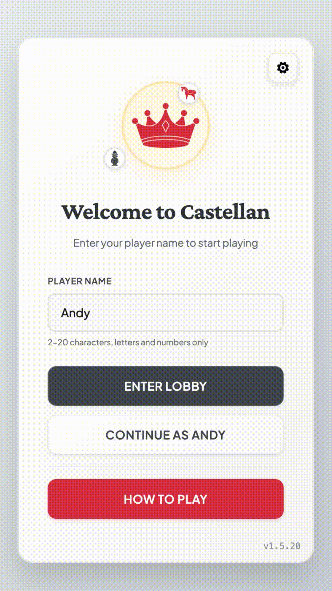

# 🀄 Castellan - Multiplayer Board Game

<div align="center">
  

  [](https://github.com/andynenth/castellan/actions)
  [](https://discord.gg/castellan)
  [](https://github.com/andynenth/castellan/issues?q=is%3Aissue+is%3Aopen+label%3A%22good+first+issue%22)
</div>

> **Real-time multiplayer board game** inspired by Liap Tui, a traditional Chinese-Thai game.
> Built with **FastAPI** (Python) + **React 19** (TypeScript) + **WebSockets**.

---

## 🚀 Quick Start (< 2 minutes)

```bash
# Clone and enter the project
git clone https://github.com/andynenth/castellan.git
cd castellan

# Start development environment (Docker-based)
./dev.sh

# Open http://localhost:5050
```

That's it! 🎉 Hot reload is enabled for both frontend and backend.

### Alternative: Local Development (no Docker)
```bash
# Install dependencies
cd frontend && npm install && cd ..
pip install -r requirements.txt

# Start everything
./start.sh
```

---

## 🤝 How to Contribute

We welcome all contributions! Here are great ways to get started:

### 🐛 Fix a Bug
Browse [open issues](https://github.com/andynenth/castellan/issues) or check `TODO.md`

### ✨ Add a Feature
- **Frontend**: New game animations, better mobile experience, UI improvements
- **Backend**: API enhancements, performance optimizations, new game modes
- **AI**: Improve bot strategies (`backend/ai/strategies/`)
- **Testing**: Increase coverage (currently 82% frontend, 78% backend)

### 📝 Improve Documentation
Help others by improving guides in `/docs` or code comments

### 🎯 Good First Issues
Perfect for your first contribution: [Good First Issues](https://github.com/andynenth/castellan/issues?q=is%3Aissue+is%3Aopen+label%3A%22good+first+issue%22)

**Quick Contribution Checklist:**
1. Fork the repo
2. Create a feature branch (`git checkout -b feature/amazing-feature`)
3. Make your changes
4. Run tests (`npm test` and `pytest`)
5. Submit a Pull Request

---

## 🏗 Project Structure

```
castellan/
├── frontend/          # React 19 + TypeScript + ESBuild
│   ├── src/          # React components and game logic
│   └── network/      # WebSocket client
├── backend/          # FastAPI + Python 3.11
│   ├── engine/       # Core game logic & state machine
│   ├── api/          # WebSocket handlers & REST endpoints
│   └── ai/           # Bot players and strategies
└── docs/             # Comprehensive documentation
```

---

## 🛠 Development Workflow

### Common Commands

```bash
# Code quality checks
cd frontend && npm run lint        # Frontend linting
source venv/bin/activate && cd backend && black .  # Python formatting

# Run tests
cd frontend && npm test            # Frontend tests
pytest                            # Backend tests

# Type checking
cd frontend && npm run type-check  # TypeScript validation
```

### Key Development Features

- **Hot Reload**: Both frontend and backend auto-reload on changes
- **WebSocket Testing**: Use `/docs` for interactive API testing
- **AI Debug Mode**: `python backend/ai_debug_simple.py` for AI-only games
- **Comprehensive Logging**: Check console for detailed game events

---

## 🎮 Architecture Overview

### Tech Stack
- **Frontend**: React 19, TypeScript, ESBuild, React Router
- **Backend**: FastAPI, Python 3.11, WebSockets, Pydantic
- **Game Engine**: Enterprise state machine with automatic event broadcasting
- **Communication**: WebSocket-first (all game operations), REST (monitoring only)

### Key Concepts
1. **4 Game Phases**: Preparation → Declaration → Turn → Scoring
2. **Real-time Sync**: All state changes auto-broadcast via WebSocket
3. **AI Players**: Configurable difficulty levels with different strategies
4. **Event Sourcing**: Complete game history for debugging/replay

### Quick Architecture Facts
- Single WebSocket endpoint: `/ws/{room_id}` handles all game operations
- Backend serves both API and static frontend files (no separate frontend server)
- State machine pattern ensures consistent game state across all clients
- Docker container includes everything needed to run

---

## 🧪 Testing

```bash
# Run all tests with coverage
cd frontend && npm test -- --coverage
pytest --cov=backend

# Run specific test suites
pytest tests/test_game_engine.py    # Game logic tests
npm test Button.test.tsx            # Component tests
```

**Current Coverage**: Frontend 82%, Backend 78%
**Goal**: Maintain >80% coverage

---

## 📚 Documentation

- **Game Rules**: [RULES.md](RULES.md) - How to play Castellan
- **Development Setup**: [docs/06-tutorials/LOCAL_DEVELOPMENT.md](docs/06-tutorials/LOCAL_DEVELOPMENT.md)
- **WebSocket API**: [docs/WEBSOCKET_API.md](docs/WEBSOCKET_API.md)
- **Adding Features**: [docs/06-tutorials/ADDING_NEW_FEATURES.md](docs/06-tutorials/ADDING_NEW_FEATURES.md)
- **AI System**: [docs/05-ai-system/](docs/05-ai-system/)
- **All Docs**: [/docs](docs/) - 30+ comprehensive guides

---

## 💬 Getting Help

- **Discord**: [Join our community](https://discord.gg/castellan) for real-time help
- **Issues**: [GitHub Issues](https://github.com/andynenth/castellan/issues) for bugs/features
- **Discussions**: [GitHub Discussions](https://github.com/andynenth/castellan/discussions) for ideas

### Quick Tips
- Check existing issues before creating new ones
- Include error messages and steps to reproduce bugs
- Join Discord for quick questions and community chat

---

## 🎯 Current Focus Areas

Help needed with:
1. **Mobile Experience**: Improve touch controls and responsive design
2. **Game Animations**: Add smooth transitions for piece movements
3. **AI Strategies**: Create more challenging bot personalities
4. **Performance**: Optimize for 100+ concurrent games
5. **Internationalization**: Add language support beyond English

---

## 📄 License

MIT © [Andy Nenthong](https://github.com/andynenth). See [LICENSE](LICENSE).

---

<div align="center">
  <strong>Ready to contribute? Let's build something awesome together! 🚀</strong>

  [Get Started](#-quick-start-2-minutes) • [Browse Issues](https://github.com/andynenth/castellan/issues) • [Join Discord](https://discord.gg/castellan)
</div>
