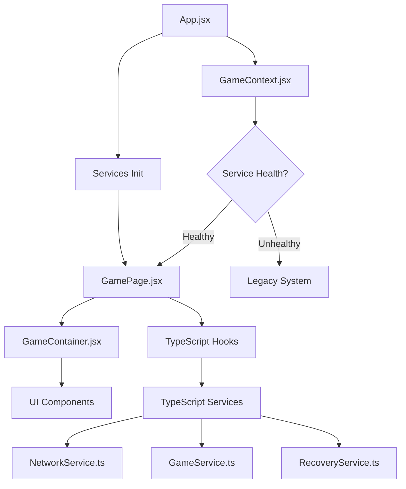
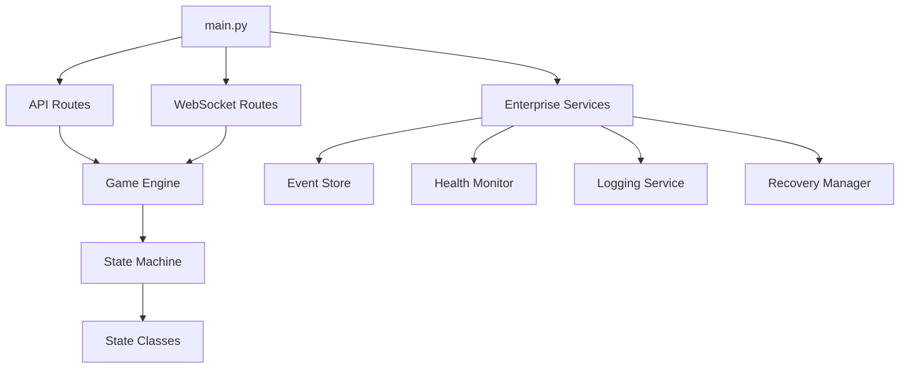
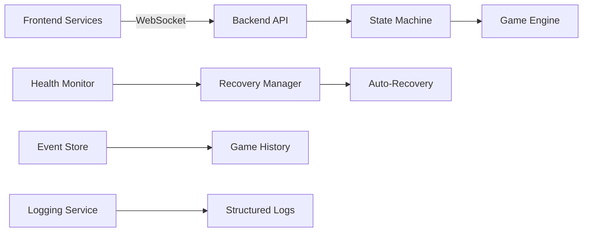

# 🏗️ Liap Tui - Software Architecture Document

**Version:** 2.0 Enterprise  
**Date:** June 25, 2025  
**Status:** Production Ready with Legacy Fallback

---

## 📋 Table of Contents

1. [High-Level Architecture Overview](#high-level-architecture-overview)
2. [Directory Structure](#directory-structure)  
3. [Frontend Systems](#frontend-systems)
4. [Backend Systems](#backend-systems)
5. [Dependencies and Relationships](#dependencies-and-relationships)
6. [Data Flow](#data-flow)
7. [System Integration](#system-integration)

---

## 🎯 High-Level Architecture Overview

Liap Tui implements a **multi-layer architecture** with **three coexisting frontend systems** and an **enterprise-grade backend**:

```
┌─────────────────────────────────────────────────────────────────┐
│                        USER INTERFACE                          │
├─────────────────────────────────────────────────────────────────┤
│  🚀 NEW REACT/TYPESCRIPT    │  🔄 HYBRID BRIDGE   │  📱 LEGACY  │
│  Enterprise Services        │  Context System     │  PixiJS     │
│  (ACTIVE - Phase 1-4)      │  (Compatibility)    │  (Fallback) │
└─────────────────────────────────────────────────────────────────┘
                                 │
                           ┌─────┴─────┐
                           │ TRANSPORT │
                           │ WebSocket │
                           └─────┬─────┘
                                 │
┌─────────────────────────────────────────────────────────────────┐
│                       BACKEND SERVICES                         │
├─────────────────────────────────────────────────────────────────┤
│  🎮 STATE MACHINE       │  🌐 API LAYER        │  🏢 ENTERPRISE │
│  Game Logic Engine      │  REST + WebSocket    │  Monitoring    │
│  (PRODUCTION READY)     │  (INTEGRATION)       │  (ACTIVE)      │
└─────────────────────────────────────────────────────────────────┘
```

### **Key Design Principles:**
- **Progressive Enhancement:** Three frontend systems ensure reliability during modernization
- **Service-Oriented:** TypeScript services provide enterprise-grade capabilities
- **State Machine:** Backend uses formal state machine for game logic
- **Enterprise Ready:** Health monitoring, auto-recovery, structured logging
- **Type Safety:** TypeScript throughout new systems

---

## 📁 Directory Structure

```
liap-tui/
├── backend/                          # Python FastAPI Backend
│   ├── engine/                       # Core Game Engine
│   │   ├── state_machine/            # 🎮 State Machine System (Phase 1)
│   │   │   ├── game_state_machine.py # Central coordinator
│   │   │   ├── core.py               # GamePhase enums, ActionType
│   │   │   ├── action_queue.py       # Sequential action processing
│   │   │   ├── base_state.py         # Abstract state class
│   │   │   └── states/               # Phase implementations
│   │   │       ├── preparation_state.py  # Weak hand handling
│   │   │       ├── declaration_state.py  # Target declarations
│   │   │       ├── turn_state.py         # Turn-based gameplay
│   │   │       └── scoring_state.py      # Score calculation
│   │   ├── game.py                   # Main Game class
│   │   ├── rules.py                  # Game rules validation
│   │   ├── scoring.py                # Score calculation
│   │   ├── player.py                 # Player entities
│   │   └── piece.py                  # Game piece entities
│   ├── api/                          # API Layer
│   │   ├── routes/                   # REST and WebSocket routes
│   │   │   ├── routes.py             # 🔄 REST endpoints (INTEGRATION)
│   │   │   └── ws.py                 # 🔄 WebSocket handlers (INTEGRATION)
│   │   ├── services/                 # 🏢 Enterprise Services (Phase 4)
│   │   │   ├── event_store.py        # Event sourcing system
│   │   │   ├── health_monitor.py     # System health monitoring
│   │   │   ├── logging_service.py    # Structured JSON logging
│   │   │   └── recovery_manager.py   # Automatic recovery
│   │   └── main.py                   # FastAPI application
│   └── tests/                        # Test Suite (78+ tests)
│
├── frontend/                         # Frontend Systems
│   ├── src/                          # 🚀 NEW REACT/TYPESCRIPT SYSTEM
│   │   ├── services/                 # Phase 3: Service Integration
│   │   │   ├── index.ts              # Service exports
│   │   │   ├── types.ts              # TypeScript interfaces
│   │   │   ├── NetworkService.ts     # WebSocket management
│   │   │   ├── GameService.ts        # Game state management
│   │   │   ├── RecoveryService.ts    # Auto-recovery system
│   │   │   └── ServiceIntegration.ts # Service coordination
│   │   ├── hooks/                    # Phase 2: Clean React Hooks
│   │   │   ├── useGameState.ts       # Game state management
│   │   │   ├── useGameActions.ts     # Action dispatch
│   │   │   └── useConnectionStatus.ts # Network status
│   │   ├── components/               # UI Components
│   │   │   ├── game/                 # Phase 2: Pure Game UI
│   │   │   │   ├── GameContainer.jsx # Smart container
│   │   │   │   ├── PreparationUI.jsx # Preparation phase UI
│   │   │   │   ├── DeclarationUI.jsx # Declaration phase UI
│   │   │   │   ├── TurnUI.jsx        # Turn phase UI
│   │   │   │   ├── ScoringUI.jsx     # Scoring phase UI
│   │   │   │   └── WaitingUI.jsx     # Waiting states UI
│   │   │   ├── Button.jsx            # Shared components
│   │   │   ├── Modal.jsx             
│   │   │   └── Layout.jsx            
│   │   ├── contexts/                 # 🔄 HYBRID BRIDGE SYSTEM
│   │   │   ├── AppContext.jsx        # Application context
│   │   │   └── GameContext.jsx       # Game context bridge
│   │   ├── phases/                   # 🔄 INTERMEDIATE REACT/JS
│   │   │   ├── PreparationPhase.jsx  # React phase components
│   │   │   ├── DeclarationPhase.jsx  
│   │   │   └── TurnPhase.jsx         
│   │   ├── hooks/                    # Mixed hook systems
│   │   │   ├── usePhaseManager.js    # 🔄 Legacy bridge
│   │   │   └── useSocket.js          # 🔄 Legacy WebSocket
│   │   └── pages/                    # Page components
│   │       ├── StartPage.jsx         
│   │       ├── LobbyPage.jsx         
│   │       ├── RoomPage.jsx          
│   │       └── GamePage.jsx          # 🚀 USES NEW ARCHITECTURE
│   ├── game/                         # 📱 LEGACY PIXIJS SYSTEM
│   │   ├── GamePhaseManager.js       # Original phase management
│   │   ├── GameStateManager.js       # Legacy state management
│   │   ├── phases/                   # Legacy phase implementations
│   │   │   ├── RedealPhase.js        # 📱 VS PreparationUI.jsx 🚀
│   │   │   ├── DeclarationPhase.js   # 📱 VS DeclarationUI.jsx 🚀
│   │   │   └── TurnPhase.js          # 📱 VS TurnUI.jsx 🚀
│   │   └── handlers/                 # Event handlers
│   ├── network/                      # Legacy networking
│   │   ├── SocketManager.js          # 📱 VS NetworkService.ts 🚀
│   │   └── ConnectionMonitor.js      
│   ├── main.js                       # Application entry point
│   ├── package.json                  # Dependencies
│   └── esbuild.config.cjs            # Build configuration
│
├── .env                              # Environment configuration
├── start.sh                          # Development launcher
├── docker-compose.dev.yml            # Development Docker
└── Dockerfile                        # Production container
```

---

## 🚀 Frontend Systems

### **1. New React/TypeScript System** (ACTIVE - Phase 1-4)

**Purpose:** Enterprise-grade frontend with advanced features

**Key Characteristics:**
- **React 19.1.0** with modern hooks
- **TypeScript** for type safety
- **Service-oriented architecture**
- **Automatic error recovery**
- **Real-time health monitoring**
- **WebSocket auto-reconnection**

**Core Components:**

#### **Services Layer** (`/src/services/`)
```javascript
// Service Integration - Coordinates all services
import { serviceIntegration } from './services/ServiceIntegration';

// Initialize Phase 1-4 architecture
await serviceIntegration.initialize();
```

#### **React Hooks** (`/src/hooks/`)
```javascript
// Modern TypeScript hooks
const gameState = useGameState();        // Game state management
const gameActions = useGameActions();    // Action dispatch
const connection = useConnectionStatus(); // Network monitoring
```

#### **UI Components** (`/src/components/game/`)
```javascript
// Pure UI components (no logic)
<GameContainer roomId={roomId}>
  <PreparationUI data={gameState.preparation} />
  <DeclarationUI data={gameState.declaration} />
  <TurnUI data={gameState.turn} />
  <ScoringUI data={gameState.scoring} />
</GameContainer>
```

---

### **2. Hybrid Bridge System** (COMPATIBILITY)

**Purpose:** Provides backward compatibility and smooth transitions

**Key Files:**
- `GameContext.jsx` - Detects service health, bridges systems
- `phases/*.jsx` - React components that can work with either system
- `usePhaseManager.js` - Legacy bridge hooks

**Smart Detection Logic:**
```javascript
// GameContext.jsx automatically detects which system to use
const servicesHealth = getServicesHealth();
const useNewArchitecture = servicesHealth.overall.healthy;

if (useNewArchitecture) {
  // Use Phase 1-4 TypeScript services
} else {
  // Fall back to legacy PixiJS system
}
```

---

### **3. Legacy PixiJS System** (FALLBACK)

**Purpose:** Original implementation, provides stability

**Key Characteristics:**
- **Pure JavaScript ES6** modules
- **PixiJS-based** rendering (implied)
- **Event-driven** architecture
- **Manual phase transitions**
- **Direct WebSocket** management

**Example Structure:**
```javascript
// Legacy phase management
class GamePhaseManager {
  constructor() {
    this.currentPhase = null;
    this.eventEmitter = new EventEmitter();
  }
  
  transitionTo(newPhase) {
    // Manual phase transitions
  }
}
```

---

## 🎮 Backend Systems

### **1. State Machine Engine** (PRODUCTION READY - Phase 1)

**Purpose:** Formal state machine for reliable game logic

**Architecture:**
```python
# Central coordinator
class GameStateMachine:
    def __init__(self):
        self.action_queue = ActionQueue()
        self.current_state = None
        
    async def process_action(self, action: GameAction):
        # Sequential action processing
        await self.action_queue.add(action)
```

**State Implementations:**
- `PreparationState` - Handles card dealing, weak hands, redeals
- `DeclarationState` - Manages target pile declarations
- `TurnState` - Turn-based piece playing logic
- `ScoringState` - Score calculation and win conditions

**Key Features:**
- ✅ **78+ tests passing**
- ✅ **Action queue** prevents race conditions
- ✅ **Formal state transitions**
- ✅ **Comprehensive validation**

---

### **2. API Layer** (INTEGRATION TARGET - Week 3)

**Purpose:** REST and WebSocket communication

**Current Status:**
- `routes.py` - Contains manual `if phase ==` checks
- `ws.py` - WebSocket handlers for real-time communication
- **Needs integration** with state machine

**Integration Goal:**
```python
# BEFORE (current)
if game.current_phase == "declaration":
    # Manual phase handling

# AFTER (target)
action = GameAction(type=ActionType.DECLARE_PILES, data=data)
await game.state_machine.process_action(action)
```

---

### **3. Enterprise Services** (ACTIVE - Phase 4)

**Purpose:** Production-grade monitoring and reliability

**Services:**
- `event_store.py` - Complete game history with replay
- `health_monitor.py` - Real-time system monitoring
- `logging_service.py` - Structured JSON logging
- `recovery_manager.py` - Automatic failure recovery

**API Endpoints:**
```bash
# Health monitoring
GET /api/health/detailed     # System health status
GET /api/health/metrics      # Prometheus metrics

# Event sourcing
GET /api/rooms/{id}/events   # Game event history
GET /api/rooms/{id}/state    # Reconstructed state
```

---

## 🔗 Dependencies and Relationships

### **Frontend Dependencies**



### **Backend Dependencies**



### **System Integration**



---

## 🌊 Data Flow

### **Frontend → Backend**

1. **User Action** → `GamePage.jsx`
2. **Hook Call** → `useGameActions.ts`
3. **Service Call** → `GameService.ts`
4. **Network** → `NetworkService.ts`
5. **WebSocket** → Backend `ws.py`
6. **API Router** → `routes.py`
7. **Game Engine** → `game.py`
8. **State Machine** → `GameStateMachine`
9. **State Process** → Specific state class

### **Backend → Frontend**

1. **State Change** → State machine
2. **Event Emission** → WebSocket handler
3. **Message Send** → WebSocket transport
4. **Frontend Receive** → `NetworkService.ts`
5. **Service Update** → `GameService.ts`
6. **Hook Update** → `useGameState.ts`
7. **Component Render** → React components

### **Error Recovery Flow**

1. **Error Detection** → Any service
2. **Recovery Service** → `RecoveryService.ts`
3. **Health Check** → Backend monitoring
4. **Auto-Recovery** → `recovery_manager.py`
5. **State Restoration** → Event sourcing
6. **User Notification** → UI components

---

## 🔧 System Integration

### **Current Active Configuration**

```javascript
// App.jsx - Entry Point
import { initializeServices } from './services';

// Initializes Phase 1-4 architecture
await initializeServices();

// GamePage.jsx - Main Game Interface
import { useGameState } from '../hooks/useGameState';
import { GameContainer } from '../components/game/GameContainer';

// Uses new TypeScript services
const gameState = useGameState();
```

### **Service Health Detection**

```javascript
// GameContext.jsx - Smart Detection
const servicesHealth = getServicesHealth();

if (servicesHealth.overall.healthy) {
  // Use Phase 1-4 Enterprise Architecture ✅
  return <ModernGameInterface />;
} else {
  // Fall back to Legacy System 📱
  return <LegacyGameInterface />;
}
```

### **Backend State Management**

```python
# State Machine - Production Ready
class GameStateMachine:
    async def process_action(self, action):
        # Formal state machine processing
        await self.current_state.handle_action(action)
        
# API Routes - Integration Target
@router.post("/action")
async def handle_action(action_data):
    # TODO: Replace manual checks with state machine
    await game.state_machine.process_action(action)
```

---

## 📊 Architecture Status

### **Production Ready** ✅
- **Backend State Machine** - 78+ tests passing
- **Enterprise Services** - Health monitoring, logging, recovery
- **Frontend Services** - TypeScript service layer
- **React Components** - Pure UI components

### **Integration Phase** 🔄
- **API Routes** - Replacing manual phase checks with state machine
- **WebSocket Handlers** - Real-time state synchronization
- **Hybrid System** - Smooth transition between legacy and new

### **Fallback Systems** 📱
- **Legacy PixiJS** - Provides stability during transition
- **Service Detection** - Automatic fallback on service failure

---

## 🎯 Key Insights

### **Why Multiple Systems?**

1. **`frontend/src/phases/DeclarationPhase.jsx`** (Hybrid React/JS)
   - Intermediate React component
   - Bridges legacy and new systems
   - Provides compatibility during transition

2. **`frontend/src/components/game/DeclarationUI.jsx`** (New TypeScript)
   - Pure UI component
   - Part of Phase 1-4 architecture
   - Type-safe, enterprise-grade

3. **`frontend/game/phases/DeclarationPhase.js`** (Legacy PixiJS)
   - Original implementation
   - Fallback system
   - Event-driven architecture

### **Architectural Benefits**

- **Zero-Downtime Migration** - New features without breaking existing functionality
- **Progressive Enhancement** - Enterprise features added incrementally
- **Risk Mitigation** - Multiple fallback systems ensure reliability
- **Developer Experience** - Modern TypeScript for new development
- **Backward Compatibility** - Legacy system maintains stability

This multi-system approach represents **excellent software architecture** for large-scale system modernization while maintaining production reliability.