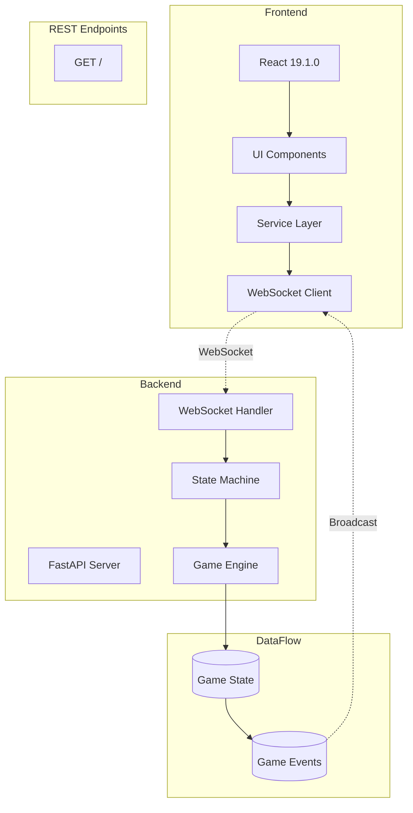
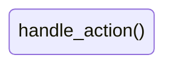
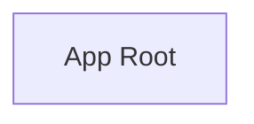
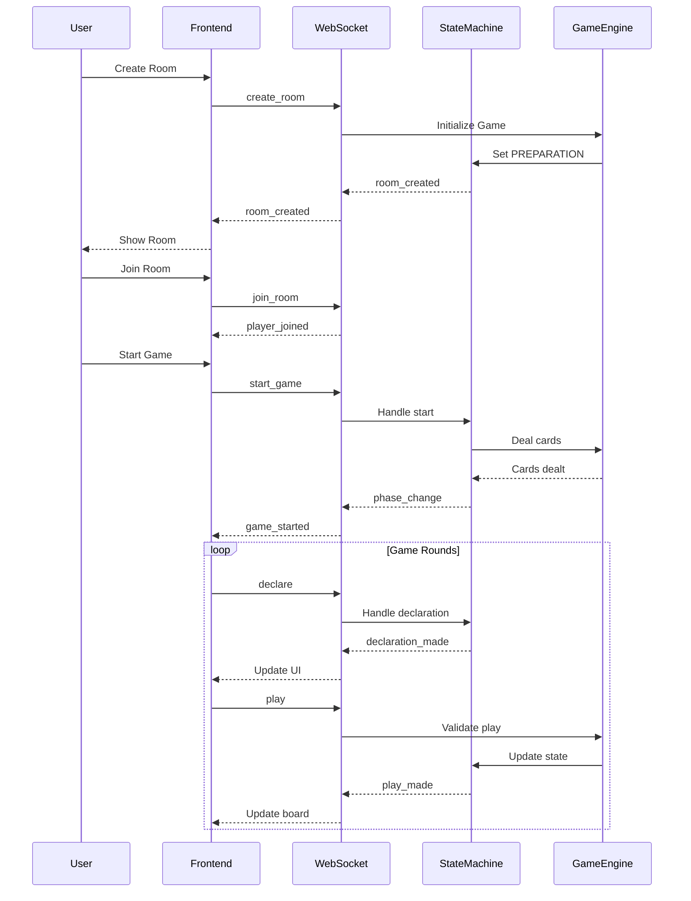

# Codebase Analysis - Data Flow Diagrams

Generated from actual code analysis

## System Architecture



## WebSocket Event Flow

```mermaid
graph LR
    Client[Frontend Client]
    Server[WebSocket Server]

    Client -->|decline_redeal| Server
    Server -->|game_ended| Client
    Client -->|start_game| Server
    Server -->|success| Client
    Client -->|accept_redeal| Server
    Server -->|game_ended| Client
    Client -->|join_room| Server
    Server -->|room_update| Client
    Server -->|player_reconnected| Client
    Client -->|declare| Server
    Server -->|declare| Client
    Server -->|room_update| Client
    Client -->|play| Server
    Server -->|| Client
    Server -->|player_disconnected| Client
    Client -->|create_room| Server
    Server -->|room_update| Client
    Client -->|leave_room| Server
    Server -->|declare| Client
    Server -->|room_closed| Client

```

## Game State Machine



## Frontend Components



## Game Flow Sequence



