# Complete Dataflow Analysis

Generated from actual codebase analysis

## Table of Contents

1. [System Architecture Overview](#system-architecture-overview)
2. [WebSocket Event Flow](#websocket-event-flow)
3. [Game State Machine](#game-state-machine)
4. [Component Communication](#component-communication)
5. [Complete Data Flow](#complete-data-flow)
6. [User Journey - Create & Join](#user-journey---create-&-join)
7. [User Journey - Gameplay](#user-journey---gameplay)
8. [Backend Processing Flow](#backend-processing-flow)
9. [Frontend State Management](#frontend-state-management)
10. [Error Handling Flow](#error-handling-flow)

---

## System Architecture Overview

[Back to top](#complete-dataflow-analysis)

---

## WebSocket Event Flow

```mermaid
flowchart TB
    subgraph "Lobby Events"
        L1[request_room_list] --> L1R[room_list_update]
        L2[create_room] --> L2R[room_created]
        L3[join_room] --> L3R[room_joined]
    end
    
    subgraph "Room Management"
        R1[client_ready] --> R1R[room_state_update]
        R2[add_bot] --> R2R[room_update]
        R3[remove_player] --> R3R[room_update]
        R4[leave_room] --> R4R[player_left]
    end
    
    subgraph "Game Lifecycle"
        G1[start_game] --> G1R[game_started]
        G2[leave_game] --> G2R[game_ended]
    end
    
    subgraph "Game Actions"
        A1[declare] --> A1R[declaration_made]
        A2[play] --> A2R[play_made]
        A3[request_redeal] --> A3R[redeal_requested]
        A4[accept_redeal] --> A4R[redeal_accepted]
        A5[decline_redeal] --> A5R[redeal_declined]
    end
    
    subgraph "Infrastructure"
        I1[ping] --> I1R[pong]
        I2[sync_request] --> I2R[sync_response]
        I3[ack] --> I3R[✓]
    end
    
    Client[Frontend Client] ==> L1
    Client ==> L2
    Client ==> L3
    Client ==> R1
    Client ==> G1
    Client ==> A1
    
    L1R ==> Broadcast[Broadcast to Clients]
    L2R ==> Broadcast
    L3R ==> Broadcast
    R1R ==> Broadcast
    G1R ==> Broadcast
    A1R ==> Broadcast
```

[Back to top](#complete-dataflow-analysis)

---

## Game State Machine

[Back to top](#complete-dataflow-analysis)

---

## Component Communication

[Back to top](#complete-dataflow-analysis)

---

## Complete Data Flow

[Back to top](#complete-dataflow-analysis)

---

## User Journey - Create & Join

[Back to top](#complete-dataflow-analysis)

---

## User Journey - Gameplay

[Back to top](#complete-dataflow-analysis)

---

## Backend Processing Flow

[Back to top](#complete-dataflow-analysis)

---

## Frontend State Management

[Back to top](#complete-dataflow-analysis)

---

## Error Handling Flow

[Back to top](#complete-dataflow-analysis)

---

