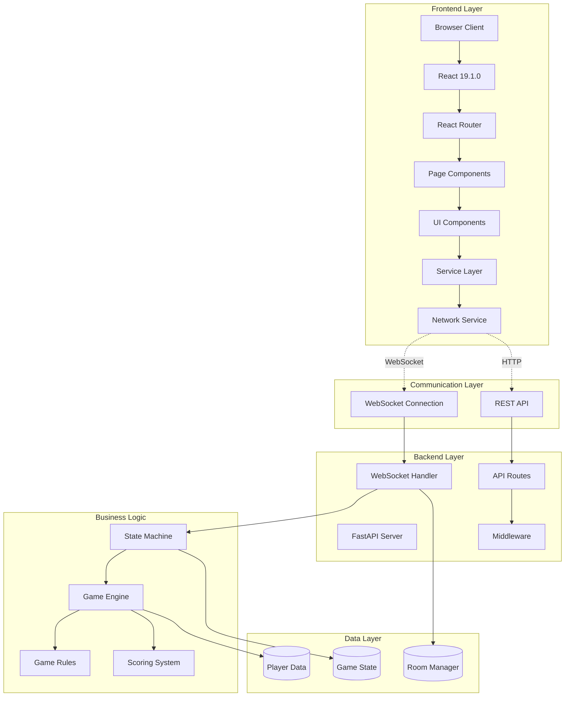
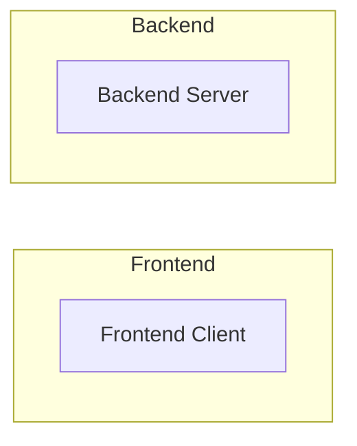
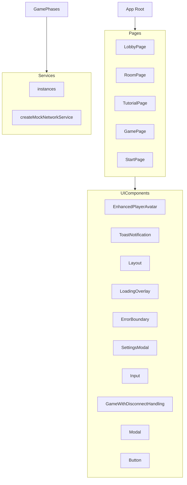
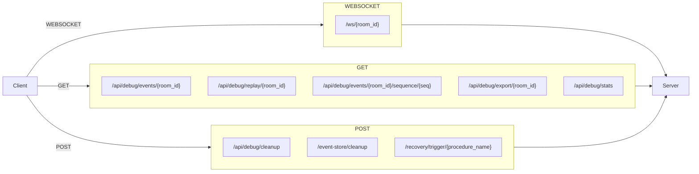
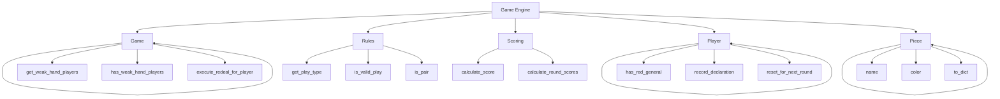
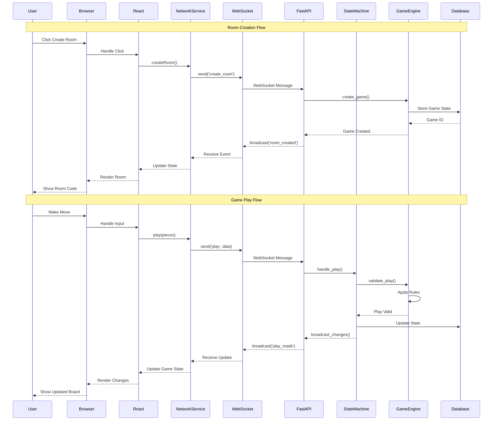

# Deep Codebase Analysis - Complete Data Flows

## Analysis Summary

- **API Routes**: 20
- **WebSocket Events**: 0
- **React Components**: 55
- **Game Phases**: 1
- **Data Flows**: 39
- **Game Features**: 5

## Complete System Architecture



## WebSocket Communication Map



## Frontend Component Hierarchy



## Backend State Machine

```mermaid
stateDiagram-v2
    [*] --> Waiting: Room Created

    state Game {
        Game : handle_action()
    }


```

## Complete Data Flow

```mermaid
graph TB
    EnhancedPlayerAvatar[EnhancedPlayerAvatar]
    ConnectionIndicator[ConnectionIndicator]
    GamePage[GamePage]
    SettingsButton[SettingsButton]
    PlayerAvatar[PlayerAvatar]
    StartPage[StartPage]
    Layout[Layout]
    TruncatedName[TruncatedName]
    GameContainer[GameContainer]
    HostIndicator[HostIndicator]
    SettingsModal[SettingsModal]
    RoomPage[RoomPage]
    ErrorBoundary[ErrorBoundary]
    ToastContainer[ToastContainer]
    ConnectionQuality[ConnectionQuality]


```



## API Endpoints



## Game Features



## Game Play Sequence



