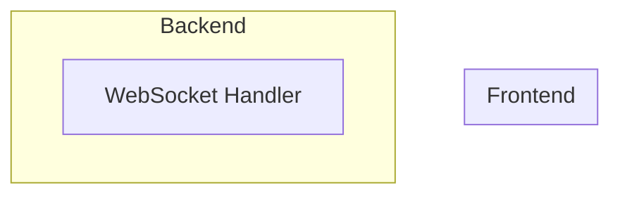
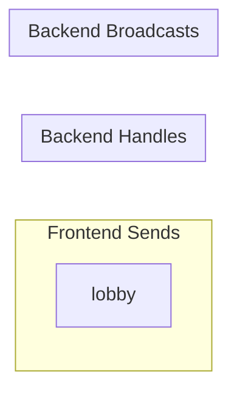
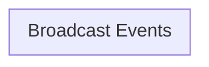
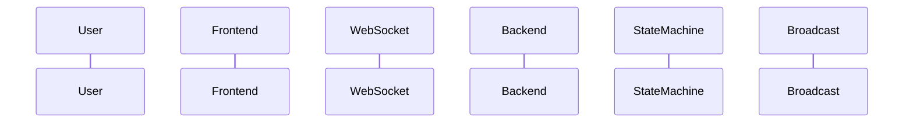
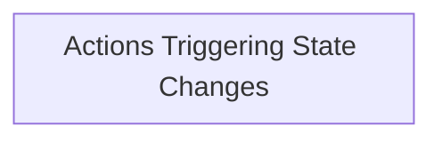

# WebSocket Message Flow Analysis

## Summary

- **Backend Handlers**: 0
- **Frontend Components**: 18
- **Message Flows**: 0

## Backend WebSocket Handlers

## Flow Diagrams

### WebSocket Message Flow

### Event Handler Map

### Broadcast Flow

### Complete Game Interaction

### State Change Flow

