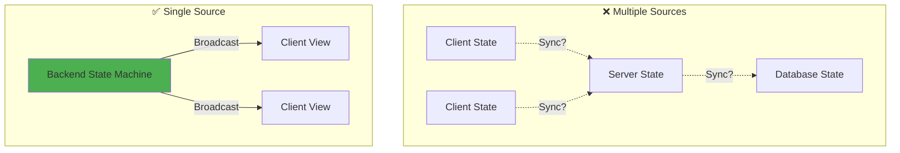
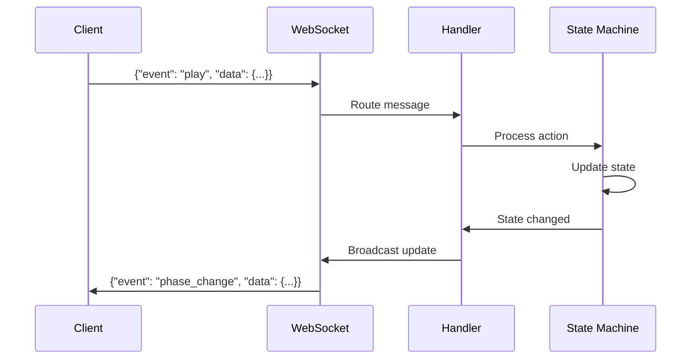
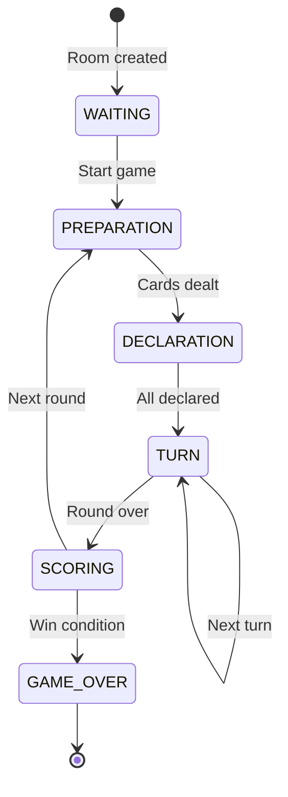
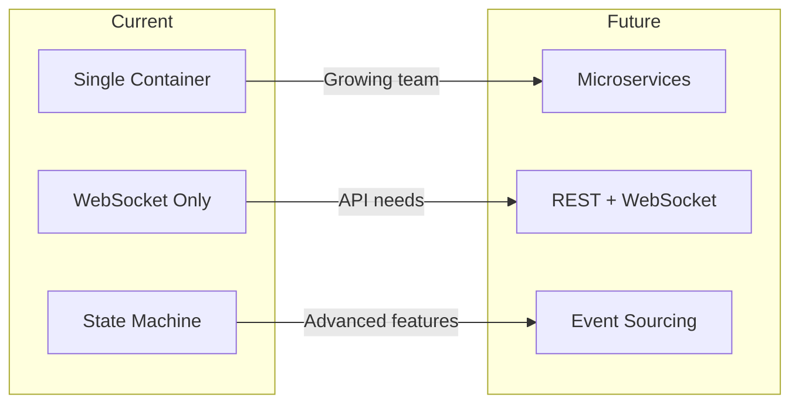

# Design Principles & Architecture Decisions

## Table of Contents
1. [Overview](#overview)
2. [Core Principles](#core-principles)
3. [Architectural Decisions](#architectural-decisions)
4. [WebSocket-Only Architecture](#websocket-only-architecture)
5. [State Machine Pattern](#state-machine-pattern)
6. [Enterprise Architecture](#enterprise-architecture)
7. [Single Container Design](#single-container-design)
8. [Design Trade-offs](#design-trade-offs)
9. [Future Considerations](#future-considerations)

## Overview

This document explains the fundamental design principles and architectural decisions that shape the Liap Tui project. Every technical choice was made with specific goals in mind: simplicity, reliability, and developer experience.

### Design Philosophy

```
"Make it work, make it right, make it fast - in that order"
```

Our architecture prioritizes:
1. **Correctness** - The game logic must be accurate
2. **Simplicity** - Easy to understand and maintain
3. **Reliability** - Consistent behavior in production
4. **Performance** - Fast enough for real-time gaming
5. **Developer Experience** - Quick feedback loops

## Core Principles

### 1. Single Source of Truth



**Principle**: The backend state machine is the authoritative source for all game state.

**Benefits**:
- No synchronization bugs
- Predictable state updates
- Easy debugging
- Clear data flow

**Implementation**:
```python
# All state changes go through one method
await self.update_phase_data({
    'current_player': next_player,
    'turn_number': turn + 1
}, "Player action processed")
```

### 2. Explicit Over Implicit

**Principle**: Make intentions clear in code, even if it means more verbosity.

**Examples**:
```python
# ❌ Implicit
def play(self, pieces):
    if len(pieces) > 0:
        self.process(pieces)

# ✅ Explicit
def play_pieces(self, piece_ids: List[str]) -> PlayResult:
    """Play specified pieces in the current turn.
    
    Args:
        piece_ids: List of piece IDs to play
        
    Returns:
        PlayResult with success status and details
        
    Raises:
        InvalidPlayError: If play violates game rules
    """
    if not piece_ids:
        raise InvalidPlayError("Must play at least one piece")
    
    return self.process_play(piece_ids)
```

### 3. Fail Fast, Fail Clearly

**Principle**: Detect and report errors as early as possible with clear messages.

**Implementation**:
```python
# Validate immediately on receipt
async def handle_play_action(self, action: GameAction):
    # Fast validation
    if not action.player_name:
        raise ValueError("Player name required")
    
    if not self.is_player_turn(action.player_name):
        raise GameError(
            code="NOT_YOUR_TURN",
            message=f"It's {self.current_player}'s turn",
            details={"current_player": self.current_player}
        )
```

### 4. Convention Over Configuration

**Principle**: Use sensible defaults and established patterns to reduce configuration.

**Examples**:
- WebSocket endpoints follow pattern: `/ws/{room_id}`
- All game events use `event`/`data` structure
- Phase names match file names and component names
- Standard port 5050 for backend

## Architectural Decisions

### Decision Record Format

Each major decision follows this template:
```markdown
**Decision**: What we decided
**Status**: Accepted/Deprecated/Superseded
**Context**: Why we needed to decide
**Alternatives**: What else we considered
**Consequences**: What this means for the project
```

## WebSocket-Only Architecture

**Decision**: Use WebSocket as the sole communication protocol for all game operations.

**Status**: Accepted

**Context**: 
- Real-time multiplayer games need bidirectional communication
- Traditional REST + WebSocket splits create complexity
- State synchronization is critical for gameplay

**Alternatives Considered**:

1. **REST API + WebSocket**
   - ✅ Pros: Standard pattern, clear separation
   - ❌ Cons: Duplicate logic, sync complexity, two protocols

2. **Server-Sent Events (SSE)**
   - ✅ Pros: Simple server→client streaming
   - ❌ Cons: Unidirectional only, no binary support

3. **Long Polling**
   - ✅ Pros: Works everywhere, simple
   - ❌ Cons: High latency, resource intensive

**Consequences**:

✅ **Benefits**:
- Single protocol to learn and debug
- Real-time communication by default
- No REST/WebSocket synchronization issues
- Consistent message patterns

❌ **Trade-offs**:
- Cannot use REST tooling (Postman, curl)
- WebSocket debugging requires specific tools
- Stateful connections need careful management

### Implementation Architecture

```python
# Single WebSocket handler for all game operations
@router.websocket("/ws/{room_id}")
async def websocket_endpoint(websocket: WebSocket, room_id: str):
    await websocket.accept()
    
    try:
        # All game logic flows through WebSocket
        async for message in websocket.iter_json():
            await handle_game_message(websocket, room_id, message)
            
    except WebSocketDisconnect:
        await handle_disconnect(room_id, websocket)
```

### Message Flow



## State Machine Pattern

**Decision**: Implement game logic as a formal state machine with defined phases and transitions.

**Status**: Accepted

**Context**:
- Games have clear phases (waiting, playing, scoring)
- Valid actions depend on current phase
- Need predictable state transitions
- Must prevent invalid game states

**Alternatives Considered**:

1. **Event-Driven Architecture**
   - ✅ Pros: Flexible, loosely coupled
   - ❌ Cons: Hard to visualize flow, complex debugging

2. **Procedural Game Loop**
   - ✅ Pros: Simple, linear flow
   - ❌ Cons: Hard to handle async events, rigid

3. **Entity-Component-System (ECS)**
   - ✅ Pros: Flexible, performant
   - ❌ Cons: Overkill for turn-based game

**Consequences**:

✅ **Benefits**:
- Clear phase progression
- Invalid transitions impossible
- Easy to visualize and debug
- Natural fit for turn-based games

❌ **Trade-offs**:
- More upfront design needed
- Some flexibility lost
- State explosion possible

### State Machine Implementation

```python
class GameStateMachine:
    def __init__(self):
        self.states = {
            GamePhase.WAITING: WaitingState(),
            GamePhase.PREPARATION: PreparationState(),
            GamePhase.DECLARATION: DeclarationState(),
            GamePhase.TURN: TurnState(),
            GamePhase.SCORING: ScoringState(),
            GamePhase.GAME_OVER: GameOverState()
        }
        
    async def process_action(self, action: GameAction) -> ActionResult:
        current_state = self.states[self.phase]
        return await current_state.handle_action(action, self.context)
```

### Phase Transitions



## Enterprise Architecture

**Decision**: Implement automatic broadcasting and change tracking for all state mutations.

**Status**: Accepted

**Context**:
- Developers often forgot to broadcast state changes
- Debugging state issues was difficult
- Need audit trail for game progression
- Manual broadcasting was error-prone

**The Problem**:
```python
# ❌ Old way - easy to forget broadcasting
self.phase_data['current_player'] = next_player
self.phase_data['turn_number'] += 1
# Oops! Forgot to broadcast - clients out of sync
```

**The Solution**:
```python
# ✅ Enterprise way - impossible to forget
await self.update_phase_data({
    'current_player': next_player,
    'turn_number': self.game.turn_number
}, "Turn completed")
# Automatically broadcasts to all clients
```

### Enterprise Features

#### 1. Automatic Broadcasting
```python
async def update_phase_data(self, updates: dict, reason: str = ""):
    """Update phase data with automatic broadcasting."""
    # Update state
    self.phase_data.update(updates)
    
    # Record change
    self._record_change(updates, reason)
    
    # Auto-broadcast to all clients
    await self._broadcast_phase_change()
    
    # Increment sequence for ordering
    self._sequence_number += 1
```

#### 2. Change History Tracking
```python
def _record_change(self, updates: dict, reason: str):
    """Track all state changes for debugging."""
    self._change_history.append({
        'timestamp': datetime.now(),
        'sequence': self._sequence_number,
        'updates': updates,
        'reason': reason,
        'phase': self.phase,
        'snapshot': copy.deepcopy(self.phase_data)
    })
```

#### 3. JSON-Safe Serialization
```python
def _prepare_broadcast_data(self) -> dict:
    """Convert game objects to JSON-safe format."""
    return {
        'phase': self.phase.value,
        'phase_data': self._serialize_phase_data(),
        'sequence_number': self._sequence_number,
        'timestamp': time.time()
    }
```

### Benefits Realized

1. **Zero Sync Bugs**: Impossible to update state without broadcasting
2. **Complete Audit Trail**: Every change is logged with reason
3. **Debugging Paradise**: Can replay game progression
4. **Consistent Updates**: All clients receive same data
5. **Developer Confidence**: No fear of forgetting broadcasts

## Single Container Design

**Decision**: Deploy frontend and backend in a single Docker container.

**Status**: Accepted

**Context**:
- Need simple deployment for MVP
- Want to minimize operational complexity
- Single team maintaining both frontend and backend
- No need for independent scaling initially

**Alternatives Considered**:

1. **Separate Containers**
   - ✅ Pros: Independent scaling, clear separation
   - ❌ Cons: Complex networking, CORS issues, more infrastructure

2. **Serverless Functions**
   - ✅ Pros: Infinite scale, pay per use
   - ❌ Cons: WebSocket complexity, cold starts, vendor lock-in

3. **Microservices**
   - ✅ Pros: Maximum flexibility, independent deployment
   - ❌ Cons: Massive complexity, overkill for game

**Consequences**:

✅ **Benefits**:
- One deployment unit
- No CORS configuration
- Simplified local development
- Single health check
- Atomic deployments

❌ **Trade-offs**:
- Frontend/backend scale together
- Larger container size
- Full redeploy for any change

### Container Architecture

```dockerfile
# Single container serves everything
FROM python:3.11-slim

# Copy built frontend
COPY --from=frontend-builder /app/static ./static

# Install backend
COPY backend/ ./backend/
RUN pip install -r requirements.txt

# Single process serves both
CMD ["python", "-m", "uvicorn", "backend.api.main:app"]
```

### Request Routing

```python
# FastAPI serves both API and static files
app = FastAPI()

# API routes first
app.include_router(api_router, prefix="/api")

# WebSocket routes
app.include_router(ws_router)

# Static files last (catch-all)
app.mount("/", StaticFiles(directory="static", html=True))
```

## Design Trade-offs

### What We Optimized For

1. **Simplicity** > Features
   - Fewer moving parts
   - Clear code paths
   - Easy debugging

2. **Correctness** > Performance
   - Validate everything
   - Clear error messages
   - Predictable behavior

3. **Developer Experience** > User Features
   - Fast feedback loops
   - Good error messages
   - Hot reload everywhere

4. **Convention** > Configuration
   - Sensible defaults
   - Standard patterns
   - Minimal setup

### What We Sacrificed

1. **Flexibility**
   - Can't easily add REST endpoints
   - Frontend/backend coupled
   - Fixed deployment model

2. **Scale**
   - Single container limits
   - Stateful WebSockets
   - No horizontal scaling (yet)

3. **Advanced Features**
   - No real-time collaboration
   - No replay system
   - Limited analytics

## Future Considerations

### When to Revisit These Decisions

1. **WebSocket-Only** → Add REST when:
   - Need third-party integrations
   - Want public API
   - Mobile app requires it

2. **Single Container** → Split when:
   - Teams grow and specialize
   - Need independent scaling
   - Different deployment schedules

3. **State Machine** → Enhance when:
   - Add complex game modes
   - Need state persistence
   - Want replay functionality

4. **Enterprise Architecture** → Extend when:
   - Add event sourcing
   - Need time travel debugging
   - Want analytics pipeline

### Migration Paths

Each decision has a clear migration path if needed:



## Summary

Our design principles prioritize:

1. **Simplicity**: Fewer concepts to understand
2. **Reliability**: Predictable, debuggable behavior
3. **Developer Joy**: Fast feedback, clear errors
4. **Pragmatism**: Right tool for the job

These principles led to:
- WebSocket-only communication
- State machine game logic
- Enterprise broadcasting system
- Single container deployment

The result is a system that:
- **Works**: Reliable multiplayer gameplay
- **Scales**: To our current needs
- **Teaches**: Clear patterns to follow
- **Evolves**: With escape hatches for growth

Remember: **Architecture is about trade-offs**. We chose simplicity and correctness over flexibility and scale, which was the right choice for this project's goals.