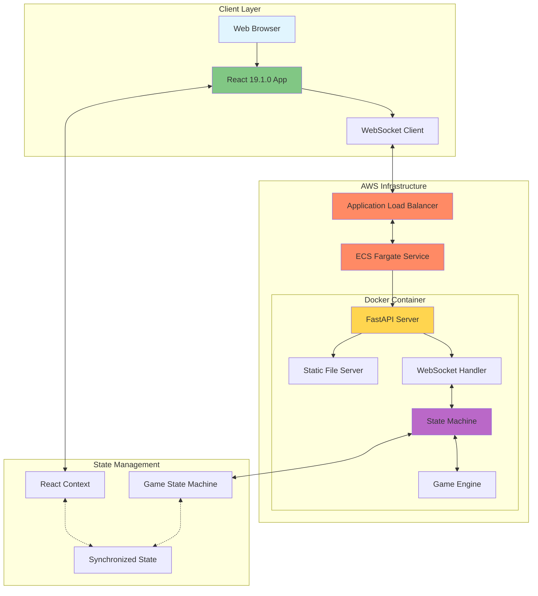

# Liap Tui (Castellan) - Project Overview

## Table of Contents
1. [Introduction](#introduction)
2. [System Architecture](#system-architecture)
3. [Core Components](#core-components)
4. [Technology Stack](#technology-stack)
5. [Key Features](#key-features)
6. [Design Philosophy](#design-philosophy)
7. [Getting Started](#getting-started)

## Introduction

Liap Tui (also known as Castellan) is a real-time multiplayer board game inspired by traditional Chinese-Thai gameplay. The project demonstrates modern web application architecture with real-time communication, state management, and cloud deployment.

### What is Liap Tui?
- **4-player** strategic board game
- **Turn-based** gameplay with simultaneous phases
- **Real-time** multiplayer using WebSockets
- **Cross-platform** web application
- **Cloud-deployed** on AWS ECS

### Game Overview
Players compete to capture "piles" by playing strategic combinations of pieces. The game features:
- 32 unique pieces with different ranks and colors
- Declaration phase where players predict their pile captures
- Strategic turn-based play with special combinations
- Scoring system with multipliers and win conditions

## System Architecture



### Architecture Highlights

1. **Single Container Design**
   - Frontend and backend in one Docker container
   - Simplified deployment and scaling
   - Reduced operational complexity

2. **WebSocket-Only Communication**
   - All game operations use WebSocket
   - No REST API for game actions
   - Real-time state synchronization

3. **State Machine Pattern**
   - Predictable state transitions
   - Enterprise architecture for broadcasting
   - Automatic state synchronization

## Core Components

### Backend Components

#### 1. **FastAPI Server** (`backend/api/main.py`)
- Serves static frontend files
- Manages WebSocket connections
- Provides health check endpoints
- Handles CORS and rate limiting

#### 2. **State Machine** (`backend/engine/state_machine/`)
- **Enterprise Architecture**: Automatic broadcasting of state changes
- **Phase Management**: WAITING → PREPARATION → DECLARATION → TURN → SCORING → GAME_OVER
- **Action Processing**: Validates and processes all game actions
- **Change Tracking**: Complete audit trail of state changes

#### 3. **Game Engine** (`backend/engine/`)
- **Core Logic**: Rules validation, scoring, win conditions
- **Player Management**: Handles 4 players with bot support
- **Piece System**: 32 unique pieces with special combinations
- **Round Management**: Multi-round gameplay with persistence

#### 4. **Room Manager** (`backend/engine/async_room_manager.py`)
- **Lobby System**: Create/join rooms
- **Player Tracking**: Connection state and reconnection
- **Game Lifecycle**: Start/pause/resume games
- **Host Migration**: Automatic host transfer on disconnect

### Frontend Components

#### 1. **React Application** (`frontend/src/`)
- **Modern React**: Version 19.1.0 with hooks
- **Single Page Application**: React Router for navigation
- **Context System**: Global state management
- **Theme Support**: Light/dark theme with persistence

#### 2. **Network Service** (`frontend/src/services/NetworkService.ts`)
- **Singleton Pattern**: Global WebSocket management
- **Auto-Reconnection**: Exponential backoff strategy
- **Message Queuing**: Handles messages during disconnection
- **Type Safety**: Full TypeScript implementation

#### 3. **Game UI Components** (`frontend/src/components/game/`)
- **Phase-Specific UIs**: Unique interface for each game phase
- **Responsive Design**: Mobile and desktop support
- **Animations**: Smooth transitions and feedback
- **Accessibility**: ARIA labels and keyboard navigation

#### 4. **Page Components** (`frontend/src/pages/`)
- **Start Page**: Player name entry
- **Lobby Page**: Room creation/joining
- **Room Page**: Pre-game waiting area
- **Game Page**: Main gameplay interface

## Technology Stack

### Frontend
- **Framework**: React 19.1.0
- **Language**: TypeScript/JavaScript
- **Bundler**: ESBuild (ultra-fast builds)
- **Styling**: CSS with Tailwind utilities
- **State**: React Context API
- **Routing**: React Router DOM
- **WebSocket**: Native WebSocket API

### Backend
- **Framework**: FastAPI (Python)
- **Language**: Python 3.11
- **Async**: asyncio for concurrent operations
- **WebSocket**: FastAPI WebSocket support
- **State Machine**: Custom implementation
- **Testing**: pytest
- **Linting**: pylint, black

### Infrastructure
- **Container**: Docker with multi-stage builds
- **Cloud**: AWS ECS Fargate
- **Load Balancer**: AWS Application Load Balancer
- **Registry**: AWS ECR
- **Deployment**: GitHub Actions CI/CD

## Key Features

### 1. **Real-Time Multiplayer**
- Instant state synchronization
- Low-latency gameplay
- Automatic reconnection
- Message queuing during disconnects

### 2. **Enterprise Architecture**
```python
# All state changes automatically broadcast
await self.update_phase_data({
    'current_player': next_player,
    'turn_number': turn + 1
}, "Player made move")
```
- Guaranteed state consistency
- Complete change history
- Automatic JSON serialization
- No manual broadcast calls

### 3. **Bot Intelligence**
- Automatic bot activation on disconnect
- Strategic play algorithms
- Configurable difficulty levels
- Seamless human/bot transitions

### 4. **Robust Error Handling**
- Graceful degradation
- User-friendly error messages
- Automatic recovery mechanisms
- Comprehensive logging

### 5. **Production Features**
- Health monitoring endpoints
- Performance metrics
- Rate limiting
- CORS configuration
- Session persistence

## Design Philosophy

### 1. **Simplicity First**
- Single container deployment
- WebSocket-only communication
- Minimal external dependencies

### 2. **State Consistency**
- Single source of truth (backend)
- Automatic synchronization
- Predictable state transitions

### 3. **Developer Experience**
- Hot reload in development
- Comprehensive logging
- Clear error messages
- Type safety throughout

### 4. **User Experience**
- Instant feedback
- Smooth animations
- Intuitive UI
- Mobile-friendly

### 5. **Scalability**
- Stateless design
- Horizontal scaling ready
- Load balancer compatible
- Cloud-native architecture

## Getting Started

### Prerequisites
- Node.js 18+
- Python 3.11+
- Docker (for containerized development)
- AWS CLI (for deployment)

### Quick Start
```bash
# Clone the repository
git clone <repository-url>
cd liap-tui

# Install dependencies
cd frontend && npm install
cd ../backend && pip install -r requirements.txt

# Start development servers
./start.sh  # Starts both frontend and backend
```

### Next Steps
1. Read [TECH_STACK.md](./TECH_STACK.md) for detailed technology explanations
2. Follow [../../02-flow-traces/STARTUP_FLOW.md](../02-flow-traces/STARTUP_FLOW.md) to understand initialization
3. See [../../06-tutorials/LOCAL_DEVELOPMENT.md](../06-tutorials/LOCAL_DEVELOPMENT.md) for development setup

## Architecture Benefits

### Why This Architecture?

1. **Single Container Simplicity**
   - Easier deployment and scaling
   - Reduced inter-service communication
   - Simplified debugging

2. **WebSocket-Only Design**
   - Real-time by default
   - Reduced complexity (no REST/WebSocket split)
   - Consistent communication pattern

3. **State Machine Pattern**
   - Predictable behavior
   - Easy to test and debug
   - Clear phase progression

4. **Enterprise Broadcasting**
   - Impossible to forget notifications
   - Complete audit trail
   - Guaranteed consistency

This architecture prioritizes simplicity, maintainability, and real-time performance while providing a solid foundation for a production multiplayer game.