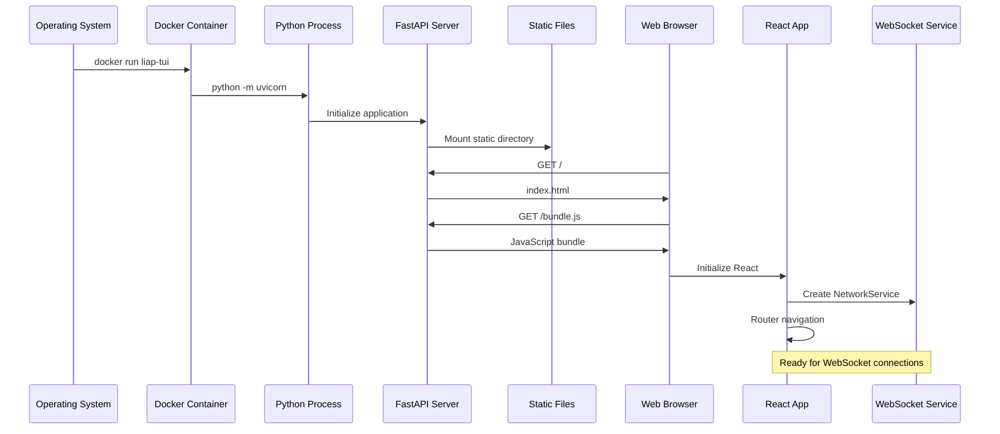

# Application Startup Flow

## Table of Contents
1. [Overview](#overview)
2. [Backend Startup Sequence](#backend-startup-sequence)
3. [Frontend Startup Sequence](#frontend-startup-sequence)
4. [Service Initialization](#service-initialization)
5. [Startup Coordination](#startup-coordination)
6. [Error Handling During Startup](#error-handling-during-startup)
7. [Development vs Production](#development-vs-production)

## Overview

This document traces the complete startup sequence of the Liap Tui application, from process initialization to ready-for-play state. Understanding this flow is crucial for debugging startup issues and adding new initialization steps.

### Startup Architecture



## Backend Startup Sequence

### 1. Process Initialization

**Entry Point**: `backend/api/main.py`

```python
# 1. Environment Setup
load_dotenv()  # Load .env configuration

# 2. Logging Configuration
from config.logging_config import setup_logging
setup_logging()

# 3. Log Buffer Setup (for debugging)
setup_log_buffer()
```

**What Happens**:
1. Python interpreter starts
2. Environment variables loaded from `.env`
3. Logging system configured with appropriate levels
4. Circular log buffer initialized for `/api/logs` endpoint

### 2. FastAPI Application Creation

```python
# Create FastAPI instance
app = FastAPI(
    title="Castellan API",
    description="Backend API for Castellan Board Game",
    version="1.0.0"
)

# Configure CORS
app.add_middleware(
    CORSMiddleware,
    allow_origins=ALLOWED_ORIGINS,
    allow_credentials=True,
    allow_methods=["*"],
    allow_headers=["*"],
)

# Add rate limiting
app.add_middleware(RateLimitMiddleware)
```

**Initialization Order**:
1. FastAPI application instance created
2. CORS middleware added (allows frontend connection)
3. Rate limiting middleware added
4. Custom middleware for WebSocket rate limiting

### 3. Singleton Services Initialization

```python
# backend/shared_instances.py
def initialize_shared_instances():
    global shared_room_manager, shared_bot_manager
    
    # Create singleton instances
    shared_room_manager = AsyncRoomManager()
    shared_bot_manager = BotManager(shared_room_manager)
    
    logger.info("✅ Shared instances initialized")

# Called during import
initialize_shared_instances()
```

**Singleton Services**:
- **AsyncRoomManager**: Manages all game rooms
- **BotManager**: Handles bot players
- **Both are global**: Shared across all requests

### 4. Route Registration

```python
# API Routes (REST endpoints)
app.include_router(api_router, prefix="/api")
app.include_router(debug_router, prefix="/api")

# WebSocket Routes
app.include_router(ws_router)

# Static File Serving (MUST be last)
app.mount("/", NoCacheStaticFiles(
    directory=STATIC_DIR,
    html=True
), name="static")
```

**Route Order Matters**:
1. API routes first (`/api/*`)
2. WebSocket routes (`/ws/*`)
3. Static files last (catch-all)

### 5. Server Startup

```bash
# Production
uvicorn backend.api.main:app --host 0.0.0.0 --port 5050

# Development
uvicorn backend.api.main:app --reload --port 5050
```

**Uvicorn Process**:
1. Loads the FastAPI app
2. Binds to specified host/port
3. Starts accepting connections
4. In dev: Watches for file changes

### Backend Ready State

When backend is ready:
- Health check endpoint responds: `GET /api/health` → 200 OK
- WebSocket endpoint available: `ws://localhost:5050/ws/{room_id}`
- Static files served: `GET /` → index.html
- Singleton services initialized and ready

## Frontend Startup Sequence

### 1. HTML Loading

**Entry Point**: `backend/static/index.html`

```html
<!DOCTYPE html>
<html>
<head>
    <meta charset="UTF-8">
    <title>Castellan</title>
    <link rel="stylesheet" href="/bundle.css">
</head>
<body>
    <div id="root"></div>
    <script src="/bundle.js"></script>
</body>
</html>
```

**Browser Process**:
1. Loads HTML document
2. Creates DOM with empty `#root` div
3. Loads CSS bundle
4. Executes JavaScript bundle

### 2. React Application Bootstrap

**Entry Point**: `frontend/main.js`

```javascript
import React from 'react';
import { createRoot } from 'react-dom/client';
import App from './src/App.jsx';

const container = document.getElementById('root');
const root = createRoot(container);
root.render(<App />);
```

**React 19 Process**:
1. Find root DOM element
2. Create React root (new API)
3. Render App component
4. Begin component lifecycle

### 3. App Component Initialization

**Component Tree**: `frontend/src/App.jsx`

```jsx
const App = () => {
  return (
    <ErrorBoundary>
      <ThemeProvider>
        <AppProvider>
          <AppWithServices />
        </AppProvider>
      </ThemeProvider>
    </ErrorBoundary>
  );
};
```

**Provider Hierarchy**:
1. **ErrorBoundary**: Catches React errors
2. **ThemeProvider**: Theme management
3. **AppProvider**: Global app state
4. **AppWithServices**: Service initialization

### 4. Service Initialization

**Service Setup**: `frontend/src/services/index.ts`

```javascript
const AppWithServices = () => {
  const [servicesInitialized, setServicesInitialized] = useState(false);

  useEffect(() => {
    const initServices = async () => {
      // 1. Initialize theme
      initializeTheme();
      
      // 2. Initialize network service
      await initializeServices();
      
      // 3. Check for stored session
      if (hasValidSession()) {
        const session = getSession();
        setSessionToRecover(session);
      }
      
      setServicesInitialized(true);
    };
    
    initServices();
  }, []);
};
```

**Service Initialization Order**:
1. Theme system (localStorage)
2. NetworkService singleton
3. Session recovery check
4. Ready for routing

## Service Initialization

### NetworkService Singleton

**Creation**: `frontend/src/services/NetworkService.ts`

```typescript
export class NetworkService extends EventTarget {
  private static instance: NetworkService | null = null;
  
  static getInstance(): NetworkService {
    if (!NetworkService.instance) {
      NetworkService.instance = new NetworkService();
    }
    return NetworkService.instance;
  }
  
  private constructor() {
    super();
    
    // Initialize configuration
    this.config = {
      heartbeatInterval: TIMING.HEARTBEAT_INTERVAL,
      maxReconnectAttempts: GAME.MAX_RECONNECT_ATTEMPTS,
      // ... other config
    };
    
    // Initialize data structures
    this.connections = new Map();
    this.messageQueues = new Map();
    this.sequenceNumbers = new Map();
  }
}
```

**Singleton Benefits**:
- Global WebSocket management
- Persistent connection state
- Message queue preservation
- Single source of truth

### Theme Initialization

```javascript
export const initializeTheme = () => {
  // Check localStorage
  const savedTheme = localStorage.getItem('liap-tui-theme');
  
  if (savedTheme) {
    applyTheme(savedTheme);
  } else {
    // Use system preference
    const prefersDark = window.matchMedia(
      '(prefers-color-scheme: dark)'
    ).matches;
    
    applyTheme(prefersDark ? 'dark' : 'light');
  }
};
```

## Startup Coordination

### Ready State Indicators

**Backend Ready**:
```python
# Health check passes
@router.get("/health")
async def health_check():
    return {"status": "healthy"}
```

**Frontend Ready**:
```javascript
// Services initialized
if (!servicesInitialized) {
  return <LoadingScreen />;
}

// Router ready
return <AppRouter />;
```

### Startup Timeline

```
Time    Backend                         Frontend
----    -------                         --------
0ms     Process starts                  
10ms    Load environment               
20ms    Initialize FastAPI             
30ms    Register routes                
40ms    Mount static files             
50ms    Start accepting connections    
100ms   Health check available         Browser requests /
150ms                                  Load HTML
200ms                                  Load bundle.js
250ms                                  React initializes
300ms                                  Services initialize
350ms                                  Router ready
400ms   <-- Ready for WebSocket connections -->
```

## Error Handling During Startup

### Backend Error Handling

```python
# Graceful startup failure
try:
    setup_logging()
except ImportError:
    print("Warning: Logging configuration not available")
    # Continue with defaults

# Health check includes detailed status
@router.get("/health/detailed")
async def detailed_health():
    return {
        "status": "healthy",
        "services": {
            "room_manager": bool(room_manager),
            "bot_manager": bool(bot_manager),
            "websocket": True
        },
        "uptime": time.time() - START_TIME
    }
```

### Frontend Error Handling

```jsx
// Service initialization failure
if (initializationError) {
  return (
    <div className="service-error">
      <h1>Service Initialization Failed</h1>
      <p>{initializationError}</p>
      <button onClick={() => window.location.reload()}>
        Retry
      </button>
    </div>
  );
}

// Error boundary for React errors
class ErrorBoundary extends React.Component {
  componentDidCatch(error, errorInfo) {
    console.error('React Error:', error, errorInfo);
    // Could send to error tracking service
  }
}
```

## Development vs Production

### Development Startup

```bash
# Backend with hot reload
cd backend
uvicorn api.main:app --reload --port 5050

# Frontend with hot reload  
cd frontend
npm run dev  # ESBuild watch mode

# Both managed by start.sh
./start.sh
```

**Development Features**:
- File watching and hot reload
- Detailed error messages
- Source maps enabled
- CORS allows localhost
- Verbose logging

### Production Startup

```dockerfile
# Docker container startup
CMD ["python", "-m", "uvicorn", "backend.api.main:app", \
     "--host", "0.0.0.0", "--port", "5050"]
```

```bash
# ECS task definition
{
  "command": ["python", "-m", "uvicorn", "backend.api.main:app"],
  "environment": [
    {"name": "ENVIRONMENT", "value": "production"},
    {"name": "LOG_LEVEL", "value": "INFO"}
  ]
}
```

**Production Optimizations**:
- Pre-built frontend bundle
- Minified JavaScript
- No source maps
- Restricted CORS
- Error aggregation

### Health Monitoring

**ALB Health Check**:
```yaml
Target: /api/health
Interval: 30 seconds
Timeout: 5 seconds
Healthy threshold: 2
Unhealthy threshold: 3
```

**Container Health**:
```dockerfile
HEALTHCHECK --interval=30s --timeout=3s \
  CMD curl -f http://localhost:5050/api/health || exit 1
```

## Startup Troubleshooting

### Common Issues

1. **Port Already in Use**
   ```
   ERROR: [Errno 48] Address already in use
   ```
   Solution: Kill existing process or use different port

2. **Static Files Not Found**
   ```
   404 Not Found: /bundle.js
   ```
   Solution: Run `npm run build` in frontend directory

3. **WebSocket Connection Failed**
   ```
   WebSocket connection to 'ws://localhost:5050/ws/lobby' failed
   ```
   Solution: Check backend is running and CORS configured

4. **Module Import Errors**
   ```
   ImportError: No module named 'backend'
   ```
   Solution: Run from project root with correct PYTHONPATH

### Startup Logs

**Successful Backend Startup**:
```
INFO:     Started server process [12345]
INFO:     Waiting for application startup.
INFO:     ✅ Shared instances initialized
INFO:     ✅ Log buffer enabled for Claude AI access
INFO:     Application startup complete.
INFO:     Uvicorn running on http://0.0.0.0:5050
```

**Successful Frontend Startup**:
```
🎮 Global services initialized
🎮 Theme initialized: light
🎮 NetworkService singleton created
🎮 Router ready
```

## Key Takeaways

1. **Initialization Order Matters**
   - Backend: Environment → FastAPI → Routes → Static
   - Frontend: HTML → React → Services → Router

2. **Singleton Services**
   - Both frontend and backend use singleton pattern
   - Ensures single source of truth
   - Survives component re-renders

3. **Error Recovery**
   - Graceful fallbacks at each stage
   - User-friendly error messages
   - Retry mechanisms available

4. **Development Experience**
   - Hot reload for rapid development
   - Detailed logging for debugging
   - Single command startup

This startup flow ensures a robust, predictable initialization that handles errors gracefully and provides a smooth developer experience.