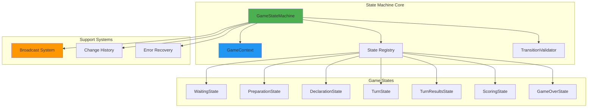
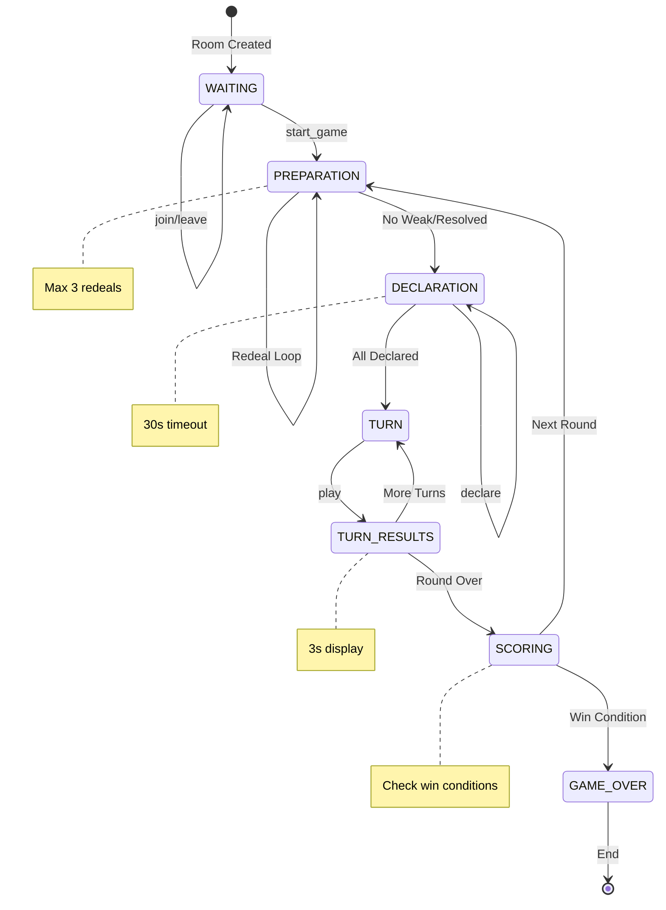
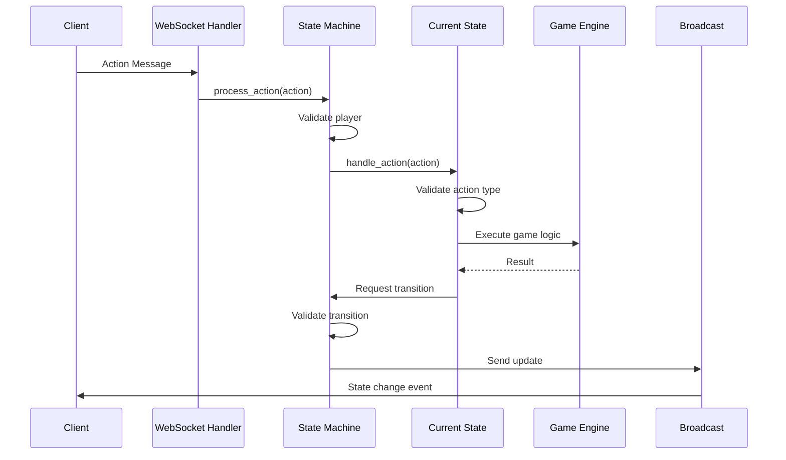

# State Machine Transitions - Game Phase Flow

## Table of Contents
1. [Overview](#overview)
2. [State Machine Architecture](#state-machine-architecture)
3. [Game Phases](#game-phases)
4. [Transition Rules](#transition-rules)
5. [Action Processing](#action-processing)
6. [Edge Cases & Error Handling](#edge-cases--error-handling)
7. [State Validation](#state-validation)
8. [Transition Examples](#transition-examples)
9. [Testing State Transitions](#testing-state-transitions)

## Overview

The Liap Tui game uses a formal state machine to manage game progression. This document details how states transition, what triggers transitions, and how the system maintains consistency throughout gameplay.

### State Machine Benefits

1. **Predictability**: Only valid transitions allowed
2. **Debugging**: Clear state at any moment
3. **Testing**: Each state testable in isolation
4. **Consistency**: Impossible to reach invalid states

## State Machine Architecture

### Core Components



### State Machine Implementation

```python
class GameStateMachine:
    """Core state machine managing game progression."""
    
    def __init__(self, room_id: str, room_manager: AsyncRoomManager):
        self.room_id = room_id
        self.room_manager = room_manager
        self.phase = GamePhase.WAITING
        self.game: Optional[Game] = None
        
        # State registry
        self.states = {
            GamePhase.WAITING: WaitingState(self),
            GamePhase.PREPARATION: PreparationState(self),
            GamePhase.DECLARATION: DeclarationState(self),
            GamePhase.TURN: TurnState(self),
            GamePhase.TURN_RESULTS: TurnResultsState(self),
            GamePhase.SCORING: ScoringState(self),
            GamePhase.GAME_OVER: GameOverState(self)
        }
        
        # Initialize current state
        self.current_state = self.states[GamePhase.WAITING]
```

## Game Phases

### Phase Overview

| Phase | Purpose | Duration | Next Phase |
|-------|---------|----------|------------|
| WAITING | Players joining | Until start | PREPARATION |
| PREPARATION | Deal cards, check weak hands | ~10s | DECLARATION |
| DECLARATION | Players declare pile targets | 30s timeout | TURN |
| TURN | Active player plays pieces | No limit | TURN_RESULTS |
| TURN_RESULTS | Show turn outcome | 3s | TURN or SCORING |
| SCORING | Calculate round scores | ~5s | PREPARATION or GAME_OVER |
| GAME_OVER | Show final results | Permanent | - |

### Phase Details

#### WAITING Phase
```python
class WaitingState(GameState):
    """Waiting for players to join."""
    
    async def handle_action(self, action: GameAction) -> ActionResult:
        if action.action_type == ActionType.START_GAME:
            # Validate preconditions
            if len(self.context.players) < 4:
                raise GameError("Need 4 players to start")
                
            # Transition to PREPARATION
            await self.transition_to_phase(GamePhase.PREPARATION)
            return ActionResult(success=True)
```

**Valid Actions**: `join_room`, `leave_room`, `start_game`

#### PREPARATION Phase
```python
class PreparationState(GameState):
    """Deal cards and handle weak hands."""
    
    async def enter_phase(self):
        # Deal pieces to all players
        self.game.deal_pieces()
        
        # Check for weak hands
        weak_players = self.game.check_weak_hands()
        
        if weak_players:
            await self.handle_weak_hand_scenario(weak_players)
        else:
            await self.transition_to_phase(GamePhase.DECLARATION)
```

**Valid Actions**: `accept_redeal`, `decline_redeal`

#### DECLARATION Phase
```python
class DeclarationState(GameState):
    """Players declare target pile count."""
    
    async def handle_action(self, action: GameAction) -> ActionResult:
        if action.action_type == ActionType.DECLARE:
            # Record declaration
            declaration = action.data["declaration"]
            self.game.set_declaration(action.player_name, declaration)
            
            # Check if all declared
            if self.game.all_players_declared():
                await self.transition_to_phase(GamePhase.TURN)
                
            return ActionResult(success=True)
```

**Valid Actions**: `declare`

#### TURN Phase
```python
class TurnState(GameState):
    """Active player plays pieces."""
    
    async def handle_action(self, action: GameAction) -> ActionResult:
        if action.action_type == ActionType.PLAY:
            # Validate it's player's turn
            if action.player_name != self.current_player:
                raise GameError("Not your turn")
                
            # Validate and play pieces
            piece_ids = action.data["piece_ids"]
            play_result = self.game.play_pieces(
                action.player_name, 
                piece_ids
            )
            
            # Always transition to TURN_RESULTS
            await self.transition_to_phase(GamePhase.TURN_RESULTS)
            
            return ActionResult(success=True, data=play_result)
```

**Valid Actions**: `play`

## Transition Rules

### State Transition Diagram



### Transition Validation

```python
class TransitionValidator:
    """Validates state transitions."""
    
    # Valid transition map
    VALID_TRANSITIONS = {
        GamePhase.WAITING: [GamePhase.PREPARATION],
        GamePhase.PREPARATION: [GamePhase.DECLARATION],
        GamePhase.DECLARATION: [GamePhase.TURN],
        GamePhase.TURN: [GamePhase.TURN_RESULTS],
        GamePhase.TURN_RESULTS: [GamePhase.TURN, GamePhase.SCORING],
        GamePhase.SCORING: [GamePhase.PREPARATION, GamePhase.GAME_OVER],
        GamePhase.GAME_OVER: []  # Terminal state
    }
    
    def can_transition(self, from_phase: GamePhase, to_phase: GamePhase) -> bool:
        """Check if transition is valid."""
        valid_targets = self.VALID_TRANSITIONS.get(from_phase, [])
        return to_phase in valid_targets
```

### Automatic Transitions

Some transitions happen automatically:

```python
# TURN → TURN_RESULTS (always after play)
async def handle_play_action(self, action: GameAction):
    # Process play
    await self.game.play_pieces(...)
    
    # Automatic transition
    await self.transition_to_phase(GamePhase.TURN_RESULTS)

# TURN_RESULTS → TURN/SCORING (after timer)
async def enter_phase(self):
    # Show results for 3 seconds
    await asyncio.sleep(3)
    
    # Auto-transition based on game state
    if self.game.is_round_complete():
        await self.transition_to_phase(GamePhase.SCORING)
    else:
        await self.transition_to_phase(GamePhase.TURN)
```

## Action Processing

### Action Flow



### Action Validation Pipeline

```python
async def process_action(self, action: GameAction) -> ActionResult:
    """Process action through validation pipeline."""
    
    # 1. Player validation
    if not self._is_valid_player(action.player_name):
        raise GameError("Unknown player")
    
    # 2. Connection validation  
    if not self._is_player_connected(action.player_name):
        raise GameError("Player not connected")
    
    # 3. Phase validation
    valid_actions = self.current_state.get_valid_actions()
    if action.action_type not in valid_actions:
        raise GameError(
            f"Action {action.action_type} not valid in {self.phase}"
        )
    
    # 4. Delegate to current state
    try:
        result = await self.current_state.handle_action(action)
        
        # 5. Post-process successful actions
        await self._record_action(action, result)
        
        return result
        
    except GameError as e:
        # 6. Handle game errors gracefully
        await self._handle_game_error(e, action)
        raise
```

## Edge Cases & Error Handling

### Common Edge Cases

#### 1. Player Disconnection During Turn
```python
async def handle_player_disconnect(self, player_name: str):
    """Handle mid-game disconnection."""
    
    if self.phase == GamePhase.TURN and self.current_player == player_name:
        # Activate bot for disconnected player
        self.game.activate_bot(player_name)
        
        # Bot makes automatic play
        bot_action = self.game.get_bot_play(player_name)
        await self.process_action(bot_action)
        
    elif self.phase == GamePhase.DECLARATION:
        # Auto-declare median value
        self.game.auto_declare(player_name)
```

#### 2. Timeout Handling
```python
class DeclarationState(GameState):
    DECLARATION_TIMEOUT = 30  # seconds
    
    async def enter_phase(self):
        """Start declaration with timeout."""
        # Start timeout timer
        self.timeout_task = asyncio.create_task(
            self._declaration_timeout()
        )
    
    async def _declaration_timeout(self):
        """Handle declaration timeout."""
        await asyncio.sleep(self.DECLARATION_TIMEOUT)
        
        # Auto-declare for remaining players
        for player in self.game.get_undeclared_players():
            self.game.auto_declare(player.name)
        
        # Force transition
        await self.transition_to_phase(GamePhase.TURN)
```

#### 3. Invalid State Recovery
```python
async def recover_from_invalid_state(self):
    """Recover from unexpected state."""
    
    logger.error(f"Invalid state detected: {self.phase}")
    
    # Attempt recovery based on game data
    if self.game and self.game.round_number > 0:
        # Mid-game: try to restore to TURN phase
        await self.force_transition(GamePhase.TURN)
    else:
        # Pre-game: reset to WAITING
        await self.force_transition(GamePhase.WAITING)
    
    # Notify players of recovery
    await self.broadcast_custom_event("state_recovery", {
        "message": "Game state recovered",
        "new_phase": self.phase.value
    })
```

### Error Types and Handling

```python
class GameError(Exception):
    """Base game error with code and details."""
    
    def __init__(self, code: str, message: str, details: dict = None):
        self.code = code
        self.message = message
        self.details = details or {}
        super().__init__(message)

# Common error codes
ERROR_CODES = {
    "INVALID_PHASE": "Action not allowed in current phase",
    "NOT_YOUR_TURN": "It's not your turn",
    "INVALID_PLAY": "That play violates game rules",
    "ALREADY_DECLARED": "You already declared",
    "ROOM_FULL": "Room has maximum players",
    "GAME_IN_PROGRESS": "Game already started",
    "INSUFFICIENT_PLAYERS": "Not enough players"
}
```

## State Validation

### Pre-Transition Validation

```python
async def transition_to_phase(self, new_phase: GamePhase):
    """Safely transition to new phase."""
    
    # 1. Validate transition is allowed
    if not self.validator.can_transition(self.phase, new_phase):
        raise GameError(
            "INVALID_TRANSITION",
            f"Cannot transition from {self.phase} to {new_phase}"
        )
    
    # 2. Exit current phase
    await self.current_state.exit_phase()
    
    # 3. Update phase
    old_phase = self.phase
    self.phase = new_phase
    self.current_state = self.states[new_phase]
    
    # 4. Enter new phase
    await self.current_state.enter_phase()
    
    # 5. Broadcast transition
    await self.update_phase_data({
        'previous_phase': old_phase.value,
        'transition_time': time.time()
    }, f"Transitioned from {old_phase} to {new_phase}")
```

### State Invariants

Each phase maintains invariants that must always be true:

```python
class TurnState(GameState):
    def validate_invariants(self):
        """Check turn phase invariants."""
        assert self.game is not None, "Game must exist"
        assert self.current_player is not None, "Must have current player"
        assert self.turn_number >= 1, "Turn number must be positive"
        assert len(self.current_plays) <= 4, "Max 4 plays per turn"
        
        # Current player must have pieces
        player = self.game.get_player(self.current_player)
        assert len(player.hand) > 0, "Current player must have pieces"
```

## Transition Examples

### Example 1: Complete Turn Sequence

```python
# Initial state: TURN phase, Alice's turn
{
    "phase": "TURN",
    "phase_data": {
        "current_player": "Alice",
        "turn_number": 5,
        "required_piece_count": 2
    }
}

# Action: Alice plays 2 pieces
→ {"event": "play", "data": {"piece_ids": ["p1", "p2"]}}

# Transition: TURN → TURN_RESULTS
← {
    "event": "phase_change",
    "data": {
        "phase": "TURN_RESULTS",
        "phase_data": {
            "plays": [
                {"player": "Alice", "pieces": ["GENERAL_RED", "ADVISOR_BLACK"]},
                {"player": "Bob", "pieces": ["HORSE_RED", "HORSE_RED"]},
                {"player": "Carol", "pieces": []},
                {"player": "David", "pieces": ["SOLDIER_BLACK"]}
            ],
            "winner": "Bob",
            "play_type": "PAIR"
        }
    }
}

# Auto-transition after 3s: TURN_RESULTS → TURN
← {
    "event": "phase_change", 
    "data": {
        "phase": "TURN",
        "phase_data": {
            "current_player": "Bob",
            "turn_number": 6,
            "pile_counts": {"Alice": 2, "Bob": 3, "Carol": 1, "David": 1}
        }
    }
}
```

### Example 2: Declaration Timeout

```python
# State: DECLARATION phase, waiting for declarations
{
    "phase": "DECLARATION",
    "phase_data": {
        "declarations": {"Alice": 3, "Bob": 2},
        "waiting_for": ["Carol", "David"],
        "timeout_remaining": 5
    }
}

# After 30s timeout
← {
    "event": "phase_change",
    "data": {
        "phase": "DECLARATION",
        "phase_data": {
            "declarations": {
                "Alice": 3,
                "Bob": 2, 
                "Carol": 2,  # Auto-declared
                "David": 2   # Auto-declared
            },
            "auto_declared": ["Carol", "David"]
        }
    }
}

# Immediate transition: DECLARATION → TURN
← {
    "event": "phase_change",
    "data": {
        "phase": "TURN",
        "phase_data": {
            "current_player": "Alice",
            "turn_number": 1
        }
    }
}
```

## Testing State Transitions

### Unit Testing States

```python
@pytest.mark.asyncio
async def test_turn_state_valid_play():
    """Test valid play in turn state."""
    # Setup
    state_machine = GameStateMachine("test_room", mock_room_manager)
    state_machine.phase = GamePhase.TURN
    state_machine.game = create_test_game()
    
    # Action
    action = GameAction(
        action_type=ActionType.PLAY,
        player_name="Alice",
        data={"piece_ids": ["p1", "p2"]}
    )
    
    # Execute
    result = await state_machine.process_action(action)
    
    # Verify
    assert result.success
    assert state_machine.phase == GamePhase.TURN_RESULTS
```

### Integration Testing Flows

```python
@pytest.mark.asyncio
async def test_complete_game_flow():
    """Test complete game from start to finish."""
    sm = GameStateMachine("test", mock_manager)
    
    # Add 4 players
    for player in ["Alice", "Bob", "Carol", "David"]:
        await sm.add_player(player)
    
    # Start game
    await sm.process_action(GameAction(
        ActionType.START_GAME, "Alice", {}
    ))
    assert sm.phase == GamePhase.PREPARATION
    
    # Continue through all phases...
```

### State Machine Visualization

For debugging, the state machine can output its current state:

```python
def visualize_state(self):
    """Generate state visualization."""
    return {
        "current_phase": self.phase.value,
        "valid_actions": self.current_state.get_valid_actions(),
        "phase_data": self.phase_data,
        "players": [p.to_dict() for p in self.game.players],
        "history": self.get_recent_transitions(5)
    }
```

## Summary

The state machine architecture provides:

1. **Predictable Flow**: Clear phase progression
2. **Error Prevention**: Invalid transitions impossible
3. **Easy Debugging**: Current state always known
4. **Automated Handling**: Timeouts and disconnections
5. **Testing Support**: Each state testable in isolation

This design ensures the game maintains consistency even with:
- Network interruptions
- Player disconnections  
- Concurrent actions
- Edge case scenarios

The combination of formal state transitions, validation, and error recovery creates a robust multiplayer game experience.