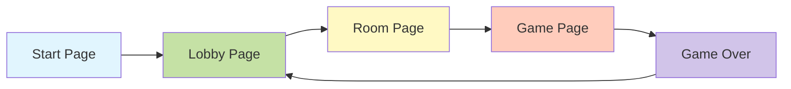
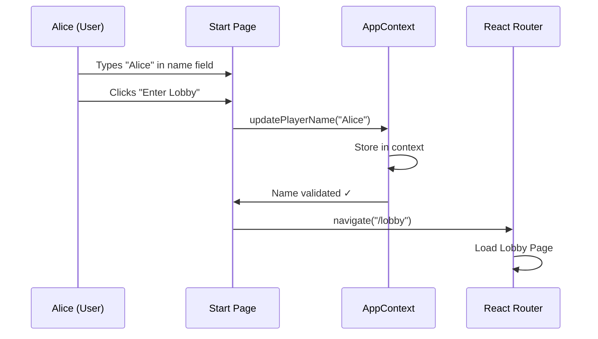
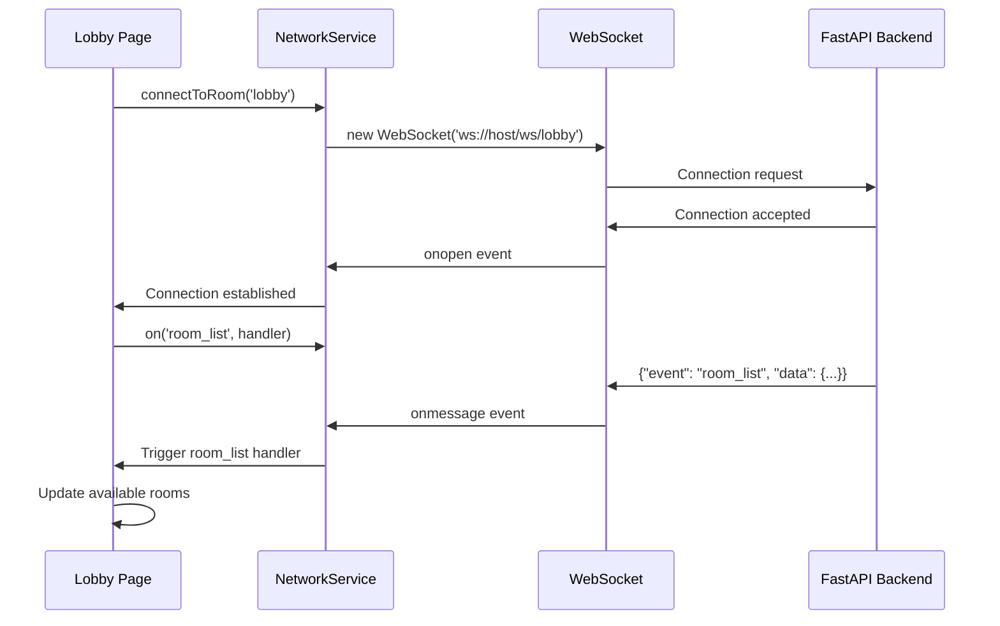
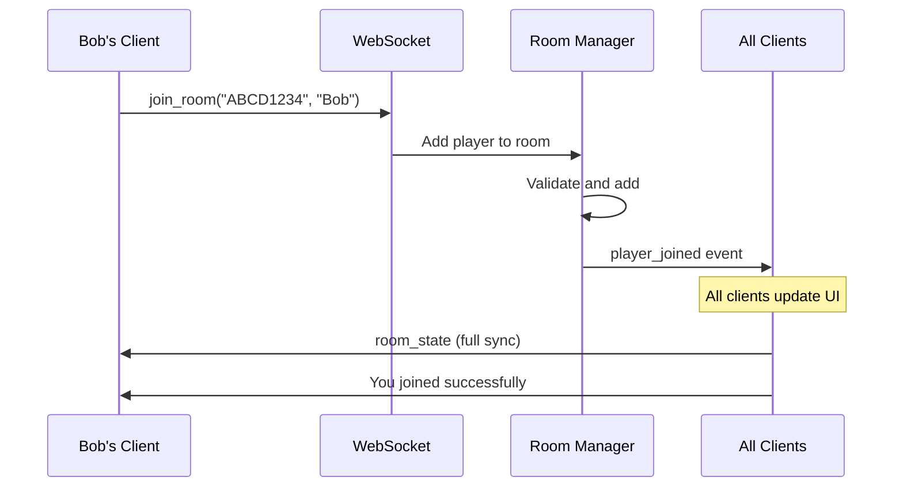
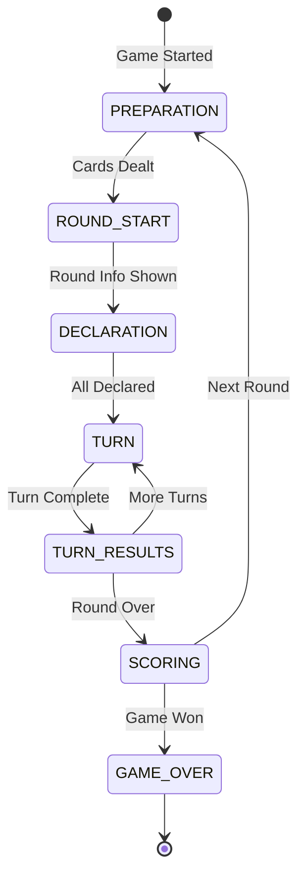
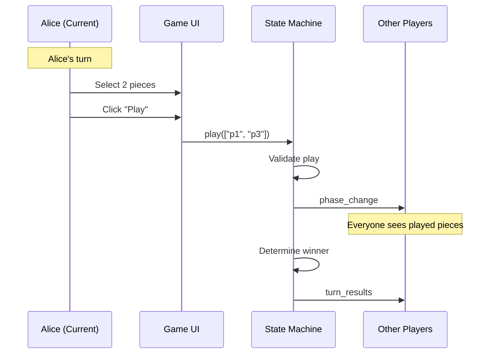
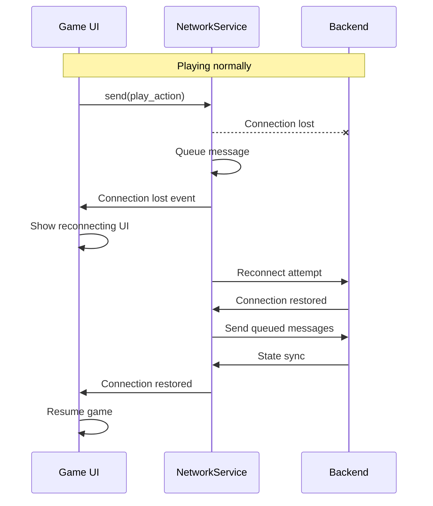

# User Journey - Complete Flow from Start to Game Over

## Table of Contents
1. [Overview](#overview)
2. [Journey Stages](#journey-stages)
3. [Start Page - Player Entry](#start-page---player-entry)
4. [Lobby - Finding a Game](#lobby---finding-a-game)
5. [Room - Waiting for Players](#room---waiting-for-players)
6. [Game - Playing Through Phases](#game---playing-through-phases)
7. [Game Over - Victory or Defeat](#game-over---victory-or-defeat)
8. [Data Flow Examples](#data-flow-examples)
9. [Error Scenarios](#error-scenarios)

## Overview

This document traces a complete user journey through the Liap Tui application, from first visit to game completion. We'll follow a player named "Alice" as she navigates through each stage, showing the data flow and state changes at each step.

### Journey Overview



## Journey Stages

### Stage Summary

| Stage | Page | Purpose | Key Actions |
|-------|------|---------|-------------|
| 1 | Start Page | Player identification | Enter name |
| 2 | Lobby | Find or create game | Create/join room |
| 3 | Room | Wait for players | Ready up, start game |
| 4 | Game | Play the game | Make moves through phases |
| 5 | Game Over | See results | Return to lobby |

## Start Page - Player Entry

### Visual State
```
┌─────────────────────────────────┐
│        Welcome to Castellan      │
│                                  │
│         [Game Logo]              │
│                                  │
│    Player Name: [___________]    │
│                                  │
│    [Enter Lobby] [How to Play]   │
└─────────────────────────────────┘
```

### User Flow



### Data State

**Before Name Entry**:
```javascript
// AppContext state
{
  playerName: null,
  currentRoomId: null,
  connectionStatus: 'disconnected'
}
```

**After Name Entry**:
```javascript
// AppContext state
{
  playerName: "Alice",
  currentRoomId: null,
  connectionStatus: 'disconnected'
}

// LocalStorage
{
  'player-name': 'Alice'
}
```

### Code Flow

```jsx
// StartPage.jsx - Form submission
const onSubmit = async (data) => {
  // Update context
  app.updatePlayerName(data.playerName);
  
  // Navigate to lobby
  navigate('/lobby');
};
```

## Lobby - Finding a Game

### Visual State
```
┌─────────────────────────────────┐
│    Lobby - Welcome Alice!        │
│                                  │
│  Available Rooms:                │
│  ┌─────────────────────┐        │
│  │ Bob's Room (2/4)   │ [Join]  │
│  │ Carol's Game (3/4) │ [Join]  │
│  └─────────────────────┘        │
│                                  │
│  [Create Room]  Room Code: [____]│
└─────────────────────────────────┘
```

### WebSocket Connection



### Create Room Flow

```javascript
// User clicks "Create Room"
const handleCreateRoom = async () => {
  setIsCreatingRoom(true);
  
  networkService.send('lobby', 'create_room', {
    player_name: playerName,
    room_settings: {
      max_players: 4,
      is_public: true
    }
  });
};

// WebSocket message sent
{
  "event": "create_room",
  "data": {
    "player_name": "Alice",
    "room_settings": {
      "max_players": 4,
      "is_public": true
    }
  },
  "room_id": "lobby",
  "sequence": 1
}

// Backend response
{
  "event": "room_created",
  "data": {
    "room_id": "ABCD1234",
    "host": "Alice",
    "players": ["Alice"],
    "settings": {
      "max_players": 4,
      "is_public": true
    }
  }
}

// Frontend handles response
networkService.on('room_created', (data) => {
  app.setCurrentRoomId(data.room_id);
  navigate(`/room/${data.room_id}`);
});
```

## Room - Waiting for Players

### Visual State
```
┌─────────────────────────────────┐
│    Room ABCD1234                 │
│                                  │
│  Players (2/4):                  │
│  • Alice (Host) ✓               │
│  • Bob ✓                        │
│  • [Waiting...]                  │
│  • [Waiting...]                  │
│                                  │
│  [Start Game] [Leave Room]       │
│                                  │
│  Room Code: ABCD1234             │
└─────────────────────────────────┘
```

### Player Join Flow



### Start Game Trigger

```javascript
// Host clicks "Start Game"
const handleStartGame = () => {
  networkService.send(roomId, 'start_game', {
    player_name: playerName
  });
};

// Backend validates and starts
{
  "event": "game_started",
  "data": {
    "room_id": "ABCD1234",
    "game_state": {
      "phase": "PREPARATION",
      "round_number": 1,
      "players": [
        {"name": "Alice", "position": 0},
        {"name": "Bob", "position": 1},
        {"name": "Carol", "position": 2},
        {"name": "David", "position": 3}
      ]
    }
  }
}

// Navigate to game
networkService.on('game_started', (data) => {
  navigate(`/game/${roomId}`);
});
```

## Game - Playing Through Phases

### Game Flow Overview



### Phase 1: PREPARATION

**What Happens**:
1. Backend deals 8 pieces to each player
2. Check for weak hands (no piece > 9 points)
3. Handle redeal requests if needed

```javascript
// Frontend receives dealt pieces
{
  "event": "phase_change",
  "data": {
    "phase": "PREPARATION",
    "phase_data": {
      "dealing_cards": true,
      "weak_players": ["Bob", "Carol"],
      "redeal_multiplier": 1
    }
  }
}

// Alice's hand data
{
  "event": "hand_updated",
  "data": {
    "pieces": [
      {"id": "p1", "rank": "GENERAL", "color": "RED", "point": 10},
      {"id": "p2", "rank": "ADVISOR", "color": "BLACK", "point": 10},
      {"id": "p3", "rank": "ELEPHANT", "color": "RED", "point": 9},
      // ... 5 more pieces
    ]
  }
}
```

### Phase 2: DECLARATION

**Visual State**:
```
Your Hand: [♠10][♥10][♠9][♥8]...
Declare how many piles you'll win: [0-8]
```

```javascript
// Alice declares 3 piles
networkService.send(roomId, 'declare', {
  player_name: "Alice",
  declaration: 3
});

// Backend broadcasts all declarations
{
  "event": "phase_change",
  "data": {
    "phase": "DECLARATION",
    "phase_data": {
      "declarations": {
        "Alice": 3,
        "Bob": 2,
        "Carol": 2,
        "David": 1
      },
      "all_declared": true
    }
  }
}
```

### Phase 3: TURN

**Turn Sequence**:



**Play Action**:
```javascript
// Alice plays GENERAL_RED + ELEPHANT_RED
{
  "event": "play",
  "data": {
    "player_name": "Alice",
    "piece_ids": ["p1", "p3"]
  }
}

// Turn result
{
  "event": "phase_change",
  "data": {
    "phase": "TURN_RESULTS",
    "phase_data": {
      "plays": [
        {"player": "Alice", "pieces": ["GENERAL_RED", "ELEPHANT_RED"]},
        {"player": "Bob", "pieces": ["CHARIOT_BLACK", "CHARIOT_BLACK"]},
        {"player": "Carol", "pieces": []}, // passed
        {"player": "David", "pieces": ["SOLDIER_RED"]}
      ],
      "winner": "Alice",
      "play_type": "PAIR"
    }
  }
}
```

### Phase 4: SCORING

**Round Complete**:
```javascript
{
  "event": "phase_change",
  "data": {
    "phase": "SCORING",
    "phase_data": {
      "round_number": 1,
      "scores": {
        "Alice": {"declared": 3, "captured": 3, "points": 9, "total": 9},
        "Bob": {"declared": 2, "captured": 1, "points": -3, "total": -3},
        "Carol": {"declared": 2, "captured": 2, "points": 6, "total": 6},
        "David": {"declared": 1, "captured": 2, "points": 3, "total": 3}
      },
      "multiplier": 1
    }
  }
}
```

## Game Over - Victory or Defeat

### Win Conditions Met

```javascript
{
  "event": "phase_change",
  "data": {
    "phase": "GAME_OVER",
    "phase_data": {
      "winners": ["Alice"],
      "final_scores": {
        "Alice": 52,
        "Bob": 31,
        "Carol": 28,
        "David": 15
      },
      "win_condition": "FIRST_TO_50",
      "rounds_played": 7
    }
  }
}
```

### UI Display
```
┌─────────────────────────────────┐
│         Game Over!              │
│                                  │
│    🏆 Alice Wins! 🏆            │
│                                  │
│  Final Scores:                  │
│  1. Alice - 52 points           │
│  2. Bob - 31 points             │
│  3. Carol - 28 points           │
│  4. David - 15 points           │
│                                  │
│  [Return to Lobby] [Play Again]  │
└─────────────────────────────────┘
```

## Data Flow Examples

### Complete Message Flow - Creating and Starting a Game

```javascript
// 1. Create Room (Lobby → Backend)
→ {"event": "create_room", "data": {"player_name": "Alice"}}
← {"event": "room_created", "data": {"room_id": "ABCD1234"}}

// 2. Join Room (Other Players)
→ {"event": "join_room", "data": {"player_name": "Bob"}}
← {"event": "player_joined", "data": {"player": "Bob", "total": 2}}

// 3. Start Game (Host)
→ {"event": "start_game", "data": {"player_name": "Alice"}}
← {"event": "game_started", "data": {"phase": "PREPARATION"}}

// 4. Game Phase Changes
← {"event": "phase_change", "data": {"phase": "PREPARATION"}}
← {"event": "hand_updated", "data": {"pieces": [...]}}
← {"event": "phase_change", "data": {"phase": "DECLARATION"}}

// 5. Player Actions
→ {"event": "declare", "data": {"declaration": 3}}
→ {"event": "play", "data": {"piece_ids": ["p1", "p2"]}}

// 6. Game Results
← {"event": "phase_change", "data": {"phase": "SCORING"}}
← {"event": "phase_change", "data": {"phase": "GAME_OVER"}}
```

### State Synchronization

**Frontend State (React Context)**:
```javascript
{
  gameState: {
    phase: "TURN",
    roundNumber: 3,
    turnNumber: 5,
    currentPlayer: "Bob",
    myHand: [...],
    phaseData: {
      declarations: {...},
      current_plays: {...},
      pile_counts: {...}
    }
  }
}
```

**Backend State (State Machine)**:
```python
{
    "phase": GamePhase.TURN,
    "phase_data": {
        "current_player": "Bob",
        "turn_number": 5,
        "required_piece_count": 2,
        "current_plays": {...},
        "pile_counts": {...}
    },
    "game": {
        "round_number": 3,
        "players": [...],
        "scores": {...}
    }
}
```

## Error Scenarios

### Connection Lost During Game



### Invalid Action Handling

```javascript
// Player tries invalid move
→ {"event": "play", "data": {"piece_ids": ["p1", "p5"]}}

// Backend validates and rejects
← {
  "event": "error",
  "data": {
    "code": "INVALID_PLAY",
    "message": "Cannot play pieces of different colors",
    "details": {
      "pieces": ["GENERAL_RED", "HORSE_BLACK"],
      "reason": "color_mismatch"
    }
  }
}

// UI shows error
<ErrorToast message="Cannot play pieces of different colors" />
```

## Journey Completion

After game over, the journey completes with:

1. **Return to Lobby**: Player can find another game
2. **Play Again**: Same players, new game
3. **Leave**: Close the application

The entire journey demonstrates:
- **Seamless Navigation**: React Router handles page transitions
- **Real-time Updates**: WebSocket keeps all players synchronized
- **State Persistence**: Game state preserved through connection issues
- **Error Recovery**: Graceful handling of edge cases

This complete user journey showcases how the architecture supports a smooth, engaging multiplayer experience from start to finish.