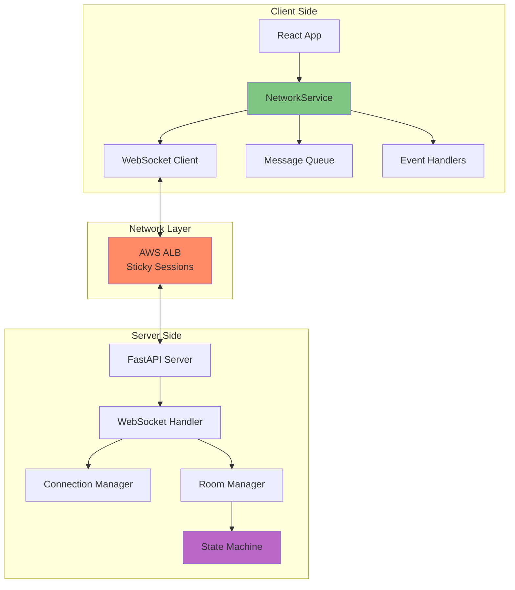
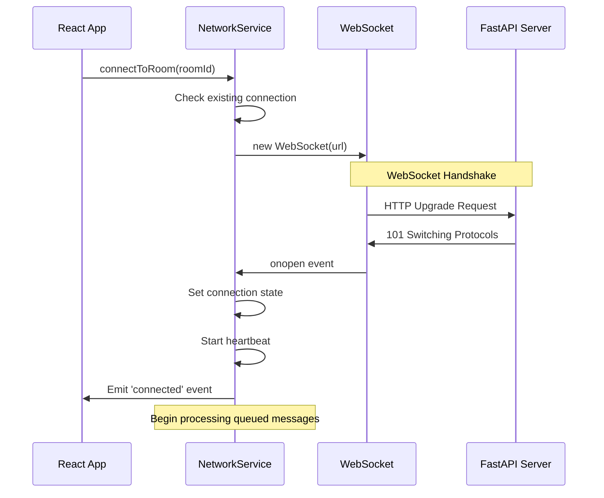

# WebSocket Communication Flow

## Table of Contents
1. [Overview](#overview)
2. [Architecture](#architecture)
3. [Connection Lifecycle](#connection-lifecycle)
4. [Message Format](#message-format)
5. [Event Types](#event-types)
6. [Communication Patterns](#communication-patterns)
7. [Error Handling & Recovery](#error-handling--recovery)
8. [Message Examples](#message-examples)
9. [Performance & Optimization](#performance--optimization)
10. [Debugging WebSocket Issues](#debugging-websocket-issues)

## Overview

The Liap Tui application uses WebSocket as the **sole communication protocol** for all game operations. This document details how WebSocket connections are established, maintained, and utilized throughout the application lifecycle.

### Key Principles

1. **WebSocket-Only**: No REST API for game operations
2. **Bidirectional**: Both client and server can initiate messages
3. **Event-Based**: All communication uses event/data pattern
4. **Stateful**: Connections maintain session state
5. **Resilient**: Automatic reconnection and message queuing

## Architecture

### WebSocket Infrastructure



### Component Responsibilities

**Client Side**:
- **NetworkService**: Singleton managing all WebSocket operations
- **Message Queue**: Stores messages during disconnections
- **Event Handlers**: React components register for specific events

**Server Side**:
- **WebSocket Handler**: Accepts connections, routes messages
- **Connection Manager**: Tracks active connections per room
- **Room Manager**: Game room lifecycle and state
- **State Machine**: Processes game actions, broadcasts changes

## Connection Lifecycle

### 1. Initial Connection



### 2. Connection States

```typescript
enum ConnectionState {
  DISCONNECTED = 'disconnected',
  CONNECTING = 'connecting',
  CONNECTED = 'connected',
  RECONNECTING = 'reconnecting',
  FAILED = 'failed'
}
```

**State Transitions**:
```
DISCONNECTED -> CONNECTING -> CONNECTED
     ^              |            |
     |              v            v
     +----------- RECONNECTING <-+
                      |
                      v
                   FAILED
```

### 3. Heartbeat Mechanism

```javascript
// Client sends ping every 30 seconds
setInterval(() => {
  if (connection.readyState === WebSocket.OPEN) {
    this.send(roomId, 'ping', {});
  }
}, TIMING.HEARTBEAT_INTERVAL);

// Server expects heartbeat or closes connection
if (time_since_last_message > TIMEOUT_SECONDS):
    await websocket.close(code=1000, reason="Heartbeat timeout")
```

### 4. Graceful Disconnection

```javascript
// Client-initiated disconnect
disconnect(roomId: string) {
  const connection = this.connections.get(roomId);
  if (connection) {
    connection.close(1000, 'Client disconnect');
    this.cleanup(roomId);
  }
}

// Server-side cleanup
async def handle_disconnect(websocket: WebSocket, room_id: str):
    await connection_manager.disconnect(room_id, websocket)
    await room_manager.handle_player_disconnect(room_id, player_id)
```

## Message Format

### Standard Message Structure

```typescript
interface NetworkMessage {
  event: string;        // Event type (e.g., 'play', 'declare')
  data: any;           // Event-specific payload
  room_id: string;     // Target room
  sequence?: number;   // Client sequence number
  timestamp?: number;  // Client timestamp
}
```

### Server Response Format

```typescript
interface ServerMessage {
  event: string;        // Event type
  data: any;           // Response data
  error?: {            // Optional error info
    code: string;
    message: string;
    details?: any;
  };
  sequence?: number;   // Echo client sequence
  server_time?: number; // Server timestamp
}
```

### Binary vs Text Messages

All messages use **text format** (JSON) for simplicity and debugging:
- Human-readable in DevTools
- Easy to log and replay
- No serialization complexity
- Sufficient performance for game needs

## Event Types

### System Events

| Event | Direction | Purpose |
|-------|-----------|---------|
| `ping` | Client→Server | Heartbeat |
| `pong` | Server→Client | Heartbeat response |
| `error` | Server→Client | Error notification |
| `connected` | Internal | Connection established |
| `disconnected` | Internal | Connection lost |
| `reconnected` | Internal | Connection restored |

### Lobby Events

| Event | Direction | Purpose |
|-------|-----------|---------|
| `create_room` | Client→Server | Create new game room |
| `room_created` | Server→Client | Room creation success |
| `room_list` | Server→Client | Available rooms update |
| `join_room` | Client→Server | Join existing room |

### Room Events

| Event | Direction | Purpose |
|-------|-----------|---------|
| `player_joined` | Server→All | New player in room |
| `player_left` | Server→All | Player left room |
| `player_ready` | Client→Server | Player ready status |
| `start_game` | Client→Server | Host starts game |
| `game_started` | Server→All | Game begins |

### Game Events

| Event | Direction | Purpose |
|-------|-----------|---------|
| `phase_change` | Server→All | Game phase transition |
| `hand_updated` | Server→Client | Player's hand changed |
| `declare` | Client→Server | Declaration phase action |
| `play` | Client→Server | Play pieces action |
| `turn_results` | Server→All | Turn outcome |
| `game_over` | Server→All | Game ended |

### Special Events

| Event | Direction | Purpose |
|-------|-----------|---------|
| `accept_redeal` | Client→Server | Accept weak hand redeal |
| `decline_redeal` | Client→Server | Decline weak hand redeal |
| `bot_activated` | Server→All | Bot took over for player |
| `custom_event` | Server→All | Game-specific events |

## Communication Patterns

### 1. Request-Response Pattern

```javascript
// Client sends action
networkService.send('room123', 'play', {
  player_name: 'Alice',
  piece_ids: ['p1', 'p2']
});

// Server validates and responds
if (valid_play) {
  // Broadcast to all players
  await broadcast(room_id, 'phase_change', new_state)
} else {
  // Error to sender only
  await send_error(websocket, 'INVALID_PLAY', details)
}
```

### 2. Broadcast Pattern

```python
# Server broadcasts to all players in room
async def broadcast(room_id: str, event: str, data: dict):
    connections = connection_manager.get_connections(room_id)
    
    for websocket in connections:
        try:
            await websocket.send_json({
                "event": event,
                "data": data
            })
        except:
            # Handle failed connections
            await handle_disconnect(websocket, room_id)
```

### 3. Targeted Message Pattern

```python
# Send to specific player only
async def send_to_player(websocket: WebSocket, event: str, data: dict):
    await websocket.send_json({
        "event": event,
        "data": data,
        "private": True  # Client knows it's private
    })
```

### 4. State Synchronization Pattern

```python
# Enterprise architecture auto-broadcasts state changes
await self.update_phase_data({
    'current_player': next_player,
    'turn_number': turn + 1
}, "Player completed turn")

# This automatically triggers:
# 1. State update
# 2. Change logging
# 3. Broadcast to all clients
# 4. Sequence number increment
```

## Error Handling & Recovery

### Connection Error Recovery

```javascript
// Exponential backoff reconnection
private async attemptReconnect(roomId: string) {
  const maxAttempts = this.config.maxReconnectAttempts;
  
  for (let attempt = 0; attempt < maxAttempts; attempt++) {
    try {
      await this.connectToRoom(roomId);
      
      // Success - process queued messages
      await this.processQueuedMessages(roomId);
      break;
      
    } catch (error) {
      // Calculate backoff delay
      const delay = Math.min(
        1000 * Math.pow(2, attempt),
        30000 // Max 30 seconds
      );
      
      await new Promise(resolve => setTimeout(resolve, delay));
    }
  }
}
```

### Message Queue Management

```javascript
// Queue messages during disconnection
send(roomId: string, event: string, data: any) {
  const connection = this.connections.get(roomId);
  
  if (connection?.readyState === WebSocket.OPEN) {
    // Send immediately
    connection.send(JSON.stringify({
      event,
      data,
      room_id: roomId,
      sequence: this.getNextSequence(roomId),
      timestamp: Date.now()
    }));
  } else {
    // Queue for later
    this.queueMessage(roomId, { event, data });
  }
}
```

### Error Response Handling

```javascript
// Client-side error handling
networkService.on('error', (error) => {
  switch (error.code) {
    case 'INVALID_PLAY':
      showToast('Invalid move: ' + error.message);
      break;
      
    case 'ROOM_FULL':
      navigate('/lobby');
      showToast('Room is full');
      break;
      
    case 'NOT_YOUR_TURN':
      // Refresh game state
      requestStateSync();
      break;
      
    default:
      console.error('Unhandled error:', error);
  }
});
```

## Message Examples

### Complete Game Flow Messages

#### 1. Creating and Joining a Room

```javascript
// Client: Create room
→ {
  "event": "create_room",
  "data": {
    "player_name": "Alice",
    "room_settings": {
      "max_players": 4,
      "is_public": true
    }
  },
  "room_id": "lobby",
  "sequence": 1
}

// Server: Room created
← {
  "event": "room_created",
  "data": {
    "room_id": "ABCD1234",
    "host": "Alice",
    "players": ["Alice"],
    "settings": {
      "max_players": 4,
      "is_public": true
    }
  }
}

// Another client: Join room
→ {
  "event": "join_room",
  "data": {
    "player_name": "Bob",
    "room_code": "ABCD1234"
  },
  "room_id": "lobby",
  "sequence": 1
}

// Server: Broadcast to all in room
← {
  "event": "player_joined",
  "data": {
    "player": "Bob",
    "players": ["Alice", "Bob"],
    "total": 2
  }
}
```

#### 2. Game Phase Transitions

```javascript
// Server: Game starts, enter preparation phase
← {
  "event": "phase_change",
  "data": {
    "phase": "PREPARATION",
    "phase_data": {
      "dealing_cards": true,
      "round_number": 1,
      "sequence_number": 1
    },
    "reason": "Game started by host"
  }
}

// Server: Hand dealt to each player (private)
← {
  "event": "hand_updated",
  "data": {
    "pieces": [
      {"id": "p1", "rank": "GENERAL", "color": "RED", "point": 10},
      {"id": "p2", "rank": "ADVISOR", "color": "BLACK", "point": 10},
      // ... 6 more pieces
    ]
  },
  "private": true
}

// Server: Move to declaration phase
← {
  "event": "phase_change",
  "data": {
    "phase": "DECLARATION",
    "phase_data": {
      "waiting_for": ["Alice", "Bob", "Carol", "David"],
      "timeout": 30
    }
  }
}
```

#### 3. Game Actions

```javascript
// Client: Make declaration
→ {
  "event": "declare",
  "data": {
    "player_name": "Alice",
    "declaration": 3
  },
  "room_id": "ABCD1234",
  "sequence": 5
}

// Server: Update declaration status
← {
  "event": "phase_change",
  "data": {
    "phase": "DECLARATION",
    "phase_data": {
      "declarations": {
        "Alice": 3,
        "Bob": null,
        "Carol": null,
        "David": null
      },
      "waiting_for": ["Bob", "Carol", "David"]
    }
  }
}

// Client: Play pieces
→ {
  "event": "play",
  "data": {
    "player_name": "Alice",
    "piece_ids": ["p1", "p2"]
  },
  "room_id": "ABCD1234",
  "sequence": 12
}

// Server: Turn results
← {
  "event": "phase_change",
  "data": {
    "phase": "TURN_RESULTS",
    "phase_data": {
      "plays": [
        {"player": "Alice", "pieces": ["GENERAL_RED", "ADVISOR_BLACK"]},
        {"player": "Bob", "pieces": ["HORSE_RED", "HORSE_RED"]},
        {"player": "Carol", "pieces": []},
        {"player": "David", "pieces": ["CANNON_BLACK"]}
      ],
      "winner": "Bob",
      "play_type": "PAIR"
    }
  }
}
```

#### 4. Error Scenarios

```javascript
// Client: Invalid play attempt
→ {
  "event": "play",
  "data": {
    "player_name": "Alice",
    "piece_ids": ["p1", "p5"]  // Different colors
  },
  "room_id": "ABCD1234",
  "sequence": 15
}

// Server: Error response
← {
  "event": "error",
  "error": {
    "code": "INVALID_PLAY",
    "message": "Cannot play pieces of different colors",
    "details": {
      "pieces": ["GENERAL_RED", "HORSE_BLACK"],
      "validation_errors": ["color_mismatch"]
    }
  },
  "sequence": 15
}
```

## Performance & Optimization

### Message Batching

```python
# Server can batch multiple updates
async def send_batch_update(room_id: str, updates: List[dict]):
    batch_message = {
        "event": "batch_update",
        "data": {
            "updates": updates,
            "batch_id": generate_batch_id()
        }
    }
    await broadcast(room_id, batch_message)
```

### Compression Opportunities

While we use text/JSON for simplicity, large games could benefit from:
- Message compression (gzip)
- Binary protocol (MessagePack)
- Delta updates (only changed fields)
- Client-side caching

### Connection Pooling

```javascript
// NetworkService maintains connection pool
class NetworkService {
  private connections: Map<string, WebSocket> = new Map();
  
  // Reuse connections when possible
  connectToRoom(roomId: string) {
    const existing = this.connections.get(roomId);
    if (existing?.readyState === WebSocket.OPEN) {
      return existing;
    }
    // Create new connection
  }
}
```

## Debugging WebSocket Issues

### Client-Side Debugging

```javascript
// Enable debug logging
localStorage.setItem('debug', 'network:*');

// Monitor all events
networkService.on('*', (event, data) => {
  console.log(`[WS Event] ${event}:`, data);
});

// Chrome DevTools
// Network tab → WS → Messages tab
// Shows all WebSocket frames
```

### Server-Side Debugging

```python
# Enable WebSocket logging
logging.getLogger("uvicorn.protocols.websockets").setLevel(logging.DEBUG)

# Log all messages
@router.websocket("/ws/{room_id}")
async def websocket_endpoint(websocket: WebSocket, room_id: str):
    logger.info(f"WebSocket connection: {room_id}")
    
    async for message in websocket.iter_json():
        logger.debug(f"Received: {message}")
        # Process message
        logger.debug(f"Sending: {response}")
```

### Common Issues

1. **Connection Drops**
   - Check ALB idle timeout (> heartbeat interval)
   - Verify client heartbeat implementation
   - Monitor server resource usage

2. **Message Loss**
   - Enable message queuing
   - Implement sequence numbers
   - Add acknowledgment for critical messages

3. **State Desync**
   - Request full state refresh
   - Implement state versioning
   - Use server as source of truth

4. **Performance Issues**
   - Monitor message frequency
   - Implement throttling
   - Consider message batching

### Testing WebSocket Connections

```bash
# Test with wscat
npm install -g wscat
wscat -c ws://localhost:5050/ws/test

# Send test message
{"event": "ping", "data": {}, "room_id": "test"}

# Test with curl (initial handshake)
curl -i -N \
  -H "Connection: Upgrade" \
  -H "Upgrade: websocket" \
  -H "Sec-WebSocket-Key: x3JJHMbDL1EzLkh9GBhXDw==" \
  -H "Sec-WebSocket-Version: 13" \
  http://localhost:5050/ws/test
```

## Best Practices

### Do's
✅ Use event-based communication consistently
✅ Implement proper error handling
✅ Queue messages during disconnection
✅ Use heartbeat to detect stale connections
✅ Log important events for debugging
✅ Validate all inputs on server side
✅ Use the enterprise architecture for state changes

### Don'ts
❌ Don't send sensitive data in messages
❌ Don't trust client-provided data
❌ Don't broadcast unnecessary updates
❌ Don't create multiple connections per room
❌ Don't ignore connection errors
❌ Don't manually broadcast state changes

## Summary

The WebSocket implementation in Liap Tui provides:

1. **Reliability**: Automatic reconnection and message queuing
2. **Simplicity**: Single protocol for all communication
3. **Performance**: Real-time updates with minimal latency
4. **Debugging**: Comprehensive logging and monitoring
5. **Scalability**: Stateless design with room isolation

This architecture has proven robust in production, handling concurrent games with multiple players while maintaining sub-100ms latency for game actions.