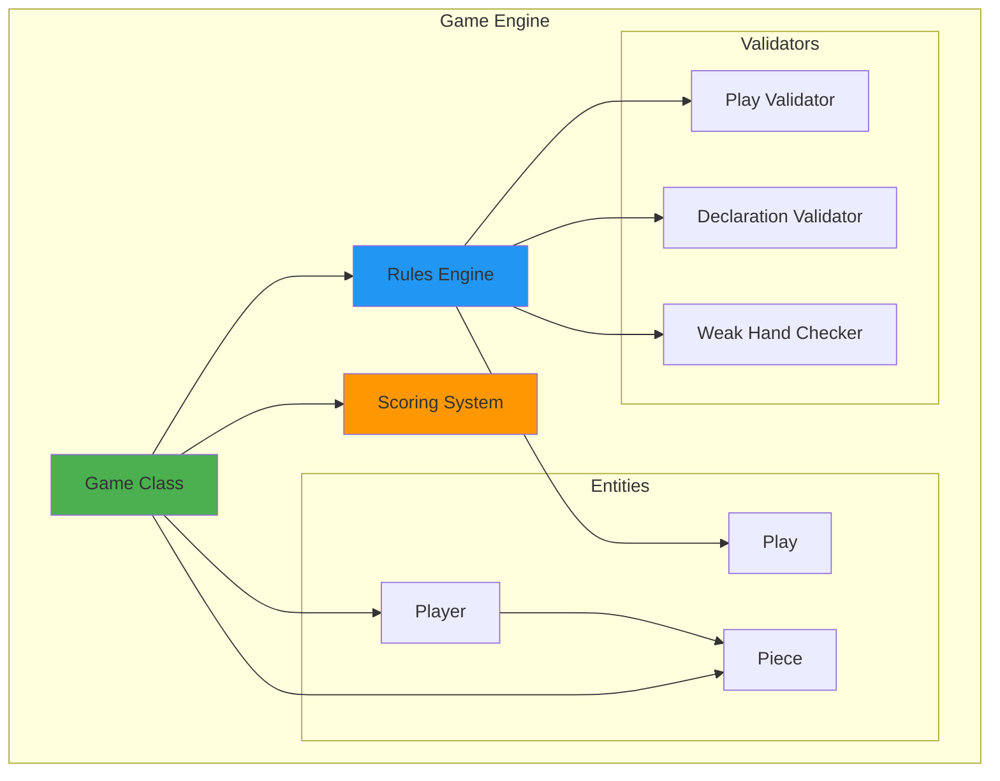

# Game Engine Deep Dive - Core Game Logic

## Table of Contents
1. [Overview](#overview)
2. [Architecture](#architecture)
3. [Game Class](#game-class)
4. [Piece System](#piece-system)
5. [Player Management](#player-management)
6. [Game Rules](#game-rules)
7. [Scoring System](#scoring-system)
8. [Special Mechanics](#special-mechanics)
9. [Game Flow](#game-flow)
10. [Testing Game Logic](#testing-game-logic)

## Overview

The Game Engine is the heart of Liap Tui, implementing all game rules, piece management, scoring, and win conditions. It's designed to be state machine-agnostic, focusing purely on game logic.

### Design Principles

1. **Pure Game Logic**: No networking or UI concerns
2. **Immutable Operations**: Clear state transitions
3. **Rule Validation**: Every move validated
4. **Testability**: Easy to test in isolation
5. **Extensibility**: Easy to add new rules or modes

## Architecture

### Component Overview



### File Structure

```
backend/engine/
├── game.py          # Main Game class
├── player.py        # Player entity
├── piece.py         # Piece entity and enums
├── rules.py         # Game rules and validation
├── scoring.py       # Scoring calculations
├── play.py          # Play combinations
└── exceptions.py    # Custom exceptions
```

## Game Class

### Core Implementation

```python
# backend/engine/game.py
from typing import List, Dict, Optional, Tuple
from dataclasses import dataclass
from .player import Player
from .piece import Piece, Rank, Color
from .rules import Rules
from .scoring import ScoringSystem

class Game:
    """Main game engine managing game state and rules."""
    
    def __init__(self, player_names: List[str]):
        """Initialize a new game with player names."""
        if len(player_names) != 4:
            raise ValueError("Game requires exactly 4 players")
        
        # Initialize players
        self.players = [
            Player(name, position) 
            for position, name in enumerate(player_names)
        ]
        
        # Game state
        self.round_number = 0
        self.turn_number = 0
        self.current_player_index = 0
        self.phase = GamePhase.NOT_STARTED
        
        # Round state
        self.deck: List[Piece] = []
        self.pile_counts: Dict[str, int] = {}
        self.current_pile: List[Piece] = []
        self.last_winner: Optional[str] = None
        
        # Rules and scoring
        self.rules = Rules()
        self.scoring = ScoringSystem()
        
        # Game settings
        self.winning_score = 50
        self.max_rounds = 20
        self.redeal_multiplier = 1
    
    def start_new_round(self):
        """Start a new round of the game."""
        self.round_number += 1
        self.turn_number = 0
        
        # Reset round state
        self._reset_round_state()
        
        # Create and shuffle deck
        self.deck = self._create_deck()
        
        # Deal pieces
        self.deal_pieces()
```

### Round Management

```python
def deal_pieces(self):
    """Deal 8 pieces to each player."""
    # Validate deck
    if len(self.deck) != 32:
        raise GameError("Invalid deck size")
    
    # Clear hands
    for player in self.players:
        player.hand.clear()
    
    # Deal pieces
    for i in range(8):
        for player in self.players:
            piece = self.deck.pop()
            player.add_piece(piece)
    
    # Sort hands
    for player in self.players:
        player.sort_hand()
    
    # Check for weak hands
    weak_players = self.check_weak_hands()
    return weak_players

def check_weak_hands(self) -> List[Player]:
    """Check which players have weak hands (no piece > 9 points)."""
    weak_players = []
    
    for player in self.players:
        max_value = max(piece.point for piece in player.hand)
        if max_value <= 9:
            weak_players.append(player)
            player.has_weak_hand = True
    
    return weak_players
```

## Piece System

### Piece Definition

```python
# backend/engine/piece.py
from enum import Enum
from dataclasses import dataclass

class Rank(Enum):
    """Piece ranks in descending order of value."""
    GENERAL = "GENERAL"      # 将/帥
    ADVISOR = "ADVISOR"      # 士/仕
    ELEPHANT = "ELEPHANT"    # 象/相
    HORSE = "HORSE"         # 馬/马
    CHARIOT = "CHARIOT"     # 車/车
    CANNON = "CANNON"       # 砲/炮
    SOLDIER = "SOLDIER"     # 卒/兵

class Color(Enum):
    """Piece colors."""
    RED = "RED"
    BLACK = "BLACK"

@dataclass(frozen=True)
class Piece:
    """Immutable game piece."""
    id: str
    rank: Rank
    color: Color
    point: int
    
    def __str__(self):
        return f"{self.rank.value}_{self.color.value}"
    
    def to_dict(self):
        return {
            'id': self.id,
            'rank': self.rank.value,
            'color': self.color.value,
            'point': self.point
        }
    
    @property
    def display_name(self):
        """Get display name for UI."""
        symbols = {
            (Rank.GENERAL, Color.RED): "帥",
            (Rank.GENERAL, Color.BLACK): "將",
            (Rank.ADVISOR, Color.RED): "仕",
            (Rank.ADVISOR, Color.BLACK): "士",
            # ... other pieces
        }
        return symbols.get((self.rank, self.color), str(self))
```

### Piece Creation

```python
def _create_deck(self) -> List[Piece]:
    """Create a standard deck of 32 pieces."""
    pieces = []
    piece_id = 0
    
    # Define piece counts and points
    piece_data = [
        (Rank.GENERAL, 1, 10),   # 1 of each color
        (Rank.ADVISOR, 2, 10),   # 2 of each color
        (Rank.ELEPHANT, 2, 9),   # 2 of each color
        (Rank.HORSE, 2, 7),      # 2 of each color
        (Rank.CHARIOT, 2, 6),    # 2 of each color
        (Rank.CANNON, 2, 5),     # 2 of each color
        (Rank.SOLDIER, 5, 1),    # 5 of each color
    ]
    
    for rank, count, point in piece_data:
        for color in [Color.RED, Color.BLACK]:
            for _ in range(count):
                piece = Piece(
                    id=f"p{piece_id}",
                    rank=rank,
                    color=color,
                    point=point
                )
                pieces.append(piece)
                piece_id += 1
    
    # Shuffle deck
    import random
    random.shuffle(pieces)
    
    return pieces
```

## Player Management

### Player Class

```python
# backend/engine/player.py
from typing import List, Optional
from dataclasses import dataclass, field
from .piece import Piece

@dataclass
class Player:
    """Represents a game player."""
    name: str
    position: int  # 0-3
    hand: List[Piece] = field(default_factory=list)
    
    # Round state
    declared: int = 0
    captured_piles: int = 0
    has_weak_hand: bool = False
    
    # Game state
    score: int = 0
    is_active: bool = True
    is_bot: bool = False
    
    def add_piece(self, piece: Piece):
        """Add a piece to player's hand."""
        self.hand.append(piece)
    
    def remove_pieces(self, piece_ids: List[str]):
        """Remove pieces from hand by ID."""
        self.hand = [p for p in self.hand if p.id not in piece_ids]
    
    def sort_hand(self):
        """Sort hand by rank and color."""
        self.hand.sort(key=lambda p: (
            -p.point,  # Higher points first
            p.rank.value,
            p.color.value
        ))
    
    def get_pieces_by_ids(self, piece_ids: List[str]) -> List[Piece]:
        """Get pieces from hand by IDs."""
        pieces = []
        for piece_id in piece_ids:
            piece = next((p for p in self.hand if p.id == piece_id), None)
            if piece:
                pieces.append(piece)
        return pieces
    
    def can_play_count(self, count: int) -> bool:
        """Check if player can play the required number of pieces."""
        if count > len(self.hand):
            return False
        
        # Check if player has enough pieces of same rank
        rank_counts = {}
        for piece in self.hand:
            rank_counts[piece.rank] = rank_counts.get(piece.rank, 0) + 1
        
        return any(c >= count for c in rank_counts.values())
```

### Player Actions

```python
def declare_piles(self, player_name: str, declaration: int) -> bool:
    """Player declares how many piles they'll capture."""
    player = self.get_player(player_name)
    if not player:
        raise GameError(f"Player {player_name} not found")
    
    # Validate declaration
    if not self.rules.is_valid_declaration(declaration):
        raise GameError(f"Invalid declaration: {declaration}")
    
    # Check if already declared
    if player.declared > 0:
        raise GameError(f"Player {player_name} already declared")
    
    # Set declaration
    player.declared = declaration
    
    # Check if all players declared
    all_declared = all(p.declared > 0 for p in self.players)
    
    # Validate total if all declared
    if all_declared:
        total = sum(p.declared for p in self.players)
        if total == 8:
            raise GameError("Total declarations cannot equal 8")
    
    return all_declared
```

## Game Rules

### Rules Engine

```python
# backend/engine/rules.py
from typing import List, Optional, Tuple
from .piece import Piece, Rank, Color
from .play import Play, PlayType

class Rules:
    """Enforces game rules and validates plays."""
    
    def is_valid_play(
        self, 
        pieces: List[Piece], 
        required_count: Optional[int] = None,
        leading_play_type: Optional[PlayType] = None
    ) -> Tuple[bool, Optional[str], Optional[Play]]:
        """Validate if a play is legal."""
        
        # Empty play (pass) is always valid
        if not pieces:
            return True, None, Play(pieces, PlayType.PASS)
        
        # Check piece count requirement
        if required_count and len(pieces) != required_count:
            return False, f"Must play exactly {required_count} pieces", None
        
        # Identify play type
        play = self._identify_play(pieces)
        if not play:
            return False, "Invalid piece combination", None
        
        # Check if play type matches requirement
        if leading_play_type and play.play_type != leading_play_type:
            if play.play_type != PlayType.MIXED_COLOR:
                return False, f"Must play {leading_play_type.value}", None
        
        return True, None, play
    
    def _identify_play(self, pieces: List[Piece]) -> Optional[Play]:
        """Identify the type of play from pieces."""
        if not pieces:
            return Play([], PlayType.PASS)
        
        # Single piece
        if len(pieces) == 1:
            return Play(pieces, PlayType.SINGLE)
        
        # Check if all same rank
        ranks = {p.rank for p in pieces}
        if len(ranks) == 1:
            # Same rank play
            if len(pieces) == 2:
                return Play(pieces, PlayType.PAIR)
            elif len(pieces) == 3:
                return Play(pieces, PlayType.TRIPLE)
            elif len(pieces) == 4:
                return Play(pieces, PlayType.QUAD)
        
        # Check for mixed color play (high value pieces)
        if all(p.point >= 5 for p in pieces):
            colors = {p.color for p in pieces}
            if len(colors) == 2:  # Both colors present
                return Play(pieces, PlayType.MIXED_COLOR)
        
        return None
```

### Play Comparison

```python
def compare_plays(self, play1: Play, play2: Play) -> int:
    """Compare two plays. Returns 1 if play1 wins, -1 if play2 wins, 0 if tie."""
    # Pass always loses
    if play1.play_type == PlayType.PASS:
        return -1
    if play2.play_type == PlayType.PASS:
        return 1
    
    # Mixed color beats same color plays
    if play1.play_type == PlayType.MIXED_COLOR and play2.play_type != PlayType.MIXED_COLOR:
        return 1
    if play2.play_type == PlayType.MIXED_COLOR and play1.play_type != PlayType.MIXED_COLOR:
        return -1
    
    # Both mixed color - compare total points
    if play1.play_type == PlayType.MIXED_COLOR and play2.play_type == PlayType.MIXED_COLOR:
        total1 = sum(p.point for p in play1.pieces)
        total2 = sum(p.point for p in play2.pieces)
        return 1 if total1 > total2 else (-1 if total2 > total1 else 0)
    
    # Same type plays - compare by rank
    if play1.pieces and play2.pieces:
        rank1_value = self._get_rank_value(play1.pieces[0].rank)
        rank2_value = self._get_rank_value(play2.pieces[0].rank)
        return 1 if rank1_value > rank2_value else (-1 if rank2_value > rank1_value else 0)
    
    return 0

def _get_rank_value(self, rank: Rank) -> int:
    """Get numeric value for rank comparison."""
    rank_values = {
        Rank.GENERAL: 7,
        Rank.ADVISOR: 6,
        Rank.ELEPHANT: 5,
        Rank.HORSE: 4,
        Rank.CHARIOT: 3,
        Rank.CANNON: 2,
        Rank.SOLDIER: 1
    }
    return rank_values.get(rank, 0)
```

## Scoring System

### Score Calculation

```python
# backend/engine/scoring.py
from typing import Dict, List, Tuple

class ScoringSystem:
    """Handles score calculation for the game."""
    
    def calculate_round_scores(
        self, 
        players: List['Player'], 
        multiplier: int = 1
    ) -> Dict[str, int]:
        """Calculate scores for all players after a round."""
        scores = {}
        
        for player in players:
            base_score = self._calculate_base_score(
                player.declared, 
                player.captured_piles
            )
            
            # Apply multiplier
            final_score = base_score * multiplier
            
            # Update player score
            player.score += final_score
            scores[player.name] = final_score
        
        return scores
    
    def _calculate_base_score(self, declared: int, captured: int) -> int:
        """Calculate base score for a player."""
        difference = abs(declared - captured)
        
        if declared == captured:
            # Perfect prediction
            return 3 * declared
        elif difference == 1:
            # Off by one
            return captured
        else:
            # Off by more than one
            return -difference
    
    def check_win_condition(
        self, 
        players: List['Player'], 
        winning_score: int,
        max_rounds: int,
        current_round: int
    ) -> Tuple[bool, List['Player']]:
        """Check if any player has won the game."""
        # Check score-based win
        winners = [p for p in players if p.score >= winning_score]
        if winners:
            # Multiple players might reach winning score
            max_score = max(p.score for p in winners)
            winners = [p for p in winners if p.score == max_score]
            return True, winners
        
        # Check round limit
        if current_round >= max_rounds:
            # Game ends, highest score wins
            max_score = max(p.score for p in players)
            winners = [p for p in players if p.score == max_score]
            return True, winners
        
        return False, []
```

### Special Scoring Rules

```python
class SpecialScoring:
    """Special scoring scenarios."""
    
    @staticmethod
    def calculate_sweep_bonus(player: Player, round_piles: int) -> int:
        """Calculate bonus for capturing all piles in a round."""
        if player.captured_piles == round_piles:
            return 10  # Sweep bonus
        return 0
    
    @staticmethod
    def calculate_perfect_round_bonus(players: List[Player]) -> Dict[str, int]:
        """Calculate bonus if all players predict perfectly."""
        bonuses = {}
        
        all_perfect = all(p.declared == p.captured_piles for p in players)
        if all_perfect:
            for player in players:
                bonuses[player.name] = 5  # Perfect round bonus
        
        return bonuses
    
    @staticmethod
    def calculate_underdog_bonus(player: Player, players: List[Player]) -> int:
        """Calculate bonus for lowest scorer winning piles."""
        if not players:
            return 0
        
        # Find lowest scorer
        min_score = min(p.score for p in players)
        
        # If this player is lowest scorer and captured piles
        if player.score == min_score and player.captured_piles > 0:
            return player.captured_piles * 2
        
        return 0
```

## Special Mechanics

### Weak Hand Handling

```python
def handle_weak_hand_decision(
    self, 
    player_name: str, 
    accept_redeal: bool
) -> Tuple[bool, int]:
    """Handle player's decision on weak hand redeal."""
    player = self.get_player(player_name)
    
    if not player or not player.has_weak_hand:
        raise GameError(f"Player {player_name} doesn't have weak hand")
    
    # Track decisions
    if not hasattr(self, 'weak_hand_decisions'):
        self.weak_hand_decisions = {}
    
    self.weak_hand_decisions[player_name] = accept_redeal
    
    # Check if all weak hand players decided
    weak_players = [p for p in self.players if p.has_weak_hand]
    all_decided = all(p.name in self.weak_hand_decisions for p in weak_players)
    
    if all_decided:
        # Check if any player accepted
        any_accepted = any(self.weak_hand_decisions.values())
        
        if any_accepted:
            # Increase multiplier and redeal
            self.redeal_multiplier += 1
            self.deck = self._create_deck()
            self.deal_pieces()
            
            # Reset weak hand flags
            for player in self.players:
                player.has_weak_hand = False
            self.weak_hand_decisions.clear()
            
            return True, self.redeal_multiplier
    
    return False, self.redeal_multiplier
```

### Bot Play Logic

```python
def get_bot_play(self, player: Player, game_state: Dict) -> List[str]:
    """Determine bot's play based on game state."""
    required_count = game_state.get('required_piece_count', 1)
    current_plays = game_state.get('current_plays', {})
    
    # Simple bot strategy
    if not current_plays:
        # First player - play lowest valid combination
        return self._get_lowest_valid_play(player, required_count)
    
    # Try to beat current best play
    best_play = self._get_best_current_play(current_plays)
    if best_play:
        counter_play = self._find_counter_play(player, best_play, required_count)
        if counter_play:
            return counter_play
    
    # Can't beat - pass
    return []

def _get_lowest_valid_play(
    self, 
    player: Player, 
    count: int
) -> List[str]:
    """Get lowest value valid play of required count."""
    # Group by rank
    rank_groups = {}
    for piece in player.hand:
        if piece.rank not in rank_groups:
            rank_groups[piece.rank] = []
        rank_groups[piece.rank].append(piece)
    
    # Find lowest rank with enough pieces
    for rank in sorted(rank_groups.keys(), key=lambda r: self._get_rank_value(r)):
        if len(rank_groups[rank]) >= count:
            return [p.id for p in rank_groups[rank][:count]]
    
    # Try mixed color play
    if count >= 2:
        high_pieces = [p for p in player.hand if p.point >= 5]
        if len(high_pieces) >= count:
            # Get mix of colors
            red_pieces = [p for p in high_pieces if p.color == Color.RED]
            black_pieces = [p for p in high_pieces if p.color == Color.BLACK]
            
            if red_pieces and black_pieces:
                play_pieces = []
                for i in range(count):
                    if i % 2 == 0 and red_pieces:
                        play_pieces.append(red_pieces.pop(0))
                    elif black_pieces:
                        play_pieces.append(black_pieces.pop(0))
                    elif red_pieces:
                        play_pieces.append(red_pieces.pop(0))
                
                if len(play_pieces) == count:
                    return [p.id for p in play_pieces]
    
    return []
```

## Game Flow

### Complete Turn Flow

```python
def play_turn(
    self, 
    player_name: str, 
    piece_ids: List[str]
) -> TurnResult:
    """Process a player's turn."""
    # Validate player
    player = self.get_player(player_name)
    if not player:
        raise GameError(f"Player {player_name} not found")
    
    # Check if it's player's turn
    current_player = self.players[self.current_player_index]
    if current_player.name != player_name:
        raise GameError(f"Not {player_name}'s turn")
    
    # Get pieces
    pieces = player.get_pieces_by_ids(piece_ids)
    if len(pieces) != len(piece_ids):
        raise GameError("Invalid piece IDs")
    
    # Validate play
    required_count = self._get_required_piece_count()
    leading_type = self._get_leading_play_type()
    
    is_valid, error_msg, play = self.rules.is_valid_play(
        pieces, required_count, leading_type
    )
    
    if not is_valid:
        raise GameError(error_msg or "Invalid play")
    
    # Process play
    result = self._process_play(player, play)
    
    # Remove pieces from hand
    if pieces:
        player.remove_pieces(piece_ids)
    
    # Update turn state
    self._update_turn_state(result)
    
    return result

def _process_play(self, player: Player, play: Play) -> TurnResult:
    """Process a play and determine results."""
    # Add to current pile
    if play.pieces:
        self.current_pile.extend(play.pieces)
    
    # Track play
    if not hasattr(self, 'current_turn_plays'):
        self.current_turn_plays = {}
    
    self.current_turn_plays[player.name] = play
    
    # Check if turn is complete
    if len(self.current_turn_plays) == 4:
        # All players have played
        winner = self._determine_turn_winner()
        
        if winner:
            # Award pile to winner
            winner_player = self.get_player(winner)
            winner_player.captured_piles += 1
            self.pile_counts[winner] = self.pile_counts.get(winner, 0) + 1
            
            # Clear pile
            pile_size = len(self.current_pile)
            self.current_pile.clear()
            
            # Set last winner
            self.last_winner = winner
        
        # Clear turn plays
        self.current_turn_plays.clear()
        
        # Increment turn
        self.turn_number += 1
        
        return TurnResult(
            success=True,
            winner=winner,
            pile_size=pile_size,
            turn_complete=True
        )
    
    # Turn continues
    return TurnResult(
        success=True,
        turn_complete=False
    )
```

## Testing Game Logic

### Unit Tests

```python
# tests/test_game_engine.py
import pytest
from backend.engine.game import Game
from backend.engine.piece import Piece, Rank, Color
from backend.engine.exceptions import GameError

class TestGameEngine:
    def test_game_initialization(self):
        """Test game initializes correctly."""
        players = ["Alice", "Bob", "Carol", "David"]
        game = Game(players)
        
        assert len(game.players) == 4
        assert game.round_number == 0
        assert game.phase == GamePhase.NOT_STARTED
        
    def test_invalid_player_count(self):
        """Test game requires exactly 4 players."""
        with pytest.raises(ValueError):
            Game(["Alice", "Bob", "Carol"])
    
    def test_deal_pieces(self):
        """Test dealing pieces to players."""
        game = Game(["Alice", "Bob", "Carol", "David"])
        game.deck = game._create_deck()
        
        game.deal_pieces()
        
        # Each player should have 8 pieces
        for player in game.players:
            assert len(player.hand) == 8
        
        # Deck should be empty
        assert len(game.deck) == 0
    
    def test_weak_hand_detection(self):
        """Test weak hand detection."""
        game = Game(["Alice", "Bob", "Carol", "David"])
        
        # Give Alice a weak hand
        alice = game.players[0]
        alice.hand = [
            Piece("p1", Rank.SOLDIER, Color.RED, 1),
            Piece("p2", Rank.SOLDIER, Color.BLACK, 1),
            Piece("p3", Rank.CANNON, Color.RED, 5),
            # ... more low pieces
        ]
        
        weak_players = game.check_weak_hands()
        assert alice in weak_players
        assert alice.has_weak_hand
```

### Integration Tests

```python
class TestGameFlow:
    def test_complete_round(self):
        """Test a complete round of play."""
        game = Game(["Alice", "Bob", "Carol", "David"])
        
        # Start round
        game.start_new_round()
        assert game.round_number == 1
        
        # Deal pieces
        game.deal_pieces()
        
        # Make declarations
        for i, player in enumerate(game.players):
            game.declare_piles(player.name, i)  # 0, 1, 2, 3
        
        # Play turns until round ends
        while not game.is_round_complete():
            current_player = game.get_current_player()
            
            # Get valid play
            pieces = self._get_valid_play(current_player)
            result = game.play_turn(current_player.name, pieces)
            
            if result.turn_complete:
                game.advance_turn()
        
        # Calculate scores
        scores = game.calculate_round_scores()
        assert len(scores) == 4
    
    def test_win_condition(self):
        """Test game win condition."""
        game = Game(["Alice", "Bob", "Carol", "David"])
        
        # Set Alice's score near winning
        game.players[0].score = 48
        
        # Alice scores 3 points
        game.players[0].declared = 1
        game.players[0].captured_piles = 1
        
        scores = game.scoring.calculate_round_scores(game.players)
        
        # Check win
        has_winner, winners = game.scoring.check_win_condition(
            game.players, 50, 20, 1
        )
        
        assert has_winner
        assert len(winners) == 1
        assert winners[0].name == "Alice"
```

### Performance Tests

```python
def test_game_performance():
    """Test game performs well under load."""
    import time
    
    game = Game(["Alice", "Bob", "Carol", "David"])
    game.start_new_round()
    game.deal_pieces()
    
    # Time 1000 play validations
    start = time.time()
    
    for _ in range(1000):
        player = game.players[0]
        pieces = player.hand[:2]
        
        is_valid, _, _ = game.rules.is_valid_play(pieces)
    
    elapsed = time.time() - start
    
    # Should complete in under 100ms
    assert elapsed < 0.1
```

## Summary

The Game Engine provides:

1. **Complete Game Logic**: All rules implemented and validated
2. **Clean Separation**: Pure game logic, no external dependencies  
3. **Extensibility**: Easy to add new rules or game modes
4. **Testability**: Comprehensive test coverage possible
5. **Performance**: Efficient algorithms for real-time play

This architecture ensures the game logic remains maintainable and bug-free while supporting the complex rules of Liap Tui.