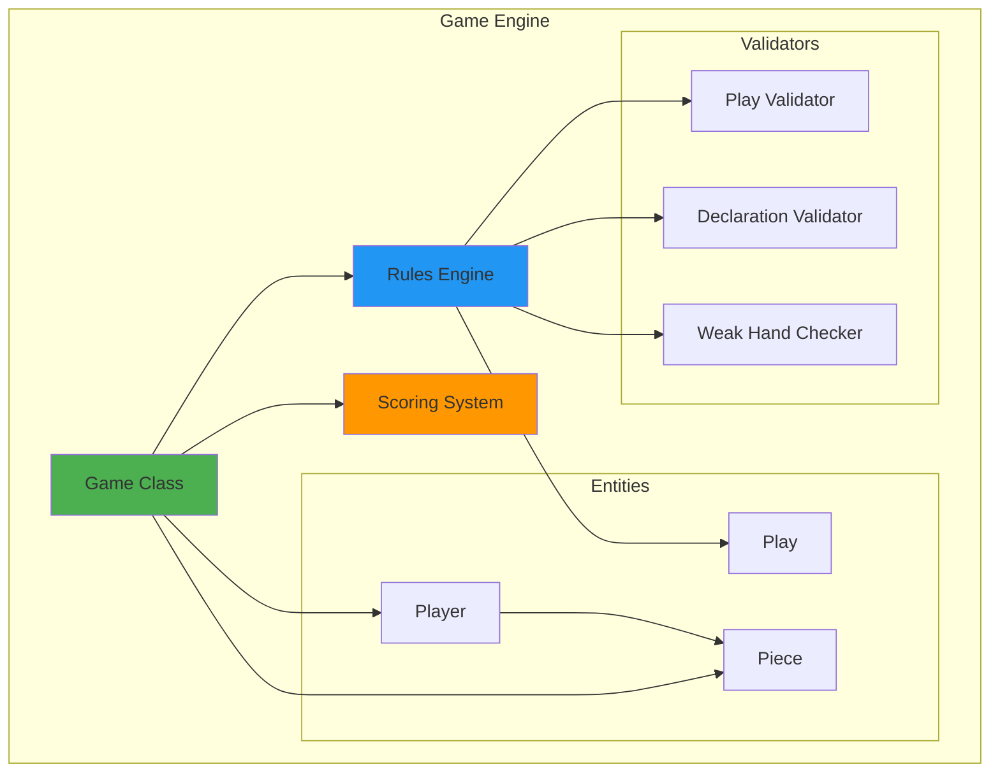

# Game Engine Deep Dive - Core Game Logic

## Table of Contents
1. [Overview](#overview)
2. [Architecture](#architecture)
3. [Game Class](#game-class)
4. [Piece System](#piece-system)
5. [Player Management](#player-management)
6. [Game Rules](#game-rules)
7. [Scoring System](#scoring-system)
8. [Turn Resolution](#turn-resolution)
9. [Win Conditions](#win-conditions)
10. [Testing Game Logic](#testing-game-logic)

## Overview

The Game Engine is the heart of Liap Tui, implementing all game rules, piece management, scoring, and win conditions. It's designed to be state machine-agnostic, focusing purely on game logic.

### Design Principles

1. **Pure Game Logic**: No networking or UI concerns
2. **Immutable Operations**: Clear state transitions
3. **Rule Validation**: Every move validated
4. **Testability**: Easy to test in isolation
5. **Extensibility**: Easy to add new rules or modes

## Architecture

### Component Overview


```mermaid
graph TB
    subgraph "Game Engine"
        Game[Game Class]
        Rules[Rules Engine]
        Scoring[Scoring System]

        subgraph "Entities"
            Player[Player]
            Piece[Piece]
            Play[Play]
        end

        subgraph "Validators"
            PV[Play Validator]
            DV[Declaration Validator]
            WH[Weak Hand Checker]
        end
    end

    Game --> Rules
    Game --> Scoring
    Game --> Player
    Game --> Piece

    Rules --> PV
    Rules --> DV
    Rules --> WH

    Player --> Piece
    Rules --> Play

    style Game fill:#4CAF50
    style Rules fill:#2196F3
    style Scoring fill:#FF9800
```

### File Structure

```
backend/engine/
├── game.py              # Main Game class
├── player.py            # Player entity
├── piece.py             # Piece entity and deck creation
├── constants.py         # Piece point values
├── rules.py             # Game rules and validation
├── scoring.py           # Scoring calculations
├── turn_resolution.py   # Turn winner determination
├── win_conditions.py    # Win condition checking
├── ai.py                # AI bot logic
└── state_machine/       # State machine implementation
    ├── core.py          # GamePhase and ActionType enums
    ├── game_state_machine.py
    └── states/          # Individual state implementations
```

## Game Class

### Core Implementation

```python
# backend/engine/game.py
from typing import List, Dict, Optional
from backend.engine.piece import Piece
from backend.engine.player import Player
from backend.engine.rules import get_play_type, get_valid_declares, is_valid_play
from backend.engine.scoring import calculate_round_scores
from backend.engine.turn_resolution import TurnPlay, resolve_turn
from backend.engine.win_conditions import WinConditionType, get_winners, is_game_over

class Game:
    """Main game engine managing game state and rules."""

    def __init__(self, players, interface=None,
                 win_condition_type=WinConditionType.FIRST_TO_REACH_50):
        """Initialize a new game with players."""
        # Core game state
        self.players = players
        self.interface = interface  # Adapter for CLI, GUI, or API
        self.current_order = []  # Player order for each round
        self.round_number = 1
        self.max_score = 50
        self.max_rounds = 20
        self.win_condition_type = win_condition_type

        # Round-specific state
        self.last_round_winner = None  # Player who won the last round
        self.redeal_multiplier = 1  # Score multiplier increases with each redeal
        self.current_turn_plays = []  # Stores TurnPlay objects for current turn
        self.required_piece_count = None  # Number of pieces required this turn
        self.turn_order = []  # Player order for current turn
        self.last_turn_winner = None  # Player who won the last turn
        self.turn_number = 0  # Current turn number within the round
        self.turn_history_this_round = []  # Track all turns for AI strategy
        self.turn_results = []  # For scoring_state to read turn data

        # Player tracking for state machine
        self.current_player = None  # Current player (for round start/declarations)
        self.round_starter = None  # Player who starts the round
        self.player_declarations = {}  # Track player declarations
        self.pile_counts = {}  # Track piles won per player per round
        self.round_scores = {}  # Track round scores for each player

    def deal_pieces(self):
        """Deal pieces and prepare for the round."""
        # Create deck
        deck = Piece.build_deck()

        # Shuffle deck
        import random
        random.shuffle(deck)

        # Deal 8 pieces to each player
        for i in range(8):
            for player in self.players:
                player.hand.append(deck.pop())
```

### Weak Hand Detection

```python
def get_weak_hand_players(self, include_details=False):
    """
    Find players with weak hand (no card > 9 points)

    Args:
        include_details (bool): If True, return detailed information
                               If False, return only names

    Returns:
        List: Player names or detailed dictionaries
    """
    weak_players = []

    for player in self.players:
        # Check if player has any piece with point > 9
        has_strong = any(p.point > 9 for p in player.hand)

        if not has_strong:
            if include_details:
                # Return rich data for controllers
                hand_strength = sum(p.point for p in player.hand)
                weak_players.append({
                    "name": player.name,
                    "is_bot": player.is_bot,
                    "hand_strength": hand_strength,
                    "hand": [str(piece) for piece in player.hand]
                })
            else:
                # Return only names (backward compatible)
                weak_players.append(player.name)

    return weak_players

def handle_redeal_request(self, accept=True):
    """Handle redeal decision for weak hands."""
    if accept:
        self.redeal_multiplier += 1
        # Clear all hands
        for player in self.players:
            player.hand.clear()
        # Deal new pieces
        self.deal_pieces()
        return True
    return False
```

## Piece System

### Piece Definition

```python
# backend/engine/piece.py
from backend.engine.constants import PIECE_POINTS

class Piece:
    def __init__(self, kind):
        """
        Create a piece from a kind string, e.g. "GENERAL_RED", "CANNON_BLACK"
        """
        self.kind = kind  # Combined string identifier
        self.point = PIECE_POINTS[kind]  # Point value from constants

    def __repr__(self):
        # Display format, e.g., GENERAL_RED(14)
        return f"{self.kind}({self.point})"

    @property
    def name(self):
        """Get the piece type name (e.g., "GENERAL", "SOLDIER")."""
        return self.kind.split("_")[0]

    @property
    def color(self):
        """Get the piece color ("RED" or "BLACK")."""
        return self.kind.split("_")[1]

    def to_dict(self):
        """Convert to JSON-serializable dictionary."""
        return {
            "kind": self.kind,
            "point": self.point,
            "name": self.name,
            "color": self.color
        }
```

### Piece Point Values

```python
# backend/engine/constants.py
# Higher numbers = stronger pieces
# RED pieces are stronger than BLACK pieces of the same type

PIECE_POINTS = {
    "GENERAL_RED": 14,
    "GENERAL_BLACK": 13,
    "ADVISOR_RED": 12,
    "ADVISOR_BLACK": 11,
    "ELEPHANT_RED": 10,
    "ELEPHANT_BLACK": 9,
    "CHARIOT_RED": 8,
    "CHARIOT_BLACK": 7,
    "HORSE_RED": 6,
    "HORSE_BLACK": 5,
    "CANNON_RED": 4,
    "CANNON_BLACK": 3,
    "SOLDIER_RED": 2,
    "SOLDIER_BLACK": 1,
}
```

### Deck Creation

```python
@staticmethod
def build_deck():
    """
    Create the full deck of 32 pieces.

    Returns:
        List[Piece]: Shuffled deck ready for dealing
    """
    # How many copies of each piece type
    counts = {
        "GENERAL": 1,   # Only one of each GENERAL (RED and BLACK)
        "SOLDIER": 5,   # Five of each SOLDIER (RED and BLACK)
        # All others default to 2 (ADVISOR, ELEPHANT, CHARIOT, HORSE, CANNON)
    }

    deck = []
    for kind in PIECE_POINTS:
        name = kind.split("_")[0]
        count = counts.get(name, 2)  # Default count is 2
        for _ in range(count):
            deck.append(Piece(kind))

    # Total deck size: 32 pieces
    # RED: 1 General + 2 Advisors + 2 Elephants + 2 Chariots +
    #      2 Horses + 2 Cannons + 5 Soldiers = 16
    # BLACK: Same distribution = 16

    return deck
```

## Player Management

### Player Class

```python
# backend/engine/player.py
class Player:
    def __init__(self, name, is_bot=False, available_colors=None):
        self.name = name  # Player's name
        self.hand = []  # List of pieces (max 8 at start of round)
        self.score = 0  # Total score throughout game
        self.declared = 0  # Piles declared this round
        self.captured_piles = 0  # Piles won this round
        self.is_bot = is_bot  # AI-controlled player
        self.zero_declares_in_a_row = 0  # Track consecutive zero declares

        # Avatar color for human players
        self.avatar_color = self._assign_avatar_color(available_colors)

        # Game statistics
        self.turns_won = 0  # Total turns won
        self.perfect_rounds = 0  # Rounds where declared == actual

        # Connection tracking (for disconnect handling)
        self.is_connected = True
        self.disconnect_time = None
        self.original_is_bot = is_bot  # Store for reconnection

        # Bot takeover management
        self.pending_bot_takeover = None
        self.bot_takeover_scheduled = False

    def to_dict(self):
        """Convert player to dictionary for JSON serialization."""
        return {
            "name": self.name,
            "score": self.score,
            "is_bot": self.is_bot,
            "avatar_color": self.avatar_color,
            "hand_size": len(self.hand),
            "declared": self.declared,
            "captured_piles": self.captured_piles,
            "is_connected": self.is_connected
        }

    def reset_for_round(self):
        """Reset round-specific values."""
        self.hand = []
        self.declared = 0
        self.captured_piles = 0
```

### Declaration Management

```python
def set_declaration(self, player_name: str, declaration: int):
    """Record player's pile declaration."""
    # Find player
    player = next((p for p in self.players if p.name == player_name), None)
    if not player:
        return False

    # Set declaration
    player.declared = declaration
    self.player_declarations[player_name] = declaration

    # Track zero declares in a row
    if declaration == 0:
        player.zero_declares_in_a_row += 1
    else:
        player.zero_declares_in_a_row = 0

    return True

def all_players_declared(self) -> bool:
    """Check if all players have declared."""
    return len(self.player_declarations) == 4

def get_valid_declarations(self, player_name: str) -> List[int]:
    """Get valid declaration options for a player."""
    # Use the rules module function
    from backend.engine.rules import get_valid_declares
    return get_valid_declares(
        player_name,
        self.player_declarations,
        [p.name for p in self.players]
    )
```

## Game Rules

### Play Type System

```python
# backend/engine/rules.py
# Available play types in order of strength
PLAY_TYPE_PRIORITY = [
    "SINGLE",              # 1 piece
    "PAIR",                # 2 of same name and color
    "THREE_OF_A_KIND",     # 3 SOLDIERs of same color
    "STRAIGHT",            # 3 of valid group, same color
    "FOUR_OF_A_KIND",      # 4 SOLDIERs of same color
    "EXTENDED_STRAIGHT",   # 4 of valid group with 1 duplicate
    "EXTENDED_STRAIGHT_5", # 5 of valid group with 2 duplicates
    "FIVE_OF_A_KIND",      # 5 SOLDIERs of same color
    "DOUBLE_STRAIGHT",     # 6 pieces: 2 CHARIOT, 2 HORSE, 2 CANNON
]

def get_play_type(pieces):
    """
    Determine the type of play from pieces.
    Returns play type string or 'INVALID'.
    """
    if len(pieces) == 1:
        return "SINGLE"
    if len(pieces) == 2 and is_pair(pieces):
        return "PAIR"
    if len(pieces) == 3:
        if is_three_of_a_kind(pieces):
            return "THREE_OF_A_KIND"
        elif is_straight(pieces):
            return "STRAIGHT"
    if len(pieces) == 4:
        if is_four_of_a_kind(pieces):
            return "FOUR_OF_A_KIND"
        elif is_extended_straight(pieces):
            return "EXTENDED_STRAIGHT"
    if len(pieces) == 5:
        if is_five_of_a_kind(pieces):
            return "FIVE_OF_A_KIND"
        elif is_extended_straight_5(pieces):
            return "EXTENDED_STRAIGHT_5"
    if len(pieces) == 6 and is_double_straight(pieces):
        return "DOUBLE_STRAIGHT"

    return "INVALID"

def is_valid_play(pieces):
    """Check if pieces form a valid play."""
    return get_play_type(pieces) != "INVALID"
```

### Valid Play Combinations

```python
# Straight combinations (3 pieces, same color)
STRAIGHT_3 = [
    {"GENERAL", "ADVISOR", "ELEPHANT"},  # Top generals
    {"CHARIOT", "HORSE", "CANNON"},      # Mobile forces
]

# Extended straight groups (4-5 pieces, same color)
EXTENDED_STRAIGHT_GROUPS = [
    {"GENERAL", "ADVISOR", "ELEPHANT"},
    {"ADVISOR", "ELEPHANT", "CHARIOT"},
    {"ELEPHANT", "CHARIOT", "HORSE"},
    {"CHARIOT", "HORSE", "CANNON"},
]

def is_straight(pieces):
    """Check if 3 pieces form a valid straight."""
    if len(pieces) != 3:
        return False
    if not all_same_color(pieces):
        return False
    names = {p.name for p in pieces}
    return names in STRAIGHT_3

def is_double_straight(pieces):
    """Check if 6 pieces form double straight (2-2-2)."""
    if len(pieces) != 6:
        return False
    if not all_same_color(pieces):
        return False

    counts = Counter(p.name for p in pieces)
    required_names = {"CHARIOT", "HORSE", "CANNON"}

    return (set(counts.keys()) == required_names and
            all(count == 2 for count in counts.values()))
```

### Declaration Rules

```python
def get_valid_declares(player_name, declarations_so_far, all_player_names):
    """
    Get valid declaration options for a player.

    Rules:
    - Each player can declare 0-8 piles
    - Total of all 4 declarations cannot equal 8
    - Last player has restricted options
    """
    # If less than 3 players have declared, allow any value 0-8
    if len(declarations_so_far) < 3:
        return list(range(9))  # [0, 1, 2, ..., 8]

    # Last player: calculate restrictions
    current_total = sum(declarations_so_far.values())

    valid_options = []
    for value in range(9):  # 0 through 8
        if current_total + value != 8:  # Total cannot equal 8
            valid_options.append(value)

    return valid_options
```

## Scoring System

### Score Calculation

```python
# backend/engine/scoring.py
# Scoring Rules:
# - If declared = 0 and actual = 0 → +3 bonus (NO MULTIPLIER)
# - If declared = 0 but actual > 0 → penalty = -actual × multiplier
# - If declared == actual (non-zero) → score = (declared × multiplier) + 5
# - Otherwise → penalty = -abs(declared - actual) × multiplier

def calculate_score_components(declared: int, actual: int) -> dict:
    """
    Calculate scoring components.
    Multipliers only apply to base points, not bonuses.
    """
    if declared == 0:
        if actual == 0:
            # Perfect zero prediction - +3 bonus, no multiplier
            return {
                "base_points": 0,
                "bonus": 3,
                "is_perfect": True,
                "hit_type": "perfect_zero"
            }
        else:
            # Failed zero - penalty
            return {
                "base_points": -actual,
                "bonus": 0,
                "is_perfect": False,
                "hit_type": "failed_zero"
            }
    else:
        if actual == declared:
            # Perfect prediction - base points + 5 bonus
            return {
                "base_points": declared,
                "bonus": 5,
                "is_perfect": True,
                "hit_type": "perfect"
            }
        else:
            # Missed target - penalty
            return {
                "base_points": -abs(declared - actual),
                "bonus": 0,
                "is_perfect": False,
                "hit_type": "miss"
            }

def calculate_final_score(declared: int, actual: int, multiplier: int = 1) -> int:
    """Calculate final score with multiplier applied correctly."""
    components = calculate_score_components(declared, actual)

    # Multiplier applies to base points only, not to bonuses
    return (components["base_points"] * multiplier) + components["bonus"]
```

## Turn Resolution

### Turn Play Structure

```python
# backend/engine/turn_resolution.py
class TurnPlay:
    """Represents a single player's play in a turn."""

    def __init__(self, player_name, pieces, total_score=0):
        self.player_name = player_name  # Who played
        self.pieces = pieces            # List of Piece objects
        self.total_score = total_score  # Combined points of pieces

def resolve_turn(turn_plays):
    """
    Determine winner of a turn.

    Args:
        turn_plays: List of TurnPlay objects

    Returns:
        Tuple of (winner_name, pile_count)
    """
    # Filter out passes (empty plays)
    active_plays = [play for play in turn_plays if play.pieces]

    if not active_plays:
        return None, 0  # Everyone passed

    # Get play types
    play_types = []
    for play in active_plays:
        play_type = get_play_type(play.pieces)
        play_types.append((play, play_type))

    # Find strongest play type
    strongest_type = None
    for play, play_type in play_types:
        if play_type != "INVALID":
            if strongest_type is None:
                strongest_type = play_type
            else:
                # Compare by PLAY_TYPE_PRIORITY index
                if PLAY_TYPE_PRIORITY.index(play_type) > PLAY_TYPE_PRIORITY.index(strongest_type):
                    strongest_type = play_type

    # Get all plays with strongest type
    contenders = [(play, ptype) for play, ptype in play_types if ptype == strongest_type]

    # Break ties by total points
    if contenders:
        winner = max(contenders, key=lambda x: x[0].total_score)[0]
        pile_count = len(winner.pieces)  # Winner gets piles = pieces played
        return winner.player_name, pile_count

    return None, 0
```

## Win Conditions

### Win Condition Types

```python
# backend/engine/win_conditions.py
from enum import Enum

class WinConditionType(Enum):
    FIRST_TO_REACH_50 = "first_to_reach_50"  # First player to 50+ points wins
    SCORE_AFTER_20_ROUNDS = "score_after_20_rounds"  # Highest score after 20 rounds

def is_game_over(players, round_number, max_score=50, max_rounds=20,
                 win_condition_type=WinConditionType.FIRST_TO_REACH_50) -> bool:
    """Check if game should end."""
    if win_condition_type == WinConditionType.FIRST_TO_REACH_50:
        return any(player.score >= max_score for player in players)
    elif win_condition_type == WinConditionType.SCORE_AFTER_20_ROUNDS:
        return round_number >= max_rounds
    return False

def get_winners(players):
    """
    Determine winner(s) based on scores.
    Returns list of winning players (can be multiple if tied).
    """
    if not players:
        return []

    max_score = max(player.score for player in players)
    return [player for player in players if player.score == max_score]
```

## Testing Game Logic

### Key Test Areas

```python
# tests/test_game.py
import pytest
from backend.engine.game import Game
from backend.engine.player import Player
from backend.engine.piece import Piece
from backend.engine.rules import is_valid_play, get_play_type

class TestGameMechanics:
    def test_weak_hand_detection(self):
        """Test weak hand detection (no piece > 9 points)."""
        # Create players
        players = [Player(f"P{i}") for i in range(1, 5)]
        game = Game(players)

        # Give P1 a weak hand
        players[0].hand = [
            Piece("SOLDIER_RED"),      # 2 points
            Piece("SOLDIER_BLACK"),    # 1 point
            Piece("CANNON_RED"),       # 4 points
            Piece("CANNON_BLACK"),     # 3 points
            Piece("HORSE_RED"),        # 6 points
            Piece("HORSE_BLACK"),      # 5 points
            Piece("CHARIOT_RED"),      # 8 points
            Piece("CHARIOT_BLACK")     # 7 points
        ]

        weak_players = game.get_weak_hand_players()
        assert "P1" in weak_players

    def test_declaration_validation(self):
        """Test declaration rules (total cannot equal 8)."""
        from backend.engine.rules import get_valid_declares

        # First 3 players can declare anything
        valid = get_valid_declares("P1", {}, ["P1", "P2", "P3", "P4"])
        assert valid == [0, 1, 2, 3, 4, 5, 6, 7, 8]

        # Last player restricted if total would equal 8
        declarations = {"P1": 2, "P2": 3, "P3": 1}  # Total = 6
        valid = get_valid_declares("P4", declarations, ["P1", "P2", "P3", "P4"])
        assert 2 not in valid  # Cannot declare 2 (would make total 8)

class TestPlayValidation:
    def test_valid_play_types(self):
        """Test all valid play combinations."""
        # Single
        pieces = [Piece("GENERAL_RED")]
        assert get_play_type(pieces) == "SINGLE"

        # Pair (same name and color)
        pieces = [Piece("HORSE_RED"), Piece("HORSE_RED")]
        assert get_play_type(pieces) == "PAIR"

        # Three of a Kind (3 soldiers same color)
        pieces = [Piece("SOLDIER_RED")] * 3
        assert get_play_type(pieces) == "THREE_OF_A_KIND"

        # Straight (3-piece combination)
        pieces = [
            Piece("CHARIOT_RED"),
            Piece("HORSE_RED"),
            Piece("CANNON_RED")
        ]
        assert get_play_type(pieces) == "STRAIGHT"

class TestScoring:
    def test_scoring_rules(self):
        """Test all scoring scenarios."""
        from backend.engine.scoring import calculate_final_score

        # Perfect zero: +3 bonus (no multiplier)
        score = calculate_final_score(declared=0, actual=0, multiplier=2)
        assert score == 3  # Not 6!

        # Failed zero: penalty with multiplier
        score = calculate_final_score(declared=0, actual=2, multiplier=2)
        assert score == -4  # -2 * 2

        # Perfect prediction: base + 5 bonus
        score = calculate_final_score(declared=3, actual=3, multiplier=2)
        assert score == 11  # (3 * 2) + 5

        # Missed target: penalty with multiplier
        score = calculate_final_score(declared=3, actual=1, multiplier=2)
        assert score == -4  # -2 * 2
```

## Summary

The Game Engine provides:

1. **Complete Game Logic**: All rules, scoring, and win conditions implemented
2. **String-Based Piece System**: Simple piece representation using "NAME_COLOR" format
3. **Flexible Play Types**: 9 different valid play combinations from SINGLE to DOUBLE_STRAIGHT
4. **Accurate Scoring**: Perfect zero gets +3 bonus without multiplier
5. **Multiple Win Conditions**: First to 50 points or highest after 20 rounds
6. **Bot Support**: AI players with strategic decision making
7. **State Machine Integration**: Works seamlessly with the enterprise architecture

Key implementation details:
- Pieces use string identifiers (e.g., "GENERAL_RED") with point values from constants.py
- RED pieces are always stronger than BLACK pieces of the same type
- Play type hierarchy determines turn winners
- Winner captures piles equal to pieces played (e.g., DOUBLE_STRAIGHT = 6 piles)
- Multipliers apply only to base scoring points, not to bonuses

This architecture ensures the game logic remains maintainable and accurate while supporting the complex rules of Liap Tui.
