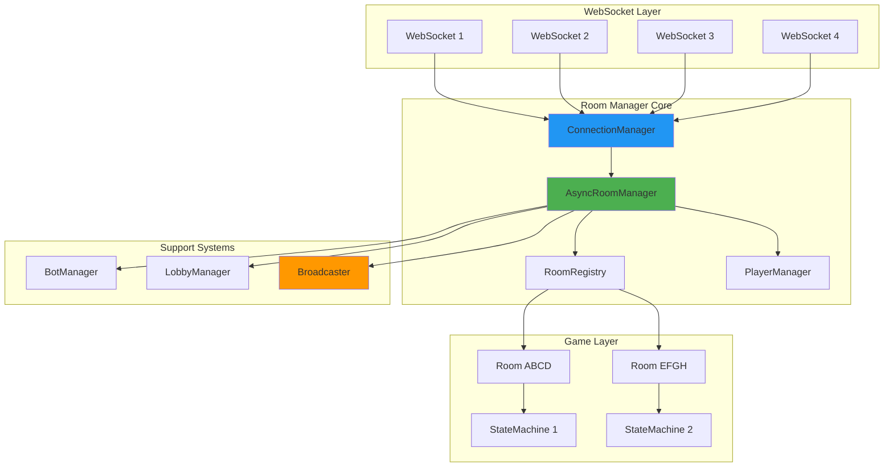
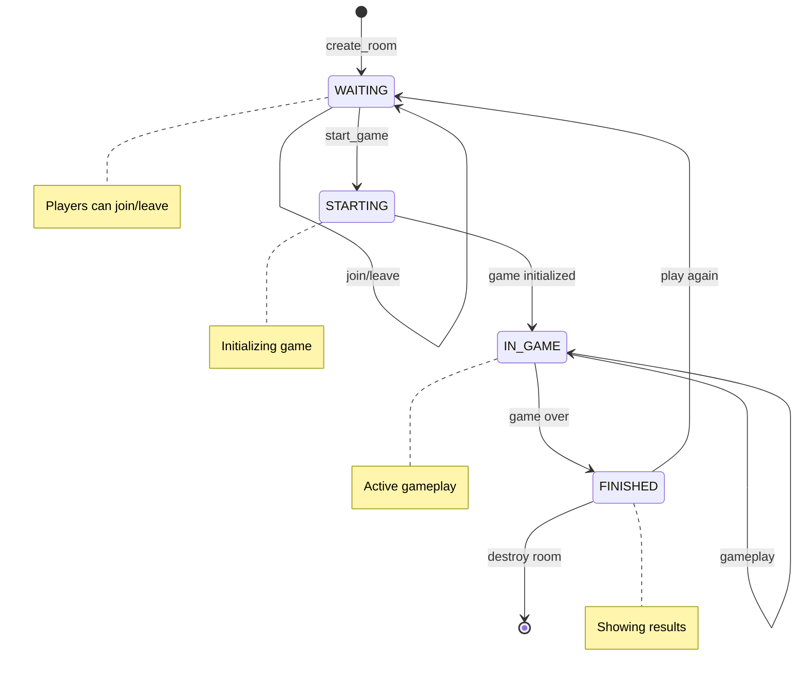

# Room Manager Deep Dive - Multiplayer Game Orchestration

## Table of Contents
1. [Overview](#overview)
2. [Architecture](#architecture)
3. [Room Lifecycle](#room-lifecycle)
4. [Player Management](#player-management)
5. [Connection Management](#connection-management)
6. [Game Integration](#game-integration)
7. [Bot Management](#bot-management)
8. [Error Handling](#error-handling)
9. [Code Examples](#code-examples)
10. [Testing & Debugging](#testing--debugging)

## Overview

The AsyncRoomManager is the central orchestrator for multiplayer gameplay in Liap Tui. It manages game rooms, player connections, and coordinates between WebSocket connections and game state machines.

### Core Responsibilities

1. **Room Lifecycle**: Create, join, leave, destroy rooms
2. **Player Management**: Track players, handle disconnections
3. **Connection Tracking**: Map WebSockets to players and rooms
4. **Game Coordination**: Start games, route messages
5. **Bot Integration**: Activate bots for disconnected players
6. **Broadcasting**: Distribute messages to room participants

## Architecture

### System Architecture



### Core Classes

```python
# backend/engine/async_room_manager.py
class AsyncRoomManager:
    """Central manager for all game rooms and connections."""
    
    def __init__(self):
        # Room storage
        self.rooms: Dict[str, Room] = {}
        self.games: Dict[str, GameStateMachine] = {}
        
        # Connection tracking
        self.connection_manager = ConnectionManager()
        
        # Player tracking
        self.player_to_room: Dict[str, str] = {}
        self.player_to_websocket: Dict[str, WebSocket] = {}
        
        # Support systems
        self.bot_manager: Optional[BotManager] = None
        
        # Lobby special handling
        self.lobby_connections: Set[WebSocket] = set()
        
        # Thread safety
        self._lock = asyncio.Lock()

# backend/engine/models.py
@dataclass
class Room:
    """Game room data structure."""
    room_id: str
    host: str
    players: List[str]
    settings: RoomSettings
    state: RoomState
    created_at: datetime
    game_started: bool = False
    
@dataclass
class RoomSettings:
    """Room configuration."""
    max_players: int = 4
    is_public: bool = True
    allow_bots: bool = True
    game_mode: str = "classic"
```

## Room Lifecycle

### Room Creation

```python
async def create_room(
    self, 
    room_id: str, 
    host_name: str, 
    settings: Dict[str, Any]
) -> Room:
    """Create a new game room."""
    async with self._lock:
        # Validate room doesn't exist
        if room_id in self.rooms:
            raise RoomError("ROOM_EXISTS", f"Room {room_id} already exists")
        
        # Create room settings
        room_settings = RoomSettings(
            max_players=settings.get('max_players', 4),
            is_public=settings.get('is_public', True),
            allow_bots=settings.get('allow_bots', True)
        )
        
        # Create room
        room = Room(
            room_id=room_id,
            host=host_name,
            players=[host_name],
            settings=room_settings,
            state=RoomState.WAITING,
            created_at=datetime.now()
        )
        
        # Store room
        self.rooms[room_id] = room
        self.player_to_room[host_name] = room_id
        
        # Log creation
        logger.info(f"Room {room_id} created by {host_name}")
        
        # Notify lobby if public
        if room_settings.is_public:
            await self._update_lobby_room_list()
        
        return room
```

### Room States



### Joining a Room

```python
async def join_room(
    self, 
    room_id: str, 
    player_name: str,
    websocket: WebSocket
) -> JoinResult:
    """Player joins an existing room."""
    async with self._lock:
        # Get room
        room = self.rooms.get(room_id)
        if not room:
            raise RoomError("ROOM_NOT_FOUND", f"Room {room_id} not found")
        
        # Check if full
        if len(room.players) >= room.settings.max_players:
            raise RoomError("ROOM_FULL", "Room is full")
        
        # Check if game in progress
        if room.game_started and not room.settings.allow_bots:
            raise RoomError("GAME_IN_PROGRESS", "Cannot join active game")
        
        # Check if player already in room
        if player_name in room.players:
            # Reconnection case
            return await self._handle_reconnection(
                room_id, player_name, websocket
            )
        
        # Add player
        room.players.append(player_name)
        self.player_to_room[player_name] = room_id
        
        # Add connection
        self.connection_manager.add_connection(room_id, websocket)
        self.player_to_websocket[player_name] = websocket
        
        # Broadcast player joined
        await self.broadcast(room_id, "player_joined", {
            "player": player_name,
            "players": room.players,
            "total": len(room.players)
        })
        
        # Send room state to new player
        await self._send_room_state(websocket, room)
        
        return JoinResult(
            success=True,
            room=room,
            is_reconnection=False
        )
```

### Leaving a Room

```python
async def leave_room(
    self, 
    room_id: str, 
    player_name: str
) -> LeaveResult:
    """Player leaves a room."""
    async with self._lock:
        room = self.rooms.get(room_id)
        if not room or player_name not in room.players:
            return LeaveResult(success=False)
        
        # Remove player
        room.players.remove(player_name)
        del self.player_to_room[player_name]
        
        # Remove connection
        websocket = self.player_to_websocket.get(player_name)
        if websocket:
            self.connection_manager.remove_connection(room_id, websocket)
            del self.player_to_websocket[player_name]
        
        # Handle empty room
        if not room.players:
            await self._destroy_room(room_id)
            return LeaveResult(success=True, room_destroyed=True)
        
        # Handle host leaving
        if player_name == room.host and room.players:
            room.host = room.players[0]  # Promote first player
            await self.broadcast(room_id, "host_changed", {
                "new_host": room.host
            })
        
        # Handle game in progress
        if room.game_started:
            game = self.games.get(room_id)
            if game and self.bot_manager:
                # Activate bot for leaving player
                await self.bot_manager.activate_bot(room_id, player_name)
                await self.broadcast(room_id, "bot_activated", {
                    "player": player_name
                })
        
        # Notify remaining players
        await self.broadcast(room_id, "player_left", {
            "player": player_name,
            "players": room.players,
            "total": len(room.players)
        })
        
        return LeaveResult(success=True, room_destroyed=False)
```

### Room Destruction

```python
async def _destroy_room(self, room_id: str):
    """Clean up and destroy a room."""
    room = self.rooms.get(room_id)
    if not room:
        return
    
    logger.info(f"Destroying room {room_id}")
    
    # Clean up game if exists
    if room_id in self.games:
        game = self.games[room_id]
        # Any game cleanup needed
        del self.games[room_id]
    
    # Remove all connections
    self.connection_manager.remove_room(room_id)
    
    # Clean up player mappings
    for player in room.players:
        if player in self.player_to_room:
            del self.player_to_room[player]
        if player in self.player_to_websocket:
            del self.player_to_websocket[player]
    
    # Remove room
    del self.rooms[room_id]
    
    # Update lobby
    if room.settings.is_public:
        await self._update_lobby_room_list()
```

## Player Management

### Player Tracking

```python
class PlayerManager:
    """Manages player state and connections."""
    
    def __init__(self):
        # Player state
        self.players: Dict[str, PlayerInfo] = {}
        
        # Connection state
        self.online_players: Set[str] = set()
        self.disconnected_players: Dict[str, datetime] = {}
    
    def add_player(self, player_name: str, room_id: str):
        """Register a new player."""
        self.players[player_name] = PlayerInfo(
            name=player_name,
            room_id=room_id,
            joined_at=datetime.now(),
            is_bot=False,
            connection_state=ConnectionState.CONNECTED
        )
        self.online_players.add(player_name)
    
    def mark_disconnected(self, player_name: str):
        """Mark player as disconnected."""
        if player_name in self.players:
            self.players[player_name].connection_state = ConnectionState.DISCONNECTED
            self.online_players.discard(player_name)
            self.disconnected_players[player_name] = datetime.now()
```

### Reconnection Handling

```python
async def _handle_reconnection(
    self, 
    room_id: str, 
    player_name: str,
    websocket: WebSocket
) -> JoinResult:
    """Handle player reconnection to active game."""
    logger.info(f"Player {player_name} reconnecting to {room_id}")
    
    # Update connection
    old_websocket = self.player_to_websocket.get(player_name)
    if old_websocket:
        self.connection_manager.remove_connection(room_id, old_websocket)
    
    self.connection_manager.add_connection(room_id, websocket)
    self.player_to_websocket[player_name] = websocket
    
    # Deactivate bot if active
    if self.bot_manager and self.bot_manager.is_bot_active(room_id, player_name):
        await self.bot_manager.deactivate_bot(room_id, player_name)
        await self.broadcast(room_id, "bot_deactivated", {
            "player": player_name
        })
    
    # Send current game state
    room = self.rooms[room_id]
    await self._send_room_state(websocket, room)
    
    if room.game_started:
        game = self.games.get(room_id)
        if game:
            # Send game state
            await self._send_game_state(websocket, game)
    
    # Notify others
    await self.broadcast(room_id, "player_reconnected", {
        "player": player_name
    }, exclude=[websocket])
    
    return JoinResult(
        success=True,
        room=room,
        is_reconnection=True
    )
```

## Connection Management

### ConnectionManager Class

```python
class ConnectionManager:
    """Manages WebSocket connections for rooms."""
    
    def __init__(self):
        # Room -> Set of WebSockets
        self.room_connections: Dict[str, Set[WebSocket]] = {}
        
        # WebSocket -> Room mapping
        self.websocket_to_room: Dict[WebSocket, str] = {}
        
        # Thread safety
        self._lock = asyncio.Lock()
    
    async def add_connection(self, room_id: str, websocket: WebSocket):
        """Add connection to room."""
        async with self._lock:
            if room_id not in self.room_connections:
                self.room_connections[room_id] = set()
            
            self.room_connections[room_id].add(websocket)
            self.websocket_to_room[websocket] = room_id
    
    async def remove_connection(self, room_id: str, websocket: WebSocket):
        """Remove connection from room."""
        async with self._lock:
            if room_id in self.room_connections:
                self.room_connections[room_id].discard(websocket)
                
                if not self.room_connections[room_id]:
                    del self.room_connections[room_id]
            
            if websocket in self.websocket_to_room:
                del self.websocket_to_room[websocket]
    
    def get_connections(self, room_id: str) -> List[WebSocket]:
        """Get all connections for a room."""
        return list(self.room_connections.get(room_id, set()))
```

### Broadcasting

```python
async def broadcast(
    self, 
    room_id: str, 
    event: str, 
    data: dict,
    exclude: List[WebSocket] = None
):
    """Broadcast message to all room connections."""
    if exclude is None:
        exclude = []
    
    # Get connections
    connections = self.connection_manager.get_connections(room_id)
    
    # Prepare message
    message = {
        "event": event,
        "data": data,
        "room_id": room_id,
        "timestamp": time.time()
    }
    
    # Send to each connection
    failed_connections = []
    
    for websocket in connections:
        if websocket in exclude:
            continue
            
        try:
            await websocket.send_json(message)
        except Exception as e:
            logger.error(f"Broadcast failed: {e}")
            failed_connections.append(websocket)
    
    # Clean up failed connections
    for websocket in failed_connections:
        await self._handle_failed_connection(room_id, websocket)
```

## Game Integration

### Starting a Game

```python
async def start_game(self, room_id: str, player_name: str) -> StartGameResult:
    """Start a game in the room."""
    async with self._lock:
        # Validate room
        room = self.rooms.get(room_id)
        if not room:
            raise RoomError("ROOM_NOT_FOUND", "Room not found")
        
        # Validate host
        if player_name != room.host:
            raise RoomError("NOT_HOST", "Only host can start game")
        
        # Validate player count
        if len(room.players) != room.settings.max_players:
            raise RoomError(
                "INVALID_PLAYER_COUNT", 
                f"Need exactly {room.settings.max_players} players"
            )
        
        # Check if game already started
        if room.game_started:
            raise RoomError("GAME_ALREADY_STARTED", "Game already in progress")
        
        # Create game state machine
        game = GameStateMachine(room_id, self)
        
        # Add players to game
        for player_name in room.players:
            game.add_player(player_name)
        
        # Initialize bot manager if needed
        if self.bot_manager:
            self.bot_manager.register_game(room_id, game)
        
        # Store game
        self.games[room_id] = game
        room.game_started = True
        room.state = RoomState.IN_GAME
        
        # Start the game
        await game.start_game()
        
        # Notify all players
        await self.broadcast(room_id, "game_started", {
            "room_id": room_id,
            "players": room.players,
            "initial_state": game.get_state()
        })
        
        logger.info(f"Game started in room {room_id}")
        
        return StartGameResult(
            success=True,
            game=game
        )
```

### Message Routing

```python
async def route_game_message(
    self, 
    room_id: str, 
    player_name: str,
    message: dict
) -> MessageResult:
    """Route message to appropriate handler."""
    # Get game
    game = self.games.get(room_id)
    
    if not game:
        # Pre-game messages
        return await self._handle_room_message(
            room_id, player_name, message
        )
    
    # Game messages
    try:
        action = GameAction(
            action_type=ActionType(message['event']),
            player_name=player_name,
            data=message.get('data', {})
        )
        
        result = await game.process_action(action)
        
        return MessageResult(
            success=result.success,
            error=result.error_message
        )
        
    except ValueError as e:
        # Invalid action type
        await self._send_error(
            self.player_to_websocket.get(player_name),
            "INVALID_ACTION",
            str(e)
        )
        return MessageResult(success=False, error=str(e))
```

## Bot Management

### Bot Integration

```python
# backend/bots/bot_manager.py
class BotManager:
    """Manages bot players for disconnected users."""
    
    def __init__(self, room_manager: AsyncRoomManager):
        self.room_manager = room_manager
        self.active_bots: Dict[str, BotPlayer] = {}
        self.bot_strategies: Dict[str, BotStrategy] = {
            'easy': EasyBotStrategy(),
            'medium': MediumBotStrategy(),
            'hard': HardBotStrategy()
        }
    
    async def activate_bot(self, room_id: str, player_name: str):
        """Activate bot for disconnected player."""
        # Create bot instance
        bot_key = f"{room_id}:{player_name}"
        
        if bot_key in self.active_bots:
            return  # Already active
        
        # Get game state
        game = self.room_manager.games.get(room_id)
        if not game:
            return
        
        # Create bot
        bot = BotPlayer(
            player_name=player_name,
            room_id=room_id,
            strategy=self.bot_strategies['medium'],
            game_reference=game
        )
        
        self.active_bots[bot_key] = bot
        
        # If it's bot's turn, make a play
        if game.get_current_player() == player_name:
            await self._make_bot_play(bot)
    
    async def _make_bot_play(self, bot: BotPlayer):
        """Bot makes a play decision."""
        # Get bot decision
        action = await bot.decide_action()
        
        if action:
            # Process through game
            game = bot.game_reference
            await game.process_action(action)
```

### Bot Decision Making

```python
class MediumBotStrategy(BotStrategy):
    """Medium difficulty bot strategy."""
    
    async def decide_play(self, game_state: dict, hand: List[Piece]) -> List[str]:
        """Decide which pieces to play."""
        current_plays = game_state.get('current_plays', {})
        required_count = game_state.get('required_piece_count', 1)
        
        # Group pieces by rank
        pieces_by_rank = defaultdict(list)
        for piece in hand:
            pieces_by_rank[piece.rank].append(piece)
        
        # Try to find valid play
        for rank, pieces in sorted(
            pieces_by_rank.items(), 
            key=lambda x: x[0].value,
            reverse=True
        ):
            if len(pieces) >= required_count:
                # Can make this play
                return [p.id for p in pieces[:required_count]]
        
        # Try mixed color play
        high_pieces = sorted(hand, key=lambda p: p.point, reverse=True)
        if len(high_pieces) >= required_count:
            return [p.id for p in high_pieces[:required_count]]
        
        # Pass if no valid play
        return []
```

## Error Handling

### Error Types

```python
class RoomError(Exception):
    """Room-related errors."""
    def __init__(self, code: str, message: str):
        self.code = code
        self.message = message
        super().__init__(message)

# Common error codes
ROOM_ERRORS = {
    "ROOM_NOT_FOUND": "The specified room does not exist",
    "ROOM_FULL": "The room has reached maximum capacity",
    "ROOM_EXISTS": "A room with this ID already exists",
    "NOT_HOST": "Only the host can perform this action",
    "GAME_IN_PROGRESS": "Cannot modify room with active game",
    "INVALID_PLAYER_COUNT": "Invalid number of players",
    "PLAYER_NOT_IN_ROOM": "Player is not in this room",
    "ALREADY_IN_ROOM": "Player is already in a room"
}
```

### Error Recovery

```python
async def _handle_failed_connection(self, room_id: str, websocket: WebSocket):
    """Handle a failed WebSocket connection."""
    # Find player for this websocket
    player_name = None
    for name, ws in self.player_to_websocket.items():
        if ws == websocket:
            player_name = name
            break
    
    if not player_name:
        # Unknown connection, just remove
        self.connection_manager.remove_connection(room_id, websocket)
        return
    
    logger.warning(f"Connection failed for {player_name} in {room_id}")
    
    # Remove connection
    self.connection_manager.remove_connection(room_id, websocket)
    del self.player_to_websocket[player_name]
    
    # Check if game is active
    room = self.rooms.get(room_id)
    if room and room.game_started:
        # Activate bot instead of removing player
        if self.bot_manager:
            await self.bot_manager.activate_bot(room_id, player_name)
            await self.broadcast(room_id, "player_disconnected", {
                "player": player_name,
                "bot_activated": True
            })
    else:
        # Remove from room if not in game
        await self.leave_room(room_id, player_name)
```

## Code Examples

### WebSocket Handler Integration

```python
# backend/api/websocket/ws.py
@router.websocket("/ws/{room_id}")
async def websocket_endpoint(websocket: WebSocket, room_id: str):
    """Main WebSocket endpoint."""
    await websocket.accept()
    
    player_name = None
    
    try:
        # Handle initial connection
        if room_id == "lobby":
            await handle_lobby_connection(websocket)
        else:
            # Get player info from first message
            message = await websocket.receive_json()
            
            if message['event'] == 'join_room':
                player_name = message['data']['player_name']
                
                # Join room
                result = await room_manager.join_room(
                    room_id, player_name, websocket
                )
                
                if result.success:
                    # Handle subsequent messages
                    await handle_room_connection(
                        websocket, room_id, player_name
                    )
            
    except WebSocketDisconnect:
        logger.info(f"WebSocket disconnected: {player_name or 'unknown'}")
        
        if player_name and room_id != "lobby":
            await handle_player_disconnect(room_id, player_name)
```

### Creating a Room Flow

```python
# Complete flow for creating a room
async def create_room_flow(player_name: str, settings: dict) -> dict:
    """Complete room creation flow."""
    # Generate room ID
    room_id = generate_room_id()
    
    # Create room
    room = await room_manager.create_room(
        room_id, player_name, settings
    )
    
    # Return room info
    return {
        "room_id": room_id,
        "host": room.host,
        "players": room.players,
        "settings": room.settings.to_dict(),
        "state": room.state.value
    }
```

### Lobby Updates

```python
async def _update_lobby_room_list(self):
    """Update lobby with current room list."""
    # Get public rooms
    public_rooms = []
    
    for room_id, room in self.rooms.items():
        if room.settings.is_public and not room.game_started:
            public_rooms.append({
                "room_id": room_id,
                "host": room.host,
                "players": len(room.players),
                "max_players": room.settings.max_players,
                "created_at": room.created_at.isoformat()
            })
    
    # Broadcast to lobby
    lobby_message = {
        "event": "room_list",
        "data": {
            "rooms": public_rooms,
            "total": len(public_rooms)
        }
    }
    
    # Send to all lobby connections
    failed = []
    for websocket in self.lobby_connections:
        try:
            await websocket.send_json(lobby_message)
        except:
            failed.append(websocket)
    
    # Clean up failed
    for ws in failed:
        self.lobby_connections.discard(ws)
```

## Testing & Debugging

### Unit Testing

```python
@pytest.mark.asyncio
async def test_room_creation():
    """Test room creation flow."""
    manager = AsyncRoomManager()
    
    # Create room
    room = await manager.create_room(
        "test_room", 
        "Alice",
        {"max_players": 4}
    )
    
    # Verify room
    assert room.room_id == "test_room"
    assert room.host == "Alice"
    assert "Alice" in room.players
    assert len(room.players) == 1
    assert not room.game_started
    
    # Verify tracking
    assert "Alice" in manager.player_to_room
    assert manager.player_to_room["Alice"] == "test_room"
```

### Integration Testing

```python
@pytest.mark.asyncio
async def test_full_game_flow():
    """Test complete multiplayer flow."""
    manager = AsyncRoomManager()
    manager.bot_manager = BotManager(manager)
    
    # Create room
    room = await manager.create_room(
        "test", "Alice", {}
    )
    
    # Add players with mock websockets
    websockets = {}
    for player in ["Bob", "Carol", "David"]:
        ws = MockWebSocket()
        websockets[player] = ws
        await manager.join_room("test", player, ws)
    
    # Verify all joined
    assert len(room.players) == 4
    
    # Start game
    result = await manager.start_game("test", "Alice")
    assert result.success
    assert "test" in manager.games
    
    # Simulate disconnection
    await manager._handle_failed_connection(
        "test", websockets["Bob"]
    )
    
    # Verify bot activated
    assert manager.bot_manager.is_bot_active("test", "Bob")
```

### Debug Endpoints

```python
@router.get("/api/debug/rooms")
async def debug_rooms():
    """Get all room information."""
    rooms_data = []
    
    for room_id, room in room_manager.rooms.items():
        rooms_data.append({
            "room_id": room_id,
            "host": room.host,
            "players": room.players,
            "game_started": room.game_started,
            "state": room.state.value,
            "connections": len(
                room_manager.connection_manager.get_connections(room_id)
            ),
            "has_bots": any(
                room_manager.bot_manager.is_bot_active(room_id, p)
                for p in room.players
            ) if room_manager.bot_manager else False
        })
    
    return {
        "total_rooms": len(rooms_data),
        "rooms": rooms_data,
        "player_mappings": dict(room_manager.player_to_room),
        "lobby_connections": len(room_manager.lobby_connections)
    }
```

### Monitoring

```python
# Metrics tracking
class RoomMetrics:
    def __init__(self):
        self.rooms_created = 0
        self.rooms_destroyed = 0
        self.games_started = 0
        self.player_connections = 0
        self.player_disconnections = 0
        self.bot_activations = 0
    
    def to_dict(self):
        return {
            "rooms_active": self.rooms_created - self.rooms_destroyed,
            "total_games": self.games_started,
            "connection_events": self.player_connections,
            "disconnection_events": self.player_disconnections,
            "bot_activations": self.bot_activations
        }
```

## Summary

The AsyncRoomManager provides:

1. **Robust Room Management**: Complete lifecycle from creation to destruction
2. **Connection Tracking**: Reliable WebSocket-to-player mapping
3. **Game Integration**: Seamless game state machine creation
4. **Bot Support**: Automatic bot activation for disconnected players
5. **Error Recovery**: Graceful handling of disconnections and errors

This architecture enables smooth multiplayer gameplay with automatic failover, ensuring games can continue even when players disconnect.