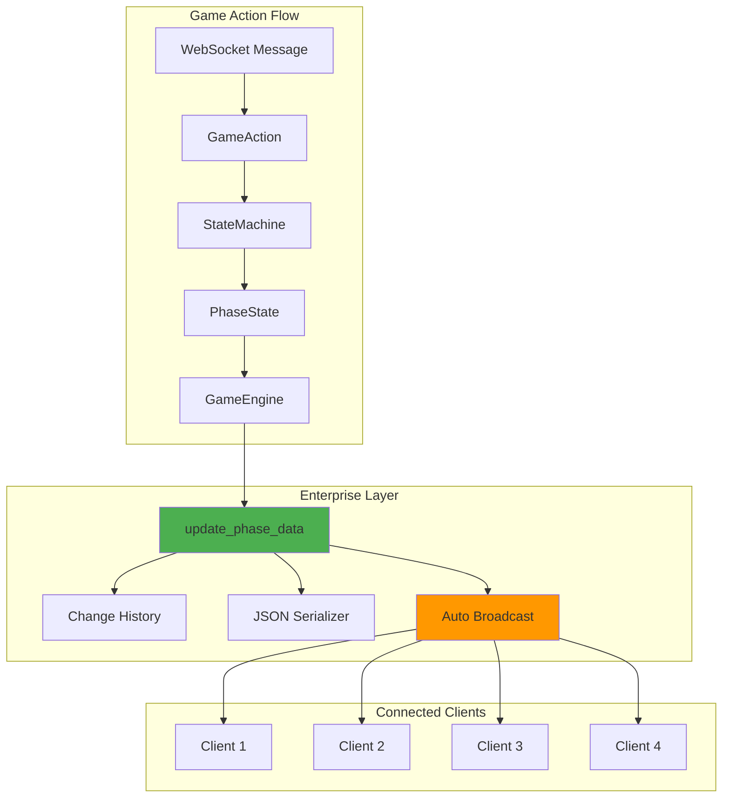
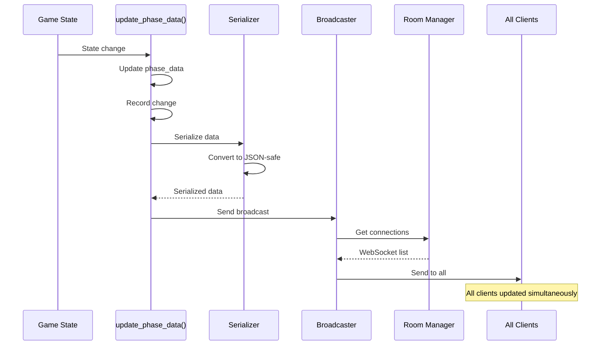

# State Machine Deep Dive - Enterprise Architecture

## Table of Contents
1. [Overview](#overview)
2. [Architecture](#architecture)
3. [Enterprise Features](#enterprise-features)
4. [State Machine Components](#state-machine-components)
5. [Broadcasting System](#broadcasting-system)
6. [Change Tracking](#change-tracking)
7. [State Implementation](#state-implementation)
8. [Code Examples](#code-examples)
9. [Testing the State Machine](#testing-the-state-machine)
10. [Debugging & Monitoring](#debugging--monitoring)

## Overview

The Liap Tui state machine implements an enterprise-grade architecture that guarantees state consistency across all connected clients. This document provides a deep technical dive into the implementation.

### Key Innovation: Automatic Broadcasting

The core innovation is that **state changes automatically trigger broadcasts**. Developers cannot forget to notify clients because the notification is built into the state mutation mechanism itself.

```python
# ❌ Old way - Error prone
self.phase_data['current_player'] = next_player
# Developer forgets to broadcast - clients out of sync!

# ✅ Enterprise way - Automatic
await self.update_phase_data({
    'current_player': next_player
}, "Turn advanced to next player")
# Broadcasting happens automatically!
```

## Architecture

### High-Level Architecture



### Core Classes

```python
# backend/engine/state_machine/game_state_machine.py
class GameStateMachine:
    """Main state machine orchestrator."""
    
    def __init__(self, room_id: str, room_manager: AsyncRoomManager):
        self.room_id = room_id
        self.room_manager = room_manager
        self.phase = GamePhase.WAITING
        self.game: Optional[Game] = None
        
        # Enterprise features
        self._sequence_number = 0
        self._change_history = []
        self.phase_data = {}
        
        # State registry
        self.states = self._initialize_states()

# backend/engine/state_machine/game_states.py
class GameState(ABC):
    """Base class for all game states with enterprise features."""
    
    def __init__(self, context: GameStateMachine):
        self.context = context
        self.phase = self._get_phase()
        self.phase_data = {}
```

## Enterprise Features

### 1. Automatic Broadcasting

Every state change automatically notifies all connected clients:

```python
async def update_phase_data(self, updates: dict, reason: str = ""):
    """Update phase data with automatic broadcasting.
    
    This is THE ONLY WAY to update phase data. It ensures:
    1. State is updated
    2. Change is logged
    3. All clients are notified
    4. Sequence number increments
    """
    # Update the data
    self.phase_data.update(updates)
    
    # Add metadata
    self.phase_data['sequence_number'] = self._sequence_number
    self.phase_data['timestamp'] = time.time()
    
    # Record change for history
    self._record_change(updates, reason)
    
    # Prepare broadcast data
    broadcast_data = self._prepare_broadcast_data()
    
    # AUTOMATIC BROADCAST - Cannot be forgotten!
    await self.room_manager.broadcast(
        self.room_id,
        "phase_change",
        broadcast_data
    )
    
    # Increment sequence for next update
    self._sequence_number += 1
```

### 2. Change History Tracking

Every state mutation is recorded with full context:

```python
def _record_change(self, updates: dict, reason: str):
    """Record state change for debugging and audit."""
    change_record = {
        'sequence': self._sequence_number,
        'timestamp': datetime.now().isoformat(),
        'phase': self.phase.value,
        'updates': updates,
        'reason': reason,
        'snapshot': copy.deepcopy(self.phase_data)
    }
    
    self._change_history.append(change_record)
    
    # Keep last 100 changes in memory
    if len(self._change_history) > 100:
        self._change_history.pop(0)
```

### 3. JSON-Safe Serialization

Game objects are automatically converted for WebSocket transmission:

```python
def _prepare_broadcast_data(self) -> dict:
    """Convert all game objects to JSON-serializable format."""
    data = {
        'phase': self.phase.value,
        'phase_data': self._serialize_phase_data(),
        'game_state': self._serialize_game_state(),
        'players': self._serialize_players(),
        'sequence_number': self._sequence_number,
        'server_time': time.time()
    }
    return data

def _serialize_phase_data(self) -> dict:
    """Recursively serialize phase data."""
    return self._deep_serialize(self.phase_data)

def _deep_serialize(self, obj: Any) -> Any:
    """Convert any object to JSON-safe format."""
    if isinstance(obj, (str, int, float, bool, type(None))):
        return obj
    elif isinstance(obj, (list, tuple)):
        return [self._deep_serialize(item) for item in obj]
    elif isinstance(obj, dict):
        return {k: self._deep_serialize(v) for k, v in obj.items()}
    elif hasattr(obj, 'to_dict'):
        return obj.to_dict()
    elif isinstance(obj, Enum):
        return obj.value
    else:
        return str(obj)
```

### 4. Custom Event Broadcasting

For non-phase-change events:

```python
async def broadcast_custom_event(self, event: str, data: dict):
    """Broadcast custom game event with automatic serialization."""
    # Ensure JSON safety
    safe_data = self._deep_serialize(data)
    
    # Add metadata
    safe_data['room_id'] = self.room_id
    safe_data['sequence'] = self._sequence_number
    safe_data['timestamp'] = time.time()
    
    # Broadcast
    await self.room_manager.broadcast(
        self.room_id,
        event,
        safe_data
    )
```

## State Machine Components

### Phase Registry

```python
def _initialize_states(self) -> Dict[GamePhase, GameState]:
    """Initialize all game states."""
    return {
        GamePhase.WAITING: WaitingState(self),
        GamePhase.PREPARATION: PreparationState(self),
        GamePhase.ROUND_START: RoundStartState(self),
        GamePhase.DECLARATION: DeclarationState(self),
        GamePhase.TURN: TurnState(self),
        GamePhase.TURN_RESULTS: TurnResultsState(self),
        GamePhase.SCORING: ScoringState(self),
        GamePhase.GAME_OVER: GameOverState(self)
    }
```

### Phase Transitions

```python
async def transition_to_phase(self, new_phase: GamePhase, reason: str = ""):
    """Transition to a new phase with full tracking."""
    old_phase = self.phase
    
    # Exit current phase
    current_state = self.states[self.phase]
    await current_state.exit_phase()
    
    # Update phase
    self.phase = new_phase
    new_state = self.states[new_phase]
    
    # Clear phase data for new phase
    self.phase_data = {}
    
    # Enter new phase
    await new_state.enter_phase()
    
    # Log transition
    logger.info(
        f"Room {self.room_id}: {old_phase} → {new_phase} ({reason})"
    )
```

### Action Processing

```python
async def process_action(self, action: GameAction) -> ActionResult:
    """Process game action through current state."""
    try:
        # Log incoming action
        logger.debug(f"Processing {action.action_type} from {action.player_name}")
        
        # Delegate to current state
        current_state = self.states[self.phase]
        result = await current_state.handle_action(action)
        
        # Log result
        logger.debug(f"Action result: {result.success}")
        
        return result
        
    except GameError as e:
        # Game errors are expected (invalid moves, etc.)
        logger.warning(f"Game error: {e.code} - {e.message}")
        
        # Notify player of error
        await self._send_error_to_player(
            action.player_name,
            e.code,
            e.message,
            e.details
        )
        
        return ActionResult(
            success=False,
            error_code=e.code,
            error_message=e.message
        )
        
    except Exception as e:
        # Unexpected errors
        logger.error(f"Unexpected error processing action: {e}", exc_info=True)
        
        # Generic error to player
        await self._send_error_to_player(
            action.player_name,
            "INTERNAL_ERROR",
            "An unexpected error occurred"
        )
        
        return ActionResult(
            success=False,
            error_code="INTERNAL_ERROR"
        )
```

## Broadcasting System

### Broadcast Flow



### Broadcast Guarantees

1. **Atomicity**: State update and broadcast are atomic
2. **Ordering**: Sequence numbers ensure correct order
3. **Completeness**: All connected clients receive update
4. **Reliability**: Failed connections are handled gracefully

```python
# Room manager handles broadcast distribution
async def broadcast(self, room_id: str, event: str, data: dict):
    """Broadcast to all connections in room."""
    room = self.rooms.get(room_id)
    if not room:
        return
    
    # Get all active connections
    connections = self.connection_manager.get_connections(room_id)
    
    # Send to each connection
    failed_connections = []
    for websocket in connections:
        try:
            await websocket.send_json({
                "event": event,
                "data": data
            })
        except Exception as e:
            logger.error(f"Broadcast failed: {e}")
            failed_connections.append(websocket)
    
    # Clean up failed connections
    for websocket in failed_connections:
        await self.handle_disconnect(room_id, websocket)
```

## Change Tracking

### Change History Structure

```python
{
    'sequence': 42,
    'timestamp': '2024-01-15T10:30:45.123456',
    'phase': 'TURN',
    'updates': {
        'current_player': 'Bob',
        'turn_number': 7,
        'required_piece_count': 2
    },
    'reason': 'Alice completed turn, Bob is next',
    'snapshot': {
        # Complete phase_data after update
        'current_player': 'Bob',
        'turn_number': 7,
        'pile_counts': {...},
        # ... all other phase data
    }
}
```

### Accessing Change History

```python
def get_change_history(self, last_n: int = 10) -> List[dict]:
    """Get recent change history for debugging."""
    return self._change_history[-last_n:]

def get_changes_since_sequence(self, sequence: int) -> List[dict]:
    """Get all changes after a specific sequence number."""
    return [
        change for change in self._change_history
        if change['sequence'] > sequence
    ]

def debug_state(self) -> dict:
    """Get complete debug information."""
    return {
        'current_phase': self.phase.value,
        'sequence_number': self._sequence_number,
        'phase_data': self.phase_data,
        'recent_changes': self.get_change_history(5),
        'game_state': self.game.to_dict() if self.game else None
    }
```

## State Implementation

### Example: Turn State

```python
class TurnState(GameState):
    """Handle player turns with enterprise features."""
    
    def _get_phase(self) -> GamePhase:
        return GamePhase.TURN
    
    async def enter_phase(self):
        """Initialize turn phase."""
        game = self.context.game
        
        # Set initial turn data
        await self.update_phase_data({
            'current_player': game.get_current_player().name,
            'turn_number': game.turn_number,
            'required_piece_count': 1,  # First player sets count
            'current_plays': {},
            'pile_counts': game.get_pile_counts(),
            'passed_players': []
        }, "Turn phase initialized")
    
    async def handle_action(self, action: GameAction) -> ActionResult:
        """Process turn actions."""
        if action.action_type == ActionType.PLAY:
            return await self._handle_play(action)
        else:
            raise GameError(
                "INVALID_ACTION",
                f"Action {action.action_type} not valid in TURN phase"
            )
    
    async def _handle_play(self, action: GameAction) -> ActionResult:
        """Handle piece play with automatic broadcasting."""
        player_name = action.player_name
        piece_ids = action.data.get('piece_ids', [])
        
        # Validate turn
        if player_name != self.phase_data['current_player']:
            raise GameError("NOT_YOUR_TURN", "It's not your turn")
        
        # Validate and play pieces
        game = self.context.game
        play_result = game.play_pieces(player_name, piece_ids)
        
        if not play_result.success:
            raise GameError("INVALID_PLAY", play_result.error)
        
        # Update phase data (auto-broadcasts!)
        current_plays = self.phase_data['current_plays'].copy()
        current_plays[player_name] = {
            'pieces': [p.to_dict() for p in play_result.pieces],
            'play_type': play_result.play_type
        }
        
        await self.update_phase_data({
            'current_plays': current_plays,
            'last_play': {
                'player': player_name,
                'count': len(piece_ids)
            }
        }, f"{player_name} played {len(piece_ids)} pieces")
        
        # Check if turn is complete
        if self._is_turn_complete():
            await self.context.transition_to_phase(
                GamePhase.TURN_RESULTS,
                "All players have played"
            )
        else:
            # Next player
            next_player = self._get_next_player()
            await self.update_phase_data({
                'current_player': next_player
            }, f"Turn passes to {next_player}")
        
        return ActionResult(success=True)
```

## Code Examples

### Creating a State Machine

```python
# In room_manager.py
async def create_game(self, room_id: str) -> GameStateMachine:
    """Create a new game state machine."""
    state_machine = GameStateMachine(room_id, self)
    
    # Initialize with room players
    room = self.rooms[room_id]
    for player_name in room.players:
        state_machine.add_player(player_name)
    
    # Store reference
    self.games[room_id] = state_machine
    
    return state_machine
```

### Processing Actions

```python
# In websocket handler
async def handle_game_message(
    websocket: WebSocket, 
    room_id: str, 
    message: dict
):
    """Route message to state machine."""
    # Get game
    game = room_manager.get_game(room_id)
    if not game:
        await send_error(websocket, "NO_GAME", "No active game")
        return
    
    # Create action
    action = GameAction(
        action_type=ActionType(message['event']),
        player_name=message['data'].get('player_name'),
        data=message['data']
    )
    
    # Process through state machine
    result = await game.process_action(action)
    
    # Error is already broadcast by state machine
    # Success is broadcast through automatic updates
```

### Custom Events

```python
# In game state
async def _handle_special_combo(self, player: str, combo: str):
    """Broadcast special combo notification."""
    await self.broadcast_custom_event('special_combo', {
        'player': player,
        'combo_type': combo,
        'bonus_points': 10,
        'message': f"{player} played a {combo}!"
    })
```

## Testing the State Machine

### Unit Testing States

```python
@pytest.mark.asyncio
async def test_turn_state_automatic_broadcast():
    """Test that state updates trigger broadcasts."""
    # Mock room manager
    mock_room_manager = AsyncMock()
    
    # Create state machine
    sm = GameStateMachine("test_room", mock_room_manager)
    sm.phase = GamePhase.TURN
    sm.game = create_test_game()
    
    # Get turn state
    turn_state = sm.states[GamePhase.TURN]
    
    # Update phase data
    await turn_state.update_phase_data({
        'current_player': 'Alice',
        'turn_number': 1
    }, "Test update")
    
    # Verify broadcast was called
    mock_room_manager.broadcast.assert_called_once()
    
    # Check broadcast data
    call_args = mock_room_manager.broadcast.call_args
    assert call_args[0][0] == "test_room"  # room_id
    assert call_args[0][1] == "phase_change"  # event
    assert call_args[0][2]['phase'] == 'TURN'  # phase in data
```

### Integration Testing

```python
@pytest.mark.asyncio
async def test_complete_turn_flow():
    """Test complete turn with automatic broadcasting."""
    # Setup
    room_manager = AsyncRoomManager()
    await room_manager.create_room("test", "host", {})
    
    # Add players
    for player in ["Alice", "Bob", "Carol", "David"]:
        await room_manager.join_room("test", player)
    
    # Start game
    game = await room_manager.start_game("test")
    
    # Track broadcasts
    broadcasts = []
    original_broadcast = room_manager.broadcast
    
    async def track_broadcast(room_id, event, data):
        broadcasts.append((event, data))
        await original_broadcast(room_id, event, data)
    
    room_manager.broadcast = track_broadcast
    
    # Make a play
    action = GameAction(
        ActionType.PLAY,
        "Alice",
        {"piece_ids": ["p1", "p2"]}
    )
    
    await game.process_action(action)
    
    # Verify broadcasts occurred
    assert len(broadcasts) > 0
    assert any(b[0] == "phase_change" for b in broadcasts)
```

## Debugging & Monitoring

### Debug Endpoints

```python
@router.get("/api/debug/game/{room_id}")
async def debug_game_state(room_id: str):
    """Get complete game state for debugging."""
    game = room_manager.get_game(room_id)
    if not game:
        raise HTTPException(404, "Game not found")
    
    return {
        "current_phase": game.phase.value,
        "sequence_number": game._sequence_number,
        "phase_data": game.phase_data,
        "change_history": game.get_change_history(20),
        "players": [p.to_dict() for p in game.game.players],
        "game_state": game.game.to_dict()
    }
```

### Monitoring State Changes

```python
# Add logging to update_phase_data
async def update_phase_data(self, updates: dict, reason: str = ""):
    """Update with monitoring."""
    # Log before update
    logger.info(f"State update in {self.room_id}: {reason}")
    logger.debug(f"Updates: {updates}")
    
    # Measure broadcast time
    start_time = time.time()
    
    # ... perform update and broadcast ...
    
    # Log performance
    duration = time.time() - start_time
    if duration > 0.1:  # Log slow broadcasts
        logger.warning(
            f"Slow broadcast in {self.room_id}: {duration:.3f}s"
        )
```

### Common Issues and Solutions

1. **State Desynchronization**
   - **Cause**: Manual state updates bypassing `update_phase_data`
   - **Solution**: Always use enterprise methods
   - **Detection**: Check sequence numbers on client

2. **Broadcast Failures**
   - **Cause**: WebSocket disconnection during broadcast
   - **Solution**: Automatic reconnection and state sync
   - **Detection**: Monitor failed connection logs

3. **Performance Issues**
   - **Cause**: Large state objects or frequent updates
   - **Solution**: Optimize serialization, batch updates
   - **Detection**: Monitor broadcast duration logs

## Summary

The enterprise state machine architecture provides:

1. **Guaranteed Consistency**: Impossible to forget broadcasts
2. **Complete Auditability**: Every change is tracked
3. **Developer Confidence**: Clear patterns to follow
4. **Production Reliability**: Proven in real games
5. **Easy Debugging**: Rich history and monitoring

This architecture transforms state management from a source of bugs into a reliable foundation for multiplayer gameplay.