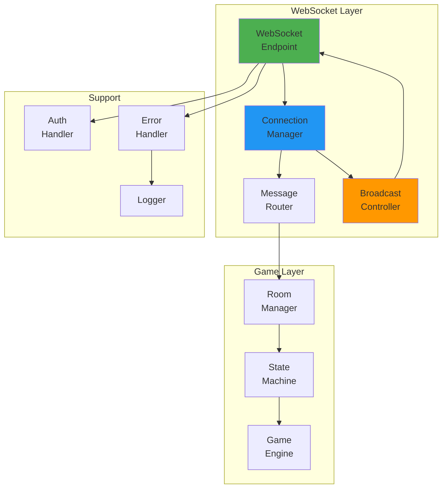
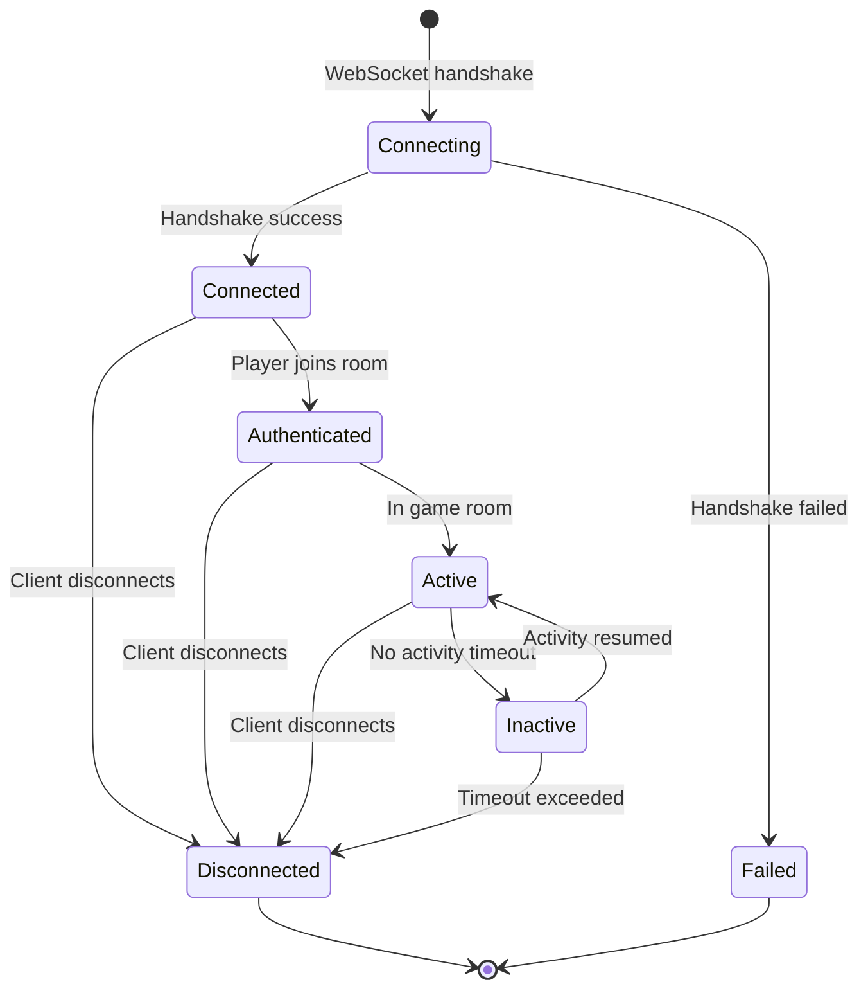

# WebSocket Handler Deep Dive - Backend Connection Management

## Table of Contents
1. [Overview](#overview)
2. [Architecture](#architecture)
3. [Connection Manager](#connection-manager)
4. [WebSocket Endpoints](#websocket-endpoints)
5. [Message Routing](#message-routing)
6. [Error Handling](#error-handling)
7. [Connection Lifecycle](#connection-lifecycle)
8. [Broadcasting System](#broadcasting-system)
9. [Performance & Scaling](#performance--scaling)
10. [Testing WebSockets](#testing-websockets)

## Overview

The WebSocket Handler is the backend component responsible for managing real-time bidirectional communication between the server and clients. It handles connection lifecycle, message routing, error recovery, and broadcasting to multiple clients.

### Design Principles

1. **Connection Reliability**: Robust handling of disconnections and reconnections
2. **Message Integrity**: Guaranteed delivery and ordering
3. **Scalability**: Efficient handling of multiple concurrent connections
4. **Error Recovery**: Graceful handling of failures
5. **Type Safety**: Strong typing for all messages

## Architecture

### Component Overview



### File Structure

```
backend/api/
├── ws.py               # WebSocket endpoints
├── connection_manager.py   # Connection management
├── message_router.py   # Message routing logic
└── broadcast.py        # Broadcasting utilities

backend/models/
├── websocket_models.py # Message type definitions
└── connection_models.py # Connection state models
```

## Connection Manager

### Core Implementation

```python
# backend/api/connection_manager.py
from typing import Dict, Set, Optional
from fastapi import WebSocket
import asyncio
import time
import uuid

class ConnectionManager:
    """Manages WebSocket connections for all rooms."""
    
    def __init__(self):
        # Room -> Set of connections
        self.room_connections: Dict[str, Set[WebSocket]] = {}
        
        # Connection -> metadata
        self.connection_metadata: Dict[WebSocket, ConnectionMetadata] = {}
        
        # Player -> connection mapping
        self.player_connections: Dict[str, WebSocket] = {}
        
        # Active connections
        self.active_connections: Set[WebSocket] = set()
        
        # Connection statistics
        self.connection_stats: Dict[str, ConnectionStats] = {}
    
    async def connect(
        self, 
        websocket: WebSocket, 
        room_id: str,
        player_name: Optional[str] = None
    ) -> str:
        """Accept and register a new connection."""
        # Accept WebSocket connection
        await websocket.accept()
        
        # Generate connection ID
        connection_id = str(uuid.uuid4())
        
        # Create metadata
        metadata = ConnectionMetadata(
            connection_id=connection_id,
            room_id=room_id,
            player_name=player_name,
            connected_at=time.time(),
            last_activity=time.time(),
            message_count=0
        )
        
        # Register connection
        self.connection_metadata[websocket] = metadata
        self.active_connections.add(websocket)
        
        # Add to room
        if room_id not in self.room_connections:
            self.room_connections[room_id] = set()
        self.room_connections[room_id].add(websocket)
        
        # Map player if authenticated
        if player_name:
            self.player_connections[player_name] = websocket
        
        # Update stats
        self._update_connection_stats(room_id, 'connect')
        
        # Log connection
        logger.info(f"Connection {connection_id} joined room {room_id}")
        
        return connection_id
```

### Connection Metadata

```python
from dataclasses import dataclass
from typing import Optional

@dataclass
class ConnectionMetadata:
    """Metadata for each WebSocket connection."""
    connection_id: str
    room_id: str
    player_name: Optional[str]
    connected_at: float
    last_activity: float
    message_count: int
    
    # Performance metrics
    avg_latency: float = 0.0
    messages_sent: int = 0
    messages_received: int = 0
    bytes_sent: int = 0
    bytes_received: int = 0
    
    # Connection state
    is_authenticated: bool = False
    is_active: bool = True
    reconnect_count: int = 0

@dataclass
class ConnectionStats:
    """Statistics for room connections."""
    total_connections: int = 0
    active_connections: int = 0
    total_messages: int = 0
    total_bytes: int = 0
    peak_connections: int = 0
    avg_connection_duration: float = 0.0
```

### Disconnection Handling

```python
async def disconnect(self, websocket: WebSocket):
    """Handle connection disconnection."""
    if websocket not in self.connection_metadata:
        return
    
    metadata = self.connection_metadata[websocket]
    room_id = metadata.room_id
    player_name = metadata.player_name
    
    # Remove from active connections
    self.active_connections.discard(websocket)
    
    # Remove from room
    if room_id in self.room_connections:
        self.room_connections[room_id].discard(websocket)
        
        # Clean up empty rooms
        if not self.room_connections[room_id]:
            del self.room_connections[room_id]
    
    # Remove player mapping
    if player_name and self.player_connections.get(player_name) == websocket:
        del self.player_connections[player_name]
    
    # Calculate connection duration
    duration = time.time() - metadata.connected_at
    
    # Update stats
    self._update_connection_stats(room_id, 'disconnect', duration)
    
    # Clean up metadata
    del self.connection_metadata[websocket]
    
    # Log disconnection
    logger.info(
        f"Connection {metadata.connection_id} disconnected from room {room_id} "
        f"after {duration:.1f}s"
    )
    
    # Notify room of disconnection
    if player_name:
        await self.notify_player_disconnection(room_id, player_name)
```

## WebSocket Endpoints

### Main WebSocket Endpoint

```python
# backend/api/ws.py
from fastapi import WebSocket, WebSocketDisconnect, Depends
from typing import Optional
import json

@router.websocket("/ws/{room_id}")
async def websocket_endpoint(
    websocket: WebSocket,
    room_id: str,
    token: Optional[str] = None
):
    """Main WebSocket endpoint for game rooms."""
    connection_id = None
    player_name = None
    
    try:
        # Authenticate if token provided
        if token:
            player_name = await authenticate_token(token)
        
        # Connect to room
        connection_id = await connection_manager.connect(
            websocket, 
            room_id, 
            player_name
        )
        
        # Send connection confirmation
        await websocket.send_json({
            "event": "connected",
            "data": {
                "connection_id": connection_id,
                "room_id": room_id,
                "player_name": player_name
            }
        })
        
        # Handle messages
        while True:
            # Receive message
            data = await websocket.receive_text()
            
            # Parse message
            try:
                message = json.loads(data)
            except json.JSONDecodeError:
                await send_error(websocket, "INVALID_JSON", "Invalid message format")
                continue
            
            # Route message
            await message_router.route_message(
                websocket=websocket,
                room_id=room_id,
                message=message,
                player_name=player_name
            )
    
    except WebSocketDisconnect:
        # Clean disconnection
        logger.info(f"WebSocket {connection_id} disconnected normally")
    
    except Exception as e:
        # Unexpected error
        logger.error(f"WebSocket error: {str(e)}", exc_info=True)
        await send_error(websocket, "SERVER_ERROR", str(e))
    
    finally:
        # Always disconnect
        await connection_manager.disconnect(websocket)
```

### Lobby WebSocket

```python
@router.websocket("/ws/lobby")
async def lobby_websocket(websocket: WebSocket):
    """WebSocket endpoint for lobby operations."""
    connection_id = None
    
    try:
        # Connect to lobby
        connection_id = await connection_manager.connect(
            websocket, 
            "lobby", 
            None
        )
        
        # Send initial room list
        rooms = await room_manager.get_public_rooms()
        await websocket.send_json({
            "event": "room_list",
            "data": {"rooms": rooms}
        })
        
        # Handle lobby messages
        while True:
            data = await websocket.receive_text()
            message = json.loads(data)
            
            # Route lobby-specific messages
            await handle_lobby_message(websocket, message)
    
    except WebSocketDisconnect:
        pass
    
    finally:
        await connection_manager.disconnect(websocket)

async def handle_lobby_message(websocket: WebSocket, message: dict):
    """Handle lobby-specific messages."""
    event = message.get("event")
    data = message.get("data", {})
    
    if event == "create_room":
        # Create new room
        room_info = await room_manager.create_room(
            room_name=data.get("room_name"),
            creator_name=data.get("player_name"),
            is_public=data.get("is_public", True)
        )
        
        await websocket.send_json({
            "event": "room_created",
            "data": room_info
        })
        
        # Broadcast to all lobby connections
        await broadcast_room_update("room_created", room_info)
    
    elif event == "refresh_rooms":
        # Send updated room list
        rooms = await room_manager.get_public_rooms()
        await websocket.send_json({
            "event": "room_list",
            "data": {"rooms": rooms}
        })
```

## Message Routing

### Message Router Implementation

```python
# backend/api/message_router.py
from typing import Dict, Callable, Optional
from fastapi import WebSocket

class MessageRouter:
    """Routes WebSocket messages to appropriate handlers."""
    
    def __init__(self):
        # Event -> handler mapping
        self.handlers: Dict[str, Callable] = {}
        
        # Register handlers
        self.register_handlers()
    
    def register_handlers(self):
        """Register all message handlers."""
        # Game actions
        self.handlers["join_room"] = self.handle_join_room
        self.handlers["leave_room"] = self.handle_leave_room
        self.handlers["start_game"] = self.handle_start_game
        self.handlers["declare"] = self.handle_declare
        self.handlers["play"] = self.handle_play
        self.handlers["accept_redeal"] = self.handle_accept_redeal
        self.handlers["decline_redeal"] = self.handle_decline_redeal
        
        # Utility
        self.handlers["ping"] = self.handle_ping
        self.handlers["chat"] = self.handle_chat
        self.handlers["get_state"] = self.handle_get_state
    
    async def route_message(
        self,
        websocket: WebSocket,
        room_id: str,
        message: dict,
        player_name: Optional[str]
    ):
        """Route message to appropriate handler."""
        event = message.get("event")
        data = message.get("data", {})
        
        # Validate message
        if not event:
            await send_error(websocket, "MISSING_EVENT", "Event type required")
            return
        
        # Find handler
        handler = self.handlers.get(event)
        if not handler:
            await send_error(
                websocket, 
                "UNKNOWN_EVENT", 
                f"Unknown event: {event}"
            )
            return
        
        # Create context
        context = MessageContext(
            websocket=websocket,
            room_id=room_id,
            player_name=player_name,
            event=event,
            data=data,
            timestamp=time.time()
        )
        
        try:
            # Execute handler
            await handler(context)
            
            # Update activity
            connection_manager.update_activity(websocket)
            
        except GameError as e:
            # Game-specific errors
            await send_error(websocket, e.code, e.message)
            
        except Exception as e:
            # Unexpected errors
            logger.error(f"Handler error for {event}: {str(e)}", exc_info=True)
            await send_error(websocket, "HANDLER_ERROR", "Internal error")
```

### Message Handlers

```python
async def handle_join_room(self, context: MessageContext):
    """Handle player joining room."""
    player_name = context.data.get("player_name")
    
    if not player_name:
        raise GameError("MISSING_NAME", "Player name required")
    
    # Join room
    success = await room_manager.add_player_to_room(
        context.room_id,
        player_name
    )
    
    if not success:
        raise GameError("JOIN_FAILED", "Failed to join room")
    
    # Update connection
    connection_manager.authenticate_connection(
        context.websocket,
        player_name
    )
    
    # Send success response
    await context.websocket.send_json({
        "event": "joined_room",
        "data": {
            "room_id": context.room_id,
            "player_name": player_name
        }
    })
    
    # Broadcast to room
    await broadcast_to_room(
        context.room_id,
        "player_joined",
        {
            "player_name": player_name,
            "timestamp": context.timestamp
        },
        exclude=[context.websocket]
    )

async def handle_play(self, context: MessageContext):
    """Handle play action."""
    if not context.player_name:
        raise GameError("NOT_AUTHENTICATED", "Must be authenticated to play")
    
    # Get game state machine
    state_machine = room_manager.get_game_state_machine(context.room_id)
    if not state_machine:
        raise GameError("NO_GAME", "No active game in room")
    
    # Create game action
    action = GameAction(
        action_type=ActionType.PLAY,
        player_name=context.player_name,
        data=context.data
    )
    
    # Process action
    result = await state_machine.process_action(action)
    
    if not result.success:
        raise GameError("PLAY_FAILED", result.error or "Invalid play")
    
    # Success response
    await context.websocket.send_json({
        "event": "play_accepted",
        "data": {
            "player": context.player_name,
            "pieces_played": context.data.get("piece_ids", [])
        }
    })
```

## Error Handling

### Error Types and Handlers

```python
# backend/api/errors.py
from enum import Enum

class ErrorCode(Enum):
    """WebSocket error codes."""
    # Connection errors
    CONNECTION_FAILED = "CONNECTION_FAILED"
    AUTHENTICATION_FAILED = "AUTHENTICATION_FAILED"
    ROOM_NOT_FOUND = "ROOM_NOT_FOUND"
    
    # Message errors
    INVALID_JSON = "INVALID_JSON"
    MISSING_EVENT = "MISSING_EVENT"
    UNKNOWN_EVENT = "UNKNOWN_EVENT"
    INVALID_DATA = "INVALID_DATA"
    
    # Game errors
    NOT_YOUR_TURN = "NOT_YOUR_TURN"
    INVALID_PLAY = "INVALID_PLAY"
    GAME_NOT_STARTED = "GAME_NOT_STARTED"
    ALREADY_IN_GAME = "ALREADY_IN_GAME"
    
    # Rate limiting
    RATE_LIMITED = "RATE_LIMITED"
    MESSAGE_TOO_LARGE = "MESSAGE_TOO_LARGE"

async def send_error(
    websocket: WebSocket, 
    code: str, 
    message: str,
    details: Optional[dict] = None
):
    """Send error message to client."""
    error_data = {
        "event": "error",
        "error": {
            "code": code,
            "message": message,
            "timestamp": time.time()
        }
    }
    
    if details:
        error_data["error"]["details"] = details
    
    try:
        await websocket.send_json(error_data)
    except Exception:
        # Connection might be closed
        pass
```

### Error Recovery

```python
class ErrorRecovery:
    """Handles error recovery strategies."""
    
    async def handle_connection_error(
        self, 
        websocket: WebSocket, 
        error: Exception
    ):
        """Handle connection-level errors."""
        if isinstance(error, ConnectionResetError):
            # Client disconnected abruptly
            logger.warning("Client disconnected without closing handshake")
            
        elif isinstance(error, WebSocketDisconnect):
            # Normal disconnection
            logger.info("Client disconnected normally")
            
        else:
            # Unexpected error
            logger.error(f"Connection error: {str(error)}", exc_info=True)
            
            # Try to send error before closing
            try:
                await send_error(
                    websocket, 
                    "CONNECTION_ERROR", 
                    "Connection error occurred"
                )
            except:
                pass
    
    async def handle_message_error(
        self,
        websocket: WebSocket,
        message: str,
        error: Exception
    ):
        """Handle message-level errors."""
        if isinstance(error, json.JSONDecodeError):
            await send_error(
                websocket,
                "INVALID_JSON",
                "Message is not valid JSON"
            )
            
        elif isinstance(error, ValidationError):
            await send_error(
                websocket,
                "INVALID_DATA",
                "Message validation failed",
                {"validation_errors": error.errors()}
            )
            
        else:
            logger.error(f"Message processing error: {str(error)}")
            await send_error(
                websocket,
                "PROCESSING_ERROR",
                "Failed to process message"
            )
```

## Connection Lifecycle

### State Diagram



### Lifecycle Management

```python
class ConnectionLifecycle:
    """Manages connection lifecycle events."""
    
    def __init__(self, connection_manager: ConnectionManager):
        self.connection_manager = connection_manager
        self.activity_timeout = 60  # seconds
        self.ping_interval = 30  # seconds
    
    async def monitor_connections(self):
        """Monitor all connections for health."""
        while True:
            try:
                await self._check_inactive_connections()
                await self._send_heartbeats()
                await asyncio.sleep(self.ping_interval)
                
            except Exception as e:
                logger.error(f"Connection monitor error: {str(e)}")
                await asyncio.sleep(5)
    
    async def _check_inactive_connections(self):
        """Check for inactive connections."""
        current_time = time.time()
        timeout_threshold = current_time - self.activity_timeout
        
        for websocket, metadata in list(
            self.connection_manager.connection_metadata.items()
        ):
            if metadata.last_activity < timeout_threshold:
                # Connection inactive
                logger.warning(
                    f"Connection {metadata.connection_id} inactive, closing"
                )
                
                # Send timeout warning
                try:
                    await websocket.send_json({
                        "event": "timeout_warning",
                        "data": {"message": "Connection will close due to inactivity"}
                    })
                except:
                    pass
                
                # Close connection
                await websocket.close()
                await self.connection_manager.disconnect(websocket)
    
    async def _send_heartbeats(self):
        """Send heartbeat to all connections."""
        tasks = []
        
        for websocket in self.connection_manager.active_connections:
            task = asyncio.create_task(self._send_ping(websocket))
            tasks.append(task)
        
        # Wait for all pings
        if tasks:
            await asyncio.gather(*tasks, return_exceptions=True)
    
    async def _send_ping(self, websocket: WebSocket):
        """Send ping to single connection."""
        try:
            await websocket.send_json({
                "event": "ping",
                "data": {"timestamp": time.time()}
            })
        except:
            # Connection might be closed
            pass
```

## Broadcasting System

### Broadcast Implementation

```python
# backend/api/broadcast.py
from typing import Set, Optional, List

async def broadcast_to_room(
    room_id: str,
    event: str,
    data: dict,
    exclude: Optional[List[WebSocket]] = None
):
    """Broadcast message to all connections in a room."""
    connections = connection_manager.get_room_connections(room_id)
    
    if not connections:
        return
    
    # Prepare message
    message = {
        "event": event,
        "data": data,
        "room_id": room_id,
        "timestamp": time.time()
    }
    
    # Create broadcast tasks
    tasks = []
    exclude_set = set(exclude or [])
    
    for websocket in connections:
        if websocket not in exclude_set:
            task = asyncio.create_task(
                send_to_websocket(websocket, message)
            )
            tasks.append(task)
    
    # Execute broadcasts concurrently
    if tasks:
        results = await asyncio.gather(*tasks, return_exceptions=True)
        
        # Log failures
        for i, result in enumerate(results):
            if isinstance(result, Exception):
                logger.error(f"Broadcast failed: {str(result)}")

async def send_to_websocket(websocket: WebSocket, message: dict):
    """Send message to single WebSocket."""
    try:
        await websocket.send_json(message)
        
        # Update statistics
        metadata = connection_manager.get_metadata(websocket)
        if metadata:
            metadata.messages_sent += 1
            metadata.bytes_sent += len(json.dumps(message))
            
    except ConnectionClosedError:
        # Connection closed, will be cleaned up
        logger.debug("Attempted to send to closed connection")
        
    except Exception as e:
        logger.error(f"Failed to send message: {str(e)}")
        raise
```

### Broadcast Patterns

```python
class BroadcastPatterns:
    """Common broadcast patterns."""
    
    @staticmethod
    async def broadcast_game_state(room_id: str, game_state: dict):
        """Broadcast complete game state."""
        await broadcast_to_room(
            room_id,
            "game_state_update",
            {
                "state": game_state,
                "full_update": True
            }
        )
    
    @staticmethod
    async def broadcast_player_action(
        room_id: str,
        player_name: str,
        action: str,
        details: dict
    ):
        """Broadcast player action to room."""
        await broadcast_to_room(
            room_id,
            "player_action",
            {
                "player": player_name,
                "action": action,
                "details": details,
                "timestamp": time.time()
            }
        )
    
    @staticmethod
    async def broadcast_to_player(
        player_name: str,
        event: str,
        data: dict
    ):
        """Send message to specific player."""
        websocket = connection_manager.get_player_connection(player_name)
        
        if websocket:
            await send_to_websocket(
                websocket,
                {
                    "event": event,
                    "data": data,
                    "private": True
                }
            )
    
    @staticmethod
    async def broadcast_to_team(
        room_id: str,
        team: List[str],
        event: str,
        data: dict
    ):
        """Broadcast to subset of players."""
        connections = []
        
        for player_name in team:
            ws = connection_manager.get_player_connection(player_name)
            if ws:
                connections.append(ws)
        
        # Send to team members
        tasks = [
            send_to_websocket(ws, {"event": event, "data": data})
            for ws in connections
        ]
        
        if tasks:
            await asyncio.gather(*tasks, return_exceptions=True)
```

## Performance & Scaling

### Performance Optimizations

```python
class PerformanceOptimizer:
    """WebSocket performance optimizations."""
    
    def __init__(self):
        self.message_cache = {}
        self.compression_enabled = True
        self.batch_interval = 0.1  # seconds
        self.pending_broadcasts = defaultdict(list)
    
    async def optimized_broadcast(
        self,
        room_id: str,
        messages: List[dict]
    ):
        """Batch multiple messages for efficiency."""
        if len(messages) == 1:
            # Single message, send immediately
            await broadcast_to_room(room_id, messages[0]["event"], messages[0]["data"])
            return
        
        # Batch multiple messages
        batch_message = {
            "event": "message_batch",
            "data": {
                "messages": messages,
                "count": len(messages)
            }
        }
        
        await broadcast_to_room(room_id, "message_batch", batch_message["data"])
    
    def should_compress(self, message: dict) -> bool:
        """Determine if message should be compressed."""
        if not self.compression_enabled:
            return False
        
        # Compress large messages
        message_size = len(json.dumps(message))
        return message_size > 1024  # 1KB threshold
    
    async def cache_repeated_message(
        self,
        event: str,
        data: dict,
        ttl: int = 60
    ) -> str:
        """Cache frequently sent messages."""
        # Generate cache key
        cache_key = f"{event}:{hash(json.dumps(data, sort_keys=True))}"
        
        if cache_key in self.message_cache:
            # Return cached version
            return cache_key
        
        # Cache new message
        self.message_cache[cache_key] = {
            "event": event,
            "data": data,
            "timestamp": time.time(),
            "ttl": ttl
        }
        
        # Schedule cleanup
        asyncio.create_task(self._cleanup_cache(cache_key, ttl))
        
        return cache_key
```

### Connection Pooling

```python
class ConnectionPool:
    """Manage WebSocket connections efficiently."""
    
    def __init__(self, max_connections_per_room: int = 100):
        self.max_connections_per_room = max_connections_per_room
        self.connection_queues: Dict[str, asyncio.Queue] = {}
    
    async def can_accept_connection(self, room_id: str) -> bool:
        """Check if room can accept more connections."""
        current_connections = len(
            connection_manager.get_room_connections(room_id)
        )
        return current_connections < self.max_connections_per_room
    
    async def queue_connection(
        self,
        websocket: WebSocket,
        room_id: str
    ):
        """Queue connection if room is full."""
        if room_id not in self.connection_queues:
            self.connection_queues[room_id] = asyncio.Queue()
        
        # Add to queue
        await self.connection_queues[room_id].put(websocket)
        
        # Notify client
        await websocket.send_json({
            "event": "queued",
            "data": {
                "message": "Room is full, you are in queue",
                "position": self.connection_queues[room_id].qsize()
            }
        })
    
    async def process_queued_connections(self, room_id: str):
        """Process queued connections when space available."""
        if room_id not in self.connection_queues:
            return
        
        queue = self.connection_queues[room_id]
        
        while not queue.empty() and await self.can_accept_connection(room_id):
            websocket = await queue.get()
            
            try:
                # Try to add connection
                await connection_manager.connect(websocket, room_id)
                
                # Notify client
                await websocket.send_json({
                    "event": "queue_processed",
                    "data": {"message": "You have been added to the room"}
                })
                
            except Exception as e:
                logger.error(f"Failed to process queued connection: {str(e)}")
```

## Testing WebSockets

### Unit Tests

```python
# tests/test_websocket_handler.py
import pytest
from fastapi.testclient import TestClient
from unittest.mock import Mock, AsyncMock

@pytest.fixture
def mock_websocket():
    """Create mock WebSocket."""
    ws = Mock()
    ws.accept = AsyncMock()
    ws.send_json = AsyncMock()
    ws.receive_text = AsyncMock()
    ws.close = AsyncMock()
    return ws

@pytest.mark.asyncio
async def test_connection_lifecycle(mock_websocket):
    """Test connection lifecycle."""
    manager = ConnectionManager()
    
    # Test connection
    connection_id = await manager.connect(mock_websocket, "test-room", "Alice")
    assert connection_id is not None
    assert mock_websocket in manager.active_connections
    assert "test-room" in manager.room_connections
    
    # Test metadata
    metadata = manager.get_metadata(mock_websocket)
    assert metadata.room_id == "test-room"
    assert metadata.player_name == "Alice"
    
    # Test disconnection
    await manager.disconnect(mock_websocket)
    assert mock_websocket not in manager.active_connections
    assert mock_websocket not in manager.connection_metadata
```

### Integration Tests

```python
@pytest.mark.asyncio
async def test_message_routing():
    """Test message routing."""
    router = MessageRouter()
    context = Mock()
    context.data = {"player_name": "Alice"}
    context.room_id = "test-room"
    
    # Mock handlers
    router.handlers["test_event"] = AsyncMock()
    
    # Route message
    await router.route_message(
        websocket=Mock(),
        room_id="test-room",
        message={"event": "test_event", "data": {}},
        player_name="Alice"
    )
    
    # Verify handler called
    assert router.handlers["test_event"].called

@pytest.mark.asyncio
async def test_broadcasting():
    """Test broadcasting system."""
    manager = ConnectionManager()
    
    # Create multiple connections
    ws1, ws2, ws3 = Mock(), Mock(), Mock()
    for ws in [ws1, ws2, ws3]:
        ws.send_json = AsyncMock()
    
    await manager.connect(ws1, "room1", "Alice")
    await manager.connect(ws2, "room1", "Bob")
    await manager.connect(ws3, "room2", "Carol")
    
    # Broadcast to room1
    await broadcast_to_room("room1", "test_event", {"data": "test"})
    
    # Verify only room1 connections received message
    ws1.send_json.assert_called_once()
    ws2.send_json.assert_called_once()
    ws3.send_json.assert_not_called()
```

### WebSocket Client Testing

```python
def test_websocket_connection():
    """Test WebSocket connection with test client."""
    client = TestClient(app)
    
    with client.websocket_connect("/ws/test-room") as websocket:
        # Test connection
        data = websocket.receive_json()
        assert data["event"] == "connected"
        
        # Send message
        websocket.send_json({
            "event": "ping",
            "data": {}
        })
        
        # Receive response
        response = websocket.receive_json()
        assert response["event"] == "pong"

def test_websocket_game_flow():
    """Test complete game flow over WebSocket."""
    client = TestClient(app)
    
    with client.websocket_connect("/ws/game-room") as ws:
        # Join room
        ws.send_json({
            "event": "join_room",
            "data": {"player_name": "TestPlayer"}
        })
        
        response = ws.receive_json()
        assert response["event"] == "joined_room"
        
        # Start game (assuming 4 players)
        ws.send_json({
            "event": "start_game",
            "data": {}
        })
        
        # Receive game started
        response = ws.receive_json()
        assert response["event"] == "phase_change"
        assert response["data"]["phase"] == "PREPARATION"
```

### Load Testing

```python
import asyncio
import websockets
import time

async def load_test_client(client_id: int, room_id: str):
    """Simulate a client for load testing."""
    uri = f"ws://localhost:8000/ws/{room_id}"
    
    async with websockets.connect(uri) as websocket:
        # Join room
        await websocket.send(json.dumps({
            "event": "join_room",
            "data": {"player_name": f"Player{client_id}"}
        }))
        
        # Simulate activity
        for i in range(100):
            await websocket.send(json.dumps({
                "event": "ping",
                "data": {"seq": i}
            }))
            
            response = await websocket.recv()
            
            # Small delay
            await asyncio.sleep(0.1)

async def run_load_test(num_clients: int = 50):
    """Run load test with multiple clients."""
    start_time = time.time()
    
    # Create client tasks
    tasks = [
        load_test_client(i, f"room{i % 10}")
        for i in range(num_clients)
    ]
    
    # Run concurrently
    await asyncio.gather(*tasks)
    
    duration = time.time() - start_time
    print(f"Load test completed: {num_clients} clients in {duration:.2f}s")

# Run load test
asyncio.run(run_load_test(100))
```

## Summary

The WebSocket Handler provides:

1. **Reliable Connections**: Robust connection management with lifecycle tracking
2. **Efficient Routing**: Fast message routing to appropriate handlers
3. **Scalable Broadcasting**: Optimized broadcasting to multiple clients
4. **Error Recovery**: Comprehensive error handling and recovery
5. **Performance**: Optimizations for high-throughput scenarios
6. **Testability**: Complete test coverage for all components

This architecture ensures smooth real-time gameplay with minimal latency and maximum reliability.