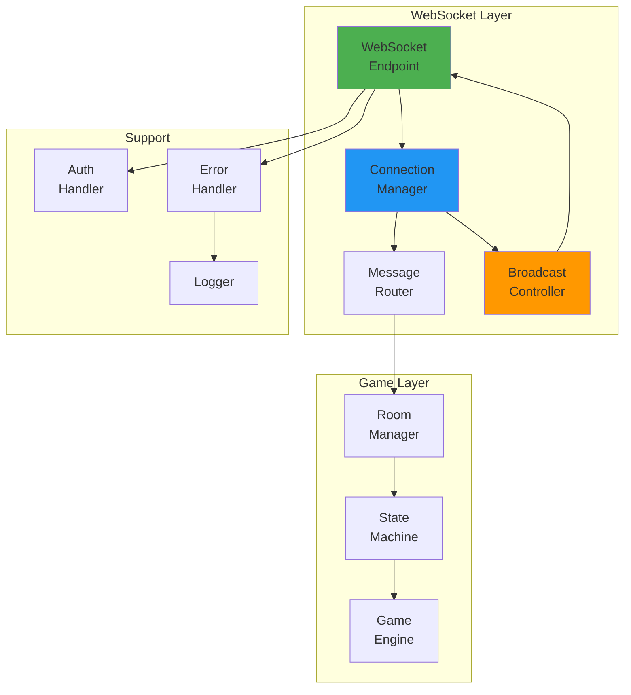

# WebSocket Handler Deep Dive - Backend Connection Management

## Table of Contents
1. [Overview](#overview)
2. [Architecture](#architecture)
3. [Connection Manager](#connection-manager)
4. [WebSocket Endpoints](#websocket-endpoints)
5. [Message Routing](#message-routing)
6. [Disconnection Handling](#disconnection-handling)
7. [Message Queuing](#message-queuing)
8. [Broadcasting System](#broadcasting-system)
9. [Rate Limiting](#rate-limiting)
10. [Testing WebSockets](#testing-websockets)

## Overview

The WebSocket Handler manages real-time bidirectional communication between the server and clients. It uses a combination of connection tracking, message queuing for disconnected players, and integration with the room manager and state machine.

### Design Principles

1. **Connection Tracking**: Track player connections with WebSocket IDs
2. **Graceful Disconnection**: 5-second grace period before bot takeover
3. **Message Queuing**: Queue messages for disconnected players
4. **Rate Limiting**: Prevent spam and abuse
5. **Event Store Integration**: Log all events for debugging

## Architecture

### Component Overview


```mermaid
graph TB
    subgraph "WebSocket Layer"
        WS[WebSocket<br/>Endpoint]
        CM[Connection<br/>Manager]
        MR[Message<br/>Router]
        BC[Broadcast<br/>Controller]
    end

    subgraph "Game Layer"
        RM[Room<br/>Manager]
        SM[State<br/>Machine]
        GE[Game<br/>Engine]
    end

    subgraph "Support"
        Auth[Auth<br/>Handler]
        Error[Error<br/>Handler]
        Log[Logger]
    end

    WS --> CM
    CM --> MR
    MR --> RM
    RM --> SM
    SM --> GE

    CM --> BC
    BC --> WS

    WS --> Auth
    WS --> Error
    Error --> Log

    style WS fill:#4CAF50
    style CM fill:#2196F3
    style BC fill:#FF9800
```

### File Structure

```
backend/api/
├── routes/
│   └── ws.py                    # Main WebSocket endpoint
├── websocket/
│   ├── connection_manager.py    # Player connection tracking
│   ├── message_queue.py         # Message queuing for disconnected players
│   └── migration_example.py     # Migration examples
├── middleware/
│   └── websocket_rate_limit.py # Rate limiting
└── validation.py                # Message validation

backend/
├── socket_manager.py            # Core WebSocket registry and broadcasting
└── shared_instances.py          # Shared room manager instance
```

## Connection Manager

### Core Implementation

```python
# backend/api/websocket/connection_manager.py
"""
Player Connection Tracking System

Manages player connection states, disconnection tracking, and reconnection windows.
Works alongside the existing SocketManager for WebSocket management.
"""

import asyncio
from datetime import datetime, timedelta
from typing import Dict, Optional, Set
from dataclasses import dataclass, field
from enum import Enum
import logging

logger = logging.getLogger(__name__)

class ConnectionStatus(Enum):
    """Player connection states"""
    CONNECTED = "connected"
    DISCONNECTED = "disconnected"
    RECONNECTING = "reconnecting"

@dataclass
class PlayerConnection:
    """Represents a player's connection state"""
    player_name: str
    room_id: str
    connection_status: ConnectionStatus = ConnectionStatus.CONNECTED
    disconnect_time: Optional[datetime] = None
    original_is_bot: bool = False
    websocket_id: Optional[str] = None  # To track specific connections

class ConnectionManager:
    """Manages player connections and disconnection tracking"""

    def __init__(self):
        # Track connections by room_id -> player_name -> PlayerConnection
        self.connections: Dict[str, Dict[str, PlayerConnection]] = {}
        # Track websocket to player mapping
        self.websocket_to_player: Dict[str, tuple[str, str]] = {}  # ws_id -> (room_id, player_name)
        # Lock for thread-safe operations
        self.lock = asyncio.Lock()
```

### Player Registration

```python
async def register_player(
    self, room_id: str, player_name: str, websocket_id: str
) -> None:
    """Register a player connection"""
    async with self.lock:
        if room_id not in self.connections:
            self.connections[room_id] = {}

        # Check if player was disconnected and reconnecting
        if player_name in self.connections[room_id]:
            connection = self.connections[room_id][player_name]
            if connection.connection_status == ConnectionStatus.DISCONNECTED:
                # Always allow reconnection (unlimited reconnection time)
                connection.connection_status = ConnectionStatus.CONNECTED
                connection.disconnect_time = None
                connection.websocket_id = websocket_id
                logger.info(f"Player {player_name} reconnected to room {room_id}")
        else:
            # New connection
            self.connections[room_id][player_name] = PlayerConnection(
                player_name=player_name,
                room_id=room_id,
                connection_status=ConnectionStatus.CONNECTED,
                websocket_id=websocket_id,
            )
            logger.info(f"Player {player_name} connected to room {room_id}")

        # Update websocket mapping
        self.websocket_to_player[websocket_id] = (room_id, player_name)
```

### Disconnection Handling

```python
async def handle_disconnect(self, websocket_id: str) -> Optional[PlayerConnection]:
    """Handle player disconnection"""
    async with self.lock:
        # Find player from websocket ID
        if websocket_id not in self.websocket_to_player:
            logger.warning(
                f"WebSocket ID {websocket_id} not found in mapping. "
                f"Current mappings: {list(self.websocket_to_player.keys())}"
            )
            return None

        room_id, player_name = self.websocket_to_player[websocket_id]

        # Remove websocket mapping
        del self.websocket_to_player[websocket_id]

        # Update connection state
        if room_id in self.connections and player_name in self.connections[room_id]:
            connection = self.connections[room_id][player_name]
            connection.connection_status = ConnectionStatus.DISCONNECTED
            connection.disconnect_time = datetime.now()
            connection.websocket_id = None

            logger.info(
                f"Player {player_name} disconnected from room {room_id} "
                f"at {connection.disconnect_time}"
            )

            return connection

        return None
```

## WebSocket Endpoints

### Main WebSocket Endpoint

```python
# backend/api/routes/ws.py
import asyncio
import logging
import uuid
import time
from typing import Optional

import backend.socket_manager
from backend.shared_instances import shared_room_manager
from backend.socket_manager import broadcast, register, unregister
from fastapi import APIRouter, WebSocket, WebSocketDisconnect

from backend.api.validation import validate_websocket_message
from backend.api.middleware.websocket_rate_limit import (
    check_websocket_rate_limit,
    send_rate_limit_error,
)
from backend.api.websocket.connection_manager import connection_manager
from backend.api.websocket.message_queue import message_queue_manager
from backend.shared_event_store import event_store

logger = logging.getLogger(__name__)
router = APIRouter()
room_manager = shared_room_manager

@router.websocket("/ws/{room_id}")
async def websocket_endpoint(websocket: WebSocket, room_id: str):
    """WebSocket endpoint for real-time game communication."""
    await websocket.accept()

    # Generate a unique ID for this websocket connection
    websocket_id = str(uuid.uuid4())
    setattr(websocket, "_ws_id", websocket_id)

    logger.info(f"WebSocket connected - room: {room_id}, ws_id: {websocket_id}")

    # Register websocket with SocketManager
    if room_id == "lobby":
        register(websocket, room_id)
    else:
        # For game rooms, registration happens after join_room
        pass

    try:
        while True:
            # Receive and validate message
            try:
                data = await websocket.receive_json()

                # Validate message structure
                if not validate_websocket_message(data):
                    await websocket.send_json({
                        "event": "error",
                        "data": {"error": "INVALID_MESSAGE_FORMAT"}
                    })
                    continue

                # Check rate limit
                if not await check_websocket_rate_limit(websocket_id):
                    await send_rate_limit_error(websocket)
                    continue

                # Route message based on event type
                await handle_websocket_message(
                    websocket, room_id, data, websocket_id
                )

            except ValueError as e:
                logger.error(f"Invalid message format: {e}")
                await websocket.send_json({
                    "event": "error",
                    "data": {"error": "INVALID_JSON"}
                })

    except WebSocketDisconnect:
        logger.info(f"WebSocket disconnected - room: {room_id}, ws_id: {websocket_id}")
    except Exception as e:
        logger.error(f"WebSocket error: {str(e)}", exc_info=True)
    finally:
        # Handle disconnect
        unregister(websocket, room_id)
        await handle_disconnect(room_id, websocket)
```

### Disconnect Handler

```python
async def handle_disconnect(room_id: str, websocket: WebSocket):
    """Handle player disconnection with bot activation"""
    try:
        # Generate a unique websocket ID for tracking
        websocket_id = getattr(websocket, "_ws_id", None)
        disconnect_time = time.time()

        logger.info(
            f"🔌 [ROOM_DEBUG] Handling disconnect for room '{room_id}', "
            f"websocket_id: {websocket_id} at {disconnect_time}"
        )

        # Get connection info
        connection = None
        if websocket_id:
            connection = await connection_manager.handle_disconnect(websocket_id)

        if connection and room_id != "lobby":
            room = await room_manager.get_room(room_id)
            if room and room.started:  # Only treat as in-game if game started!
                # This is an in-game disconnect
                logger.info(
                    f"🎮 [ROOM_DEBUG] In-game disconnect detected for player "
                    f"'{connection.player_name}' in room '{room_id}'"
                )
                if room.game:
                    # Find the player in the game
                    player = next(
                        (p for p in room.game.players if p.name == connection.player_name),
                        None,
                    )

                    if player and not player.is_bot:
                        # Store original state
                        player.original_is_bot = player.is_bot
                        player.original_avatar_color = getattr(player, "avatar_color", None)

                        # Mark as disconnected
                        player.is_connected = False
                        player.disconnect_time = connection.disconnect_time

                        # Schedule bot takeover after grace period (5 seconds)
                        from datetime import datetime, timedelta
                        player.pending_bot_takeover = datetime.now() + timedelta(seconds=5)
                        player.bot_takeover_scheduled = True

                        logger.info(
                            f"🕐 [GRACE_PERIOD] Player {connection.player_name} disconnected. "
                            f"Bot takeover scheduled in 5 seconds at {player.pending_bot_takeover}"
                        )

                        # Store disconnection event
                        await event_store.log_player_disconnected(
                            room_id=room_id,
                            player_name=connection.player_name,
                            disconnect_time=disconnect_time,
                            game_context={
                                "current_phase": room.game_state_machine.get_current_phase()
                                if room.game_state_machine else None,
                                "current_player": room.game_state_machine.get_phase_data().get(
                                    "current_player"
                                ) if room.game_state_machine else None,
                                "round_number": room.game.round_number if room.game else None,
                                "turn_number": room.game.turn_number if room.game else None,
                            }
                        )

                        # Notify other players
                        await broadcast_with_queue(
                            room_id,
                            "player_disconnected",
                            {
                                "player_name": connection.player_name,
                                "grace_period_seconds": 5,
                                "bot_takeover_at": player.pending_bot_takeover.isoformat(),
                            },
                        )

    except Exception as e:
        logger.error(f"Error handling disconnect: {e}", exc_info=True)
```

## Message Routing

The message routing is handled directly in the WebSocket endpoint rather than a separate router class:

```python
async def handle_websocket_message(
    websocket: WebSocket,
    room_id: str,
    message: dict,
    websocket_id: str
):
    """Route WebSocket message to appropriate handler"""
    event = message.get("event")
    data = message.get("data", {})

    # Get current player name from connection
    player_name = await get_current_player_name(websocket_id)

    # Route based on event type
    if room_id == "lobby":
        # Lobby-specific events
        if event == "create_room":
            await handle_create_room(websocket, data)
        elif event == "refresh_rooms":
            await handle_refresh_rooms(websocket)
        elif event == "join_room":
            await handle_join_room_from_lobby(websocket, data)
    else:
        # Game room events
        if event == "join_room":
            await handle_join_room(websocket, websocket_id, room_id, data)
        elif event == "start_game":
            await handle_start_game(room_id, player_name)
        elif event == "declare":
            await handle_declare(room_id, player_name, data)
        elif event == "play":
            await handle_play(room_id, player_name, data)
        elif event == "accept_redeal":
            await handle_accept_redeal(room_id, player_name)
        elif event == "decline_redeal":
            await handle_decline_redeal(room_id, player_name)
        elif event == "leave_room":
            await handle_leave_room(room_id, player_name)
```

### Message Handlers

```python
async def handle_join_room(
    websocket: WebSocket,
    websocket_id: str,
    room_id: str,
    data: dict
):
    """Handle player joining a room"""
    player_name = data.get("player_name")
    if not player_name:
        await websocket.send_json({
            "event": "error",
            "data": {"error": "MISSING_PLAYER_NAME"}
        })
        return

    # Register with connection manager
    await connection_manager.register_player(room_id, player_name, websocket_id)

    # Register with socket manager for broadcasting
    register(websocket, room_id)

    # Join room through room manager
    room = await room_manager.get_room(room_id)
    if not room:
        await websocket.send_json({
            "event": "error",
            "data": {"error": "ROOM_NOT_FOUND"}
        })
        return

    # Add player to room
    success = await room.add_player(player_name)
    if not success:
        await websocket.send_json({
            "event": "error",
            "data": {"error": "ROOM_FULL"}
        })
        return

    # Send room state to joining player
    await websocket.send_json({
        "event": "room_joined",
        "data": {
            "room_id": room_id,
            "players": await room.get_player_list(),
            "host": room.host,
            "started": room.started
        }
    })

    # Broadcast to other players
    await broadcast(
        room_id,
        "player_joined",
        {
            "player_name": player_name,
            "players": await room.get_player_list()
        }
    )
```
```

## Disconnection Handling

The WebSocket handler implements a sophisticated disconnection handling system with grace periods and bot takeover:

### Grace Period System

```python
# 5-second grace period before bot takeover
GRACE_PERIOD_SECONDS = 5

# Player disconnect tracking in Game class
class Player:
    def __init__(self, name, is_bot=False):
        self.name = name
        self.is_bot = is_bot
        self.is_connected = True
        self.disconnect_time = None
        self.pending_bot_takeover = None
        self.bot_takeover_scheduled = False
        self.original_is_bot = is_bot
        self.original_avatar_color = None
```

### Bot Takeover Process

1. **Disconnect Detection**: When a player disconnects, they're marked as disconnected but remain human
2. **Grace Period**: 5-second window for reconnection
3. **Bot Activation**: After grace period, bot takes over if player hasn't reconnected
4. **Reconnection**: Player can reconnect at any time and resume control

## Message Queuing

The system includes message queuing for disconnected players to ensure they don't miss important game events:

```python
# backend/api/websocket/message_queue.py
class MessageQueueManager:
    """Manages message queues for disconnected players"""

    def __init__(self):
        # room_id -> player_name -> List[QueuedMessage]
        self.queues: Dict[str, Dict[str, List[QueuedMessage]]] = {}
        self.lock = asyncio.Lock()
        self.max_queue_size = 100  # Per player
        self.max_queue_age = 300  # 5 minutes

    async def queue_message(
        self, room_id: str, player_name: str, event: str, data: dict
    ):
        """Queue a message for a disconnected player"""
        async with self.lock:
            if room_id not in self.queues:
                self.queues[room_id] = {}

            if player_name not in self.queues[room_id]:
                self.queues[room_id][player_name] = []

            queue = self.queues[room_id][player_name]

            # Add message to queue
            queued_message = QueuedMessage(
                event=event,
                data=data,
                timestamp=datetime.now(),
                sequence=len(queue)
            )

            queue.append(queued_message)

            # Trim queue if too large
            if len(queue) > self.max_queue_size:
                queue.pop(0)  # Remove oldest

    async def get_queued_messages(
        self, room_id: str, player_name: str
    ) -> List[dict]:
        """Get all queued messages for a player"""
        async with self.lock:
            if room_id in self.queues and player_name in self.queues[room_id]:
                messages = self.queues[room_id][player_name]
                # Clear the queue
                self.queues[room_id][player_name] = []

                # Convert to dict format
                return [
                    {
                        "event": msg.event,
                        "data": msg.data,
                        "timestamp": msg.timestamp.isoformat(),
                        "sequence": msg.sequence
                    }
                    for msg in messages
                ]

            return []
```

### Broadcasting with Queue Support

```python
async def broadcast_with_queue(room_id: str, event: str, data: dict):
    """Broadcast to room and queue messages for disconnected players"""
    # Get list of disconnected players in the room
    room = await room_manager.get_room(room_id)
    if room and room.game:
        disconnected_players = []
        for player in room.game.players:
            if player and hasattr(player, "is_connected") and not player.is_connected:
                disconnected_players.append(player.name)

        # Queue messages for disconnected players
        for player_name in disconnected_players:
            await message_queue_manager.queue_message(room_id, player_name, event, data)

    # Broadcast to connected players
    await broadcast(room_id, event, data)
```

## Broadcasting System

The broadcasting system uses the socket_manager module to handle room-based message distribution:

### Core Broadcasting

```python
# backend/socket_manager.py
import asyncio
from typing import Dict, List, Optional, Set
from fastapi import WebSocket
import logging

logger = logging.getLogger(__name__)

# Global registry of WebSocket connections by room
_connections: Dict[str, Set[WebSocket]] = {}
_lock = asyncio.Lock()

def register(websocket: WebSocket, room_id: str):
    """Register a WebSocket connection to a room."""
    if room_id not in _connections:
        _connections[room_id] = set()
    _connections[room_id].add(websocket)
    logger.info(f"WebSocket registered to room {room_id}. Total connections: {len(_connections[room_id])}")

def unregister(websocket: WebSocket, room_id: str):
    """Remove a WebSocket connection from a room."""
    if room_id in _connections:
        _connections[room_id].discard(websocket)
        if not _connections[room_id]:
            del _connections[room_id]
        logger.info(f"WebSocket unregistered from room {room_id}")

async def broadcast(room_id: str, event: str, data: dict, exclude: Optional[List[WebSocket]] = None):
    """Broadcast a message to all connections in a room."""
    if room_id not in _connections:
        logger.warning(f"No connections for room {room_id}")
        return

    exclude_set = set(exclude or [])
    message = {
        "event": event,
        "data": data
    }

    # Send to all connections in the room
    disconnected = []
    for websocket in _connections[room_id]:
        if websocket in exclude_set:
            continue

        try:
            await websocket.send_json(message)
        except Exception as e:
            logger.error(f"Error broadcasting to websocket: {e}")
            disconnected.append(websocket)

    # Clean up disconnected sockets
    for ws in disconnected:
        unregister(ws, room_id)
```

## Rate Limiting

The WebSocket handler includes rate limiting to prevent spam and abuse:

```python
# backend/api/middleware/websocket_rate_limit.py
import time
from typing import Dict
import asyncio

class WebSocketRateLimiter:
    """Rate limiting for WebSocket connections."""

    def __init__(self, max_messages_per_minute: int = 60):
        self.max_messages_per_minute = max_messages_per_minute
        self.connection_buckets: Dict[str, list] = {}
        self.lock = asyncio.Lock()

    async def check_rate_limit(self, websocket_id: str) -> bool:
        """Check if connection is within rate limit."""
        async with self.lock:
            current_time = time.time()

            # Initialize bucket if needed
            if websocket_id not in self.connection_buckets:
                self.connection_buckets[websocket_id] = []

            bucket = self.connection_buckets[websocket_id]

            # Remove old entries (older than 1 minute)
            bucket = [t for t in bucket if current_time - t < 60]

            # Check if within limit
            if len(bucket) >= self.max_messages_per_minute:
                return False

            # Add current request
            bucket.append(current_time)
            self.connection_buckets[websocket_id] = bucket

            return True

# Global rate limiter instance
rate_limiter = WebSocketRateLimiter()

async def check_websocket_rate_limit(websocket_id: str) -> bool:
    """Check if WebSocket connection is within rate limits."""
    return await rate_limiter.check_rate_limit(websocket_id)

async def send_rate_limit_error(websocket: WebSocket):
    """Send rate limit error to client."""
    await websocket.send_json({
        "event": "error",
        "data": {
            "error": "RATE_LIMITED",
            "message": "Too many messages. Please slow down."
        }
    })
```

## Testing WebSockets

### Testing with FastAPI TestClient

```python
import pytest
from fastapi.testclient import TestClient
from backend.main import app

def test_websocket_connection():
    """Test basic WebSocket connection."""
    client = TestClient(app)

    with client.websocket_connect("/ws/test-room") as websocket:
        # Send join room message
        websocket.send_json({
            "event": "join_room",
            "data": {"player_name": "TestPlayer"}
        })

        # Should receive room_joined response
        data = websocket.receive_json()
        assert data["event"] == "room_joined"
        assert data["data"]["room_id"] == "test-room"

def test_rate_limiting():
    """Test rate limiting functionality."""
    client = TestClient(app)

    with client.websocket_connect("/ws/test-room") as websocket:
        # Send many messages rapidly
        for i in range(100):
            websocket.send_json({
                "event": "test_event",
                "data": {"count": i}
            })

        # Eventually should receive rate limit error
        rate_limit_received = False
        for _ in range(100):
            data = websocket.receive_json()
            if data.get("event") == "error" and data["data"].get("error") == "RATE_LIMITED":
                rate_limit_received = True
                break

        assert rate_limit_received
```

### Testing Disconnection Handling

```python
@pytest.mark.asyncio
async def test_disconnection_grace_period():
    """Test the 5-second grace period before bot takeover."""
    # Create a room and start a game
    room_id = "test-room"
    player_name = "TestPlayer"

    # Simulate disconnect
    disconnect_time = time.time()

    # Player should remain human for 5 seconds
    await asyncio.sleep(3)
    # Check player is still human (not bot)

    # After 5 seconds, bot should take over
    await asyncio.sleep(3)
    # Check player is now bot
```

## Summary

The WebSocket Handler provides:

1. **Connection Tracking**: WebSocket ID-based player connection tracking
2. **Grace Period System**: 5-second grace period before bot takeover
3. **Message Queuing**: Queue messages for disconnected players
4. **Rate Limiting**: Prevent spam with configurable rate limits
5. **Event Store Integration**: All events logged for debugging
6. **Simple Broadcasting**: Room-based message distribution

Key implementation details:
- Uses socket_manager for WebSocket registry and broadcasting
- ConnectionManager tracks player connections and disconnection state
- Message queuing ensures disconnected players don't miss events
- Rate limiting prevents abuse
- Bot takeover after 5-second grace period for disconnected players
