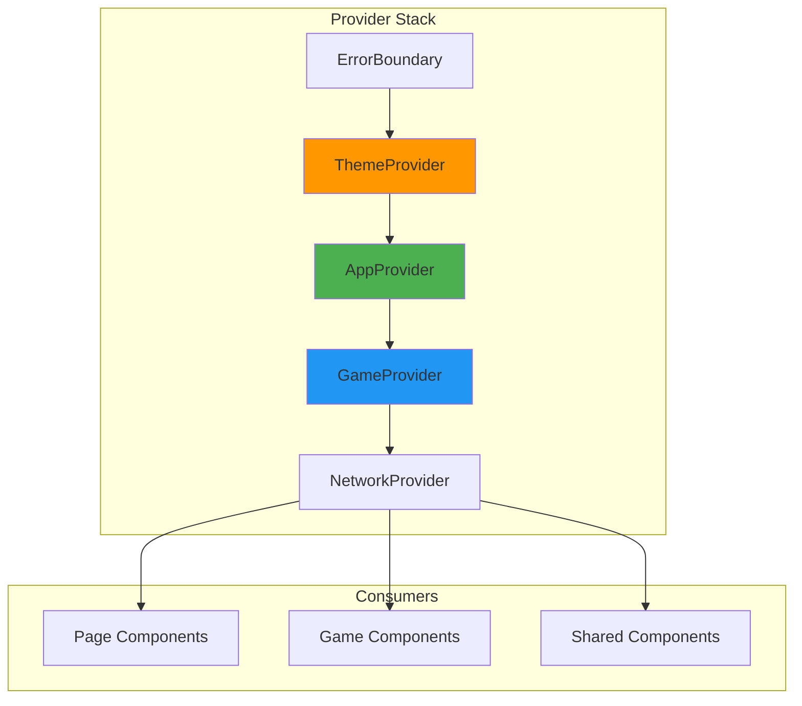

# Context System Deep Dive - State Management Architecture

## Table of Contents
1. [Overview](#overview)
2. [Context Architecture](#context-architecture)
3. [AppContext - Global Application State](#appcontext---global-application-state)
4. [GameContext - Game State Management](#gamecontext---game-state-management)
5. [ThemeContext - UI Theme Management](#themecontext---ui-theme-management)
6. [Context Integration Patterns](#context-integration-patterns)
7. [Performance Considerations](#performance-considerations)
8. [Testing Context](#testing-context)
9. [Best Practices](#best-practices)
10. [Common Patterns & Examples](#common-patterns--examples)

## Overview

The Liap Tui frontend uses React Context API for state management, avoiding the complexity of external state libraries while maintaining clean separation of concerns. This document explores how contexts work together to manage application state.

### Why Context API?

1. **Built-in**: No external dependencies
2. **Simple**: Easy to understand and debug
3. **Type-safe**: Full TypeScript support
4. **Sufficient**: Meets our state management needs
5. **Performance**: Good enough with proper optimization

### Context Philosophy

```
"Use Context for cross-cutting concerns, not everything"
```

We use Context for:
- ✅ User session data
- ✅ Game state
- ✅ Theme preferences
- ✅ Network connection status

We DON'T use Context for:
- ❌ Local UI state (use useState)
- ❌ Form data (keep it local)
- ❌ Temporary values

## Context Architecture

### Context Hierarchy



### Provider Organization

```jsx
// App.jsx - Provider hierarchy
const App = () => {
  return (
    <ErrorBoundary>
      <ThemeProvider>
        <AppProvider>
          <BrowserRouter>
            <AppWithProviders />
          </BrowserRouter>
        </AppProvider>
      </ThemeProvider>
    </ErrorBoundary>
  );
};

const AppWithProviders = () => {
  const { currentRoomId } = useApp();
  
  // Conditional providers based on app state
  if (currentRoomId) {
    return (
      <GameProvider roomId={currentRoomId}>
        <NetworkProvider roomId={currentRoomId}>
          <AppRouter />
        </NetworkProvider>
      </GameProvider>
    );
  }
  
  return <AppRouter />;
};
```

## AppContext - Global Application State

### Context Definition

```typescript
// contexts/AppContext.tsx
interface AppContextType {
  // Player data
  playerName: string | null;
  setPlayerName: (name: string) => void;
  
  // Room management
  currentRoomId: string | null;
  setCurrentRoomId: (roomId: string | null) => void;
  
  // Session management
  sessionId: string;
  isAuthenticated: boolean;
  
  // UI state
  isMobile: boolean;
  isLoading: boolean;
  setIsLoading: (loading: boolean) => void;
  
  // Error handling
  error: AppError | null;
  setError: (error: AppError | null) => void;
  clearError: () => void;
}

const AppContext = createContext<AppContextType | undefined>(undefined);
```

### AppProvider Implementation

```jsx
export const AppProvider: React.FC<{ children: ReactNode }> = ({ children }) => {
  // Persistent state (localStorage)
  const [playerName, setPlayerNameState] = useState<string | null>(() => {
    return localStorage.getItem('player-name');
  });
  
  // Session state
  const [currentRoomId, setCurrentRoomId] = useState<string | null>(null);
  const [sessionId] = useState(() => generateSessionId());
  
  // UI state
  const [isLoading, setIsLoading] = useState(false);
  const [error, setError] = useState<AppError | null>(null);
  
  // Derived state
  const isMobile = useMediaQuery('(max-width: 768px)');
  const isAuthenticated = !!playerName;
  
  // Enhanced setters with side effects
  const setPlayerName = useCallback((name: string) => {
    setPlayerNameState(name);
    localStorage.setItem('player-name', name);
    
    // Track user
    analytics.identify(sessionId, { playerName: name });
  }, [sessionId]);
  
  const clearError = useCallback(() => {
    setError(null);
  }, []);
  
  // Global error handler
  useEffect(() => {
    const handleError = (event: ErrorEvent) => {
      setError({
        code: 'GLOBAL_ERROR',
        message: event.message,
        timestamp: Date.now()
      });
    };
    
    window.addEventListener('error', handleError);
    return () => window.removeEventListener('error', handleError);
  }, []);
  
  const value = useMemo(() => ({
    playerName,
    setPlayerName,
    currentRoomId,
    setCurrentRoomId,
    sessionId,
    isAuthenticated,
    isMobile,
    isLoading,
    setIsLoading,
    error,
    setError,
    clearError
  }), [
    playerName,
    setPlayerName,
    currentRoomId,
    sessionId,
    isAuthenticated,
    isMobile,
    isLoading,
    error
  ]);
  
  return (
    <AppContext.Provider value={value}>
      {children}
    </AppContext.Provider>
  );
};
```

### Using AppContext

```jsx
// Custom hook for type safety
export const useApp = () => {
  const context = useContext(AppContext);
  if (!context) {
    throw new Error('useApp must be used within AppProvider');
  }
  return context;
};

// Usage in components
const Header = () => {
  const { playerName, isAuthenticated } = useApp();
  
  return (
    <header>
      {isAuthenticated ? (
        <span>Welcome, {playerName}!</span>
      ) : (
        <span>Please log in</span>
      )}
    </header>
  );
};
```

## GameContext - Game State Management

### Context Definition

```typescript
// contexts/GameContext.tsx
interface GameState {
  phase: GamePhase;
  roundNumber: number;
  turnNumber: number;
  players: Player[];
  myHand: Piece[];
  phaseData: any;
  scores: Record<string, number>;
}

interface GameContextType {
  // State
  gameState: GameState | null;
  isGameActive: boolean;
  
  // Player info
  myPlayer: Player | null;
  isMyTurn: boolean;
  
  // Actions
  playPieces: (pieceIds: string[]) => Promise<void>;
  declare: (pileCount: number) => Promise<void>;
  acceptRedeal: () => Promise<void>;
  declineRedeal: () => Promise<void>;
  
  // UI state
  selectedPieces: string[];
  setSelectedPieces: (pieces: string[]) => void;
  
  // Network state
  connectionStatus: 'connected' | 'disconnected' | 'reconnecting';
  lastError: GameError | null;
}
```

### GameProvider Implementation

```jsx
export const GameProvider: React.FC<{ roomId: string; children: ReactNode }> = ({ 
  roomId, 
  children 
}) => {
  const { playerName } = useApp();
  const networkService = useRef(NetworkService.getInstance());
  
  // Game state
  const [gameState, setGameState] = useState<GameState | null>(null);
  const [connectionStatus, setConnectionStatus] = useState<ConnectionStatus>('disconnected');
  const [lastError, setLastError] = useState<GameError | null>(null);
  
  // UI state
  const [selectedPieces, setSelectedPieces] = useState<string[]>([]);
  
  // Connect to game room
  useEffect(() => {
    const service = networkService.current;
    
    // Connect
    service.connectToRoom(roomId);
    
    // Event handlers
    const handlePhaseChange = (event: CustomEvent) => {
      const { phase, phase_data, game_state } = event.detail.data;
      
      setGameState(prev => ({
        ...prev,
        phase,
        phaseData: phase_data,
        ...game_state
      }));
    };
    
    const handleHandUpdate = (event: CustomEvent) => {
      const { pieces } = event.detail.data;
      
      setGameState(prev => ({
        ...prev!,
        myHand: pieces
      }));
    };
    
    const handleConnectionChange = (event: CustomEvent) => {
      setConnectionStatus(event.detail.status);
    };
    
    const handleError = (event: CustomEvent) => {
      setLastError({
        code: event.detail.code,
        message: event.detail.message,
        timestamp: Date.now()
      });
    };
    
    // Register listeners
    service.on('phase_change', handlePhaseChange);
    service.on('hand_updated', handleHandUpdate);
    service.on('connection_status', handleConnectionChange);
    service.on('error', handleError);
    
    // Cleanup
    return () => {
      service.off('phase_change', handlePhaseChange);
      service.off('hand_updated', handleHandUpdate);
      service.off('connection_status', handleConnectionChange);
      service.off('error', handleError);
      service.disconnect(roomId);
    };
  }, [roomId]);
  
  // Derived state
  const myPlayer = useMemo(() => {
    if (!gameState || !playerName) return null;
    return gameState.players.find(p => p.name === playerName) || null;
  }, [gameState, playerName]);
  
  const isMyTurn = useMemo(() => {
    if (!gameState || !myPlayer) return false;
    return gameState.phaseData?.current_player === myPlayer.name;
  }, [gameState, myPlayer]);
  
  const isGameActive = !!gameState && gameState.phase !== 'GAME_OVER';
  
  // Actions
  const playPieces = useCallback(async (pieceIds: string[]) => {
    if (!isMyTurn) {
      throw new Error('Not your turn');
    }
    
    await networkService.current.send(roomId, 'play', {
      player_name: playerName,
      piece_ids: pieceIds
    });
    
    // Clear selection after play
    setSelectedPieces([]);
  }, [roomId, playerName, isMyTurn]);
  
  const declare = useCallback(async (pileCount: number) => {
    await networkService.current.send(roomId, 'declare', {
      player_name: playerName,
      declaration: pileCount
    });
  }, [roomId, playerName]);
  
  const value = useMemo(() => ({
    gameState,
    isGameActive,
    myPlayer,
    isMyTurn,
    playPieces,
    declare,
    acceptRedeal: async () => {
      await networkService.current.send(roomId, 'accept_redeal', { 
        player_name: playerName 
      });
    },
    declineRedeal: async () => {
      await networkService.current.send(roomId, 'decline_redeal', { 
        player_name: playerName 
      });
    },
    selectedPieces,
    setSelectedPieces,
    connectionStatus,
    lastError
  }), [
    gameState,
    isGameActive,
    myPlayer,
    isMyTurn,
    playPieces,
    declare,
    selectedPieces,
    connectionStatus,
    lastError,
    roomId,
    playerName
  ]);
  
  return (
    <GameContext.Provider value={value}>
      {children}
    </GameContext.Provider>
  );
};
```

### Using GameContext

```jsx
// Custom hook
export const useGame = () => {
  const context = useContext(GameContext);
  if (!context) {
    throw new Error('useGame must be used within GameProvider');
  }
  return context;
};

// Usage in game components
const PlayerHand = () => {
  const { 
    gameState, 
    myPlayer, 
    isMyTurn,
    selectedPieces,
    setSelectedPieces,
    playPieces
  } = useGame();
  
  if (!gameState || !myPlayer) {
    return <div>Loading...</div>;
  }
  
  const handlePieceClick = (pieceId: string) => {
    if (!isMyTurn) return;
    
    setSelectedPieces(prev => 
      prev.includes(pieceId)
        ? prev.filter(id => id !== pieceId)
        : [...prev, pieceId]
    );
  };
  
  const handlePlay = async () => {
    try {
      await playPieces(selectedPieces);
    } catch (error) {
      console.error('Play failed:', error);
    }
  };
  
  return (
    <div className="player-hand">
      <div className="pieces">
        {gameState.myHand.map(piece => (
          <PieceCard
            key={piece.id}
            piece={piece}
            isSelected={selectedPieces.includes(piece.id)}
            onClick={() => handlePieceClick(piece.id)}
            disabled={!isMyTurn}
          />
        ))}
      </div>
      
      <Button
        onClick={handlePlay}
        disabled={!isMyTurn || selectedPieces.length === 0}
      >
        Play {selectedPieces.length} Pieces
      </Button>
    </div>
  );
};
```

## ThemeContext - UI Theme Management

### Context Definition

```typescript
// contexts/ThemeContext.tsx
type Theme = 'light' | 'dark' | 'system';

interface ThemeContextType {
  theme: Theme;
  setTheme: (theme: Theme) => void;
  effectiveTheme: 'light' | 'dark';
  toggleTheme: () => void;
}
```

### ThemeProvider Implementation

```jsx
export const ThemeProvider: React.FC<{ children: ReactNode }> = ({ children }) => {
  // Load saved theme
  const [theme, setThemeState] = useState<Theme>(() => {
    const saved = localStorage.getItem('theme') as Theme;
    return saved || 'system';
  });
  
  // System theme detection
  const prefersDark = useMediaQuery('(prefers-color-scheme: dark)');
  
  // Calculate effective theme
  const effectiveTheme = useMemo(() => {
    if (theme === 'system') {
      return prefersDark ? 'dark' : 'light';
    }
    return theme;
  }, [theme, prefersDark]);
  
  // Apply theme to document
  useEffect(() => {
    const root = document.documentElement;
    
    // Remove old theme
    root.classList.remove('theme-light', 'theme-dark');
    
    // Add new theme
    root.classList.add(`theme-${effectiveTheme}`);
    
    // Update meta theme-color
    const metaThemeColor = document.querySelector('meta[name="theme-color"]');
    if (metaThemeColor) {
      metaThemeColor.content = effectiveTheme === 'dark' ? '#1a1a1a' : '#ffffff';
    }
  }, [effectiveTheme]);
  
  // Enhanced setter
  const setTheme = useCallback((newTheme: Theme) => {
    setThemeState(newTheme);
    localStorage.setItem('theme', newTheme);
    
    // Track preference
    analytics.track('theme_changed', { theme: newTheme });
  }, []);
  
  const toggleTheme = useCallback(() => {
    setTheme(effectiveTheme === 'light' ? 'dark' : 'light');
  }, [effectiveTheme, setTheme]);
  
  const value = useMemo(() => ({
    theme,
    setTheme,
    effectiveTheme,
    toggleTheme
  }), [theme, setTheme, effectiveTheme, toggleTheme]);
  
  return (
    <ThemeContext.Provider value={value}>
      {children}
    </ThemeContext.Provider>
  );
};
```

### Theme Usage

```jsx
// Theme switcher component
const ThemeSwitcher = () => {
  const { theme, setTheme, effectiveTheme } = useTheme();
  
  return (
    <div className="theme-switcher">
      <button
        onClick={() => setTheme('light')}
        className={theme === 'light' ? 'active' : ''}
        aria-label="Light theme"
      >
        <SunIcon />
      </button>
      
      <button
        onClick={() => setTheme('dark')}
        className={theme === 'dark' ? 'active' : ''}
        aria-label="Dark theme"
      >
        <MoonIcon />
      </button>
      
      <button
        onClick={() => setTheme('system')}
        className={theme === 'system' ? 'active' : ''}
        aria-label="System theme"
      >
        <SystemIcon />
      </button>
    </div>
  );
};
```

## Context Integration Patterns

### 1. Context Composition

Combining multiple contexts:

```jsx
// Composed hook
export const useGameSession = () => {
  const app = useApp();
  const game = useGame();
  const theme = useTheme();
  
  return {
    // Combined state
    isReady: app.isAuthenticated && game.isGameActive,
    playerInfo: {
      name: app.playerName,
      isHost: game.myPlayer?.isHost,
      score: game.myPlayer?.score
    },
    
    // Combined actions
    leaveGame: async () => {
      await game.leaveGame();
      app.setCurrentRoomId(null);
    },
    
    // UI preferences
    isDarkMode: theme.effectiveTheme === 'dark'
  };
};
```

### 2. Context Selectors

Optimize re-renders with selectors:

```jsx
// Selector hook
export const useGamePhase = () => {
  const { gameState } = useGame();
  return gameState?.phase || null;
};

export const useMyScore = () => {
  const { gameState } = useGame();
  const { playerName } = useApp();
  
  return gameState?.scores?.[playerName!] || 0;
};

// Usage - only re-renders when phase changes
const PhaseIndicator = () => {
  const phase = useGamePhase();
  
  return <div>Current Phase: {phase}</div>;
};
```

### 3. Context Guards

Ensure context requirements:

```jsx
// Guard component
const RequireGame: React.FC<{ children: ReactNode }> = ({ children }) => {
  const { isGameActive } = useGame();
  const navigate = useNavigate();
  
  useEffect(() => {
    if (!isGameActive) {
      navigate('/lobby');
    }
  }, [isGameActive, navigate]);
  
  if (!isGameActive) {
    return <LoadingScreen />;
  }
  
  return <>{children}</>;
};

// Usage
<RequireGame>
  <GamePage />
</RequireGame>
```

## Performance Considerations

### 1. Context Splitting

Split contexts to minimize re-renders:

```jsx
// ❌ Bad: Everything in one context
const BigContext = createContext({
  user: {},
  theme: {},
  game: {},
  // ... everything
});

// ✅ Good: Separate contexts
const UserContext = createContext();
const ThemeContext = createContext();
const GameContext = createContext();
```

### 2. Memoization

Use memoization to prevent unnecessary re-renders:

```jsx
const GameProvider = ({ children }) => {
  const [gameState, setGameState] = useState(null);
  
  // ❌ Bad: New object every render
  const value = {
    gameState,
    updateGame: (data) => setGameState(data)
  };
  
  // ✅ Good: Memoized value
  const value = useMemo(() => ({
    gameState,
    updateGame: (data) => setGameState(data)
  }), [gameState]);
  
  return (
    <GameContext.Provider value={value}>
      {children}
    </GameContext.Provider>
  );
};
```

### 3. Lazy Initial State

Use lazy initial state for expensive computations:

```jsx
const AppProvider = ({ children }) => {
  // ❌ Bad: Runs on every render
  const [state, setState] = useState(expensiveComputation());
  
  // ✅ Good: Runs only once
  const [state, setState] = useState(() => expensiveComputation());
};
```

## Testing Context

### Testing Providers

```jsx
// Test utilities
const renderWithProviders = (ui, { providerProps = {} } = {}) => {
  return render(
    <ThemeProvider>
      <AppProvider {...providerProps.app}>
        <GameProvider {...providerProps.game}>
          {ui}
        </GameProvider>
      </AppProvider>
    </ThemeProvider>
  );
};

// Test example
describe('GameContext', () => {
  it('provides game state to children', () => {
    const mockGameState = {
      phase: 'TURN',
      roundNumber: 1,
      players: []
    };
    
    const TestComponent = () => {
      const { gameState } = useGame();
      return <div>{gameState?.phase}</div>;
    };
    
    const { getByText } = renderWithProviders(
      <TestComponent />,
      {
        providerProps: {
          game: { initialState: mockGameState }
        }
      }
    );
    
    expect(getByText('TURN')).toBeInTheDocument();
  });
});
```

### Mocking Context

```jsx
// Mock context for isolated testing
const mockGameContext = {
  gameState: { phase: 'TURN' },
  isMyTurn: true,
  playPieces: jest.fn(),
  selectedPieces: [],
  setSelectedPieces: jest.fn()
};

jest.mock('../contexts/GameContext', () => ({
  useGame: () => mockGameContext
}));
```

## Best Practices

### 1. Context Boundaries

Define clear boundaries:

```jsx
// ✅ Good: Clear purpose
- AppContext: Global app state (user, session)
- GameContext: Game-specific state
- ThemeContext: UI preferences

// ❌ Bad: Mixed concerns
- GlobalContext: Everything mixed together
```

### 2. Default Values

Provide meaningful defaults:

```jsx
// ✅ Good: Type-safe defaults
const GameContext = createContext<GameContextType>({
  gameState: null,
  isGameActive: false,
  isMyTurn: false,
  playPieces: async () => {
    throw new Error('GameContext not initialized');
  },
  // ... other defaults
});

// ❌ Bad: Undefined context
const GameContext = createContext();
```

### 3. Error Boundaries

Use error boundaries with context:

```jsx
const ContextErrorBoundary = ({ children }) => {
  return (
    <ErrorBoundary
      fallback={<ErrorScreen />}
      onError={(error) => {
        console.error('Context error:', error);
      }}
    >
      {children}
    </ErrorBoundary>
  );
};
```

## Common Patterns & Examples

### 1. Persistent Context State

```jsx
// Persist context state to localStorage
const usePersistentState = <T,>(
  key: string,
  defaultValue: T
): [T, (value: T) => void] => {
  const [state, setState] = useState<T>(() => {
    const saved = localStorage.getItem(key);
    return saved ? JSON.parse(saved) : defaultValue;
  });
  
  const setPersistentState = useCallback((value: T) => {
    setState(value);
    localStorage.setItem(key, JSON.stringify(value));
  }, [key]);
  
  return [state, setPersistentState];
};

// Usage in context
const AppProvider = ({ children }) => {
  const [settings, setSettings] = usePersistentState('app-settings', {
    soundEnabled: true,
    notifications: true
  });
};
```

### 2. Context with Reducer

```jsx
// For complex state logic
const gameReducer = (state: GameState, action: GameAction): GameState => {
  switch (action.type) {
    case 'PHASE_CHANGED':
      return { ...state, phase: action.payload.phase };
      
    case 'PIECES_PLAYED':
      return {
        ...state,
        myHand: state.myHand.filter(
          p => !action.payload.pieceIds.includes(p.id)
        )
      };
      
    default:
      return state;
  }
};

const GameProvider = ({ children }) => {
  const [state, dispatch] = useReducer(gameReducer, initialGameState);
  
  // Actions
  const actions = useMemo(() => ({
    updatePhase: (phase: GamePhase) => {
      dispatch({ type: 'PHASE_CHANGED', payload: { phase } });
    },
    playPieces: (pieceIds: string[]) => {
      dispatch({ type: 'PIECES_PLAYED', payload: { pieceIds } });
    }
  }), []);
  
  return (
    <GameContext.Provider value={{ ...state, ...actions }}>
      {children}
    </GameContext.Provider>
  );
};
```

### 3. Dynamic Context

```jsx
// Context that adapts based on conditions
const DynamicGameProvider = ({ roomId, children }) => {
  const [isSpectator, setIsSpectator] = useState(false);
  
  // Different context based on role
  if (isSpectator) {
    return (
      <SpectatorGameContext.Provider value={spectatorValue}>
        {children}
      </SpectatorGameContext.Provider>
    );
  }
  
  return (
    <PlayerGameContext.Provider value={playerValue}>
      {children}
    </PlayerGameContext.Provider>
  );
};
```

## Summary

The Context system provides:

1. **Clean State Management**: Organized, type-safe state
2. **Performance**: Optimized with proper patterns
3. **Developer Experience**: Easy to use and test
4. **Flexibility**: Composable and extensible
5. **Maintainability**: Clear separation of concerns

This architecture scales from simple theme preferences to complex game state while maintaining clarity and performance.