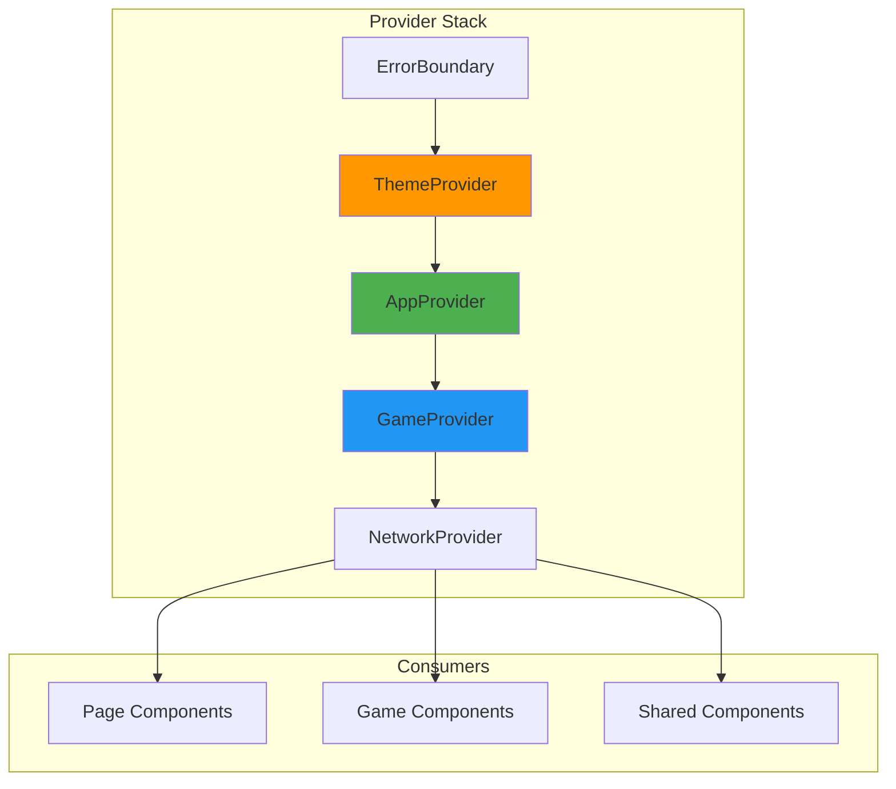

# Context System Deep Dive - State Management Architecture

## Table of Contents
1. [Overview](#overview)
2. [Context Architecture](#context-architecture)
3. [AppContext - Global Application State](#appcontext---global-application-state)
4. [GameContext - Game State Management](#gamecontext---game-state-management)
5. [ThemeContext - UI Theme Management](#themecontext---ui-theme-management)
6. [Context Integration Patterns](#context-integration-patterns)
7. [Performance Considerations](#performance-considerations)
8. [Testing Context](#testing-context)
9. [Best Practices](#best-practices)
10. [Common Patterns & Examples](#common-patterns--examples)

## Overview

The Liap Tui frontend uses React Context API for state management, avoiding the complexity of external state libraries while maintaining clean separation of concerns. This document explores how contexts work together to manage application state.

### Why Context API?

1. **Built-in**: No external dependencies
2. **Simple**: Easy to understand and debug
3. **JavaScript-native**: Works seamlessly with React's JSX
4. **Sufficient**: Meets our state management needs
5. **Performance**: Good enough with proper optimization

### Context Philosophy

```
"Use Context for cross-cutting concerns, not everything"
```

We use Context for:
- ✅ User session data
- ✅ Game state
- ✅ Theme preferences
- ✅ Network connection status

We DON'T use Context for:
- ❌ Local UI state (use useState)
- ❌ Form data (keep it local)
- ❌ Temporary values

## Context Architecture

### Context Hierarchy


```mermaid
graph TB
    subgraph "Provider Stack"
        Error[ErrorBoundary]
        Theme[ThemeProvider]
        App[AppProvider]
        Game[GameProvider]
        Network[NetworkProvider]
    end

    subgraph "Consumers"
        Pages[Page Components]
        GameComp[Game Components]
        Shared[Shared Components]
    end

    Error --> Theme
    Theme --> App
    App --> Game
    Game --> Network

    Network --> Pages
    Network --> GameComp
    Network --> Shared

    style App fill:#4CAF50
    style Game fill:#2196F3
    style Theme fill:#FF9800
```

### Provider Organization

```jsx
// App.jsx - Provider hierarchy
const App = () => {
  return (
    <ErrorBoundary>
      <ThemeProvider>
        <AppProvider>
          <BrowserRouter>
            <AppWithProviders />
          </BrowserRouter>
        </AppProvider>
      </ThemeProvider>
    </ErrorBoundary>
  );
};

const AppWithProviders = () => {
  const { currentRoomId } = useApp();

  // Conditional providers based on app state
  if (currentRoomId) {
    return (
      <GameProvider roomId={currentRoomId}>
        <NetworkProvider roomId={currentRoomId}>
          <AppRouter />
        </NetworkProvider>
      </GameProvider>
    );
  }

  return <AppRouter />;
};
```

## AppContext - Global Application State

### Context Definition

```jsx
// contexts/AppContext.jsx
// Note: This project uses JavaScript, not TypeScript

const AppContext = createContext(null);

// The context provides these values:
// - currentScene: Current application scene ('start', 'lobby', 'room', 'game')
// - playerName: Player's name
// - currentRoomId: Current room ID (if in a room)
// - isTransitioning: Whether a scene transition is happening
// - appError: Any application-level error
// - Navigation methods: navigateToScene, goToStart, goToLobby, goToRoom, goToGame
// - Player management: updatePlayerName
// - Room management: joinRoom, leaveRoom
// - Utilities: clearError, canNavigateToScene
```

### AppProvider Implementation

```jsx
export const AppProvider = ({ children }) => {
  // Scene navigation state
  const [currentScene, setCurrentScene] = useState('start');
  const [playerName, setPlayerName] = useState('');
  const [currentRoomId, setCurrentRoomId] = useState(null);
  const [isTransitioning, setIsTransitioning] = useState(false);
  const [appError, setAppError] = useState(null);

  // Load persisted data on mount
  useEffect(() => {
    const savedPlayerName = localStorage.getItem('playerName');
    if (savedPlayerName) {
      setPlayerName(savedPlayerName);
    }

    const savedRoomId = localStorage.getItem('currentRoomId');
    if (savedRoomId) {
      setCurrentRoomId(savedRoomId);
    }
  }, []);

  // Persist player name
  useEffect(() => {
    if (playerName) {
      localStorage.setItem('playerName', playerName);
    } else {
      localStorage.removeItem('playerName');
    }
  }, [playerName]);

  // Persist room ID
  useEffect(() => {
    if (currentRoomId) {
      localStorage.setItem('currentRoomId', currentRoomId);
    } else {
      localStorage.removeItem('currentRoomId');
    }
  }, [currentRoomId]);

  // Scene navigation with validation
  const navigateToScene = async (sceneName, options = {}) => {
    setIsTransitioning(true);
    setAppError(null);

    try {
      // Scene-specific validation
      switch (sceneName) {
        case 'start':
          setCurrentRoomId(null);
          break;
        case 'lobby':
          if (!playerName) {
            throw new Error('Player name required for lobby');
          }
          break;
        case 'room':
          if (!playerName || !options.roomId) {
            throw new Error('Player name and room ID required for room');
          }
          setCurrentRoomId(options.roomId);
          break;
        case 'game':
          if (!playerName || !currentRoomId) {
            throw new Error('Player name and room ID required for game');
          }
          break;
        default:
          throw new Error(`Unknown scene: ${sceneName}`);
      }

      setCurrentScene(sceneName);
    } catch (error) {
      console.error('Scene navigation failed:', error);
      setAppError(error);
    } finally {
      setIsTransitioning(false);
    }
  };

  // Player name validation
  const updatePlayerName = (name) => {
    const trimmedName = name.trim();
    if (trimmedName.length < 2) {
      throw new Error('Player name must be at least 2 characters');
    }
    if (trimmedName.length > 20) {
      throw new Error('Player name must be less than 20 characters');
    }
    setPlayerName(trimmedName);
  };

  const value = {
    // Current state
    currentScene,
    playerName,
    currentRoomId,
    isTransitioning,
    appError,

    // Navigation
    navigateToScene,
    goToStart: () => navigateToScene('start'),
    goToLobby: () => navigateToScene('lobby'),
    goToRoom: (roomId) => navigateToScene('room', { roomId }),
    goToGame: () => navigateToScene('game'),

    // Player management
    updatePlayerName,

    // Room management
    joinRoom: async (roomId) => {
      if (!playerName) {
        throw new Error('Player name required to join room');
      }
      await navigateToScene('room', { roomId });
    },
    leaveRoom: () => {
      setCurrentRoomId(null);
      navigateToScene('lobby');
    },

    // Utilities
    clearError: () => setAppError(null),
    canNavigateToScene: (sceneName) => {
      switch (sceneName) {
        case 'start': return true;
        case 'lobby': return !!playerName;
        case 'room': return !!playerName && !!currentRoomId;
        case 'game': return !!playerName && !!currentRoomId;
        default: return false;
      }
    }
  };

  return <AppContext.Provider value={value}>{children}</AppContext.Provider>;
};
```

### Using AppContext

```jsx
// Custom hook for type safety
export const useApp = () => {
  const context = useContext(AppContext);
  if (!context) {
    throw new Error('useApp must be used within AppProvider');
  }
  return context;
};

// Usage in components
const Header = () => {
  const { playerName, currentScene } = useApp();

  return (
    <header>
      {playerName ? (
        <span>Welcome, {playerName}! ({currentScene})</span>
      ) : (
        <span>Please enter your name</span>
      )}
    </header>
  );
};
```

## GameContext - Game State Management

### Context Definition

```jsx
// contexts/GameContext.jsx
// Simplified Phase 1-4 Enterprise Architecture Context

const GameContext = createContext(null);

// The context provides these values:
// - isInitialized: Whether the game context is ready
// - error: Any initialization error
// - playerName: Current player's name
// - roomId: Current room ID
// - gameState: State from Phase 1-4 services
// - currentPhase: Current game phase ('waiting', 'preparation', etc.)
// - isConnected: Network connection status
// - actions: Object with available actions (e.g., leaveGame)
// - Legacy compatibility: myHand, scores, isMyTurn
```

### GameProvider Implementation

```jsx
export const GameProvider = ({ children, roomId, playerName, initialData = {} }) => {
  const [isInitialized, setIsInitialized] = useState(false);
  const [error, setError] = useState(null);
  const [gameState, setGameState] = useState(null);

  // Initialize Phase 1-4 Enterprise Services
  useEffect(() => {
    const initializeGame = async () => {
      try {
        const health = getServicesHealth();

        if (health.overall.healthy && roomId && playerName) {
          console.log('🚀 GAME_CONTEXT: Phase 1-4 Enterprise Architecture initializing');

          // Subscribe to game service state changes
          const unsubscribe = gameService.addListener((state) => {
            setGameState(state);
          });

          // Get initial state
          setGameState(gameService.getState());
          setIsInitialized(true);

          return unsubscribe;
        } else {
          throw new Error('Phase 1-4 services not healthy or missing room/player data');
        }
      } catch (err) {
        console.error('Failed to initialize GameContext:', err);
        setError(err.message);
      }
    };

    if (roomId && playerName) {
      initializeGame();
    }
  }, [roomId, playerName]);

  // Provide simple context value focused on Phase 1-4 architecture
  const contextValue = {
    // Basic state
    isInitialized,
    error,
    playerName,
    roomId,

    // Game state from Phase 1-4 services
    gameState,

    // Current phase from game state
    currentPhase: gameState?.phase || 'waiting',

    // Connection status (from services)
    isConnected: getServicesHealth().network.healthy,

    // Simple action methods that delegate to services
    actions: {
      leaveGame: () => gameService.disconnect(),
    },

    // Legacy compatibility properties (simplified)
    myHand: gameState?.hand || [],
    scores: gameState?.scores || {},
    isMyTurn: gameState?.currentPlayer === playerName,
  };

  return (
    <GameContext.Provider value={contextValue}>{children}</GameContext.Provider>
  );
};
```

### Using GameContext

```jsx
// Custom hook
export const useGame = () => {
  const context = useContext(GameContext);
  if (!context) {
    throw new Error('useGame must be used within GameProvider');
  }
  return context;
};

// Usage in game components (simplified for Phase 1-4 architecture)
const PlayerInfo = () => {
  const {
    isInitialized,
    playerName,
    currentPhase,
    isMyTurn,
    myHand,
    scores
  } = useGame();

  if (!isInitialized) {
    return <div>Loading game...</div>;
  }

  return (
    <div className="player-info">
      <h3>{playerName}</h3>
      <p>Phase: {currentPhase}</p>
      <p>Turn: {isMyTurn ? 'Your turn!' : 'Waiting...'}</p>
      <p>Hand: {myHand.length} pieces</p>
      <p>Score: {scores[playerName] || 0}</p>
    </div>
  );
};
```

## ThemeContext - UI Theme Management

### Context Definition

```jsx
// contexts/ThemeContext.jsx

const ThemeContext = createContext();

// The context provides these values:
// - currentTheme: Current theme object with id, name, and colors
// - changeTheme: Function to change theme by ID
// - themes: Object with all available theme configurations
```

### ThemeProvider Implementation

```jsx
export function ThemeProvider({ children }) {
  const [currentTheme, setCurrentTheme] = useState(() => getTheme());

  useEffect(() => {
    // Apply theme colors on mount
    applyThemeColors(currentTheme);
  }, [currentTheme]);

  const changeTheme = (themeId) => {
    const theme = themes[themeId];
    if (!theme) {
      console.error(`Theme ${themeId} not found`);
      return;
    }

    // Update localStorage and apply colors
    setTheme(themeId);
    setCurrentTheme(theme);
  };

  const value = {
    currentTheme,
    changeTheme,
    themes,
  };

  return (
    <ThemeContext.Provider value={value}>{children}</ThemeContext.Provider>
  );
}
```

### Theme Usage

```jsx
// Theme usage
export const useTheme = () => {
  const context = useContext(ThemeContext);
  if (!context) {
    throw new Error('useTheme must be used within a ThemeProvider');
  }
  return context;
};

// Theme switcher component
const ThemeSwitcher = () => {
  const { currentTheme, changeTheme, themes } = useTheme();

  return (
    <div className="theme-switcher">
      <select
        value={currentTheme.id}
        onChange={(e) => changeTheme(e.target.value)}
      >
        {Object.entries(themes).map(([id, theme]) => (
          <option key={id} value={id}>
            {theme.name}
          </option>
        ))}
      </select>
    </div>
  );
};
```

## Context Integration Patterns

### 1. Context Composition

Combining multiple contexts:

```jsx
// Composed hook
export const useGameSession = () => {
  const app = useApp();
  const game = useGame();
  const theme = useTheme();

  return {
    // Combined state
    isReady: app.playerName && game.isInitialized,
    playerInfo: {
      name: app.playerName,
      score: game.scores[app.playerName] || 0,
      isMyTurn: game.isMyTurn
    },

    // Combined actions
    leaveGame: async () => {
      game.actions.leaveGame();
      app.leaveRoom();
    },

    // UI preferences
    themeId: theme.currentTheme.id
  };
};
```

### 2. Context Selectors

Optimize re-renders with selectors:

```jsx
// Selector hook
export const useGamePhase = () => {
  const { gameState } = useGame();
  return gameState?.phase || null;
};

export const useMyScore = () => {
  const { gameState } = useGame();
  const { playerName } = useApp();

  return gameState?.scores?.[playerName!] || 0;
};

// Usage - only re-renders when phase changes
const PhaseIndicator = () => {
  const phase = useGamePhase();

  return <div>Current Phase: {phase}</div>;
};
```

### 3. Context Guards

Ensure context requirements:

```jsx
// Guard component
const RequireGame = ({ children }) => {
  const { isInitialized } = useGame();
  const { navigateToScene } = useApp();

  useEffect(() => {
    if (!isInitialized) {
      navigateToScene('lobby');
    }
  }, [isInitialized, navigateToScene]);

  if (!isInitialized) {
    return <div>Loading game...</div>;
  }

  return children;
};

// Usage
<RequireGame>
  <GamePage />
</RequireGame>
```

## Performance Considerations

### 1. Context Splitting

Split contexts to minimize re-renders:

```jsx
// ❌ Bad: Everything in one context
const BigContext = createContext({
  user: {},
  theme: {},
  game: {},
  // ... everything
});

// ✅ Good: Separate contexts
const UserContext = createContext();
const ThemeContext = createContext();
const GameContext = createContext();
```

### 2. Memoization

Use memoization to prevent unnecessary re-renders:

```jsx
const GameProvider = ({ children }) => {
  const [gameState, setGameState] = useState(null);

  // ❌ Bad: New object every render
  const value = {
    gameState,
    updateGame: (data) => setGameState(data)
  };

  // ✅ Good: Memoized value
  const value = useMemo(() => ({
    gameState,
    updateGame: (data) => setGameState(data)
  }), [gameState]);

  return (
    <GameContext.Provider value={value}>
      {children}
    </GameContext.Provider>
  );
};
```

### 3. Lazy Initial State

Use lazy initial state for expensive computations:

```jsx
const AppProvider = ({ children }) => {
  // ❌ Bad: Runs on every render
  const [state, setState] = useState(expensiveComputation());

  // ✅ Good: Runs only once
  const [state, setState] = useState(() => expensiveComputation());
};
```

## Testing Context

### Testing Providers

```jsx
// Test utilities
const renderWithProviders = (ui, { providerProps = {} } = {}) => {
  return render(
    <ThemeProvider>
      <AppProvider {...providerProps.app}>
        <GameProvider {...providerProps.game}>
          {ui}
        </GameProvider>
      </AppProvider>
    </ThemeProvider>
  );
};

// Test example
describe('GameContext', () => {
  it('provides game state to children', () => {
    const mockGameState = {
      phase: 'TURN',
      roundNumber: 1,
      players: []
    };

    const TestComponent = () => {
      const { gameState } = useGame();
      return <div>{gameState?.phase}</div>;
    };

    const { getByText } = renderWithProviders(
      <TestComponent />,
      {
        providerProps: {
          game: { initialState: mockGameState }
        }
      }
    );

    expect(getByText('TURN')).toBeInTheDocument();
  });
});
```

### Mocking Context

```jsx
// Mock context for isolated testing
const mockGameContext = {
  gameState: { phase: 'TURN' },
  isMyTurn: true,
  playPieces: jest.fn(),
  selectedPieces: [],
  setSelectedPieces: jest.fn()
};

jest.mock('../contexts/GameContext', () => ({
  useGame: () => mockGameContext
}));
```

## Best Practices

### 1. Context Boundaries

Define clear boundaries:

```jsx
// ✅ Good: Clear purpose
- AppContext: Global app state (user, session)
- GameContext: Game-specific state
- ThemeContext: UI preferences

// ❌ Bad: Mixed concerns
- GlobalContext: Everything mixed together
```

### 2. Default Values

Provide meaningful defaults:

```jsx
// ✅ Good: Defaults with error handling
const GameContext = createContext({
  gameState: null,
  isInitialized: false,
  isMyTurn: false,
  actions: {
    leaveGame: () => {
      throw new Error('GameContext not initialized');
    }
  },
  // ... other defaults
});

// ❌ Bad: Undefined context
const GameContext = createContext();
```

### 3. Error Boundaries

Use error boundaries with context:

```jsx
const ContextErrorBoundary = ({ children }) => {
  return (
    <ErrorBoundary
      fallback={<ErrorScreen />}
      onError={(error) => {
        console.error('Context error:', error);
      }}
    >
      {children}
    </ErrorBoundary>
  );
};
```

## Common Patterns & Examples

### 1. Persistent Context State

```jsx
// Persist context state to localStorage
const usePersistentState = (key, defaultValue) => {
  const [state, setState] = useState(() => {
    const saved = localStorage.getItem(key);
    return saved ? JSON.parse(saved) : defaultValue;
  });

  const setPersistentState = useCallback((value) => {
    setState(value);
    localStorage.setItem(key, JSON.stringify(value));
  }, [key]);

  return [state, setPersistentState];
};

// Usage in context
const AppProvider = ({ children }) => {
  const [settings, setSettings] = usePersistentState('app-settings', {
    soundEnabled: true,
    notifications: true
  });

  // ... rest of provider
};
```

### 2. Context with Reducer

```jsx
// For complex state logic
const gameReducer = (state, action) => {
  switch (action.type) {
    case 'PHASE_CHANGED':
      return { ...state, phase: action.payload.phase };

    case 'HAND_UPDATED':
      return {
        ...state,
        myHand: action.payload.hand
      };

    case 'SCORE_UPDATED':
      return {
        ...state,
        scores: action.payload.scores
      };

    default:
      return state;
  }
};

const GameProvider = ({ children }) => {
  const [state, dispatch] = useReducer(gameReducer, initialGameState);

  // Actions
  const actions = useMemo(() => ({
    updatePhase: (phase) => {
      dispatch({ type: 'PHASE_CHANGED', payload: { phase } });
    },
    updateHand: (hand) => {
      dispatch({ type: 'HAND_UPDATED', payload: { hand } });
    },
    updateScores: (scores) => {
      dispatch({ type: 'SCORE_UPDATED', payload: { scores } });
    }
  }), []);

  return (
    <GameContext.Provider value={{ ...state, ...actions }}>
      {children}
    </GameContext.Provider>
  );
};
```

### 3. Dynamic Context

```jsx
// Context that adapts based on conditions
const DynamicGameProvider = ({ roomId, children }) => {
  const [isSpectator, setIsSpectator] = useState(false);

  // Different context based on role
  if (isSpectator) {
    return (
      <SpectatorGameContext.Provider value={spectatorValue}>
        {children}
      </SpectatorGameContext.Provider>
    );
  }

  return (
    <PlayerGameContext.Provider value={playerValue}>
      {children}
    </PlayerGameContext.Provider>
  );
};
```

## Summary

The Context system provides:

1. **Clean State Management**: Organized JavaScript state management
2. **Performance**: Optimized with proper patterns
3. **Developer Experience**: Easy to use and test
4. **Flexibility**: Composable and extensible
5. **Maintainability**: Clear separation of concerns

This JavaScript-based architecture scales from simple theme preferences to complex game state while maintaining clarity and performance.
