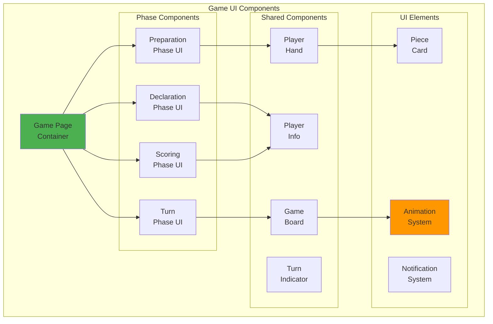

# Game UI Flow Deep Dive - Phase-Based UI Components

## Table of Contents
1. [Overview](#overview)
2. [UI Architecture](#ui-architecture)
3. [Phase Components](#phase-components)
4. [Animation System](#animation-system)
5. [User Interactions](#user-interactions)
6. [State Synchronization](#state-synchronization)
7. [Component Communication](#component-communication)
8. [Responsive Design](#responsive-design)
9. [Performance Optimization](#performance-optimization)
10. [Testing UI Components](#testing-ui-components)

## Overview

The Game UI Flow system manages the visual representation of game states and player interactions. It provides a smooth, intuitive interface for the Liap Tui game, handling everything from card animations to turn indicators.

### Design Principles

1. **Phase-Based Architecture**: UI components mirror game phases
2. **Smooth Transitions**: Seamless animations between states
3. **Real-Time Updates**: Instant reflection of game changes
4. **Intuitive Interactions**: Clear feedback for all actions
5. **Responsive Design**: Works on all screen sizes

## UI Architecture

### Component Hierarchy



### File Structure

```
frontend/src/
├── pages/
│   └── GamePage.tsx        # Main game container
├── phases/
│   ├── PreparationPhase.tsx
│   ├── DeclarationPhase.tsx
│   ├── TurnPhase.tsx
│   └── ScoringPhase.tsx
├── components/
│   ├── game/
│   │   ├── PlayerHand.tsx
│   │   ├── GameBoard.tsx
│   │   ├── PieceCard.tsx
│   │   └── TurnIndicator.tsx
│   └── ui/
│       ├── AnimatedCard.tsx
│       └── GameNotification.tsx
└── styles/
    └── game.css
```

## Phase Components

### Preparation Phase UI

```typescript
// frontend/src/phases/PreparationPhase.tsx
import React, { useState, useEffect } from 'react';
import { useGame } from '../hooks/useGame';
import { PlayerHand } from '../components/game/PlayerHand';
import { WeakHandDialog } from '../components/game/WeakHandDialog';
import { CountdownTimer } from '../components/ui/CountdownTimer';

interface PreparationPhaseProps {
    gameState: GameState;
    onAction: (action: GameAction) => void;
}

export const PreparationPhase: React.FC<PreparationPhaseProps> = ({
    gameState,
    onAction
}) => {
    const { currentPlayer, pieces } = useGame();
    const [showWeakHandDialog, setShowWeakHandDialog] = useState(false);
    const [dealAnimation, setDealAnimation] = useState(true);

    useEffect(() => {
        // Check for weak hand
        const hasWeakHand = gameState.phase_data.weak_hands?.includes(currentPlayer);
        if (hasWeakHand) {
            setShowWeakHandDialog(true);
        }
    }, [gameState.phase_data.weak_hands]);

    const handleWeakHandDecision = (accept: boolean) => {
        onAction({
            type: accept ? 'accept_redeal' : 'decline_redeal',
            data: { player_name: currentPlayer }
        });
        setShowWeakHandDialog(false);
    };

    return (
        <div className="preparation-phase">
            <div className="phase-header">
                <h2>Preparation Phase</h2>
                <p>Cards are being dealt...</p>
            </div>

            {/* Deal animation */}
            {dealAnimation && (
                <DealAnimation
                    onComplete={() => setDealAnimation(false)}
                    playerCount={4}
                    cardsPerPlayer={8}
                />
            )}

            {/* Player's hand */}
            {!dealAnimation && (
                <PlayerHand
                    pieces={pieces}
                    selectable={false}
                    animate="deal-in"
                />
            )}

            {/* Weak hand dialog */}
            {showWeakHandDialog && (
                <WeakHandDialog
                    onAccept={() => handleWeakHandDecision(true)}
                    onDecline={() => handleWeakHandDecision(false)}
                    currentMultiplier={gameState.phase_data.redeal_multiplier}
                />
            )}

            {/* Waiting for other players */}
            {gameState.phase_data.waiting_for_decisions && (
                <div className="waiting-indicator">
                    <p>Waiting for other players to decide...</p>
                    <PlayerDecisionStatus
                        decisions={gameState.phase_data.weak_hand_decisions}
                    />
                </div>
            )}
        </div>
    );
};

// Deal animation component
const DealAnimation: React.FC<{
    onComplete: () => void;
    playerCount: number;
    cardsPerPlayer: number;
}> = ({ onComplete, playerCount, cardsPerPlayer }) => {
    useEffect(() => {
        const totalCards = playerCount * cardsPerPlayer;
        const animationDuration = totalCards * 100; // 100ms per card

        const timer = setTimeout(onComplete, animationDuration);
        return () => clearTimeout(timer);
    }, []);

    return (
        <div className="deal-animation">
            <div className="deck-pile">
                {/* Animated cards flying to players */}
                {Array.from({ length: playerCount * cardsPerPlayer }).map((_, i) => (
                    <AnimatedCard
                        key={i}
                        delay={i * 100}
                        targetPlayer={i % playerCount}
                    />
                ))}
            </div>
        </div>
    );
};
```

### Declaration Phase UI

```typescript
// frontend/src/phases/DeclarationPhase.tsx
import React, { useState } from 'react';
import { useGame } from '../hooks/useGame';
import { DeclarationSelector } from '../components/game/DeclarationSelector';
import { PlayerDeclarations } from '../components/game/PlayerDeclarations';

export const DeclarationPhase: React.FC<DeclarationPhaseProps> = ({
    gameState,
    onAction
}) => {
    const { currentPlayer } = useGame();
    const [selectedValue, setSelectedValue] = useState<number | null>(null);
    const [hasSubmitted, setHasSubmitted] = useState(false);

    const handleDeclare = () => {
        if (selectedValue !== null) {
            onAction({
                type: 'declare',
                data: {
                    player_name: currentPlayer,
                    declaration: selectedValue
                }
            });
            setHasSubmitted(true);
        }
    };

    const myDeclaration = gameState.phase_data.declarations[currentPlayer];
    const waitingFor = gameState.phase_data.waiting_for || [];

    return (
        <div className="declaration-phase">
            <div className="phase-header">
                <h2>Declaration Phase</h2>
                <p>Declare how many piles you'll capture</p>
            </div>

            {/* Declaration UI */}
            {!hasSubmitted && myDeclaration === null && (
                <div className="declaration-section">
                    <DeclarationSelector
                        min={0}
                        max={8}
                        value={selectedValue}
                        onChange={setSelectedValue}
                        invalidValues={[]} // Server validates total != 8
                    />
                    
                    <button
                        className="declare-button"
                        onClick={handleDeclare}
                        disabled={selectedValue === null}
                    >
                        Declare {selectedValue} Piles
                    </button>

                    <DeclarationHints
                        playerHand={gameState.player_hand}
                        currentDeclarations={gameState.phase_data.declarations}
                    />
                </div>
            )}

            {/* Waiting state */}
            {(hasSubmitted || myDeclaration !== null) && (
                <div className="waiting-section">
                    <div className="my-declaration">
                        <h3>Your Declaration</h3>
                        <div className="declaration-value">{myDeclaration}</div>
                    </div>

                    <PlayerDeclarations
                        declarations={gameState.phase_data.declarations}
                        waitingFor={waitingFor}
                        animate={true}
                    />
                </div>
            )}

            {/* Timer */}
            <CountdownTimer
                endTime={gameState.phase_data.phase_start + 30}
                onExpire={() => {
                    if (!hasSubmitted) {
                        // Auto-declare 0 on timeout
                        handleDeclare();
                    }
                }}
            />
        </div>
    );
};

// Declaration hints component
const DeclarationHints: React.FC<{
    playerHand: Piece[];
    currentDeclarations: Record<string, number | null>;
}> = ({ playerHand, currentDeclarations }) => {
    // Calculate strategic hints
    const strongPieces = playerHand.filter(p => p.point >= 7).length;
    const pairs = calculatePairs(playerHand);
    
    return (
        <div className="declaration-hints">
            <h4>Strategy Tips:</h4>
            <ul>
                <li>You have {strongPieces} high-value pieces</li>
                <li>You can make {pairs} pairs or better</li>
                <li>Current total: {Object.values(currentDeclarations)
                    .filter(d => d !== null)
                    .reduce((sum, d) => sum + d!, 0)}</li>
            </ul>
        </div>
    );
};
```

### Turn Phase UI

```typescript
// frontend/src/phases/TurnPhase.tsx
import React, { useState, useEffect } from 'react';
import { useGame } from '../hooks/useGame';
import { PlayerHand } from '../components/game/PlayerHand';
import { GameBoard } from '../components/game/GameBoard';
import { TurnIndicator } from '../components/game/TurnIndicator';
import { PlayValidator } from '../utils/playValidator';

export const TurnPhase: React.FC<TurnPhaseProps> = ({
    gameState,
    onAction
}) => {
    const { currentPlayer, pieces } = useGame();
    const [selectedPieces, setSelectedPieces] = useState<string[]>([]);
    const [isMyTurn, setIsMyTurn] = useState(false);

    const phaseData = gameState.phase_data;
    const currentTurnPlayer = phaseData.current_player;
    const requiredCount = phaseData.required_piece_count;
    const currentPlays = phaseData.current_plays || {};

    useEffect(() => {
        setIsMyTurn(currentPlayer === currentTurnPlayer);
        if (!isMyTurn) {
            setSelectedPieces([]);
        }
    }, [currentTurnPlayer, currentPlayer]);

    const handlePieceClick = (pieceId: string) => {
        if (!isMyTurn) return;

        setSelectedPieces(prev => {
            if (prev.includes(pieceId)) {
                return prev.filter(id => id !== pieceId);
            }
            
            // Validate selection
            const newSelection = [...prev, pieceId];
            const selectedPieceObjects = pieces.filter(p => 
                newSelection.includes(p.id)
            );
            
            if (PlayValidator.isValidSelection(selectedPieceObjects, requiredCount)) {
                return newSelection;
            }
            
            return prev;
        });
    };

    const handlePlay = () => {
        if (selectedPieces.length === 0) {
            // Pass
            onAction({
                type: 'play',
                data: {
                    player_name: currentPlayer,
                    piece_ids: []
                }
            });
        } else {
            // Play pieces
            onAction({
                type: 'play',
                data: {
                    player_name: currentPlayer,
                    piece_ids: selectedPieces
                }
            });
        }
        setSelectedPieces([]);
    };

    const canPlay = isMyTurn && (
        selectedPieces.length === 0 || // Can pass
        selectedPieces.length === requiredCount // Correct count
    );

    return (
        <div className="turn-phase">
            <TurnIndicator
                currentPlayer={currentTurnPlayer}
                isMyTurn={isMyTurn}
                turnNumber={phaseData.turn_number}
            />

            {/* Game board showing current plays */}
            <GameBoard
                currentPlays={currentPlays}
                lastWinner={phaseData.last_winner}
                pileCount={phaseData.current_pile_count || 0}
            />

            {/* Required piece count indicator */}
            {requiredCount > 0 && (
                <div className="requirement-indicator">
                    <span className="requirement-label">Must play:</span>
                    <span className="requirement-count">{requiredCount} pieces</span>
                </div>
            )}

            {/* Player's hand */}
            <PlayerHand
                pieces={pieces}
                selectedIds={selectedPieces}
                onPieceClick={handlePieceClick}
                selectable={isMyTurn}
                highlightValid={isMyTurn}
                requiredCount={requiredCount}
            />

            {/* Action buttons */}
            {isMyTurn && (
                <div className="turn-actions">
                    <button
                        className="play-button"
                        onClick={handlePlay}
                        disabled={!canPlay}
                    >
                        {selectedPieces.length === 0 ? 'Pass' : `Play ${selectedPieces.length} Pieces`}
                    </button>
                    
                    {selectedPieces.length > 0 && (
                        <button
                            className="clear-button"
                            onClick={() => setSelectedPieces([])}
                        >
                            Clear Selection
                        </button>
                    )}
                </div>
            )}

            {/* Turn history */}
            <TurnHistory
                plays={phaseData.turn_history || []}
                currentTurn={phaseData.turn_number}
            />
        </div>
    );
};

// Game board component
const GameBoard: React.FC<{
    currentPlays: Record<string, Play>;
    lastWinner?: string;
    pileCount: number;
}> = ({ currentPlays, lastWinner, pileCount }) => {
    return (
        <div className="game-board">
            <div className="board-center">
                <div className="pile-indicator">
                    <span className="pile-count">{pileCount}</span>
                    <span className="pile-label">pieces in pile</span>
                </div>
                
                {lastWinner && (
                    <div className="last-winner">
                        {lastWinner} won last turn
                    </div>
                )}
            </div>

            <div className="player-plays">
                {Object.entries(currentPlays).map(([player, play]) => (
                    <PlayerPlayDisplay
                        key={player}
                        playerName={player}
                        play={play}
                        position={getPlayerPosition(player)}
                    />
                ))}
            </div>
        </div>
    );
};
```

### Scoring Phase UI

```typescript
// frontend/src/phases/ScoringPhase.tsx
import React, { useState, useEffect } from 'react';
import { useGame } from '../hooks/useGame';
import { ScoreBoard } from '../components/game/ScoreBoard';
import { RoundSummary } from '../components/game/RoundSummary';
import { GameOverDialog } from '../components/game/GameOverDialog';

export const ScoringPhase: React.FC<ScoringPhaseProps> = ({
    gameState,
    onAction
}) => {
    const [showAnimation, setShowAnimation] = useState(true);
    const scores = gameState.phase_data.scores || {};
    const gameOver = gameState.phase_data.game_over;
    const winners = gameState.phase_data.winners || [];

    useEffect(() => {
        // Animate score changes
        const timer = setTimeout(() => setShowAnimation(false), 3000);
        return () => clearTimeout(timer);
    }, []);

    return (
        <div className="scoring-phase">
            <div className="phase-header">
                <h2>Round {gameState.round_number} Complete</h2>
            </div>

            {/* Round summary */}
            <RoundSummary
                declarations={gameState.phase_data.round_declarations}
                captures={gameState.phase_data.round_captures}
                scores={scores}
                animate={showAnimation}
            />

            {/* Score board */}
            <ScoreBoard
                players={gameState.players}
                currentScores={scores}
                animate={showAnimation}
                highlightWinners={gameOver}
            />

            {/* Special bonuses */}
            {gameState.phase_data.special_bonuses && (
                <SpecialBonuses
                    bonuses={gameState.phase_data.special_bonuses}
                    animate={showAnimation}
                />
            )}

            {/* Game over */}
            {gameOver && (
                <GameOverDialog
                    winners={winners}
                    finalScores={gameState.players.reduce((acc, p) => {
                        acc[p.name] = p.score;
                        return acc;
                    }, {})}
                    rounds={gameState.round_number}
                    onClose={() => {
                        // Return to lobby
                        window.location.href = '/lobby';
                    }}
                />
            )}

            {/* Continue button */}
            {!gameOver && !showAnimation && (
                <button
                    className="continue-button"
                    onClick={() => onAction({ type: 'ready_for_next_round' })}
                >
                    Start Next Round
                </button>
            )}
        </div>
    );
};

// Score animation component
const ScoreAnimation: React.FC<{
    playerName: string;
    oldScore: number;
    newScore: number;
    change: number;
}> = ({ playerName, oldScore, newScore, change }) => {
    const [displayScore, setDisplayScore] = useState(oldScore);
    
    useEffect(() => {
        // Animate score change
        const duration = 1000;
        const steps = 30;
        const increment = change / steps;
        let current = oldScore;
        let step = 0;
        
        const interval = setInterval(() => {
            step++;
            current += increment;
            
            if (step >= steps) {
                setDisplayScore(newScore);
                clearInterval(interval);
            } else {
                setDisplayScore(Math.round(current));
            }
        }, duration / steps);
        
        return () => clearInterval(interval);
    }, [oldScore, newScore, change]);
    
    return (
        <div className="score-animation">
            <span className="player-name">{playerName}</span>
            <span className="score-value">{displayScore}</span>
            {change !== 0 && (
                <span className={`score-change ${change > 0 ? 'positive' : 'negative'}`}>
                    {change > 0 ? '+' : ''}{change}
                </span>
            )}
        </div>
    );
};
```

## Animation System

### Core Animation Framework

```typescript
// frontend/src/systems/AnimationSystem.ts
export class AnimationSystem {
    private animations: Map<string, Animation> = new Map();
    private rafId: number | null = null;
    
    constructor() {
        this.startAnimationLoop();
    }
    
    private startAnimationLoop() {
        const animate = (timestamp: number) => {
            this.updateAnimations(timestamp);
            this.rafId = requestAnimationFrame(animate);
        };
        this.rafId = requestAnimationFrame(animate);
    }
    
    public addAnimation(id: string, animation: Animation) {
        this.animations.set(id, animation);
    }
    
    public removeAnimation(id: string) {
        this.animations.delete(id);
    }
    
    private updateAnimations(timestamp: number) {
        for (const [id, animation] of this.animations) {
            if (animation.update(timestamp)) {
                // Animation complete
                this.animations.delete(id);
                animation.onComplete?.();
            }
        }
    }
}

// Animation types
interface Animation {
    startTime: number;
    duration: number;
    easing: EasingFunction;
    update: (timestamp: number) => boolean; // Returns true when complete
    onComplete?: () => void;
}

// Card animation
export class CardAnimation implements Animation {
    startTime: number;
    duration: number = 500;
    easing = Easing.easeOutCubic;
    
    constructor(
        private element: HTMLElement,
        private from: Position,
        private to: Position
    ) {
        this.startTime = performance.now();
    }
    
    update(timestamp: number): boolean {
        const elapsed = timestamp - this.startTime;
        const progress = Math.min(elapsed / this.duration, 1);
        const easedProgress = this.easing(progress);
        
        const x = this.from.x + (this.to.x - this.from.x) * easedProgress;
        const y = this.from.y + (this.to.y - this.from.y) * easedProgress;
        
        this.element.style.transform = `translate(${x}px, ${y}px)`;
        
        return progress >= 1;
    }
}
```

### React Animation Hooks

```typescript
// frontend/src/hooks/useAnimation.ts
export const useAnimation = <T extends HTMLElement>() => {
    const elementRef = useRef<T>(null);
    const animationRef = useRef<AnimationSystem | null>(null);
    
    useEffect(() => {
        animationRef.current = new AnimationSystem();
        
        return () => {
            if (animationRef.current) {
                animationRef.current.destroy();
            }
        };
    }, []);
    
    const animateCard = useCallback((
        from: Position,
        to: Position,
        duration = 500
    ) => {
        if (!elementRef.current || !animationRef.current) return;
        
        const animation = new CardAnimation(
            elementRef.current,
            from,
            to
        );
        
        animationRef.current.addAnimation(
            `card-${Date.now()}`,
            animation
        );
    }, []);
    
    const animateScale = useCallback((
        from: number,
        to: number,
        duration = 300
    ) => {
        if (!elementRef.current) return;
        
        const element = elementRef.current;
        element.style.transform = `scale(${from})`;
        
        requestAnimationFrame(() => {
            element.style.transition = `transform ${duration}ms ease-out`;
            element.style.transform = `scale(${to})`;
        });
    }, []);
    
    return {
        elementRef,
        animateCard,
        animateScale
    };
};
```

## User Interactions

### Touch and Click Handling

```typescript
// frontend/src/components/game/PieceCard.tsx
export const PieceCard: React.FC<PieceCardProps> = ({
    piece,
    selected,
    selectable,
    onClick,
    highlight
}) => {
    const [isPressed, setIsPressed] = useState(false);
    const { elementRef, animateScale } = useAnimation<HTMLDivElement>();
    
    const handlePointerDown = (e: React.PointerEvent) => {
        if (!selectable) return;
        
        setIsPressed(true);
        animateScale(1, 0.95);
        
        // Prevent text selection
        e.preventDefault();
    };
    
    const handlePointerUp = () => {
        if (!selectable || !isPressed) return;
        
        setIsPressed(false);
        animateScale(0.95, 1);
        onClick?.(piece.id);
    };
    
    const handlePointerLeave = () => {
        if (isPressed) {
            setIsPressed(false);
            animateScale(0.95, 1);
        }
    };
    
    return (
        <div
            ref={elementRef}
            className={clsx('piece-card', {
                'selected': selected,
                'selectable': selectable,
                'highlight': highlight,
                'pressed': isPressed
            })}
            onPointerDown={handlePointerDown}
            onPointerUp={handlePointerUp}
            onPointerLeave={handlePointerLeave}
            role="button"
            tabIndex={selectable ? 0 : -1}
            aria-pressed={selected}
            aria-label={`${piece.rank} ${piece.color} piece`}
        >
            <div className="piece-rank">{getPieceSymbol(piece)}</div>
            <div className="piece-points">{piece.point}</div>
            {selected && <div className="selection-indicator" />}
        </div>
    );
};
```

### Drag and Drop Support

```typescript
// frontend/src/hooks/useDragDrop.ts
export const useDragDrop = (
    onDrop: (draggedId: string, targetId: string) => void
) => {
    const [draggedItem, setDraggedItem] = useState<string | null>(null);
    const [dragOffset, setDragOffset] = useState({ x: 0, y: 0 });
    
    const handleDragStart = useCallback((
        e: React.DragEvent,
        itemId: string
    ) => {
        setDraggedItem(itemId);
        
        // Calculate offset
        const rect = e.currentTarget.getBoundingClientRect();
        setDragOffset({
            x: e.clientX - rect.left,
            y: e.clientY - rect.top
        });
        
        // Set drag image
        if (e.dataTransfer) {
            e.dataTransfer.effectAllowed = 'move';
            e.dataTransfer.setData('text/plain', itemId);
            
            // Create custom drag image
            const dragImage = e.currentTarget.cloneNode(true) as HTMLElement;
            dragImage.style.transform = 'rotate(-5deg)';
            document.body.appendChild(dragImage);
            e.dataTransfer.setDragImage(dragImage, dragOffset.x, dragOffset.y);
            
            setTimeout(() => document.body.removeChild(dragImage), 0);
        }
    }, [dragOffset]);
    
    const handleDragEnd = useCallback(() => {
        setDraggedItem(null);
    }, []);
    
    const handleDragOver = useCallback((e: React.DragEvent) => {
        e.preventDefault();
        if (e.dataTransfer) {
            e.dataTransfer.dropEffect = 'move';
        }
    }, []);
    
    const handleDrop = useCallback((
        e: React.DragEvent,
        targetId: string
    ) => {
        e.preventDefault();
        
        const draggedId = e.dataTransfer?.getData('text/plain');
        if (draggedId && draggedId !== targetId) {
            onDrop(draggedId, targetId);
        }
        
        setDraggedItem(null);
    }, [onDrop]);
    
    return {
        draggedItem,
        handleDragStart,
        handleDragEnd,
        handleDragOver,
        handleDrop
    };
};
```

## State Synchronization

### Real-Time Updates

```typescript
// frontend/src/hooks/useGameSync.ts
export const useGameSync = () => {
    const { gameState, updateGameState } = useGame();
    const networkService = useRef(NetworkService.getInstance());
    
    useEffect(() => {
        const handlePhaseChange = (event: CustomEvent) => {
            const { phase, phase_data, game_state } = event.detail.data;
            
            updateGameState({
                phase,
                phase_data,
                ...game_state
            });
            
            // Trigger phase transition animation
            triggerPhaseTransition(phase);
        };
        
        const handlePlayerAction = (event: CustomEvent) => {
            const { player, action, details } = event.detail.data;
            
            // Update local state optimistically
            updateGameState(state => ({
                ...state,
                lastAction: { player, action, details }
            }));
            
            // Show action notification
            showActionNotification(player, action);
        };
        
        const handleHandUpdate = (event: CustomEvent) => {
            const { pieces } = event.detail.data;
            updateGameState(state => ({
                ...state,
                playerHand: pieces
            }));
        };
        
        // Register listeners
        const service = networkService.current;
        service.addEventListener('phase_change', handlePhaseChange);
        service.addEventListener('player_action', handlePlayerAction);
        service.addEventListener('hand_updated', handleHandUpdate);
        
        return () => {
            service.removeEventListener('phase_change', handlePhaseChange);
            service.removeEventListener('player_action', handlePlayerAction);
            service.removeEventListener('hand_updated', handleHandUpdate);
        };
    }, [updateGameState]);
    
    return gameState;
};
```

### Optimistic Updates

```typescript
// frontend/src/utils/optimisticUpdates.ts
export class OptimisticUpdateManager {
    private pendingUpdates: Map<string, PendingUpdate> = new Map();
    
    applyOptimisticUpdate<T>(
        id: string,
        currentState: T,
        update: Partial<T>,
        rollbackTimeout = 5000
    ): T {
        // Store original state for rollback
        this.pendingUpdates.set(id, {
            originalState: currentState,
            timestamp: Date.now(),
            timeout: setTimeout(() => {
                this.rollback(id);
            }, rollbackTimeout)
        });
        
        // Apply update
        return { ...currentState, ...update };
    }
    
    confirmUpdate(id: string) {
        const pending = this.pendingUpdates.get(id);
        if (pending) {
            clearTimeout(pending.timeout);
            this.pendingUpdates.delete(id);
        }
    }
    
    rollback(id: string): any {
        const pending = this.pendingUpdates.get(id);
        if (pending) {
            clearTimeout(pending.timeout);
            this.pendingUpdates.delete(id);
            return pending.originalState;
        }
        return null;
    }
}

// Usage in component
const handlePlay = async (pieces: string[]) => {
    const updateId = `play-${Date.now()}`;
    
    // Optimistic update
    setGameState(state => 
        optimisticManager.applyOptimisticUpdate(
            updateId,
            state,
            {
                playerHand: state.playerHand.filter(p => 
                    !pieces.includes(p.id)
                ),
                pendingPlay: true
            }
        )
    );
    
    try {
        await networkService.send('play', { piece_ids: pieces });
        optimisticManager.confirmUpdate(updateId);
    } catch (error) {
        // Rollback on error
        const original = optimisticManager.rollback(updateId);
        if (original) {
            setGameState(original);
        }
        showError('Failed to play pieces');
    }
};
```

## Component Communication

### Event Bus System

```typescript
// frontend/src/systems/EventBus.ts
export class GameEventBus extends EventTarget {
    private static instance: GameEventBus;
    
    static getInstance(): GameEventBus {
        if (!GameEventBus.instance) {
            GameEventBus.instance = new GameEventBus();
        }
        return GameEventBus.instance;
    }
    
    emit<T>(event: string, data: T) {
        this.dispatchEvent(new CustomEvent(event, { detail: data }));
    }
    
    on<T>(event: string, handler: (data: T) => void) {
        const listener = (e: Event) => {
            handler((e as CustomEvent<T>).detail);
        };
        this.addEventListener(event, listener);
        return () => this.removeEventListener(event, listener);
    }
}

// Usage in components
const eventBus = GameEventBus.getInstance();

// Emit event
eventBus.emit('piece-selected', { pieceId: 'p1' });

// Listen for event
useEffect(() => {
    return eventBus.on('piece-selected', ({ pieceId }) => {
        highlightPiece(pieceId);
    });
}, []);
```

### Context Bridge

```typescript
// frontend/src/contexts/GameUIContext.tsx
interface GameUIContextValue {
    selectedPieces: string[];
    hoveredPiece: string | null;
    animationSpeed: number;
    soundEnabled: boolean;
    vibrationEnabled: boolean;
    
    selectPiece: (id: string) => void;
    deselectPiece: (id: string) => void;
    setHoveredPiece: (id: string | null) => void;
    updateSettings: (settings: Partial<UISettings>) => void;
}

export const GameUIContext = React.createContext<GameUIContextValue | null>(null);

export const GameUIProvider: React.FC<{ children: ReactNode }> = ({ 
    children 
}) => {
    const [selectedPieces, setSelectedPieces] = useState<string[]>([]);
    const [hoveredPiece, setHoveredPiece] = useState<string | null>(null);
    const [settings, setSettings] = useState<UISettings>({
        animationSpeed: 1,
        soundEnabled: true,
        vibrationEnabled: true
    });
    
    const selectPiece = useCallback((id: string) => {
        setSelectedPieces(prev => [...prev, id]);
        
        if (settings.soundEnabled) {
            playSound('piece-select');
        }
        
        if (settings.vibrationEnabled && 'vibrate' in navigator) {
            navigator.vibrate(50);
        }
    }, [settings]);
    
    const value = useMemo(() => ({
        selectedPieces,
        hoveredPiece,
        ...settings,
        selectPiece,
        deselectPiece,
        setHoveredPiece,
        updateSettings
    }), [selectedPieces, hoveredPiece, settings]);
    
    return (
        <GameUIContext.Provider value={value}>
            {children}
        </GameUIContext.Provider>
    );
};
```

## Responsive Design

### Breakpoint System

```css
/* frontend/src/styles/breakpoints.css */
:root {
  /* Breakpoints */
  --bp-mobile: 480px;
  --bp-tablet: 768px;
  --bp-desktop: 1024px;
  --bp-wide: 1440px;
  
  /* Container widths */
  --container-mobile: 100%;
  --container-tablet: 720px;
  --container-desktop: 960px;
  --container-wide: 1200px;
}

/* Responsive mixins */
@media (max-width: 480px) {
  .game-board {
    --board-size: calc(100vw - 32px);
    --card-size: 60px;
    --card-font-size: 0.8rem;
  }
  
  .player-hand {
    flex-wrap: wrap;
    max-height: 40vh;
    overflow-y: auto;
  }
}

@media (min-width: 481px) and (max-width: 768px) {
  .game-board {
    --board-size: 500px;
    --card-size: 70px;
    --card-font-size: 0.9rem;
  }
}

@media (min-width: 769px) {
  .game-board {
    --board-size: 600px;
    --card-size: 80px;
    --card-font-size: 1rem;
  }
}
```

### Responsive Hook

```typescript
// frontend/src/hooks/useResponsive.ts
export const useResponsive = () => {
    const [viewport, setViewport] = useState({
        width: window.innerWidth,
        height: window.innerHeight,
        isMobile: window.innerWidth <= 480,
        isTablet: window.innerWidth > 480 && window.innerWidth <= 768,
        isDesktop: window.innerWidth > 768,
        orientation: window.innerWidth > window.innerHeight ? 'landscape' : 'portrait'
    });
    
    useEffect(() => {
        const handleResize = debounce(() => {
            const width = window.innerWidth;
            const height = window.innerHeight;
            
            setViewport({
                width,
                height,
                isMobile: width <= 480,
                isTablet: width > 480 && width <= 768,
                isDesktop: width > 768,
                orientation: width > height ? 'landscape' : 'portrait'
            });
        }, 250);
        
        window.addEventListener('resize', handleResize);
        window.addEventListener('orientationchange', handleResize);
        
        return () => {
            window.removeEventListener('resize', handleResize);
            window.removeEventListener('orientationchange', handleResize);
        };
    }, []);
    
    return viewport;
};

// Responsive game layout
export const ResponsiveGameLayout: React.FC = () => {
    const { isMobile, orientation } = useResponsive();
    
    if (isMobile && orientation === 'portrait') {
        return <MobilePortraitLayout />;
    } else if (isMobile && orientation === 'landscape') {
        return <MobileLandscapeLayout />;
    } else {
        return <DesktopLayout />;
    }
};
```

## Performance Optimization

### React Optimizations

```typescript
// Memoized components
export const PlayerHand = React.memo<PlayerHandProps>(({
    pieces,
    selectedIds,
    onPieceClick,
    selectable
}) => {
    return (
        <div className="player-hand">
            {pieces.map(piece => (
                <PieceCard
                    key={piece.id}
                    piece={piece}
                    selected={selectedIds.includes(piece.id)}
                    onClick={onPieceClick}
                    selectable={selectable}
                />
            ))}
        </div>
    );
}, (prevProps, nextProps) => {
    // Custom comparison
    return (
        prevProps.pieces.length === nextProps.pieces.length &&
        prevProps.selectedIds.length === nextProps.selectedIds.length &&
        prevProps.selectable === nextProps.selectable &&
        prevProps.pieces.every((p, i) => p.id === nextProps.pieces[i].id)
    );
});

// Virtual scrolling for large lists
export const VirtualPieceList: React.FC<{
    pieces: Piece[];
    height: number;
}> = ({ pieces, height }) => {
    const rowHeight = 80;
    const buffer = 5;
    
    const [scrollTop, setScrollTop] = useState(0);
    
    const startIndex = Math.max(0, Math.floor(scrollTop / rowHeight) - buffer);
    const endIndex = Math.min(
        pieces.length,
        Math.ceil((scrollTop + height) / rowHeight) + buffer
    );
    
    const visiblePieces = pieces.slice(startIndex, endIndex);
    const offsetY = startIndex * rowHeight;
    
    return (
        <div
            className="virtual-list"
            style={{ height, overflow: 'auto' }}
            onScroll={e => setScrollTop(e.currentTarget.scrollTop)}
        >
            <div style={{ height: pieces.length * rowHeight }}>
                <div style={{ transform: `translateY(${offsetY}px)` }}>
                    {visiblePieces.map(piece => (
                        <PieceCard key={piece.id} piece={piece} />
                    ))}
                </div>
            </div>
        </div>
    );
};
```

### Animation Performance

```typescript
// Use CSS transforms for better performance
const optimizedAnimation = {
    entering: {
        transform: 'translateY(100px) scale(0.8)',
        opacity: 0
    },
    entered: {
        transform: 'translateY(0) scale(1)',
        opacity: 1,
        transition: 'transform 300ms ease-out, opacity 300ms ease-out'
    },
    exiting: {
        transform: 'translateY(-50px) scale(0.8)',
        opacity: 0,
        transition: 'transform 200ms ease-in, opacity 200ms ease-in'
    }
};

// Batch DOM updates
export const batchDOMUpdates = (updates: (() => void)[]) => {
    requestAnimationFrame(() => {
        updates.forEach(update => update());
    });
};

// Debounced updates
export const useDebouncedState = <T>(
    initialValue: T,
    delay = 300
): [T, T, (value: T) => void] => {
    const [value, setValue] = useState(initialValue);
    const [debouncedValue, setDebouncedValue] = useState(initialValue);
    
    useEffect(() => {
        const handler = setTimeout(() => {
            setDebouncedValue(value);
        }, delay);
        
        return () => clearTimeout(handler);
    }, [value, delay]);
    
    return [value, debouncedValue, setValue];
};
```

## Testing UI Components

### Component Tests

```typescript
// tests/components/PieceCard.test.tsx
import { render, fireEvent } from '@testing-library/react';
import { PieceCard } from '../src/components/game/PieceCard';

describe('PieceCard', () => {
    const mockPiece = {
        id: 'p1',
        rank: 'GENERAL',
        color: 'RED',
        point: 10
    };
    
    it('renders piece information', () => {
        const { getByText } = render(<PieceCard piece={mockPiece} />);
        
        expect(getByText('帥')).toBeInTheDocument();
        expect(getByText('10')).toBeInTheDocument();
    });
    
    it('handles click when selectable', () => {
        const handleClick = jest.fn();
        const { getByRole } = render(
            <PieceCard
                piece={mockPiece}
                selectable={true}
                onClick={handleClick}
            />
        );
        
        fireEvent.click(getByRole('button'));
        expect(handleClick).toHaveBeenCalledWith('p1');
    });
    
    it('shows selected state', () => {
        const { container } = render(
            <PieceCard piece={mockPiece} selected={true} />
        );
        
        expect(container.firstChild).toHaveClass('selected');
    });
});
```

### Integration Tests

```typescript
// tests/phases/TurnPhase.test.tsx
import { render, fireEvent, waitFor } from '@testing-library/react';
import { TurnPhase } from '../src/phases/TurnPhase';
import { GameProvider } from '../src/contexts/GameContext';

describe('TurnPhase', () => {
    const mockGameState = {
        phase: 'TURN',
        phase_data: {
            current_player: 'Alice',
            required_piece_count: 2,
            current_plays: {}
        },
        player_hand: [
            { id: 'p1', rank: 'GENERAL', color: 'RED', point: 10 },
            { id: 'p2', rank: 'GENERAL', color: 'BLACK', point: 10 }
        ]
    };
    
    it('allows piece selection on player turn', async () => {
        const handleAction = jest.fn();
        
        const { getByLabelText } = render(
            <GameProvider initialState={{ currentPlayer: 'Alice' }}>
                <TurnPhase
                    gameState={mockGameState}
                    onAction={handleAction}
                />
            </GameProvider>
        );
        
        // Click first piece
        fireEvent.click(getByLabelText('GENERAL RED piece'));
        
        // Click second piece
        fireEvent.click(getByLabelText('GENERAL BLACK piece'));
        
        // Play button should be enabled
        const playButton = getByText('Play 2 Pieces');
        expect(playButton).not.toBeDisabled();
        
        // Click play
        fireEvent.click(playButton);
        
        await waitFor(() => {
            expect(handleAction).toHaveBeenCalledWith({
                type: 'play',
                data: {
                    player_name: 'Alice',
                    piece_ids: ['p1', 'p2']
                }
            });
        });
    });
});
```

### Visual Regression Tests

```typescript
// tests/visual/game-phases.visual.test.ts
import { test, expect } from '@playwright/test';

test.describe('Game Phase Visuals', () => {
    test('preparation phase layout', async ({ page }) => {
        await page.goto('/game/test-room');
        await page.evaluate(() => {
            // Set to preparation phase
            window.setTestGameState({
                phase: 'PREPARATION',
                phase_data: { weak_hands: [] }
            });
        });
        
        await expect(page).toHaveScreenshot('preparation-phase.png');
    });
    
    test('turn phase with selections', async ({ page }) => {
        await page.goto('/game/test-room');
        await page.evaluate(() => {
            window.setTestGameState({
                phase: 'TURN',
                phase_data: {
                    current_player: 'TestPlayer',
                    required_piece_count: 2
                }
            });
        });
        
        // Select pieces
        await page.click('[aria-label="GENERAL RED piece"]');
        await page.click('[aria-label="ADVISOR RED piece"]');
        
        await expect(page).toHaveScreenshot('turn-phase-selected.png');
    });
});
```

## Summary

The Game UI Flow system provides:

1. **Phase-Based Architecture**: Clear separation of game phases
2. **Smooth Animations**: Polished transitions and interactions
3. **Responsive Design**: Works on all devices and screen sizes
4. **Real-Time Sync**: Instant updates from server
5. **Intuitive Interactions**: Clear feedback for all actions
6. **Performance**: Optimized rendering and animations
7. **Accessibility**: Full keyboard and screen reader support

This creates an engaging, responsive game experience that feels smooth and professional.