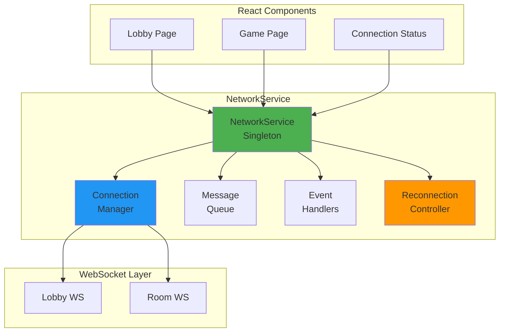

# NetworkService Deep Dive - WebSocket Client Architecture

## Table of Contents
1. [Overview](#overview)
2. [Architecture](#architecture)
3. [Singleton Pattern](#singleton-pattern)
4. [Connection Management](#connection-management)
5. [Message Handling](#message-handling)
6. [Reconnection Logic](#reconnection-logic)
7. [Event System](#event-system)
8. [Message Queuing](#message-queuing)
9. [Error Handling](#error-handling)
10. [Code Examples](#code-examples)

## Overview

The NetworkService is a singleton class that manages all WebSocket communication between the frontend and backend. It provides a robust, type-safe interface for real-time multiplayer gameplay with automatic reconnection, message queuing, and event handling.

### Key Features

1. **Singleton Pattern**: One instance manages all connections
2. **Multi-Room Support**: Handle lobby and game room connections
3. **Auto-Reconnection**: Exponential backoff with queuing
4. **Type Safety**: Full TypeScript support
5. **Event System**: EventTarget-based pub/sub
6. **Message Queuing**: No lost messages during disconnections

## Architecture

### High-Level Design



### Core Structure

```typescript
// frontend/src/services/NetworkService.ts
export class NetworkService extends EventTarget {
  private static instance: NetworkService | null = null;
  
  // Connection management
  private connections: Map<string, WebSocket>;
  private messageQueues: Map<string, QueuedMessage[]>;
  private connectionStates: Map<string, ConnectionState>;
  
  // Configuration
  private config: NetworkConfig;
  
  // Reconnection
  private reconnectAttempts: Map<string, number>;
  private reconnectTimeouts: Map<string, NodeJS.Timeout>;
  
  // Message tracking
  private sequenceNumbers: Map<string, number>;
  private lastPingTime: Map<string, number>;
  
  private constructor() {
    super();
    this.connections = new Map();
    this.messageQueues = new Map();
    this.connectionStates = new Map();
    this.reconnectAttempts = new Map();
    this.reconnectTimeouts = new Map();
    this.sequenceNumbers = new Map();
    this.lastPingTime = new Map();
    
    this.config = {
      maxReconnectAttempts: 5,
      reconnectDelay: 1000,
      maxReconnectDelay: 30000,
      heartbeatInterval: 30000,
      messageTimeout: 5000,
      queueSize: 100
    };
  }
}
```

## Singleton Pattern

### Implementation

```typescript
export class NetworkService extends EventTarget {
  private static instance: NetworkService | null = null;
  
  // Private constructor prevents direct instantiation
  private constructor() {
    super();
    this.initialize();
  }
  
  // Public static method to get instance
  public static getInstance(): NetworkService {
    if (!NetworkService.instance) {
      NetworkService.instance = new NetworkService();
      
      // Make available globally for debugging
      if (typeof window !== 'undefined') {
        (window as any).networkService = NetworkService.instance;
      }
    }
    return NetworkService.instance;
  }
  
  // Reset instance (for testing)
  public static resetInstance(): void {
    if (NetworkService.instance) {
      NetworkService.instance.cleanup();
      NetworkService.instance = null;
    }
  }
  
  private initialize(): void {
    // Set up global error handlers
    window.addEventListener('beforeunload', () => {
      this.cleanup();
    });
    
    // Start heartbeat timer
    this.startHeartbeat();
    
    console.log('🎮 NetworkService initialized');
  }
}
```

### Usage in React

```typescript
// Use in components
const MyComponent = () => {
  const networkService = useRef(NetworkService.getInstance());
  
  useEffect(() => {
    const service = networkService.current;
    
    // Connect to room
    service.connectToRoom(roomId);
    
    // Set up event listeners
    const handleMessage = (event: CustomEvent) => {
      console.log('Received:', event.detail);
    };
    
    service.addEventListener('message', handleMessage);
    
    return () => {
      service.removeEventListener('message', handleMessage);
      service.disconnect(roomId);
    };
  }, [roomId]);
};
```

## Connection Management

### Connecting to Rooms

```typescript
public async connectToRoom(roomId: string): Promise<void> {
  // Check if already connected
  const existingConnection = this.connections.get(roomId);
  if (existingConnection?.readyState === WebSocket.OPEN) {
    console.log(`Already connected to room ${roomId}`);
    return;
  }
  
  // Close existing connection if any
  if (existingConnection) {
    existingConnection.close();
  }
  
  // Update state
  this.setConnectionState(roomId, ConnectionState.CONNECTING);
  
  try {
    // Create WebSocket URL
    const wsUrl = this.buildWebSocketUrl(roomId);
    
    // Create new WebSocket
    const ws = new WebSocket(wsUrl);
    
    // Set up event handlers
    this.setupWebSocketHandlers(ws, roomId);
    
    // Store connection
    this.connections.set(roomId, ws);
    
    // Wait for connection
    await this.waitForConnection(ws, roomId);
    
  } catch (error) {
    console.error(`Failed to connect to room ${roomId}:`, error);
    this.setConnectionState(roomId, ConnectionState.FAILED);
    throw error;
  }
}

private buildWebSocketUrl(roomId: string): string {
  const protocol = window.location.protocol === 'https:' ? 'wss:' : 'ws:';
  const host = process.env.REACT_APP_WS_HOST || window.location.host;
  return `${protocol}//${host}/ws/${roomId}`;
}
```

### WebSocket Event Handlers

```typescript
private setupWebSocketHandlers(ws: WebSocket, roomId: string): void {
  // Connection opened
  ws.onopen = () => {
    console.log(`✅ Connected to room ${roomId}`);
    this.handleConnectionOpen(roomId);
  };
  
  // Message received
  ws.onmessage = (event) => {
    try {
      const message = JSON.parse(event.data);
      this.handleMessage(roomId, message);
    } catch (error) {
      console.error('Failed to parse message:', error);
    }
  };
  
  // Connection closed
  ws.onclose = (event) => {
    console.log(`❌ Disconnected from room ${roomId}`, event.code, event.reason);
    this.handleConnectionClose(roomId, event);
  };
  
  // Error occurred
  ws.onerror = (error) => {
    console.error(`WebSocket error for room ${roomId}:`, error);
    this.handleConnectionError(roomId, error);
  };
}

private handleConnectionOpen(roomId: string): void {
  // Update state
  this.setConnectionState(roomId, ConnectionState.CONNECTED);
  
  // Reset reconnect attempts
  this.reconnectAttempts.set(roomId, 0);
  
  // Clear reconnect timeout
  const timeout = this.reconnectTimeouts.get(roomId);
  if (timeout) {
    clearTimeout(timeout);
    this.reconnectTimeouts.delete(roomId);
  }
  
  // Process queued messages
  this.processQueuedMessages(roomId);
  
  // Emit connected event
  this.dispatchEvent(new CustomEvent('connected', {
    detail: { roomId }
  }));
  
  // Start heartbeat for this connection
  this.startHeartbeatForRoom(roomId);
}
```

## Message Handling

### Sending Messages

```typescript
public send(roomId: string, event: string, data: any): void {
  const connection = this.connections.get(roomId);
  
  // Build message
  const message: NetworkMessage = {
    event,
    data,
    room_id: roomId,
    sequence: this.getNextSequence(roomId),
    timestamp: Date.now()
  };
  
  // If connected, send immediately
  if (connection?.readyState === WebSocket.OPEN) {
    try {
      connection.send(JSON.stringify(message));
      
      // Track last activity
      this.updateLastActivity(roomId);
      
      // Log in development
      if (process.env.NODE_ENV === 'development') {
        console.log(`📤 Sent to ${roomId}:`, event, data);
      }
      
    } catch (error) {
      console.error('Failed to send message:', error);
      this.queueMessage(roomId, message);
    }
  } else {
    // Queue message if not connected
    this.queueMessage(roomId, message);
    
    // Attempt reconnection
    if (this.getConnectionState(roomId) !== ConnectionState.CONNECTING) {
      this.reconnect(roomId);
    }
  }
}

private getNextSequence(roomId: string): number {
  const current = this.sequenceNumbers.get(roomId) || 0;
  const next = current + 1;
  this.sequenceNumbers.set(roomId, next);
  return next;
}
```

### Receiving Messages

```typescript
private handleMessage(roomId: string, message: ServerMessage): void {
  // Log in development
  if (process.env.NODE_ENV === 'development') {
    console.log(`📥 Received from ${roomId}:`, message.event, message.data);
  }
  
  // Update last activity
  this.updateLastActivity(roomId);
  
  // Handle system messages
  if (this.isSystemMessage(message.event)) {
    this.handleSystemMessage(roomId, message);
    return;
  }
  
  // Dispatch custom event for the message
  this.dispatchEvent(new CustomEvent(message.event, {
    detail: {
      roomId,
      ...message
    }
  }));
  
  // Also dispatch generic message event
  this.dispatchEvent(new CustomEvent('message', {
    detail: {
      roomId,
      event: message.event,
      data: message.data
    }
  }));
}

private isSystemMessage(event: string): boolean {
  return ['pong', 'error', 'connection_status'].includes(event);
}

private handleSystemMessage(roomId: string, message: ServerMessage): void {
  switch (message.event) {
    case 'pong':
      // Heartbeat response
      this.lastPingTime.set(roomId, Date.now());
      break;
      
    case 'error':
      // Server error
      this.handleServerError(roomId, message.error);
      break;
      
    case 'connection_status':
      // Connection status update
      this.updateConnectionStatus(roomId, message.data);
      break;
  }
}
```

## Reconnection Logic

### Exponential Backoff

```typescript
private async reconnect(roomId: string): Promise<void> {
  // Check if already reconnecting
  if (this.getConnectionState(roomId) === ConnectionState.RECONNECTING) {
    return;
  }
  
  // Update state
  this.setConnectionState(roomId, ConnectionState.RECONNECTING);
  
  // Get attempt count
  const attempts = this.reconnectAttempts.get(roomId) || 0;
  
  // Check max attempts
  if (attempts >= this.config.maxReconnectAttempts) {
    console.error(`Max reconnection attempts reached for room ${roomId}`);
    this.setConnectionState(roomId, ConnectionState.FAILED);
    this.dispatchEvent(new CustomEvent('connection_failed', {
      detail: { roomId, reason: 'max_attempts' }
    }));
    return;
  }
  
  // Calculate delay with exponential backoff
  const delay = Math.min(
    this.config.reconnectDelay * Math.pow(2, attempts),
    this.config.maxReconnectDelay
  );
  
  console.log(`Reconnecting to ${roomId} in ${delay}ms (attempt ${attempts + 1})`);
  
  // Schedule reconnection
  const timeout = setTimeout(async () => {
    try {
      // Increment attempts
      this.reconnectAttempts.set(roomId, attempts + 1);
      
      // Attempt connection
      await this.connectToRoom(roomId);
      
      // Success - reset attempts
      this.reconnectAttempts.set(roomId, 0);
      
    } catch (error) {
      // Failed - will retry
      console.error(`Reconnection attempt ${attempts + 1} failed:`, error);
      
      // Schedule next attempt
      this.reconnect(roomId);
    }
  }, delay);
  
  // Store timeout for cleanup
  this.reconnectTimeouts.set(roomId, timeout);
}
```

### Connection Recovery

```typescript
private handleConnectionClose(roomId: string, event: CloseEvent): void {
  // Update state
  this.setConnectionState(roomId, ConnectionState.DISCONNECTED);
  
  // Stop heartbeat
  this.stopHeartbeatForRoom(roomId);
  
  // Emit disconnected event
  this.dispatchEvent(new CustomEvent('disconnected', {
    detail: {
      roomId,
      code: event.code,
      reason: event.reason,
      wasClean: event.wasClean
    }
  }));
  
  // Determine if we should reconnect
  if (this.shouldReconnect(event)) {
    // Automatic reconnection
    this.reconnect(roomId);
  } else {
    // Clean disconnection or fatal error
    this.cleanup(roomId);
  }
}

private shouldReconnect(event: CloseEvent): boolean {
  // Don't reconnect for clean closures
  if (event.wasClean && event.code === 1000) {
    return false;
  }
  
  // Don't reconnect for authentication failures
  if (event.code === 4001) {
    return false;
  }
  
  // Reconnect for most other cases
  return true;
}
```

## Event System

### Event Types

```typescript
// Event type definitions
interface NetworkEvents {
  // Connection events
  'connected': { roomId: string };
  'disconnected': { roomId: string; code: number; reason: string };
  'reconnecting': { roomId: string; attempt: number };
  'connection_failed': { roomId: string; reason: string };
  
  // Message events
  'message': { roomId: string; event: string; data: any };
  
  // Game events
  'phase_change': GamePhaseChangeEvent;
  'player_joined': PlayerJoinedEvent;
  'player_left': PlayerLeftEvent;
  'hand_updated': HandUpdatedEvent;
  
  // Error events
  'error': { roomId: string; error: NetworkError };
}
```

### Using Events in React

```typescript
// Custom hook for network events
export const useNetworkEvent = <K extends keyof NetworkEvents>(
  event: K,
  handler: (data: NetworkEvents[K]) => void
) => {
  const networkService = useRef(NetworkService.getInstance());
  
  useEffect(() => {
    const service = networkService.current;
    
    const eventHandler = (e: CustomEvent) => {
      handler(e.detail as NetworkEvents[K]);
    };
    
    service.addEventListener(event, eventHandler);
    
    return () => {
      service.removeEventListener(event, eventHandler);
    };
  }, [event, handler]);
};

// Usage in component
const GameComponent = () => {
  useNetworkEvent('phase_change', (data) => {
    console.log('Phase changed to:', data.phase);
    updateGamePhase(data);
  });
  
  useNetworkEvent('connected', ({ roomId }) => {
    console.log('Connected to room:', roomId);
    setConnectionStatus('connected');
  });
};
```

## Message Queuing

### Queue Implementation

```typescript
interface QueuedMessage {
  message: NetworkMessage;
  timestamp: number;
  attempts: number;
}

private queueMessage(roomId: string, message: NetworkMessage): void {
  // Get or create queue
  let queue = this.messageQueues.get(roomId);
  if (!queue) {
    queue = [];
    this.messageQueues.set(roomId, queue);
  }
  
  // Add to queue
  queue.push({
    message,
    timestamp: Date.now(),
    attempts: 0
  });
  
  // Limit queue size
  if (queue.length > this.config.queueSize) {
    // Remove oldest messages
    const removed = queue.splice(0, queue.length - this.config.queueSize);
    console.warn(`Dropped ${removed.length} queued messages for room ${roomId}`);
  }
  
  console.log(`Message queued for ${roomId}, queue size: ${queue.length}`);
}

private async processQueuedMessages(roomId: string): Promise<void> {
  const queue = this.messageQueues.get(roomId);
  if (!queue || queue.length === 0) {
    return;
  }
  
  console.log(`Processing ${queue.length} queued messages for room ${roomId}`);
  
  const connection = this.connections.get(roomId);
  if (!connection || connection.readyState !== WebSocket.OPEN) {
    console.warn('Cannot process queue - not connected');
    return;
  }
  
  // Process messages in order
  const processed: QueuedMessage[] = [];
  
  for (const queuedMessage of queue) {
    try {
      // Update sequence number
      queuedMessage.message.sequence = this.getNextSequence(roomId);
      
      // Send message
      connection.send(JSON.stringify(queuedMessage.message));
      processed.push(queuedMessage);
      
      // Small delay between messages
      await new Promise(resolve => setTimeout(resolve, 10));
      
    } catch (error) {
      console.error('Failed to send queued message:', error);
      break;
    }
  }
  
  // Remove processed messages
  if (processed.length > 0) {
    const remaining = queue.filter(m => !processed.includes(m));
    this.messageQueues.set(roomId, remaining);
    
    console.log(`Processed ${processed.length} messages, ${remaining.length} remaining`);
  }
}
```

## Error Handling

### Error Types

```typescript
enum NetworkErrorCode {
  CONNECTION_FAILED = 'CONNECTION_FAILED',
  SEND_FAILED = 'SEND_FAILED',
  PARSE_ERROR = 'PARSE_ERROR',
  TIMEOUT = 'TIMEOUT',
  SERVER_ERROR = 'SERVER_ERROR',
  AUTHENTICATION_FAILED = 'AUTHENTICATION_FAILED'
}

class NetworkError extends Error {
  constructor(
    public code: NetworkErrorCode,
    public message: string,
    public roomId?: string,
    public details?: any
  ) {
    super(message);
    this.name = 'NetworkError';
  }
}
```

### Error Handling Strategy

```typescript
private handleServerError(roomId: string, error: any): void {
  console.error(`Server error for room ${roomId}:`, error);
  
  // Create network error
  const networkError = new NetworkError(
    NetworkErrorCode.SERVER_ERROR,
    error.message || 'Server error occurred',
    roomId,
    error
  );
  
  // Dispatch error event
  this.dispatchEvent(new CustomEvent('error', {
    detail: {
      roomId,
      error: networkError
    }
  }));
  
  // Handle specific error codes
  switch (error.code) {
    case 'ROOM_NOT_FOUND':
      // Room doesn't exist - don't retry
      this.disconnect(roomId);
      break;
      
    case 'AUTHENTICATION_FAILED':
      // Auth failed - don't retry
      this.disconnect(roomId);
      break;
      
    case 'RATE_LIMITED':
      // Rate limited - increase delay
      this.increaseReconnectDelay(roomId);
      break;
      
    default:
      // Other errors - standard handling
      break;
  }
}

private handleConnectionError(roomId: string, error: Event): void {
  console.error(`Connection error for room ${roomId}:`, error);
  
  // Create network error
  const networkError = new NetworkError(
    NetworkErrorCode.CONNECTION_FAILED,
    'WebSocket connection error',
    roomId
  );
  
  // Update state
  this.setConnectionState(roomId, ConnectionState.ERROR);
  
  // Dispatch error event
  this.dispatchEvent(new CustomEvent('error', {
    detail: {
      roomId,
      error: networkError
    }
  }));
}
```

## Code Examples

### Complete Usage Example

```typescript
// GameManager using NetworkService
class GameManager {
  private networkService: NetworkService;
  private roomId: string;
  
  constructor(roomId: string) {
    this.networkService = NetworkService.getInstance();
    this.roomId = roomId;
    this.setupEventHandlers();
  }
  
  private setupEventHandlers(): void {
    // Connection events
    this.networkService.addEventListener('connected', (e: CustomEvent) => {
      if (e.detail.roomId === this.roomId) {
        console.log('Game connected!');
        this.onConnected();
      }
    });
    
    this.networkService.addEventListener('disconnected', (e: CustomEvent) => {
      if (e.detail.roomId === this.roomId) {
        console.log('Game disconnected!');
        this.onDisconnected();
      }
    });
    
    // Game events
    this.networkService.addEventListener('phase_change', (e: CustomEvent) => {
      if (e.detail.roomId === this.roomId) {
        this.handlePhaseChange(e.detail.data);
      }
    });
    
    this.networkService.addEventListener('hand_updated', (e: CustomEvent) => {
      if (e.detail.roomId === this.roomId) {
        this.updatePlayerHand(e.detail.data.pieces);
      }
    });
  }
  
  async connect(): Promise<void> {
    await this.networkService.connectToRoom(this.roomId);
  }
  
  playPieces(pieceIds: string[]): void {
    this.networkService.send(this.roomId, 'play', {
      player_name: this.playerName,
      piece_ids: pieceIds
    });
  }
  
  declare(pileCount: number): void {
    this.networkService.send(this.roomId, 'declare', {
      player_name: this.playerName,
      declaration: pileCount
    });
  }
}
```

### React Integration

```typescript
// NetworkContext for easy access
const NetworkContext = React.createContext<NetworkService | null>(null);

export const NetworkProvider: React.FC<{ children: ReactNode }> = ({ children }) => {
  const networkService = useRef(NetworkService.getInstance());
  
  return (
    <NetworkContext.Provider value={networkService.current}>
      {children}
    </NetworkContext.Provider>
  );
};

// Hook for using network service
export const useNetworkService = () => {
  const service = useContext(NetworkContext);
  if (!service) {
    throw new Error('useNetworkService must be used within NetworkProvider');
  }
  return service;
};

// Connection status hook
export const useConnectionStatus = (roomId: string) => {
  const networkService = useNetworkService();
  const [status, setStatus] = useState<ConnectionState>(ConnectionState.DISCONNECTED);
  
  useEffect(() => {
    const updateStatus = () => {
      setStatus(networkService.getConnectionState(roomId));
    };
    
    // Initial status
    updateStatus();
    
    // Listen for changes
    const events = ['connected', 'disconnected', 'reconnecting', 'connection_failed'];
    
    events.forEach(event => {
      networkService.addEventListener(event, updateStatus);
    });
    
    return () => {
      events.forEach(event => {
        networkService.removeEventListener(event, updateStatus);
      });
    };
  }, [networkService, roomId]);
  
  return status;
};
```

### Testing NetworkService

```typescript
// Mock WebSocket for testing
class MockWebSocket {
  readyState: number = WebSocket.CONNECTING;
  url: string;
  
  onopen?: (event: Event) => void;
  onclose?: (event: CloseEvent) => void;
  onmessage?: (event: MessageEvent) => void;
  onerror?: (event: Event) => void;
  
  constructor(url: string) {
    this.url = url;
    
    // Simulate connection
    setTimeout(() => {
      this.readyState = WebSocket.OPEN;
      this.onopen?.(new Event('open'));
    }, 100);
  }
  
  send(data: string): void {
    // Simulate echo
    setTimeout(() => {
      this.onmessage?.(new MessageEvent('message', { data }));
    }, 10);
  }
  
  close(): void {
    this.readyState = WebSocket.CLOSED;
    this.onclose?.(new CloseEvent('close'));
  }
}

// Test example
describe('NetworkService', () => {
  beforeEach(() => {
    global.WebSocket = MockWebSocket as any;
    NetworkService.resetInstance();
  });
  
  it('should connect to room', async () => {
    const service = NetworkService.getInstance();
    const connected = jest.fn();
    
    service.addEventListener('connected', connected);
    
    await service.connectToRoom('test-room');
    
    expect(connected).toHaveBeenCalledWith(
      expect.objectContaining({
        detail: { roomId: 'test-room' }
      })
    );
  });
  
  it('should queue messages when disconnected', () => {
    const service = NetworkService.getInstance();
    
    service.send('test-room', 'test-event', { data: 'test' });
    
    expect(service.getQueueSize('test-room')).toBe(1);
  });
});
```

## Summary

The NetworkService provides:

1. **Robust Communication**: Reliable WebSocket management
2. **Automatic Recovery**: Reconnection with exponential backoff
3. **Message Integrity**: Queuing ensures no lost messages
4. **Type Safety**: Full TypeScript support
5. **Easy Integration**: Simple API for React components
6. **Debugging Support**: Comprehensive logging and events

This architecture ensures smooth real-time multiplayer gameplay even with network interruptions.