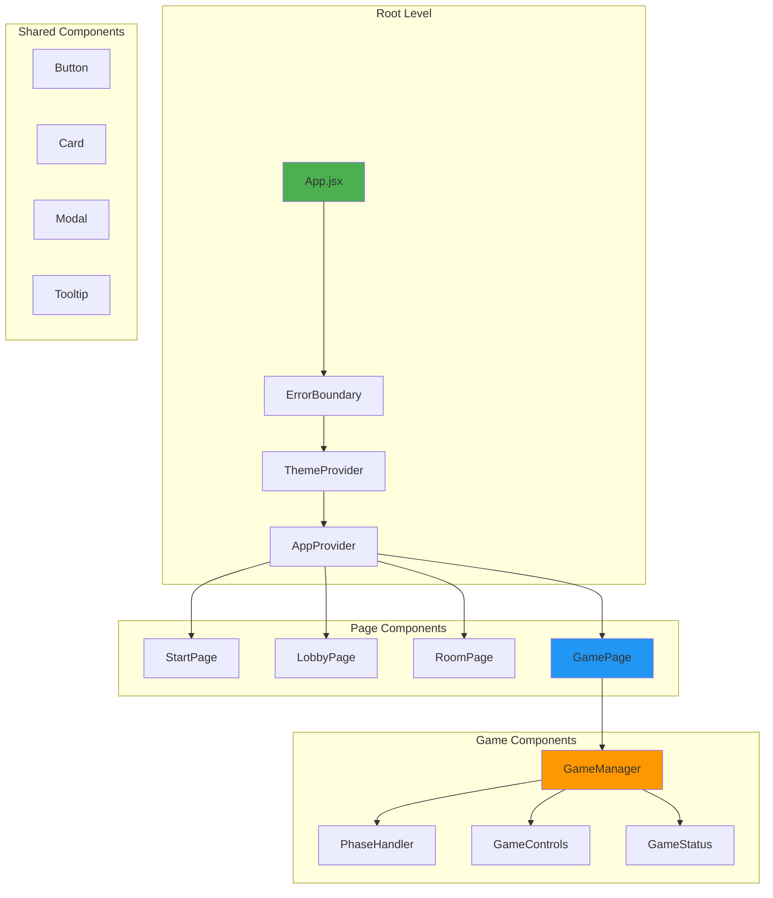

# React Architecture Deep Dive - Component Design & Patterns

## Table of Contents
1. [Overview](#overview)
2. [Architecture Principles](#architecture-principles)
3. [Component Hierarchy](#component-hierarchy)
4. [Routing Architecture](#routing-architecture)
5. [Component Patterns](#component-patterns)
6. [State Management Strategy](#state-management-strategy)
7. [Props Flow & Data Passing](#props-flow--data-passing)
8. [Performance Optimization](#performance-optimization)
9. [Component Examples](#component-examples)
10. [Testing Strategy](#testing-strategy)

## Overview

The Liap Tui frontend uses React 19.1.0 with modern patterns including hooks, context, and functional components. This document explores the architectural decisions and patterns that make the frontend maintainable and performant.

### Key Technologies

- **React 19.1.0**: Latest React with improved performance
- **React Router DOM**: Client-side routing
- **TypeScript**: Type safety throughout
- **ESBuild**: Ultra-fast bundling
- **CSS Modules**: Scoped styling

## Architecture Principles

### 1. Component Composition

```
"Prefer composition over inheritance"
```

We build complex UIs by composing simple, focused components:

```jsx
// ❌ Monolithic component
const GameScreen = () => {
  // 500 lines of mixed concerns
};

// ✅ Composed components
const GameScreen = () => {
  return (
    <GameLayout>
      <GameHeader />
      <GamePhaseDisplay />
      <PlayerHand />
      <ActionPanel />
    </GameLayout>
  );
};
```

### 2. Single Responsibility

Each component has one clear purpose:

```jsx
// PlayerCard: Only displays player info
const PlayerCard = ({ player }) => (
  <div className="player-card">
    <Avatar player={player} />
    <PlayerName name={player.name} />
    <PlayerScore score={player.score} />
  </div>
);

// TurnTimer: Only manages turn timing
const TurnTimer = ({ duration, onExpire }) => {
  // Timer logic only
};
```

### 3. Props Over State

Prefer props for data flow, local state only when necessary:

```jsx
// ✅ Good: Stateless component receives props
const PieceDisplay = ({ piece, isSelected, onSelect }) => (
  <div 
    className={`piece ${isSelected ? 'selected' : ''}`}
    onClick={() => onSelect(piece.id)}
  >
    <PieceIcon piece={piece} />
  </div>
);

// ✅ Good: State only for local UI concerns
const Tooltip = ({ content }) => {
  const [isVisible, setIsVisible] = useState(false);
  // Local state for UI behavior only
};
```

## Component Hierarchy

### Application Structure



### Directory Structure

```
frontend/src/
├── components/
│   ├── game/           # Game-specific components
│   │   ├── GameBoard.jsx
│   │   ├── PlayerHand.jsx
│   │   ├── PieceCard.jsx
│   │   └── TurnResults.jsx
│   ├── shared/         # Reusable components
│   │   ├── Button.jsx
│   │   ├── Modal.jsx
│   │   ├── Card.jsx
│   │   └── TruncatedName.jsx
│   └── layout/         # Layout components
│       ├── Header.jsx
│       ├── Footer.jsx
│       └── Container.jsx
├── pages/              # Route components
│   ├── StartPage.jsx
│   ├── LobbyPage.jsx
│   ├── RoomPage.jsx
│   └── GamePage.jsx
├── phases/             # Game phase components
│   ├── PreparationPhase.jsx
│   ├── DeclarationPhase.jsx
│   ├── TurnPhase.jsx
│   └── ScoringPhase.jsx
├── hooks/              # Custom hooks
│   ├── useGame.js
│   ├── useWebSocket.js
│   └── useTheme.js
├── contexts/           # React contexts
│   ├── AppContext.jsx
│   ├── GameContext.jsx
│   └── ThemeContext.jsx
└── services/           # External services
    ├── NetworkService.ts
    └── GameService.ts
```

## Routing Architecture

### Route Configuration

```jsx
// src/AppRouter.jsx
const AppRouter = () => {
  const { playerName } = useApp();
  
  return (
    <BrowserRouter>
      <Routes>
        <Route path="/" element={<StartPage />} />
        <Route 
          path="/lobby" 
          element={
            <ProtectedRoute requiresName>
              <LobbyPage />
            </ProtectedRoute>
          } 
        />
        <Route 
          path="/room/:roomId" 
          element={
            <ProtectedRoute requiresName>
              <RoomPage />
            </ProtectedRoute>
          } 
        />
        <Route 
          path="/game/:roomId" 
          element={
            <ProtectedRoute requiresName requiresGame>
              <GamePage />
            </ProtectedRoute>
          } 
        />
        <Route path="*" element={<Navigate to="/" />} />
      </Routes>
    </BrowserRouter>
  );
};
```

### Protected Routes

```jsx
const ProtectedRoute = ({ children, requiresName, requiresGame }) => {
  const { playerName } = useApp();
  const { gameState } = useGame();
  
  // Check requirements
  if (requiresName && !playerName) {
    return <Navigate to="/" />;
  }
  
  if (requiresGame && !gameState) {
    return <Navigate to="/lobby" />;
  }
  
  return children;
};
```

### Navigation Patterns

```jsx
// Programmatic navigation
const navigate = useNavigate();

// After room creation
const handleRoomCreated = (roomId) => {
  navigate(`/room/${roomId}`);
};

// Game start navigation
useEffect(() => {
  if (gameStarted) {
    navigate(`/game/${roomId}`);
  }
}, [gameStarted]);
```

## Component Patterns

### 1. Container/Presenter Pattern

Separate logic from presentation:

```jsx
// Container: Handles logic and data
const PlayerHandContainer = () => {
  const { gameState } = useGame();
  const [selectedPieces, setSelectedPieces] = useState([]);
  
  const handlePieceSelect = (pieceId) => {
    // Selection logic
  };
  
  const handlePlay = () => {
    // Play logic
  };
  
  return (
    <PlayerHandPresenter
      pieces={gameState.myHand}
      selectedPieces={selectedPieces}
      onPieceSelect={handlePieceSelect}
      onPlay={handlePlay}
      canPlay={selectedPieces.length > 0}
    />
  );
};

// Presenter: Pure presentation
const PlayerHandPresenter = ({ 
  pieces, 
  selectedPieces, 
  onPieceSelect, 
  onPlay,
  canPlay 
}) => (
  <div className="player-hand">
    <div className="pieces">
      {pieces.map(piece => (
        <PieceCard
          key={piece.id}
          piece={piece}
          isSelected={selectedPieces.includes(piece.id)}
          onSelect={onPieceSelect}
        />
      ))}
    </div>
    <Button 
      onClick={onPlay} 
      disabled={!canPlay}
    >
      Play Selected
    </Button>
  </div>
);
```

### 2. Compound Components

Components that work together:

```jsx
// Card compound component
const Card = ({ children }) => (
  <div className="card">{children}</div>
);

Card.Header = ({ children }) => (
  <div className="card-header">{children}</div>
);

Card.Body = ({ children }) => (
  <div className="card-body">{children}</div>
);

Card.Footer = ({ children }) => (
  <div className="card-footer">{children}</div>
);

// Usage
<Card>
  <Card.Header>Player Info</Card.Header>
  <Card.Body>
    <PlayerStats player={player} />
  </Card.Body>
  <Card.Footer>
    <Button>View Profile</Button>
  </Card.Footer>
</Card>
```

### 3. Render Props Pattern

For flexible rendering:

```jsx
const MouseTracker = ({ render }) => {
  const [position, setPosition] = useState({ x: 0, y: 0 });
  
  const handleMouseMove = (e) => {
    setPosition({ x: e.clientX, y: e.clientY });
  };
  
  return (
    <div onMouseMove={handleMouseMove}>
      {render(position)}
    </div>
  );
};

// Usage
<MouseTracker
  render={({ x, y }) => (
    <Tooltip x={x} y={y}>
      Hovering at ({x}, {y})
    </Tooltip>
  )}
/>
```

### 4. Custom Hooks Pattern

Encapsulate complex logic:

```jsx
// useGamePhase hook
const useGamePhase = () => {
  const { gameState } = useGame();
  const [phaseComponent, setPhaseComponent] = useState(null);
  
  useEffect(() => {
    switch (gameState?.phase) {
      case 'PREPARATION':
        setPhaseComponent(<PreparationPhase />);
        break;
      case 'DECLARATION':
        setPhaseComponent(<DeclarationPhase />);
        break;
      case 'TURN':
        setPhaseComponent(<TurnPhase />);
        break;
      case 'SCORING':
        setPhaseComponent(<ScoringPhase />);
        break;
      default:
        setPhaseComponent(<WaitingPhase />);
    }
  }, [gameState?.phase]);
  
  return {
    currentPhase: gameState?.phase,
    phaseComponent,
    isGameActive: !!gameState
  };
};

// Usage in component
const GameScreen = () => {
  const { phaseComponent, currentPhase } = useGamePhase();
  
  return (
    <div className="game-screen">
      <h2>Current Phase: {currentPhase}</h2>
      {phaseComponent}
    </div>
  );
};
```

## State Management Strategy

### Local State vs Context

```jsx
// Local state: Component-specific UI state
const Modal = () => {
  const [isOpen, setIsOpen] = useState(false);
  // UI state stays local
};

// Context: Shared application state
const AppContext = createContext();

const AppProvider = ({ children }) => {
  const [playerName, setPlayerName] = useState('');
  const [currentRoomId, setCurrentRoomId] = useState(null);
  
  // Shared across app
  return (
    <AppContext.Provider value={{
      playerName,
      setPlayerName,
      currentRoomId,
      setCurrentRoomId
    }}>
      {children}
    </AppContext.Provider>
  );
};
```

### State Lifting

```jsx
// Before: State in child
const PieceCard = () => {
  const [isSelected, setIsSelected] = useState(false);
  // Problem: Parent doesn't know selection
};

// After: State lifted to parent
const PlayerHand = () => {
  const [selectedPieces, setSelectedPieces] = useState([]);
  
  return pieces.map(piece => (
    <PieceCard
      key={piece.id}
      piece={piece}
      isSelected={selectedPieces.includes(piece.id)}
      onSelect={(id) => {
        setSelectedPieces(prev => 
          prev.includes(id) 
            ? prev.filter(p => p !== id)
            : [...prev, id]
        );
      }}
    />
  ));
};
```

## Props Flow & Data Passing

### Props Types

```typescript
// Type-safe props with TypeScript
interface PlayerCardProps {
  player: {
    id: string;
    name: string;
    score: number;
    isActive: boolean;
  };
  onSelect?: (playerId: string) => void;
  className?: string;
}

const PlayerCard: React.FC<PlayerCardProps> = ({ 
  player, 
  onSelect, 
  className = '' 
}) => {
  // Component implementation
};
```

### Props Drilling Solution

```jsx
// Problem: Props drilling
<App>
  <GameScreen user={user}>
    <GameBoard user={user}>
      <PlayerArea user={user}>
        <PlayerInfo user={user} />
      </PlayerArea>
    </GameBoard>
  </GameScreen>
</App>

// Solution: Context
const UserContext = createContext();

<UserContext.Provider value={user}>
  <App>
    <GameScreen>
      <GameBoard>
        <PlayerArea>
          <PlayerInfo /> {/* Uses useContext(UserContext) */}
        </PlayerArea>
      </GameBoard>
    </GameScreen>
  </App>
</UserContext.Provider>
```

### Props Best Practices

```jsx
// 1. Destructure props
const Button = ({ label, onClick, disabled = false }) => {
  // Clear what props are expected
};

// 2. Default props
const Card = ({ title = 'Untitled', children }) => {
  // Provides sensible defaults
};

// 3. Spread remaining props
const Input = ({ label, error, ...inputProps }) => (
  <div>
    <label>{label}</label>
    <input {...inputProps} />
    {error && <span className="error">{error}</span>}
  </div>
);

// 4. Children as prop
const Layout = ({ children, sidebar }) => (
  <div className="layout">
    <aside>{sidebar}</aside>
    <main>{children}</main>
  </div>
);
```

## Performance Optimization

### 1. React.memo

Prevent unnecessary re-renders:

```jsx
// Expensive component
const ExpensivePieceList = React.memo(({ pieces }) => {
  console.log('Rendering piece list');
  
  return (
    <div className="piece-list">
      {pieces.map(piece => (
        <ComplexPieceVisualization key={piece.id} piece={piece} />
      ))}
    </div>
  );
}, (prevProps, nextProps) => {
  // Custom comparison
  return prevProps.pieces.length === nextProps.pieces.length &&
    prevProps.pieces.every((piece, index) => 
      piece.id === nextProps.pieces[index].id
    );
});
```

### 2. useMemo & useCallback

```jsx
const GameStats = ({ gameData }) => {
  // Expensive calculation
  const statistics = useMemo(() => {
    return calculateComplexStats(gameData);
  }, [gameData]);
  
  // Stable callback reference
  const handleRefresh = useCallback(() => {
    refreshGameData();
  }, []);
  
  return (
    <div>
      <StatsDisplay stats={statistics} />
      <Button onClick={handleRefresh}>Refresh</Button>
    </div>
  );
};
```

### 3. Code Splitting

```jsx
// Lazy load heavy components
const GameAnalytics = lazy(() => import('./GameAnalytics'));
const DebugPanel = lazy(() => import('./DebugPanel'));

const GamePage = () => {
  const [showAnalytics, setShowAnalytics] = useState(false);
  
  return (
    <div>
      <Game />
      {showAnalytics && (
        <Suspense fallback={<Loading />}>
          <GameAnalytics />
        </Suspense>
      )}
    </div>
  );
};
```

### 4. Virtual Lists

```jsx
// For long lists
import { FixedSizeList } from 'react-window';

const GameHistory = ({ history }) => (
  <FixedSizeList
    height={600}
    itemCount={history.length}
    itemSize={50}
    width="100%"
  >
    {({ index, style }) => (
      <div style={style}>
        <HistoryItem item={history[index]} />
      </div>
    )}
  </FixedSizeList>
);
```

## Component Examples

### Complete Component Example

```jsx
// PlayerCard.jsx - A complete component example
import React, { memo } from 'react';
import './PlayerCard.css';

interface PlayerCardProps {
  player: {
    id: string;
    name: string;
    score: number;
    isActive: boolean;
    isHost: boolean;
    pieces: number;
  };
  isCurrentTurn: boolean;
  onKick?: (playerId: string) => void;
  showKickButton?: boolean;
}

const PlayerCard = memo<PlayerCardProps>(({
  player,
  isCurrentTurn,
  onKick,
  showKickButton = false
}) => {
  return (
    <div className={`
      player-card 
      ${isCurrentTurn ? 'current-turn' : ''}
      ${player.isActive ? 'active' : 'inactive'}
    `}>
      <div className="player-header">
        <TruncatedName name={player.name} maxLength={12} />
        {player.isHost && <HostBadge />}
      </div>
      
      <div className="player-stats">
        <div className="stat">
          <span className="label">Score</span>
          <span className="value">{player.score}</span>
        </div>
        <div className="stat">
          <span className="label">Pieces</span>
          <span className="value">{player.pieces}</span>
        </div>
      </div>
      
      {isCurrentTurn && (
        <div className="turn-indicator">
          <span>Current Turn</span>
          <TurnTimer />
        </div>
      )}
      
      {showKickButton && onKick && (
        <Button
          variant="danger"
          size="small"
          onClick={() => onKick(player.id)}
        >
          Kick Player
        </Button>
      )}
    </div>
  );
});

PlayerCard.displayName = 'PlayerCard';

export default PlayerCard;
```

### Hook Example

```jsx
// useWebSocket.js - Custom hook for WebSocket management
import { useEffect, useRef, useCallback } from 'react';
import { NetworkService } from '../services/NetworkService';

export const useWebSocket = (roomId: string) => {
  const networkService = useRef(NetworkService.getInstance());
  const [connectionState, setConnectionState] = useState('disconnected');
  const [lastMessage, setLastMessage] = useState(null);
  
  useEffect(() => {
    if (!roomId) return;
    
    const service = networkService.current;
    
    // Connect
    service.connectToRoom(roomId);
    
    // Set up event listeners
    const handleConnect = () => setConnectionState('connected');
    const handleDisconnect = () => setConnectionState('disconnected');
    const handleMessage = (event) => setLastMessage(event.detail);
    
    service.addEventListener('connected', handleConnect);
    service.addEventListener('disconnected', handleDisconnect);
    service.addEventListener('message', handleMessage);
    
    // Cleanup
    return () => {
      service.removeEventListener('connected', handleConnect);
      service.removeEventListener('disconnected', handleDisconnect);
      service.removeEventListener('message', handleMessage);
      service.disconnect(roomId);
    };
  }, [roomId]);
  
  const sendMessage = useCallback((event: string, data: any) => {
    networkService.current.send(roomId, event, data);
  }, [roomId]);
  
  return {
    connectionState,
    lastMessage,
    sendMessage,
    isConnected: connectionState === 'connected'
  };
};
```

## Testing Strategy

### Component Testing

```jsx
// PlayerCard.test.jsx
import { render, screen, fireEvent } from '@testing-library/react';
import PlayerCard from './PlayerCard';

describe('PlayerCard', () => {
  const mockPlayer = {
    id: '1',
    name: 'Alice',
    score: 42,
    isActive: true,
    isHost: true,
    pieces: 5
  };
  
  it('renders player information', () => {
    render(<PlayerCard player={mockPlayer} isCurrentTurn={false} />);
    
    expect(screen.getByText('Alice')).toBeInTheDocument();
    expect(screen.getByText('42')).toBeInTheDocument();
    expect(screen.getByText('5')).toBeInTheDocument();
  });
  
  it('shows current turn indicator', () => {
    render(<PlayerCard player={mockPlayer} isCurrentTurn={true} />);
    
    expect(screen.getByText('Current Turn')).toBeInTheDocument();
  });
  
  it('calls onKick when kick button clicked', () => {
    const onKick = jest.fn();
    
    render(
      <PlayerCard 
        player={mockPlayer} 
        isCurrentTurn={false}
        showKickButton={true}
        onKick={onKick}
      />
    );
    
    fireEvent.click(screen.getByText('Kick Player'));
    expect(onKick).toHaveBeenCalledWith('1');
  });
});
```

### Hook Testing

```jsx
// useWebSocket.test.js
import { renderHook, act } from '@testing-library/react-hooks';
import { useWebSocket } from './useWebSocket';

jest.mock('../services/NetworkService');

describe('useWebSocket', () => {
  it('connects to room on mount', () => {
    const { result } = renderHook(() => useWebSocket('room123'));
    
    expect(NetworkService.getInstance().connectToRoom)
      .toHaveBeenCalledWith('room123');
  });
  
  it('updates connection state', () => {
    const { result } = renderHook(() => useWebSocket('room123'));
    
    expect(result.current.connectionState).toBe('disconnected');
    
    act(() => {
      // Simulate connection
      NetworkService.getInstance().emit('connected');
    });
    
    expect(result.current.connectionState).toBe('connected');
  });
});
```

## Summary

The React architecture provides:

1. **Clear Structure**: Organized component hierarchy
2. **Reusability**: Shared components and patterns
3. **Type Safety**: TypeScript throughout
4. **Performance**: Optimized rendering and updates
5. **Testability**: Components designed for testing
6. **Maintainability**: Clear patterns and conventions

This architecture scales well from simple UI updates to complex game state management while maintaining code clarity and performance.