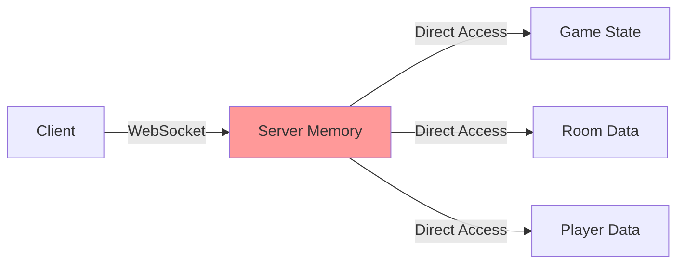
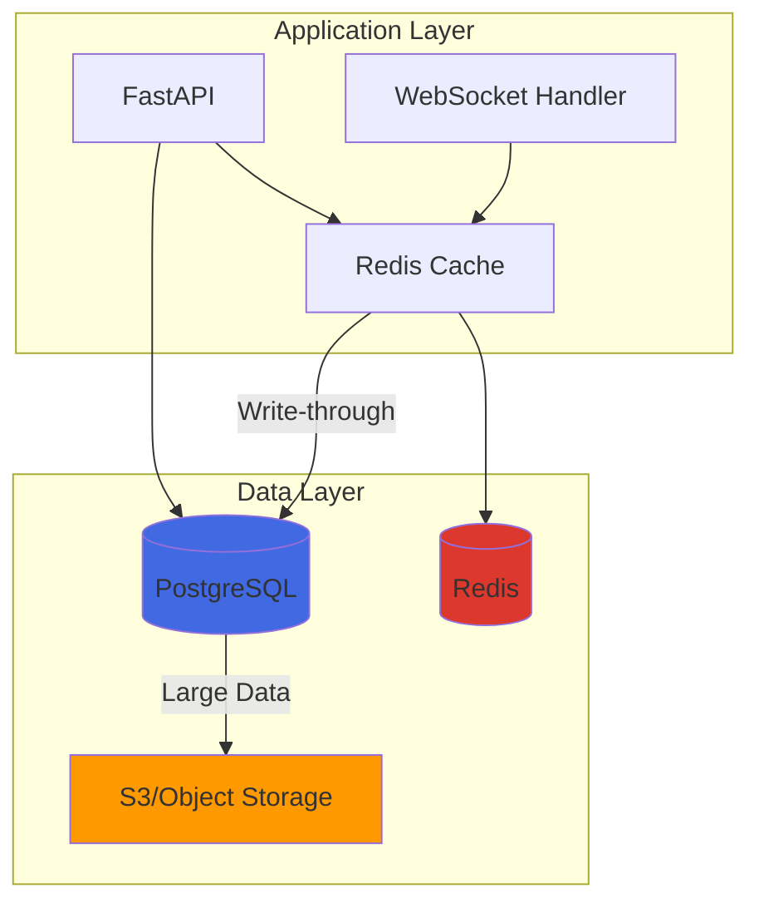
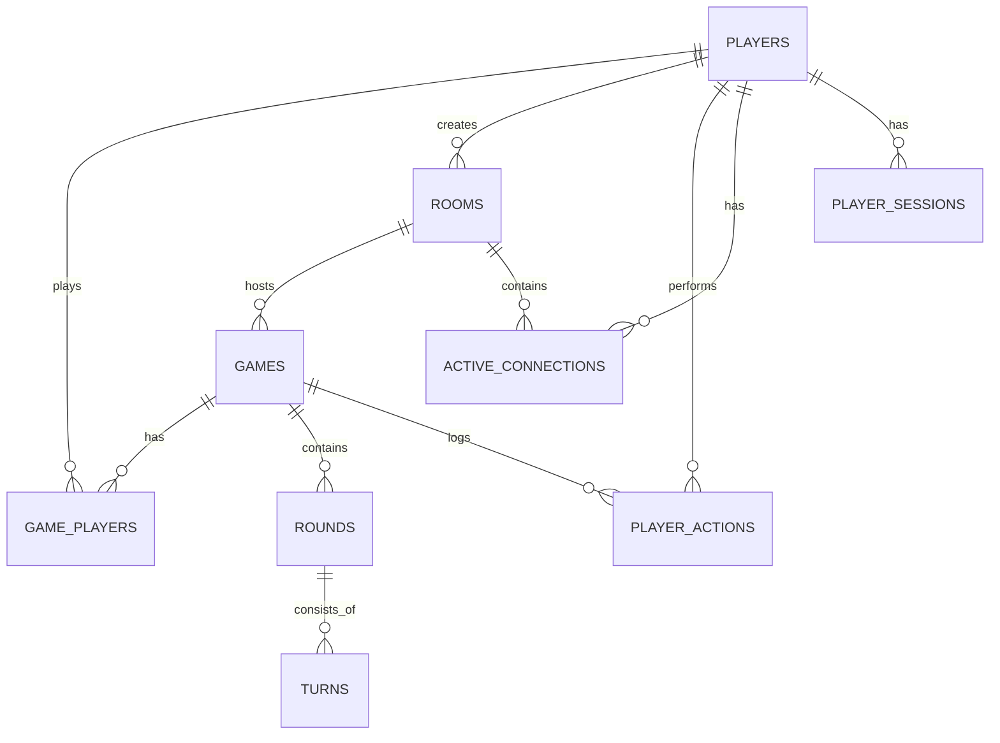

# Database Schema - Data Persistence Design

## Table of Contents
1. [Overview](#overview)
2. [Current Architecture](#current-architecture)
3. [Future Database Design](#future-database-design)
4. [Schema Design](#schema-design)
5. [Relationships](#relationships)
6. [Indexes and Performance](#indexes-and-performance)
7. [Data Migration](#data-migration)
8. [Caching Strategy](#caching-strategy)
9. [Security Considerations](#security-considerations)
10. [Implementation Plan](#implementation-plan)

## Overview

Currently, Liap Tui uses in-memory storage for all game state. This document outlines a future database schema design for implementing persistent storage, allowing for features like game history, player statistics, and crash recovery.

### Why Add Persistence?

1. **Game Recovery**: Resume games after server restarts
2. **Player Statistics**: Track wins, scores, and achievements
3. **Match History**: Review past games
4. **Leaderboards**: Global and friend rankings
5. **Analytics**: Understand player behavior

## Current Architecture

### In-Memory Storage

```python
# Current implementation
class RoomManager:
    def __init__(self):
        # All data stored in memory
        self.rooms: Dict[str, Room] = {}
        self.room_players: Dict[str, Set[str]] = {}
        self.player_rooms: Dict[str, str] = {}
        self.game_state_machines: Dict[str, GameStateMachine] = {}

# Pros:
# - Fast access (no I/O)
# - Simple implementation
# - No dependencies

# Cons:
# - Data lost on restart
# - No historical data
# - Limited by server memory
# - No horizontal scaling
```

### Current Data Flow



## Future Database Design

### Proposed Architecture



### Technology Choices

| Component | Technology | Rationale |
|-----------|------------|-----------|
| Primary DB | PostgreSQL | ACID compliance, JSON support, reliability |
| Cache | Redis | Fast access, pub/sub for real-time |
| Object Storage | S3/MinIO | Game replays, large analytics data |
| ORM | SQLAlchemy | Type safety, migrations, flexibility |

## Schema Design

### Core Tables

```sql
-- Players table
CREATE TABLE players (
    id UUID PRIMARY KEY DEFAULT gen_random_uuid(),
    username VARCHAR(50) UNIQUE NOT NULL,
    display_name VARCHAR(100) NOT NULL,
    email VARCHAR(255) UNIQUE,
    created_at TIMESTAMP WITH TIME ZONE DEFAULT NOW(),
    last_seen TIMESTAMP WITH TIME ZONE DEFAULT NOW(),
    is_active BOOLEAN DEFAULT true,
    
    -- Statistics
    games_played INTEGER DEFAULT 0,
    games_won INTEGER DEFAULT 0,
    total_score INTEGER DEFAULT 0,
    highest_score INTEGER DEFAULT 0,
    
    -- Settings
    settings JSONB DEFAULT '{}',
    
    CONSTRAINT username_valid CHECK (username ~ '^[a-zA-Z0-9_-]{3,50}$')
);

-- Rooms table
CREATE TABLE rooms (
    id UUID PRIMARY KEY DEFAULT gen_random_uuid(),
    room_code VARCHAR(20) UNIQUE NOT NULL,
    name VARCHAR(100) NOT NULL,
    created_by UUID REFERENCES players(id),
    created_at TIMESTAMP WITH TIME ZONE DEFAULT NOW(),
    
    -- Room settings
    is_public BOOLEAN DEFAULT true,
    max_players INTEGER DEFAULT 4,
    game_settings JSONB DEFAULT '{}',
    
    -- Status
    status VARCHAR(20) DEFAULT 'waiting',
    current_game_id UUID,
    
    CONSTRAINT status_valid CHECK (status IN ('waiting', 'playing', 'finished', 'abandoned'))
);

-- Games table
CREATE TABLE games (
    id UUID PRIMARY KEY DEFAULT gen_random_uuid(),
    room_id UUID REFERENCES rooms(id) ON DELETE CASCADE,
    started_at TIMESTAMP WITH TIME ZONE DEFAULT NOW(),
    ended_at TIMESTAMP WITH TIME ZONE,
    
    -- Game configuration
    winning_score INTEGER DEFAULT 50,
    max_rounds INTEGER DEFAULT 20,
    initial_multiplier INTEGER DEFAULT 1,
    
    -- Current state
    current_round INTEGER DEFAULT 0,
    current_phase VARCHAR(20) DEFAULT 'NOT_STARTED',
    phase_data JSONB DEFAULT '{}',
    
    -- Results
    winner_id UUID REFERENCES players(id),
    final_scores JSONB,
    
    CONSTRAINT phase_valid CHECK (current_phase IN (
        'NOT_STARTED', 'PREPARATION', 'DECLARATION', 'TURN', 'SCORING', 'GAME_OVER'
    ))
);

-- Game players junction table
CREATE TABLE game_players (
    game_id UUID REFERENCES games(id) ON DELETE CASCADE,
    player_id UUID REFERENCES players(id),
    position INTEGER NOT NULL CHECK (position BETWEEN 0 AND 3),
    
    -- Player game state
    score INTEGER DEFAULT 0,
    is_active BOOLEAN DEFAULT true,
    is_bot BOOLEAN DEFAULT false,
    
    -- Current round state
    pieces_in_hand JSONB DEFAULT '[]',
    declared_piles INTEGER,
    captured_piles INTEGER DEFAULT 0,
    
    PRIMARY KEY (game_id, player_id),
    UNIQUE (game_id, position)
);

-- Rounds table (for historical data)
CREATE TABLE rounds (
    id UUID PRIMARY KEY DEFAULT gen_random_uuid(),
    game_id UUID REFERENCES games(id) ON DELETE CASCADE,
    round_number INTEGER NOT NULL,
    started_at TIMESTAMP WITH TIME ZONE DEFAULT NOW(),
    ended_at TIMESTAMP WITH TIME ZONE,
    
    -- Round configuration
    multiplier INTEGER DEFAULT 1,
    had_redeal BOOLEAN DEFAULT false,
    
    -- Round results
    round_data JSONB NOT NULL,
    
    UNIQUE (game_id, round_number)
);

-- Turns table (for replay and analysis)
CREATE TABLE turns (
    id UUID PRIMARY KEY DEFAULT gen_random_uuid(),
    round_id UUID REFERENCES rounds(id) ON DELETE CASCADE,
    turn_number INTEGER NOT NULL,
    timestamp TIMESTAMP WITH TIME ZONE DEFAULT NOW(),
    
    -- Turn data
    leading_player_id UUID REFERENCES players(id),
    required_piece_count INTEGER,
    
    -- Plays made this turn
    plays JSONB NOT NULL,
    winner_id UUID REFERENCES players(id),
    pile_count INTEGER,
    
    UNIQUE (round_id, turn_number)
);

-- Player actions log (for replay and analytics)
CREATE TABLE player_actions (
    id BIGSERIAL PRIMARY KEY,
    game_id UUID REFERENCES games(id) ON DELETE CASCADE,
    player_id UUID REFERENCES players(id),
    action_type VARCHAR(50) NOT NULL,
    action_data JSONB NOT NULL,
    timestamp TIMESTAMP WITH TIME ZONE DEFAULT NOW(),
    sequence_number INTEGER NOT NULL,
    
    -- Indexing for fast queries
    INDEX idx_player_actions_game_id (game_id),
    INDEX idx_player_actions_player_id (player_id),
    INDEX idx_player_actions_timestamp (timestamp)
);
```

### Session and Connection Tables

```sql
-- Active connections (for reconnection)
CREATE TABLE active_connections (
    connection_id UUID PRIMARY KEY,
    player_id UUID REFERENCES players(id),
    room_id UUID REFERENCES rooms(id),
    connected_at TIMESTAMP WITH TIME ZONE DEFAULT NOW(),
    last_heartbeat TIMESTAMP WITH TIME ZONE DEFAULT NOW(),
    
    -- Connection metadata
    ip_address INET,
    user_agent TEXT,
    
    INDEX idx_active_connections_player_id (player_id),
    INDEX idx_active_connections_room_id (room_id)
);

-- Player sessions (for auth)
CREATE TABLE player_sessions (
    id UUID PRIMARY KEY DEFAULT gen_random_uuid(),
    player_id UUID REFERENCES players(id) ON DELETE CASCADE,
    token_hash VARCHAR(64) UNIQUE NOT NULL,
    created_at TIMESTAMP WITH TIME ZONE DEFAULT NOW(),
    expires_at TIMESTAMP WITH TIME ZONE NOT NULL,
    
    -- Session metadata
    ip_address INET,
    user_agent TEXT,
    
    INDEX idx_player_sessions_token_hash (token_hash),
    INDEX idx_player_sessions_expires_at (expires_at)
);
```

### Analytics Tables

```sql
-- Game analytics events
CREATE TABLE analytics_events (
    id BIGSERIAL PRIMARY KEY,
    event_type VARCHAR(50) NOT NULL,
    player_id UUID REFERENCES players(id),
    game_id UUID REFERENCES games(id),
    room_id UUID REFERENCES rooms(id),
    
    -- Event data
    event_data JSONB NOT NULL,
    timestamp TIMESTAMP WITH TIME ZONE DEFAULT NOW(),
    
    -- Partitioned by month for performance
    INDEX idx_analytics_events_timestamp (timestamp),
    INDEX idx_analytics_events_player_id (player_id)
) PARTITION BY RANGE (timestamp);

-- Create monthly partitions
CREATE TABLE analytics_events_2024_01 PARTITION OF analytics_events
    FOR VALUES FROM ('2024-01-01') TO ('2024-02-01');
```

## Relationships

### Entity Relationship Diagram



### Key Relationships

1. **Player → Games**: Many-to-many through game_players
2. **Game → Rounds**: One-to-many, ordered by round_number
3. **Round → Turns**: One-to-many, ordered by turn_number
4. **Player → Actions**: One-to-many, time-series data

## Indexes and Performance

### Primary Indexes

```sql
-- Most common queries
CREATE INDEX idx_game_players_player_games 
    ON game_players(player_id, game_id) 
    WHERE is_active = true;

CREATE INDEX idx_games_active_rooms 
    ON games(room_id) 
    WHERE ended_at IS NULL;

CREATE INDEX idx_player_actions_recent 
    ON player_actions(game_id, timestamp DESC);

-- Full-text search on room names
CREATE INDEX idx_rooms_name_search 
    ON rooms USING gin(to_tsvector('english', name));

-- JSONB indexes for common queries
CREATE INDEX idx_games_phase_data 
    ON games USING gin(phase_data);

CREATE INDEX idx_game_players_pieces 
    ON game_players USING gin(pieces_in_hand);
```

### Query Optimization

```sql
-- Materialized view for leaderboard
CREATE MATERIALIZED VIEW player_leaderboard AS
SELECT 
    p.id,
    p.username,
    p.display_name,
    p.games_won,
    p.games_played,
    p.highest_score,
    CASE 
        WHEN p.games_played > 0 
        THEN p.games_won::float / p.games_played 
        ELSE 0 
    END as win_rate,
    RANK() OVER (ORDER BY p.games_won DESC) as wins_rank,
    RANK() OVER (ORDER BY p.highest_score DESC) as score_rank
FROM players p
WHERE p.games_played >= 10;

-- Refresh periodically
CREATE INDEX idx_player_leaderboard_wins ON player_leaderboard(wins_rank);
CREATE INDEX idx_player_leaderboard_score ON player_leaderboard(score_rank);
```

## Data Migration

### Migration Strategy

```python
# backend/database/migration.py
from typing import Dict, Any
import asyncio
from sqlalchemy.ext.asyncio import AsyncSession

class DataMigrator:
    """Migrate from in-memory to persistent storage."""
    
    async def migrate_active_games(
        self,
        room_manager: RoomManager,
        db: AsyncSession
    ):
        """Migrate currently active games to database."""
        for room_id, room in room_manager.rooms.items():
            # Create room record
            db_room = Room(
                room_code=room_id,
                name=room.name,
                created_by=room.creator_id,
                is_public=room.is_public,
                status='playing' if room.game_started else 'waiting'
            )
            db.add(db_room)
            
            # Migrate game if active
            if room_id in room_manager.game_state_machines:
                game_sm = room_manager.game_state_machines[room_id]
                await self.migrate_game_state(game_sm, db_room, db)
        
        await db.commit()
    
    async def migrate_game_state(
        self,
        game_sm: GameStateMachine,
        db_room: Room,
        db: AsyncSession
    ):
        """Migrate game state machine to database."""
        # Create game record
        db_game = Game(
            room_id=db_room.id,
            current_round=game_sm.game.round_number,
            current_phase=game_sm.current_state.phase.value,
            phase_data=self.serialize_phase_data(game_sm.current_state)
        )
        db.add(db_game)
        
        # Migrate players
        for i, player in enumerate(game_sm.game.players):
            db_game_player = GamePlayer(
                game_id=db_game.id,
                player_id=await self.get_or_create_player(player.name, db),
                position=i,
                score=player.score,
                pieces_in_hand=[p.to_dict() for p in player.hand],
                declared_piles=player.declared,
                captured_piles=player.captured_piles
            )
            db.add(db_game_player)
```

### Backward Compatibility

```python
class HybridStorage:
    """Support both in-memory and database storage."""
    
    def __init__(self, db_session: AsyncSession):
        self.memory_store = {}
        self.db = db_session
        self.cache = Redis()
    
    async def get_game_state(self, game_id: str) -> Optional[Dict]:
        # Check memory first
        if game_id in self.memory_store:
            return self.memory_store[game_id]
        
        # Check cache
        cached = await self.cache.get(f"game:{game_id}")
        if cached:
            return json.loads(cached)
        
        # Check database
        db_game = await self.db.get(Game, game_id)
        if db_game:
            state = self.game_to_dict(db_game)
            # Populate cache
            await self.cache.setex(
                f"game:{game_id}",
                300,  # 5 minutes
                json.dumps(state)
            )
            return state
        
        return None
```

## Caching Strategy

### Redis Cache Schema

```python
# Cache keys structure
CACHE_KEYS = {
    # Game state - short TTL
    "game_state": "game:{game_id}:state",  # 5 minutes
    "game_players": "game:{game_id}:players",  # 5 minutes
    
    # Room data - medium TTL
    "room_info": "room:{room_id}:info",  # 30 minutes
    "room_list": "rooms:public:list",  # 1 minute
    
    # Player data - long TTL
    "player_stats": "player:{player_id}:stats",  # 1 hour
    "player_games": "player:{player_id}:games",  # 30 minutes
    
    # Leaderboards - medium TTL
    "leaderboard_wins": "leaderboard:wins:top100",  # 15 minutes
    "leaderboard_score": "leaderboard:score:top100",  # 15 minutes
}
```

### Cache Warming

```python
class CacheWarmer:
    """Preload frequently accessed data."""
    
    async def warm_game_cache(self, game_id: str):
        """Load game data into cache."""
        # Get from database
        game = await self.db.get(Game, game_id)
        if not game:
            return
        
        # Cache game state
        await self.cache.setex(
            f"game:{game_id}:state",
            300,
            json.dumps(self.serialize_game(game))
        )
        
        # Cache player list
        players = await self.get_game_players(game_id)
        await self.cache.setex(
            f"game:{game_id}:players",
            300,
            json.dumps(players)
        )
    
    async def warm_leaderboard_cache(self):
        """Update leaderboard caches."""
        # Get top players by wins
        top_wins = await self.db.execute(
            select(Player)
            .order_by(Player.games_won.desc())
            .limit(100)
        )
        
        await self.cache.setex(
            "leaderboard:wins:top100",
            900,  # 15 minutes
            json.dumps([p.to_dict() for p in top_wins])
        )
```

## Security Considerations

### Data Protection

```sql
-- Row-level security for player data
ALTER TABLE players ENABLE ROW LEVEL SECURITY;

CREATE POLICY players_select_policy ON players
    FOR SELECT
    USING (true);  -- Public profiles

CREATE POLICY players_update_policy ON players
    FOR UPDATE
    USING (id = current_user_id());  -- Only update own profile

-- Sensitive data encryption
CREATE EXTENSION IF NOT EXISTS pgcrypto;

-- Store sensitive data encrypted
ALTER TABLE players 
    ADD COLUMN email_encrypted BYTEA;

-- Encrypt on insert/update
CREATE OR REPLACE FUNCTION encrypt_email() RETURNS TRIGGER AS $$
BEGIN
    IF NEW.email IS NOT NULL THEN
        NEW.email_encrypted = pgp_sym_encrypt(
            NEW.email::text,
            current_setting('app.encryption_key')
        );
        NEW.email = NULL;  -- Don't store plaintext
    END IF;
    RETURN NEW;
END;
$$ LANGUAGE plpgsql;

CREATE TRIGGER encrypt_player_email
    BEFORE INSERT OR UPDATE ON players
    FOR EACH ROW
    EXECUTE FUNCTION encrypt_email();
```

### Audit Trail

```sql
-- Audit log for sensitive operations
CREATE TABLE audit_log (
    id BIGSERIAL PRIMARY KEY,
    table_name VARCHAR(50) NOT NULL,
    operation VARCHAR(10) NOT NULL,
    user_id UUID,
    changed_data JSONB,
    timestamp TIMESTAMP WITH TIME ZONE DEFAULT NOW(),
    ip_address INET
);

-- Trigger for audit logging
CREATE OR REPLACE FUNCTION audit_trigger() RETURNS TRIGGER AS $$
BEGIN
    INSERT INTO audit_log (table_name, operation, user_id, changed_data)
    VALUES (
        TG_TABLE_NAME,
        TG_OP,
        current_user_id(),
        to_jsonb(NEW)
    );
    RETURN NEW;
END;
$$ LANGUAGE plpgsql;

-- Apply to sensitive tables
CREATE TRIGGER audit_players
    AFTER INSERT OR UPDATE OR DELETE ON players
    FOR EACH ROW
    EXECUTE FUNCTION audit_trigger();
```

## Implementation Plan

### Phase 1: Basic Persistence (2 weeks)
1. Set up PostgreSQL and Redis
2. Create schema and migrations
3. Implement player and room tables
4. Add session management

### Phase 2: Game State (3 weeks)
1. Implement game state persistence
2. Add crash recovery
3. Cache layer implementation
4. Migration tools

### Phase 3: Analytics (2 weeks)
1. Player action logging
2. Game analytics events
3. Leaderboard implementation
4. Basic reporting

### Phase 4: Advanced Features (3 weeks)
1. Game replay system
2. Player statistics
3. Achievements system
4. Friend system

### Migration Checklist

- [ ] Database setup and configuration
- [ ] Schema creation and migrations
- [ ] ORM model definitions
- [ ] Cache layer implementation
- [ ] Data migration scripts
- [ ] Backward compatibility layer
- [ ] Performance testing
- [ ] Security audit
- [ ] Monitoring and alerts
- [ ] Documentation update

## Summary

The database schema provides:

1. **Data Persistence**: Games survive server restarts
2. **Player Progress**: Track statistics and achievements
3. **Analytics**: Understand player behavior
4. **Scalability**: Support for horizontal scaling
5. **Performance**: Optimized queries with proper indexing
6. **Security**: Encryption and audit trails
7. **Flexibility**: JSONB for evolving game data

This design balances performance, flexibility, and maintainability while providing a clear migration path from the current in-memory system.