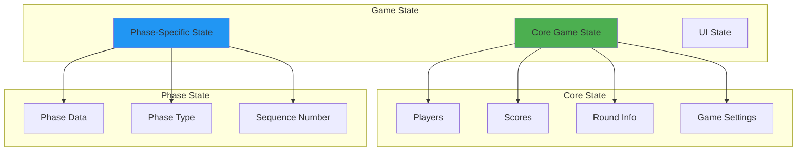

# Game State Structure - Phase-by-Phase Data Model

## Table of Contents
1. [Overview](#overview)
2. [Core State Structure](#core-state-structure)
3. [Phase-Specific State](#phase-specific-state)
4. [WAITING Phase State](#waiting-phase-state)
5. [PREPARATION Phase State](#preparation-phase-state)
6. [DECLARATION Phase State](#declaration-phase-state)
7. [TURN Phase State](#turn-phase-state)
8. [TURN_RESULTS Phase State](#turn_results-phase-state)
9. [SCORING Phase State](#scoring-phase-state)
10. [GAME_OVER Phase State](#game_over-phase-state)
11. [State Transitions](#state-transitions)
12. [State Persistence](#state-persistence)

## Overview

The game state in Liap Tui is managed through a combination of core game data and phase-specific data. This document details the exact structure of the state at each phase of the game.

### State Architecture



## Core State Structure

### Base Game State

```typescript
interface GameState {
  // Phase information
  phase: GamePhase;
  phase_data: PhaseData; // Phase-specific data
  
  // Game information
  game_id: string;
  room_id: string;
  round_number: number;
  turn_number: number;
  
  // Player information
  players: Player[];
  scores: Record<string, number>;
  
  // Settings
  settings: GameSettings;
  
  // Metadata
  sequence_number: number;
  last_update: number;
  created_at: number;
}

enum GamePhase {
  WAITING = "WAITING",
  PREPARATION = "PREPARATION",
  ROUND_START = "ROUND_START",
  DECLARATION = "DECLARATION",
  TURN = "TURN",
  TURN_RESULTS = "TURN_RESULTS",
  SCORING = "SCORING",
  GAME_OVER = "GAME_OVER"
}
```

### Player State

```typescript
interface Player {
  // Identity
  name: string;
  id: string;
  
  // Game position
  position: number; // 0-3
  
  // Status
  is_host: boolean;
  is_bot: boolean;
  connection_status: 'connected' | 'disconnected';
  
  // Game data
  score: number;
  pieces_remaining: number;
  declared_piles?: number;
  captured_piles?: number;
  
  // Round data
  has_declared: boolean;
  has_played_this_turn: boolean;
  passed: boolean;
}
```

### Game Settings

```typescript
interface GameSettings {
  max_players: number;
  winning_score: number;
  max_rounds: number;
  allow_bots: boolean;
  redeal_enabled: boolean;
  timer_enabled: boolean;
  timer_duration: number;
}
```

## Phase-Specific State

Each phase has its own specific state structure stored in `phase_data`:

```typescript
type PhaseData = 
  | WaitingPhaseData
  | PreparationPhaseData
  | DeclarationPhaseData
  | TurnPhaseData
  | TurnResultsPhaseData
  | ScoringPhaseData
  | GameOverPhaseData;
```

## WAITING Phase State

The initial phase when the room is created but the game hasn't started.

```typescript
interface WaitingPhaseData {
  // Room info
  room_code: string;
  host: string;
  
  // Player management
  players: string[];
  ready_players: string[];
  
  // Settings
  room_settings: {
    max_players: number;
    is_public: boolean;
    allow_spectators: boolean;
  };
  
  // Metadata
  created_at: number;
  last_activity: number;
}
```

### Example WAITING State

```json
{
  "phase": "WAITING",
  "phase_data": {
    "room_code": "ABCD1234",
    "host": "Alice",
    "players": ["Alice", "Bob"],
    "ready_players": ["Alice"],
    "room_settings": {
      "max_players": 4,
      "is_public": true,
      "allow_spectators": false
    },
    "created_at": 1673890123456,
    "last_activity": 1673890150000
  },
  "players": [
    {
      "name": "Alice",
      "id": "alice_123",
      "position": 0,
      "is_host": true,
      "is_bot": false,
      "connection_status": "connected"
    },
    {
      "name": "Bob",
      "id": "bob_456",
      "position": 1,
      "is_host": false,
      "is_bot": false,
      "connection_status": "connected"
    }
  ]
}
```

## PREPARATION Phase State

The phase where cards are dealt and weak hands are handled.

```typescript
interface PreparationPhaseData {
  // Deal status
  dealing_cards: boolean;
  cards_dealt: boolean;
  
  // Weak hand handling
  weak_players: string[];
  redeal_requests: {
    accepted: string[];
    declined: string[];
    pending: string[];
  };
  redeal_count: number;
  redeal_multiplier: number;
  
  // Timer
  phase_start_time: number;
  timeout?: number;
}
```

### Example PREPARATION State

```json
{
  "phase": "PREPARATION",
  "phase_data": {
    "dealing_cards": false,
    "cards_dealt": true,
    "weak_players": ["Bob", "Carol"],
    "redeal_requests": {
      "accepted": ["Bob"],
      "declined": [],
      "pending": ["Carol"]
    },
    "redeal_count": 1,
    "redeal_multiplier": 2,
    "phase_start_time": 1673890200000,
    "timeout": 30000
  },
  "round_number": 1,
  "turn_number": 0
}
```

## DECLARATION Phase State

The phase where players declare how many piles they'll capture.

```typescript
interface DeclarationPhaseData {
  // Declarations
  declarations: Record<string, number | null>;
  
  // Status
  waiting_for: string[];
  all_declared: boolean;
  
  // Validation
  total_declared: number;
  valid_total: boolean; // Total should not equal 8
  
  // Timer
  declaration_timeout: number;
  time_remaining: number;
}
```

### Example DECLARATION State

```json
{
  "phase": "DECLARATION",
  "phase_data": {
    "declarations": {
      "Alice": 3,
      "Bob": 2,
      "Carol": null,
      "David": null
    },
    "waiting_for": ["Carol", "David"],
    "all_declared": false,
    "total_declared": 5,
    "valid_total": true,
    "declaration_timeout": 30000,
    "time_remaining": 15000
  }
}
```

## TURN Phase State

The main gameplay phase where players take turns playing pieces.

```typescript
interface TurnPhaseData {
  // Turn management
  current_player: string;
  turn_number: number;
  turn_order: string[];
  
  // Play requirements
  required_piece_count: number;
  leading_play_type?: 'SINGLE' | 'PAIR' | 'TRIPLE' | 'QUAD' | 'MIXED';
  
  // Current turn state
  current_plays: Record<string, PlayInfo>;
  passed_players: string[];
  
  // Pile tracking
  pile_counts: Record<string, number>;
  current_pile_size: number;
  
  // History
  last_winner?: string;
  consecutive_passes: number;
}

interface PlayInfo {
  pieces: Piece[];
  play_type: string;
  timestamp: number;
}
```

### Example TURN State

```json
{
  "phase": "TURN",
  "phase_data": {
    "current_player": "Bob",
    "turn_number": 5,
    "turn_order": ["Alice", "Bob", "Carol", "David"],
    "required_piece_count": 2,
    "leading_play_type": "PAIR",
    "current_plays": {
      "Alice": {
        "pieces": [
          {"id": "p1", "rank": "HORSE", "color": "RED", "point": 7},
          {"id": "p2", "rank": "HORSE", "color": "RED", "point": 7}
        ],
        "play_type": "PAIR",
        "timestamp": 1673890300000
      }
    },
    "passed_players": ["Carol"],
    "pile_counts": {
      "Alice": 2,
      "Bob": 1,
      "Carol": 1,
      "David": 0
    },
    "current_pile_size": 4,
    "last_winner": "Alice",
    "consecutive_passes": 1
  }
}
```

## TURN_RESULTS Phase State

Brief phase showing the results of a completed turn.

```typescript
interface TurnResultsPhaseData {
  // Turn results
  plays: TurnPlay[];
  winner: string;
  winning_play: Piece[];
  play_type: string;
  
  // Pile info
  pile_size: number;
  pile_winner: string;
  
  // Display timer
  display_duration: number;
  display_start_time: number;
}

interface TurnPlay {
  player: string;
  pieces: Piece[];
  play_type: string;
  passed: boolean;
}
```

### Example TURN_RESULTS State

```json
{
  "phase": "TURN_RESULTS",
  "phase_data": {
    "plays": [
      {
        "player": "Alice",
        "pieces": [
          {"rank": "GENERAL", "color": "RED", "point": 10},
          {"rank": "ADVISOR", "color": "BLACK", "point": 10}
        ],
        "play_type": "MIXED_COLOR",
        "passed": false
      },
      {
        "player": "Bob",
        "pieces": [
          {"rank": "ELEPHANT", "color": "RED", "point": 9},
          {"rank": "ELEPHANT", "color": "RED", "point": 9}
        ],
        "play_type": "PAIR",
        "passed": false
      },
      {
        "player": "Carol",
        "pieces": [],
        "play_type": "PASS",
        "passed": true
      }
    ],
    "winner": "Alice",
    "winning_play": [
      {"rank": "GENERAL", "color": "RED", "point": 10},
      {"rank": "ADVISOR", "color": "BLACK", "point": 10}
    ],
    "play_type": "MIXED_COLOR",
    "pile_size": 6,
    "pile_winner": "Alice",
    "display_duration": 3000,
    "display_start_time": 1673890350000
  }
}
```

## SCORING Phase State

Phase where round scores are calculated and displayed.

```typescript
interface ScoringPhaseData {
  // Round info
  round_number: number;
  
  // Scoring details
  scores: Record<string, ScoreDetail>;
  
  // Multiplier
  base_multiplier: number;
  redeal_multiplier: number;
  total_multiplier: number;
  
  // Special scoring
  special_bonuses: SpecialBonus[];
  
  // Next round
  is_final_round: boolean;
  next_round_dealer?: string;
}

interface ScoreDetail {
  declared: number;
  captured: number;
  difference: number;
  base_points: number;
  multiplied_points: number;
  round_total: number;
  game_total: number;
}

interface SpecialBonus {
  player: string;
  type: string;
  points: number;
  description: string;
}
```

### Example SCORING State

```json
{
  "phase": "SCORING",
  "phase_data": {
    "round_number": 3,
    "scores": {
      "Alice": {
        "declared": 3,
        "captured": 3,
        "difference": 0,
        "base_points": 9,
        "multiplied_points": 9,
        "round_total": 9,
        "game_total": 25
      },
      "Bob": {
        "declared": 2,
        "captured": 1,
        "difference": -1,
        "base_points": -3,
        "multiplied_points": -3,
        "round_total": -3,
        "game_total": 12
      }
    },
    "base_multiplier": 1,
    "redeal_multiplier": 1,
    "total_multiplier": 1,
    "special_bonuses": [],
    "is_final_round": false,
    "next_round_dealer": "Bob"
  }
}
```

## GAME_OVER Phase State

Final phase showing game results and statistics.

```typescript
interface GameOverPhaseData {
  // Winners
  winners: string[];
  win_condition: 'SCORE_REACHED' | 'MAX_ROUNDS' | 'FORFEIT';
  
  // Final scores
  final_scores: Record<string, number>;
  score_history: RoundScore[];
  
  // Statistics
  game_statistics: {
    total_rounds: number;
    total_turns: number;
    game_duration: number;
    total_piles: number;
    largest_pile: number;
    perfect_declarations: Record<string, number>;
    most_piles_captured: {
      player: string;
      count: number;
    };
  };
  
  // Achievements
  achievements: Achievement[];
  
  // Replay
  can_play_again: boolean;
  rematch_votes: string[];
}

interface RoundScore {
  round: number;
  scores: Record<string, number>;
}

interface Achievement {
  player: string;
  type: string;
  title: string;
  description: string;
}
```

### Example GAME_OVER State

```json
{
  "phase": "GAME_OVER",
  "phase_data": {
    "winners": ["Alice"],
    "win_condition": "SCORE_REACHED",
    "final_scores": {
      "Alice": 52,
      "Bob": 35,
      "Carol": 28,
      "David": 15
    },
    "score_history": [
      {
        "round": 1,
        "scores": {"Alice": 9, "Bob": 6, "Carol": 3, "David": 0}
      },
      {
        "round": 2,
        "scores": {"Alice": 18, "Bob": 15, "Carol": 9, "David": 3}
      }
    ],
    "game_statistics": {
      "total_rounds": 7,
      "total_turns": 84,
      "game_duration": 1800000,
      "total_piles": 112,
      "largest_pile": 8,
      "perfect_declarations": {
        "Alice": 4,
        "Bob": 2,
        "Carol": 3,
        "David": 1
      },
      "most_piles_captured": {
        "player": "Alice",
        "count": 35
      }
    },
    "achievements": [
      {
        "player": "Alice",
        "type": "PERFECT_ROUND",
        "title": "Perfect Predictor",
        "description": "Captured exactly as many piles as declared"
      }
    ],
    "can_play_again": true,
    "rematch_votes": ["Alice", "Bob"]
  }
}
```

## State Transitions

### State Change Flow

```typescript
// State transition with validation
async function transitionState(
  currentState: GameState,
  newPhase: GamePhase,
  phaseData: PhaseData
): Promise<GameState> {
  // Validate transition
  if (!isValidTransition(currentState.phase, newPhase)) {
    throw new Error(`Invalid transition: ${currentState.phase} -> ${newPhase}`);
  }
  
  // Create new state
  const newState: GameState = {
    ...currentState,
    phase: newPhase,
    phase_data: phaseData,
    sequence_number: currentState.sequence_number + 1,
    last_update: Date.now()
  };
  
  // Phase-specific updates
  switch (newPhase) {
    case GamePhase.TURN:
      newState.turn_number += 1;
      break;
      
    case GamePhase.SCORING:
      // Update scores in core state
      newState.scores = calculateScores(phaseData);
      break;
      
    case GamePhase.PREPARATION:
      if (currentState.phase === GamePhase.SCORING) {
        newState.round_number += 1;
        newState.turn_number = 0;
      }
      break;
  }
  
  return newState;
}
```

### Valid Transitions

```typescript
const VALID_TRANSITIONS: Record<GamePhase, GamePhase[]> = {
  WAITING: [GamePhase.PREPARATION],
  PREPARATION: [GamePhase.DECLARATION, GamePhase.ROUND_START],
  ROUND_START: [GamePhase.DECLARATION],
  DECLARATION: [GamePhase.TURN],
  TURN: [GamePhase.TURN_RESULTS],
  TURN_RESULTS: [GamePhase.TURN, GamePhase.SCORING],
  SCORING: [GamePhase.PREPARATION, GamePhase.GAME_OVER],
  GAME_OVER: []
};
```

## State Persistence

### Serialization

```typescript
// Convert game state to JSON-safe format
function serializeGameState(state: GameState): string {
  return JSON.stringify(state, (key, value) => {
    // Handle special types
    if (value instanceof Date) {
      return value.toISOString();
    }
    if (value instanceof Map) {
      return Object.fromEntries(value);
    }
    if (value instanceof Set) {
      return Array.from(value);
    }
    return value;
  });
}

// Restore game state from JSON
function deserializeGameState(json: string): GameState {
  return JSON.parse(json, (key, value) => {
    // Restore dates
    if (typeof value === 'string' && /^\d{4}-\d{2}-\d{2}T/.test(value)) {
      return new Date(value);
    }
    return value;
  });
}
```

### State Snapshots

```typescript
interface StateSnapshot {
  game_id: string;
  room_id: string;
  timestamp: number;
  sequence_number: number;
  state: GameState;
  checksum: string;
}

// Create snapshot for recovery
function createSnapshot(state: GameState): StateSnapshot {
  const serialized = serializeGameState(state);
  
  return {
    game_id: state.game_id,
    room_id: state.room_id,
    timestamp: Date.now(),
    sequence_number: state.sequence_number,
    state: state,
    checksum: calculateChecksum(serialized)
  };
}
```

## Summary

The game state structure provides:

1. **Clear Separation**: Core state vs phase-specific state
2. **Type Safety**: Strongly typed interfaces for each phase
3. **Predictability**: Well-defined state transitions
4. **Debuggability**: Complete state visible at any time
5. **Persistence**: JSON-serializable for save/restore

This comprehensive state model ensures consistency across all clients and enables features like spectating, replay, and crash recovery.