# Deployment Patterns - AWS ECS Production Setup

## Table of Contents
1. [Overview](#overview)
2. [Architecture Overview](#architecture-overview)
3. [Container Strategy](#container-strategy)
4. [AWS ECS Configuration](#aws-ecs-configuration)
5. [Load Balancing](#load-balancing)
6. [Auto-Scaling](#auto-scaling)
7. [Monitoring & Logging](#monitoring--logging)
8. [Security Configuration](#security-configuration)
9. [Cost Optimization](#cost-optimization)
10. [Disaster Recovery](#disaster-recovery)

## Overview

This document outlines production deployment patterns for Liap Tui using AWS ECS (Elastic Container Service). The architecture emphasizes scalability, reliability, and cost-effectiveness for a real-time multiplayer game.

### Deployment Goals

1. **High Availability**: 99.9% uptime target
2. **Auto-Scaling**: Handle 100 to 10,000 concurrent players
3. **Low Latency**: <100ms WebSocket latency
4. **Cost Efficient**: Pay for what you use
5. **Zero Downtime**: Blue-green deployments

## Architecture Overview

### Production Architecture

```mermaid
graph TB
    subgraph "Internet"
        Users[Players]
    end
    
    subgraph "AWS Edge"
        CF[CloudFront CDN]
        WAF[AWS WAF]
    end
    
    subgraph "Load Balancing"
        ALB[Application Load Balancer]
        NLB[Network Load Balancer]
    end
    
    subgraph "ECS Cluster"
        subgraph "Service A"
            Task1[ECS Task 1]
            Task2[ECS Task 2]
        end
        subgraph "Service B"
            Task3[ECS Task 3]
            Task4[ECS Task 4]
        end
    end
    
    subgraph "Data Layer"
        ElastiCache[(Redis)]
        RDS[(PostgreSQL)]
        S3[S3 Bucket]
    end
    
    subgraph "Monitoring"
        CW[CloudWatch]
        XRay[X-Ray]
    end
    
    Users --> CF
    CF --> WAF
    WAF --> ALB
    ALB --> NLB
    NLB --> Task1
    NLB --> Task2
    NLB --> Task3
    NLB --> Task4
    
    Task1 --> ElastiCache
    Task2 --> ElastiCache
    Task3 --> RDS
    Task4 --> S3
    
    Task1 --> CW
    Task2 --> XRay
    
    style CF fill:#FF9900
    style ALB fill:#FF9900
    style Task1 fill:#146EB4
    style ElastiCache fill:#C92540
    style RDS fill:#232F3E
```



### Component Responsibilities

| Component | Purpose | Technology |
|-----------|---------|------------|
| CDN | Static assets, DDoS protection | CloudFront |
| WAF | Application firewall | AWS WAF |
| Load Balancer | Request distribution | ALB for HTTP, NLB for WebSocket |
| Container Service | Application hosting | ECS Fargate |
| Cache | Session state, game state | ElastiCache Redis |
| Database | Player data, game history | RDS PostgreSQL |
| Object Storage | Replays, logs | S3 |
| Monitoring | Metrics and tracing | CloudWatch, X-Ray |

## Container Strategy

### Docker Configuration

```dockerfile
# Production Dockerfile
FROM python:3.11-slim as backend-builder

# Build arguments
ARG BUILD_VERSION
ARG BUILD_COMMIT

# Install dependencies
WORKDIR /app
COPY backend/requirements.txt .
RUN pip install --no-cache-dir -r requirements.txt

# Copy application
COPY backend/ .

# Build frontend
FROM node:20-alpine as frontend-builder

WORKDIR /app
COPY frontend/package*.json ./
RUN npm ci --only=production

COPY frontend/ .
RUN npm run build

# Final production image
FROM python:3.11-slim

# Runtime dependencies
RUN apt-get update && apt-get install -y \
    nginx \
    supervisor \
    curl \
    && rm -rf /var/lib/apt/lists/*

# Copy backend
WORKDIR /app
COPY --from=backend-builder /app /app
COPY --from=backend-builder /usr/local/lib/python3.11/site-packages /usr/local/lib/python3.11/site-packages

# Copy frontend
COPY --from=frontend-builder /app/dist /var/www/html

# Configuration files
COPY deployment/nginx.conf /etc/nginx/nginx.conf
COPY deployment/supervisord.conf /etc/supervisor/conf.d/supervisord.conf

# Health check
HEALTHCHECK --interval=30s --timeout=3s --start-period=10s --retries=3 \
    CMD curl -f http://localhost/api/health || exit 1

# Environment variables
ENV PYTHONUNBUFFERED=1
ENV BUILD_VERSION=${BUILD_VERSION}
ENV BUILD_COMMIT=${BUILD_COMMIT}

# Expose ports
EXPOSE 80 8000

# Start services
CMD ["/usr/bin/supervisord", "-c", "/etc/supervisor/conf.d/supervisord.conf"]
```

### Multi-Stage Build Benefits

1. **Smaller Images**: Production image ~150MB vs ~500MB
2. **Security**: No build tools in production
3. **Caching**: Efficient layer caching
4. **Versioning**: Build metadata included

### Container Best Practices

```yaml
# docker-compose.prod.yml
version: '3.8'

services:
  app:
    image: ${ECR_REGISTRY}/liap-tui:${VERSION}
    environment:
      - ENV=production
      - REDIS_URL=redis://${REDIS_HOST}:6379
      - DATABASE_URL=postgresql://${DB_USER}:${DB_PASS}@${DB_HOST}/liaptui
      - CORS_ORIGINS=${ALLOWED_ORIGINS}
      - LOG_LEVEL=info
    deploy:
      resources:
        limits:
          cpus: '2'
          memory: 2G
        reservations:
          cpus: '0.5'
          memory: 512M
    logging:
      driver: awslogs
      options:
        awslogs-group: /ecs/liap-tui
        awslogs-region: us-east-1
        awslogs-stream-prefix: app
```

## AWS ECS Configuration

### Task Definition

```json
{
  "family": "liap-tui-production",
  "networkMode": "awsvpc",
  "requiresCompatibilities": ["FARGATE"],
  "cpu": "1024",
  "memory": "2048",
  "containerDefinitions": [
    {
      "name": "liap-tui-app",
      "image": "${ECR_REGISTRY}/liap-tui:${VERSION}",
      "essential": true,
      "portMappings": [
        {
          "containerPort": 80,
          "protocol": "tcp"
        },
        {
          "containerPort": 8000,
          "protocol": "tcp"
        }
      ],
      "environment": [
        {
          "name": "ENV",
          "value": "production"
        }
      ],
      "secrets": [
        {
          "name": "DATABASE_URL",
          "valueFrom": "arn:aws:secretsmanager:region:account:secret:liap-tui/db-url"
        },
        {
          "name": "REDIS_URL",
          "valueFrom": "arn:aws:secretsmanager:region:account:secret:liap-tui/redis-url"
        }
      ],
      "healthCheck": {
        "command": ["CMD-SHELL", "curl -f http://localhost/api/health || exit 1"],
        "interval": 30,
        "timeout": 5,
        "retries": 3,
        "startPeriod": 60
      },
      "logConfiguration": {
        "logDriver": "awslogs",
        "options": {
          "awslogs-group": "/ecs/liap-tui",
          "awslogs-region": "us-east-1",
          "awslogs-stream-prefix": "ecs"
        }
      }
    }
  ],
  "executionRoleArn": "arn:aws:iam::account:role/ecsTaskExecutionRole",
  "taskRoleArn": "arn:aws:iam::account:role/liap-tui-task-role"
}
```

### Service Configuration

```yaml
# ecs-service.yml
apiVersion: v1
kind: Service
metadata:
  name: liap-tui-service
spec:
  cluster: production-cluster
  taskDefinition: liap-tui-production:latest
  desiredCount: 3
  launchType: FARGATE
  networkConfiguration:
    awsvpcConfiguration:
      subnets:
        - subnet-12345678
        - subnet-87654321
        - subnet-11223344
      securityGroups:
        - sg-app-servers
      assignPublicIp: DISABLED
  loadBalancers:
    - targetGroupArn: arn:aws:elasticloadbalancing:region:account:targetgroup/liap-tui/abc123
      containerName: liap-tui-app
      containerPort: 80
  deploymentConfiguration:
    maximumPercent: 200
    minimumHealthyPercent: 100
    deploymentCircuitBreaker:
      enable: true
      rollback: true
  placementStrategies:
    - type: spread
      field: attribute:ecs.availability-zone
```

### ECS Cluster Setup

```bash
# Create ECS cluster with capacity providers
aws ecs create-cluster \
  --cluster-name production-cluster \
  --capacity-providers FARGATE FARGATE_SPOT \
  --default-capacity-provider-strategy \
    capacityProvider=FARGATE,weight=2,base=1 \
    capacityProvider=FARGATE_SPOT,weight=3,base=0 \
  --settings name=containerInsights,value=enabled
```

## Load Balancing

### Dual Load Balancer Strategy

```yaml
# Application Load Balancer (HTTP/HTTPS)
ALB:
  Type: AWS::ElasticLoadBalancingV2::LoadBalancer
  Properties:
    Type: application
    Scheme: internet-facing
    SecurityGroups:
      - !Ref ALBSecurityGroup
    Subnets:
      - !Ref PublicSubnet1
      - !Ref PublicSubnet2
      - !Ref PublicSubnet3
    Tags:
      - Key: Name
        Value: liap-tui-alb

# Network Load Balancer (WebSocket)
NLB:
  Type: AWS::ElasticLoadBalancingV2::LoadBalancer
  Properties:
    Type: network
    Scheme: internet-facing
    Subnets:
      - !Ref PublicSubnet1
      - !Ref PublicSubnet2
      - !Ref PublicSubnet3
    Tags:
      - Key: Name
        Value: liap-tui-nlb
```

### Target Group Configuration

```yaml
# WebSocket target group with sticky sessions
WebSocketTargetGroup:
  Type: AWS::ElasticLoadBalancingV2::TargetGroup
  Properties:
    Port: 8000
    Protocol: TCP
    VpcId: !Ref VPC
    TargetType: ip
    HealthCheckEnabled: true
    HealthCheckProtocol: HTTP
    HealthCheckPath: /api/health
    HealthCheckIntervalSeconds: 30
    HealthCheckTimeoutSeconds: 10
    HealthyThresholdCount: 2
    UnhealthyThresholdCount: 3
    TargetGroupAttributes:
      - Key: stickiness.enabled
        Value: true
      - Key: stickiness.type
        Value: source_ip
      - Key: deregistration_delay.timeout_seconds
        Value: 60
```

### Path-Based Routing

```yaml
# ALB listener rules
ListenerRules:
  - Priority: 1
    Conditions:
      - Field: path-pattern
        Values: ["/api/*"]
    Actions:
      - Type: forward
        TargetGroupArn: !Ref APITargetGroup
  
  - Priority: 2
    Conditions:
      - Field: path-pattern
        Values: ["/ws/*"]
    Actions:
      - Type: redirect
        RedirectConfig:
          Protocol: TCP
          Port: 8000
          Host: "#{host}"
          Path: "/#{path}"
          Query: "#{query}"
          StatusCode: HTTP_301
  
  - Priority: 100
    Conditions:
      - Field: path-pattern
        Values: ["/*"]
    Actions:
      - Type: forward
        TargetGroupArn: !Ref StaticTargetGroup
```

## Auto-Scaling

### Application Auto-Scaling

```yaml
# ECS service auto-scaling
ServiceScalingTarget:
  Type: AWS::ApplicationAutoScaling::ScalableTarget
  Properties:
    MaxCapacity: 20
    MinCapacity: 3
    ResourceId: !Sub service/${ClusterName}/${ServiceName}
    RoleARN: !Sub arn:aws:iam::${AWS::AccountId}:role/aws-service-role/ecs.application-autoscaling.amazonaws.com/AWSServiceRoleForApplicationAutoScaling_ECSService
    ScalableDimension: ecs:service:DesiredCount
    ServiceNamespace: ecs

# CPU-based scaling
CPUScalingPolicy:
  Type: AWS::ApplicationAutoScaling::ScalingPolicy
  Properties:
    PolicyName: cpu-scaling
    PolicyType: TargetTrackingScaling
    ScalingTargetId: !Ref ServiceScalingTarget
    TargetTrackingScalingPolicyConfiguration:
      PredefinedMetricSpecification:
        PredefinedMetricType: ECSServiceAverageCPUUtilization
      TargetValue: 70.0
      ScaleInCooldown: 300
      ScaleOutCooldown: 60

# Connection-based scaling
ConnectionScalingPolicy:
  Type: AWS::ApplicationAutoScaling::ScalingPolicy
  Properties:
    PolicyName: connection-scaling
    PolicyType: TargetTrackingScaling
    ScalingTargetId: !Ref ServiceScalingTarget
    TargetTrackingScalingPolicyConfiguration:
      CustomizedMetricSpecification:
        MetricName: ActiveConnections
        Namespace: LiapTui
        Statistic: Average
        Unit: Count
      TargetValue: 1000.0
```

### Predictive Scaling

```python
# backend/monitoring/predictive_scaling.py
import boto3
from datetime import datetime, timedelta
import numpy as np

class PredictiveScaler:
    """Predictive scaling based on historical patterns."""
    
    def __init__(self):
        self.cloudwatch = boto3.client('cloudwatch')
        self.autoscaling = boto3.client('application-autoscaling')
    
    async def analyze_patterns(self):
        """Analyze weekly patterns for predictive scaling."""
        # Get historical data
        end_time = datetime.utcnow()
        start_time = end_time - timedelta(days=14)
        
        metrics = self.cloudwatch.get_metric_statistics(
            Namespace='LiapTui',
            MetricName='ActivePlayers',
            StartTime=start_time,
            EndTime=end_time,
            Period=3600,  # 1 hour
            Statistics=['Average', 'Maximum']
        )
        
        # Analyze patterns by hour and day
        patterns = self.extract_patterns(metrics['Datapoints'])
        
        # Schedule scaling based on patterns
        await self.schedule_scaling(patterns)
    
    def extract_patterns(self, datapoints):
        """Extract usage patterns from historical data."""
        hourly_averages = {}
        
        for point in datapoints:
            hour = point['Timestamp'].hour
            day = point['Timestamp'].weekday()
            key = (day, hour)
            
            if key not in hourly_averages:
                hourly_averages[key] = []
            
            hourly_averages[key].append(point['Average'])
        
        # Calculate averages and peaks
        patterns = {}
        for key, values in hourly_averages.items():
            patterns[key] = {
                'average': np.mean(values),
                'peak': np.max(values),
                'stddev': np.std(values)
            }
        
        return patterns
    
    async def schedule_scaling(self, patterns):
        """Schedule scaling actions based on patterns."""
        for (day, hour), stats in patterns.items():
            # Calculate required capacity
            required_capacity = int(stats['peak'] / 1000) + 2  # Buffer
            
            # Create scheduled action
            self.autoscaling.put_scheduled_action(
                ServiceNamespace='ecs',
                ResourceId=f'service/production-cluster/liap-tui-service',
                ScalableDimension='ecs:service:DesiredCount',
                ScheduledActionName=f'scale-{day}-{hour}',
                Schedule=f'cron(0 {hour} ? * {day} *)',
                ScalableTargetAction={
                    'MinCapacity': max(3, required_capacity - 2),
                    'MaxCapacity': required_capacity + 5
                }
            )
```

## Monitoring & Logging

### CloudWatch Dashboard

```json
{
  "widgets": [
    {
      "type": "metric",
      "properties": {
        "metrics": [
          ["AWS/ECS", "CPUUtilization", {"stat": "Average"}],
          [".", "MemoryUtilization", {"stat": "Average"}],
          ["LiapTui", "ActiveConnections", {"stat": "Sum"}],
          [".", "GameRoomsActive", {"stat": "Average"}],
          [".", "WebSocketLatency", {"stat": "p99"}]
        ],
        "period": 300,
        "stat": "Average",
        "region": "us-east-1",
        "title": "ECS Service Metrics"
      }
    },
    {
      "type": "log",
      "properties": {
        "query": "SOURCE '/ecs/liap-tui' | fields @timestamp, @message | filter @message like /ERROR/ | sort @timestamp desc | limit 20",
        "region": "us-east-1",
        "title": "Recent Errors"
      }
    }
  ]
}
```

### Application Metrics

```python
# backend/monitoring/metrics.py
import boto3
from datetime import datetime

class MetricsPublisher:
    """Publish custom metrics to CloudWatch."""
    
    def __init__(self):
        self.cloudwatch = boto3.client('cloudwatch')
        self.namespace = 'LiapTui'
    
    async def publish_game_metrics(self, room_manager):
        """Publish game-related metrics."""
        metrics = []
        
        # Active connections
        metrics.append({
            'MetricName': 'ActiveConnections',
            'Value': len(room_manager.connections),
            'Unit': 'Count',
            'Timestamp': datetime.utcnow()
        })
        
        # Active game rooms
        active_games = sum(
            1 for room in room_manager.rooms.values()
            if room.game_started
        )
        metrics.append({
            'MetricName': 'GameRoomsActive',
            'Value': active_games,
            'Unit': 'Count',
            'Timestamp': datetime.utcnow()
        })
        
        # WebSocket latency (from ping/pong)
        if hasattr(room_manager, 'latency_stats'):
            metrics.append({
                'MetricName': 'WebSocketLatency',
                'StatisticValues': {
                    'SampleCount': len(room_manager.latency_stats),
                    'Sum': sum(room_manager.latency_stats),
                    'Minimum': min(room_manager.latency_stats),
                    'Maximum': max(room_manager.latency_stats)
                },
                'Unit': 'Milliseconds',
                'Timestamp': datetime.utcnow()
            })
        
        # Publish metrics
        if metrics:
            self.cloudwatch.put_metric_data(
                Namespace=self.namespace,
                MetricData=metrics
            )
```

### Distributed Tracing

```python
# backend/monitoring/tracing.py
from aws_xray_sdk.core import xray_recorder
from aws_xray_sdk.ext.fastapi.middleware import XRayMiddleware

# Add X-Ray tracing
app.add_middleware(XRayMiddleware, recorder=xray_recorder)

# Trace WebSocket operations
@xray_recorder.capture('websocket_handler')
async def handle_websocket_message(websocket, message):
    subsegment = xray_recorder.current_subsegment()
    subsegment.put_annotation('event_type', message.get('event'))
    subsegment.put_annotation('room_id', websocket.room_id)
    
    try:
        result = await process_message(message)
        subsegment.put_metadata('result', result)
        return result
    except Exception as e:
        subsegment.add_exception(e)
        raise
```

## Security Configuration

### Network Security

```yaml
# Security groups
AppSecurityGroup:
  Type: AWS::EC2::SecurityGroup
  Properties:
    GroupDescription: Security group for ECS tasks
    VpcId: !Ref VPC
    SecurityGroupIngress:
      # ALB access only
      - IpProtocol: tcp
        FromPort: 80
        ToPort: 80
        SourceSecurityGroupId: !Ref ALBSecurityGroup
      # NLB access for WebSocket
      - IpProtocol: tcp
        FromPort: 8000
        ToPort: 8000
        SourceSecurityGroupId: !Ref NLBSecurityGroup
    SecurityGroupEgress:
      # Redis access
      - IpProtocol: tcp
        FromPort: 6379
        ToPort: 6379
        DestinationSecurityGroupId: !Ref RedisSecurityGroup
      # RDS access
      - IpProtocol: tcp
        FromPort: 5432
        ToPort: 5432
        DestinationSecurityGroupId: !Ref RDSSecurityGroup
      # HTTPS for external APIs
      - IpProtocol: tcp
        FromPort: 443
        ToPort: 443
        CidrIp: 0.0.0.0/0
```

### WAF Rules

```json
{
  "Rules": [
    {
      "Name": "RateLimitRule",
      "Priority": 1,
      "Statement": {
        "RateBasedStatement": {
          "Limit": 2000,
          "AggregateKeyType": "IP",
          "ScopeDownStatement": {
            "ByteMatchStatement": {
              "SearchString": "/api/",
              "FieldToMatch": {
                "UriPath": {}
              },
              "TextTransformations": [
                {
                  "Priority": 0,
                  "Type": "NONE"
                }
              ],
              "PositionalConstraint": "STARTS_WITH"
            }
          }
        }
      },
      "Action": {
        "Block": {}
      }
    },
    {
      "Name": "SQLInjectionRule",
      "Priority": 2,
      "Statement": {
        "ManagedRuleGroupStatement": {
          "VendorName": "AWS",
          "Name": "AWSManagedRulesSQLiRuleSet"
        }
      },
      "OverrideAction": {
        "None": {}
      }
    }
  ]
}
```

### Secrets Management

```python
# backend/config/secrets.py
import boto3
import json
from functools import lru_cache

class SecretsManager:
    """Manage secrets from AWS Secrets Manager."""
    
    def __init__(self):
        self.client = boto3.client('secretsmanager')
    
    @lru_cache(maxsize=32)
    def get_secret(self, secret_name: str) -> dict:
        """Get secret from AWS Secrets Manager."""
        try:
            response = self.client.get_secret_value(
                SecretId=secret_name
            )
            
            if 'SecretString' in response:
                return json.loads(response['SecretString'])
            else:
                # Binary secret
                return response['SecretBinary']
                
        except Exception as e:
            # Use local env vars as fallback
            import os
            return {
                'database_url': os.getenv('DATABASE_URL'),
                'redis_url': os.getenv('REDIS_URL'),
                'jwt_secret': os.getenv('JWT_SECRET')
            }
```

## Cost Optimization

### Cost-Saving Strategies

1. **Fargate Spot for Non-Critical Tasks**
   ```yaml
   CapacityProviderStrategy:
     - Base: 2
       Weight: 1
       CapacityProvider: FARGATE
     - Base: 0
       Weight: 3
       CapacityProvider: FARGATE_SPOT
   ```

2. **Reserved Capacity for Baseline**
   - Purchase Savings Plans for predictable workload
   - Use Spot for burst capacity

3. **Intelligent Tiering**
   ```python
   # Move cold data to cheaper storage
   def archive_old_games():
       # Games older than 30 days
       old_games = db.query(Game).filter(
           Game.ended_at < datetime.now() - timedelta(days=30)
       )
       
       for game in old_games:
           # Archive to S3
           s3.put_object(
               Bucket='liap-tui-archives',
               Key=f'games/{game.id}.json',
               Body=json.dumps(game.to_dict()),
               StorageClass='GLACIER'
           )
           
           # Remove from hot storage
           db.delete(game)
   ```

4. **CDN for Static Assets**
   - Serve all static content from CloudFront
   - Reduce load on application servers

### Cost Monitoring

```yaml
# Cost allocation tags
Tags:
  - Key: Environment
    Value: production
  - Key: Application
    Value: liap-tui
  - Key: CostCenter
    Value: gaming
  - Key: Component
    Value: !Ref ComponentName
```

## Disaster Recovery

### Backup Strategy

```yaml
# RDS automated backups
DBInstance:
  BackupRetentionPeriod: 7
  PreferredBackupWindow: "03:00-04:00"
  PreferredMaintenanceWindow: "Mon:04:00-Mon:05:00"
  
# Point-in-time recovery
DBCluster:
  BackupRetentionPeriod: 35
  EnableCloudwatchLogsExports:
    - postgresql
```

### Multi-Region Failover

```python
# backend/failover/health_check.py
class RegionHealthChecker:
    """Monitor region health and trigger failover."""
    
    async def check_primary_region(self):
        """Check if primary region is healthy."""
        try:
            # Check critical services
            checks = [
                self.check_ecs_health(),
                self.check_rds_health(),
                self.check_redis_health()
            ]
            
            results = await asyncio.gather(*checks)
            return all(results)
            
        except Exception:
            return False
    
    async def initiate_failover(self):
        """Failover to secondary region."""
        # Update Route53 to point to secondary
        route53 = boto3.client('route53')
        
        route53.change_resource_record_sets(
            HostedZoneId='Z123456789',
            ChangeBatch={
                'Changes': [{
                    'Action': 'UPSERT',
                    'ResourceRecordSet': {
                        'Name': 'api.liaptui.com',
                        'Type': 'A',
                        'AliasTarget': {
                            'HostedZoneId': 'Z0987654321',
                            'DNSName': 'secondary-alb.us-west-2.elb.amazonaws.com',
                            'EvaluateTargetHealth': True
                        }
                    }
                }]
            }
        )
```

### Recovery Time Objectives

| Scenario | RTO | RPO | Strategy |
|----------|-----|-----|----------|
| Task failure | <1 min | 0 | ECS auto-restart |
| AZ failure | <5 min | 0 | Multi-AZ deployment |
| Region failure | <30 min | <5 min | Cross-region replication |
| Data corruption | <2 hours | <1 hour | Point-in-time recovery |

## Summary

This deployment pattern provides:

1. **Scalability**: Auto-scaling from 100 to 10,000+ players
2. **Reliability**: Multi-AZ deployment with health checks
3. **Performance**: CDN + optimized containers
4. **Security**: WAF + network isolation + secrets management
5. **Cost Efficiency**: Spot instances + reserved capacity
6. **Observability**: Comprehensive monitoring and tracing
7. **Disaster Recovery**: Automated backups and failover

The architecture balances complexity with operational excellence, providing a robust platform for production deployment.