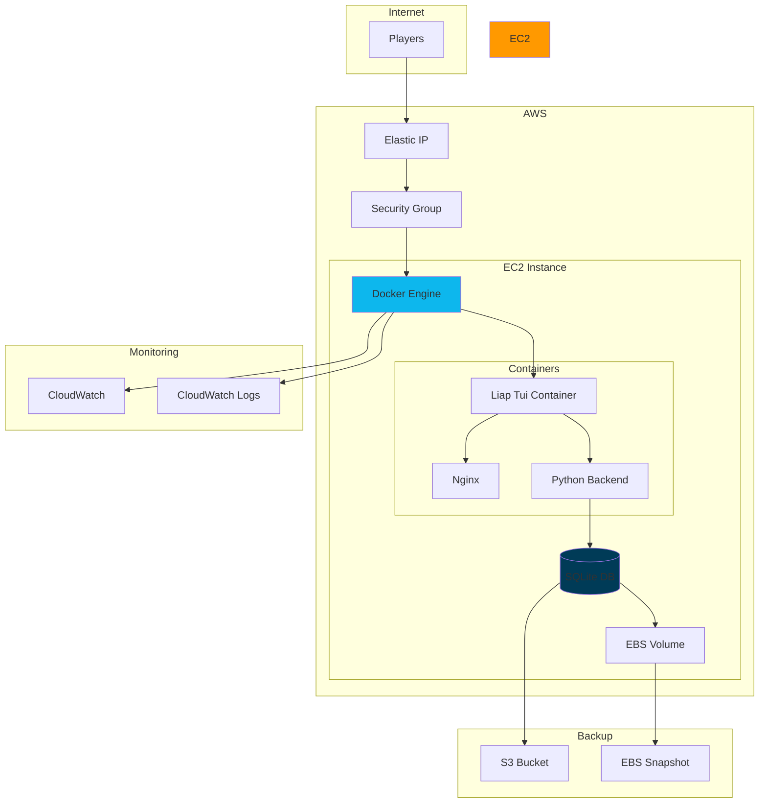

# Deployment Patterns - AWS EC2 Production Setup

## Table of Contents
1. [Overview](#overview)
2. [Architecture Overview](#architecture-overview)
3. [Container Strategy](#container-strategy)
4. [AWS EC2 Configuration](#aws-ec2-configuration)
5. [Docker Compose Setup](#docker-compose-setup)
6. [Database Management](#database-management)
7. [Monitoring & Logging](#monitoring--logging)
8. [Security Configuration](#security-configuration)
9. [Cost Optimization](#cost-optimization)
10. [Disaster Recovery](#disaster-recovery)

## Overview

This document outlines production deployment patterns for Liap Tui using AWS EC2 with Docker Compose. The architecture emphasizes simplicity, reliability, and cost-effectiveness for a real-time multiplayer game using a single EC2 instance with SQLite database.

### Deployment Goals

1. **High Availability**: 99.5% uptime target
2. **Simplicity**: Single instance deployment with Docker Compose
3. **Low Latency**: <100ms WebSocket latency
4. **Cost Efficient**: Fixed monthly cost with free tier eligible
5. **Easy Maintenance**: Simple SSH-based deployments

## Architecture Overview

### Production Architecture


```mermaid
graph TB
    subgraph "Internet"
        Users[Players]
    end
    
    subgraph "AWS"
        subgraph "EC2 Instance"
            Docker[Docker Engine]
            subgraph "Containers"
                App[Liap Tui Container]
                Nginx[Nginx]
                Python[Python Backend]
            end
            SQLite[(SQLite DB)]
            Volume[EBS Volume]
        end
        
        SG[Security Group]
        EIP[Elastic IP]
    end
    
    subgraph "Monitoring"
        CW[CloudWatch]
        Logs[CloudWatch Logs]
    end
    
    subgraph "Backup"
        S3[S3 Bucket]
        Snapshot[EBS Snapshot]
    end
    
    Users --> EIP
    EIP --> SG
    SG --> Docker
    Docker --> App
    App --> Nginx
    App --> Python
    Python --> SQLite
    SQLite --> Volume
    
    Docker --> CW
    Docker --> Logs
    Volume --> Snapshot
    SQLite --> S3
    
    style Docker fill:#0db7ed
    style SQLite fill:#003B57
    style EC2 fill:#FF9900
```

### Component Responsibilities

| Component | Purpose | Technology |
|-----------|---------|------------|
| Web Server | Static assets, reverse proxy | Nginx (in container) |
| Application | Game logic, WebSocket handler | Python FastAPI |
| Database | Game events, play history | SQLite (file-based) |
| Container Runtime | Application isolation | Docker + Docker Compose |
| Storage | Database persistence | EBS Volume |
| Backup | Database backups | S3 + EBS Snapshots |
| Monitoring | Metrics and logs | CloudWatch Agent |
| Security | Network firewall | Security Groups |

## Container Strategy

### Docker Configuration

```dockerfile
# Production Dockerfile
FROM python:3.11-slim as backend-builder

# Build arguments
ARG BUILD_VERSION
ARG BUILD_COMMIT

# Install dependencies
WORKDIR /app
COPY backend/requirements.txt .
RUN pip install --no-cache-dir -r requirements.txt

# Copy application
COPY backend/ .

# Build frontend
FROM node:20-alpine as frontend-builder

WORKDIR /app
COPY frontend/package*.json ./
RUN npm ci --only=production

COPY frontend/ .
RUN npm run build

# Final production image
FROM python:3.11-slim

# Runtime dependencies
RUN apt-get update && apt-get install -y \
    nginx \
    supervisor \
    curl \
    && rm -rf /var/lib/apt/lists/*

# Copy backend
WORKDIR /app
COPY --from=backend-builder /app /app
COPY --from=backend-builder /usr/local/lib/python3.11/site-packages /usr/local/lib/python3.11/site-packages

# Copy frontend
COPY --from=frontend-builder /app/dist /var/www/html

# Configuration files
COPY deployment/nginx.conf /etc/nginx/nginx.conf
COPY deployment/supervisord.conf /etc/supervisor/conf.d/supervisord.conf

# Health check
HEALTHCHECK --interval=30s --timeout=3s --start-period=10s --retries=3 \
    CMD curl -f http://localhost/api/health || exit 1

# Environment variables
ENV PYTHONUNBUFFERED=1
ENV BUILD_VERSION=${BUILD_VERSION}
ENV BUILD_COMMIT=${BUILD_COMMIT}

# Expose ports
EXPOSE 80 8000

# Start services
CMD ["/usr/bin/supervisord", "-c", "/etc/supervisor/conf.d/supervisord.conf"]
```

### Multi-Stage Build Benefits

1. **Smaller Images**: Production image ~150MB vs ~500MB
2. **Security**: No build tools in production
3. **Caching**: Efficient layer caching
4. **Versioning**: Build metadata included

### Docker Compose Configuration

```yaml
# docker-compose.yml
version: '3.8'

services:
  app:
    build: .
    image: liap-tui:latest
    container_name: liap-tui
    ports:
      - "80:80"
      - "8000:8000"
    environment:
      - ENV=production
      - DATABASE_PATH=/app/data/game_events.db
      - CORS_ORIGINS=https://yourdomain.com
      - LOG_LEVEL=info
    volumes:
      - ./game_events.db:/app/data/game_events.db
      - ./logs:/app/logs
    restart: unless-stopped
    healthcheck:
      test: ["CMD", "curl", "-f", "http://localhost/api/health"]
      interval: 30s
      timeout: 10s
      retries: 3
      start_period: 40s
    logging:
      driver: "json-file"
      options:
        max-size: "10m"
        max-file: "3"
```

## AWS EC2 Configuration

### EC2 Instance Setup

```bash
# Launch EC2 instance
aws ec2 run-instances \
  --image-id ami-0c02fb55956c7d316 \
  --instance-type t2.micro \
  --key-name your-key-pair \
  --security-group-ids sg-xxxxxx \
  --subnet-id subnet-xxxxxx \
  --tag-specifications 'ResourceType=instance,Tags=[{Key=Name,Value=liap-tui-production}]' \
  --user-data file://user-data.sh

# user-data.sh - Instance initialization
#!/bin/bash
# Update system
sudo yum update -y

# Install Docker
sudo yum install docker -y
sudo service docker start
sudo usermod -a -G docker ec2-user

# Install Docker Compose
sudo curl -L "https://github.com/docker/compose/releases/latest/download/docker-compose-$(uname -s)-$(uname -m)" -o /usr/local/bin/docker-compose
sudo chmod +x /usr/local/bin/docker-compose

# Install CloudWatch Agent
wget https://s3.amazonaws.com/amazoncloudwatch-agent/amazon_linux/amd64/latest/amazon-cloudwatch-agent.rpm
sudo rpm -U ./amazon-cloudwatch-agent.rpm

# Create app directory
mkdir -p /home/ec2-user/liap-tui
cd /home/ec2-user/liap-tui

# Clone repository (or copy files)
git clone https://github.com/yourusername/liap-tui.git .

# Start application
docker-compose up -d
```

### Security Group Configuration

```yaml
# EC2 Security Group
SecurityGroup:
  Type: AWS::EC2::SecurityGroup
  Properties:
    GroupDescription: Security group for Liap Tui EC2 instance
    VpcId: !Ref VPC
    SecurityGroupIngress:
      # HTTP
      - IpProtocol: tcp
        FromPort: 80
        ToPort: 80
        CidrIp: 0.0.0.0/0
      # HTTPS
      - IpProtocol: tcp
        FromPort: 443
        ToPort: 443
        CidrIp: 0.0.0.0/0
      # WebSocket
      - IpProtocol: tcp
        FromPort: 8000
        ToPort: 8000
        CidrIp: 0.0.0.0/0
      # SSH (restricted)
      - IpProtocol: tcp
        FromPort: 22
        ToPort: 22
        CidrIp: YOUR_IP/32
    SecurityGroupEgress:
      # All outbound traffic
      - IpProtocol: -1
        CidrIp: 0.0.0.0/0
```

### Elastic IP Assignment

```bash
# Allocate Elastic IP
EIP_ALLOC=$(aws ec2 allocate-address --domain vpc --query 'AllocationId' --output text)

# Associate with instance
aws ec2 associate-address \
  --instance-id i-xxxxxxxxx \
  --allocation-id $EIP_ALLOC

# Update DNS records
aws route53 change-resource-record-sets \
  --hosted-zone-id Z123456789 \
  --change-batch '{
    "Changes": [{
      "Action": "UPSERT",
      "ResourceRecordSet": {
        "Name": "liaptui.com",
        "Type": "A",
        "TTL": 300,
        "ResourceRecords": [{"Value": "YOUR_ELASTIC_IP"}]
      }
    }]
  }'
```

## Database Management

### SQLite Configuration

```yaml
# SQLite database setup
Database:
  Type: File
  Path: /home/ec2-user/liap-tui/game_events.db
  Permissions: 644
  Owner: ec2-user
  Group: ec2-user
  
  # Volume mapping in docker-compose.yml
  volumes:
    - ./game_events.db:/app/data/game_events.db
    - ./backups:/app/backups
```

### Backup Strategy

```bash
#!/bin/bash
# backup.sh - Daily backup script

# Variables
DB_PATH="/home/ec2-user/liap-tui/game_events.db"
BACKUP_DIR="/home/ec2-user/liap-tui/backups"
S3_BUCKET="liap-tui-backups"
DATE=$(date +%Y%m%d_%H%M%S)

# Create backup
sqlite3 $DB_PATH ".backup $BACKUP_DIR/game_events_$DATE.db"

# Compress
gzip $BACKUP_DIR/game_events_$DATE.db

# Upload to S3
aws s3 cp $BACKUP_DIR/game_events_$DATE.db.gz s3://$S3_BUCKET/daily/

# Clean old local backups (keep 7 days)
find $BACKUP_DIR -name "*.db.gz" -mtime +7 -delete

# Setup cron job
# crontab -e
# 0 2 * * * /home/ec2-user/liap-tui/backup.sh
```

### Database Maintenance

```python
# backend/maintenance/db_maintenance.py
import sqlite3
import logging
from datetime import datetime, timedelta

class DatabaseMaintenance:
    """SQLite maintenance tasks."""
    
    def __init__(self, db_path: str):
        self.db_path = db_path
        self.logger = logging.getLogger(__name__)
    
    def vacuum_database(self):
        """Reclaim unused space."""
        conn = sqlite3.connect(self.db_path)
        try:
            self.logger.info("Starting VACUUM...")
            conn.execute("VACUUM")
            self.logger.info("VACUUM completed")
        finally:
            conn.close()
    
    def analyze_database(self):
        """Update query optimizer statistics."""
        conn = sqlite3.connect(self.db_path)
        try:
            conn.execute("ANALYZE")
            self.logger.info("ANALYZE completed")
        finally:
            conn.close()
    
    def archive_old_events(self, days_to_keep: int = 30):
        """Archive events older than specified days."""
        conn = sqlite3.connect(self.db_path)
        try:
            cutoff_date = datetime.now() - timedelta(days=days_to_keep)
            
            # Count events to archive
            cursor = conn.execute(
                "SELECT COUNT(*) FROM events WHERE timestamp < ?",
                (cutoff_date.timestamp(),)
            )
            count = cursor.fetchone()[0]
            
            if count > 0:
                # Create archive table if not exists
                conn.execute("""
                    CREATE TABLE IF NOT EXISTS events_archive (
                        LIKE events INCLUDING ALL
                    )
                """)
                
                # Move old events
                conn.execute("""
                    INSERT INTO events_archive 
                    SELECT * FROM events 
                    WHERE timestamp < ?
                """, (cutoff_date.timestamp(),))
                
                conn.execute("""
                    DELETE FROM events 
                    WHERE timestamp < ?
                """, (cutoff_date.timestamp(),))
                
                conn.commit()
                self.logger.info(f"Archived {count} events")
            
        finally:
            conn.close()
```

## Performance Optimization

### EC2 Instance Optimization

```bash
# System tuning for game server
cat << EOF > /etc/sysctl.d/99-liaptui.conf
# Network optimizations
net.core.somaxconn = 65535
net.ipv4.tcp_max_syn_backlog = 65535
net.ipv4.ip_local_port_range = 1024 65535
net.ipv4.tcp_tw_reuse = 1
net.ipv4.tcp_fin_timeout = 15

# WebSocket optimizations
net.core.netdev_max_backlog = 5000
net.ipv4.tcp_keepalive_time = 600
net.ipv4.tcp_keepalive_intvl = 60
net.ipv4.tcp_keepalive_probes = 3

# File descriptor limits
fs.file-max = 100000
EOF

# Apply settings
sysctl -p /etc/sysctl.d/99-liaptui.conf

# Update limits
cat << EOF > /etc/security/limits.d/99-liaptui.conf
ec2-user soft nofile 65535
ec2-user hard nofile 65535
ec2-user soft nproc 65535
ec2-user hard nproc 65535
EOF
```

### Docker Performance Tuning

```yaml
# docker-compose.yml optimizations
version: '3.8'

services:
  app:
    build: .
    image: liap-tui:latest
    container_name: liap-tui
    restart: unless-stopped
    
    # Resource limits
    deploy:
      resources:
        limits:
          cpus: '0.8'
          memory: 800M
        reservations:
          cpus: '0.5'
          memory: 512M
    
    # Performance settings
    environment:
      - PYTHONUNBUFFERED=1
      - WORKERS=4
      - MAX_CONNECTIONS=1000
      - DATABASE_POOL_SIZE=20
    
    # Logging optimization
    logging:
      driver: "json-file"
      options:
        max-size: "10m"
        max-file: "3"
        compress: "true"
```

### Application Performance

```python
# backend/performance/optimization.py
import asyncio
from functools import lru_cache
import uvloop

# Use uvloop for better async performance
asyncio.set_event_loop_policy(uvloop.EventLoopPolicy())

class PerformanceOptimizer:
    """Application performance optimizations."""
    
    def __init__(self):
        self.connection_pool = None
        self.cache = {}
    
    @lru_cache(maxsize=1000)
    def get_cached_game_state(self, room_id: str, sequence: int):
        """Cache frequently accessed game states."""
        return self._fetch_game_state(room_id, sequence)
    
    async def batch_database_writes(self, events: list):
        """Batch multiple writes for efficiency."""
        if len(events) < 10:
            # Write immediately for small batches
            await self._write_events(events)
        else:
            # Batch larger writes
            for i in range(0, len(events), 100):
                batch = events[i:i+100]
                await self._write_events(batch)
                await asyncio.sleep(0.01)  # Prevent blocking
```

## Monitoring & Logging

### CloudWatch Dashboard

```json
{
  "widgets": [
    {
      "type": "metric",
      "properties": {
        "metrics": [
          ["AWS/EC2", "CPUUtilization", {"stat": "Average"}],
          [".", "NetworkIn", {"stat": "Sum"}],
          [".", "NetworkOut", {"stat": "Sum"}],
          ["LiapTui", "ActiveConnections", {"stat": "Sum"}],
          [".", "GameRoomsActive", {"stat": "Average"}],
          [".", "WebSocketLatency", {"stat": "p99"}]
        ],
        "period": 300,
        "stat": "Average",
        "region": "us-east-1",
        "title": "EC2 Instance Metrics"
      }
    },
    {
      "type": "log",
      "properties": {
        "query": "SOURCE '/aws/ec2/liap-tui' | fields @timestamp, @message | filter @message like /ERROR/ | sort @timestamp desc | limit 20",
        "region": "us-east-1",
        "title": "Recent Errors"
      }
    }
  ]
}
```

### Application Metrics

```python
# backend/monitoring/metrics.py
import boto3
from datetime import datetime

class MetricsPublisher:
    """Publish custom metrics to CloudWatch."""
    
    def __init__(self):
        self.cloudwatch = boto3.client('cloudwatch')
        self.namespace = 'LiapTui'
    
    async def publish_game_metrics(self, room_manager):
        """Publish game-related metrics."""
        metrics = []
        
        # Active connections
        metrics.append({
            'MetricName': 'ActiveConnections',
            'Value': len(room_manager.connections),
            'Unit': 'Count',
            'Timestamp': datetime.utcnow()
        })
        
        # Active game rooms
        active_games = sum(
            1 for room in room_manager.rooms.values()
            if room.game_started
        )
        metrics.append({
            'MetricName': 'GameRoomsActive',
            'Value': active_games,
            'Unit': 'Count',
            'Timestamp': datetime.utcnow()
        })
        
        # WebSocket latency (from ping/pong)
        if hasattr(room_manager, 'latency_stats'):
            metrics.append({
                'MetricName': 'WebSocketLatency',
                'StatisticValues': {
                    'SampleCount': len(room_manager.latency_stats),
                    'Sum': sum(room_manager.latency_stats),
                    'Minimum': min(room_manager.latency_stats),
                    'Maximum': max(room_manager.latency_stats)
                },
                'Unit': 'Milliseconds',
                'Timestamp': datetime.utcnow()
            })
        
        # Publish metrics
        if metrics:
            self.cloudwatch.put_metric_data(
                Namespace=self.namespace,
                MetricData=metrics
            )
```

### CloudWatch Agent Configuration

```json
// /opt/aws/amazon-cloudwatch-agent/etc/amazon-cloudwatch-agent.json
{
  "metrics": {
    "namespace": "LiapTui",
    "metrics_collected": {
      "cpu": {
        "measurement": [
          {
            "name": "cpu_usage_idle",
            "rename": "CPU_USAGE_IDLE",
            "unit": "Percent"
          },
          "cpu_usage_active"
        ],
        "totalcpu": false,
        "metrics_collection_interval": 60
      },
      "disk": {
        "measurement": [
          "used_percent",
          "inodes_free"
        ],
        "metrics_collection_interval": 60,
        "resources": [
          "*"
        ]
      },
      "mem": {
        "measurement": [
          "mem_used_percent"
        ],
        "metrics_collection_interval": 60
      },
      "netstat": {
        "measurement": [
          "tcp_established",
          "tcp_time_wait"
        ],
        "metrics_collection_interval": 60
      }
    }
  },
  "logs": {
    "logs_collected": {
      "files": {
        "collect_list": [
          {
            "file_path": "/home/ec2-user/liap-tui/logs/app.log",
            "log_group_name": "/aws/ec2/liap-tui",
            "log_stream_name": "{instance_id}/app.log"
          },
          {
            "file_path": "/home/ec2-user/liap-tui/logs/error.log",
            "log_group_name": "/aws/ec2/liap-tui",
            "log_stream_name": "{instance_id}/error.log"
          }
        ]
      }
    }
  }
}
```

## Security Configuration

### SSH Access Management

```bash
# Secure SSH configuration
cat << EOF > /etc/ssh/sshd_config.d/99-liaptui.conf
# Disable root login
PermitRootLogin no

# Use key authentication only
PasswordAuthentication no
PubkeyAuthentication yes

# Limit SSH access
AllowUsers ec2-user

# Security settings
Protocol 2
ClientAliveInterval 300
ClientAliveCountMax 2
MaxAuthTries 3
MaxSessions 2
EOF

# Restart SSH
sudo systemctl restart sshd

# Setup fail2ban for SSH protection
sudo yum install fail2ban -y
cat << EOF > /etc/fail2ban/jail.local
[sshd]
enabled = true
port = ssh
filter = sshd
logpath = /var/log/secure
maxretry = 3
bantime = 3600
EOF

sudo systemctl enable fail2ban
sudo systemctl start fail2ban
```

### Application Security

```python
# backend/security/hardening.py
import os
import secrets
from datetime import datetime, timedelta
import jwt

class SecurityHardening:
    """Security hardening for EC2 deployment."""
    
    def __init__(self):
        self.secret_key = os.environ.get('JWT_SECRET', secrets.token_urlsafe(32))
        self.rate_limits = {}
    
    def setup_cors(self, app):
        """Configure CORS for production."""
        from fastapi.middleware.cors import CORSMiddleware
        
        app.add_middleware(
            CORSMiddleware,
            allow_origins=["https://yourdomain.com"],
            allow_credentials=True,
            allow_methods=["GET", "POST"],
            allow_headers=["*"],
            max_age=3600,
        )
    
    def rate_limit_check(self, ip: str, endpoint: str) -> bool:
        """Simple rate limiting."""
        key = f"{ip}:{endpoint}"
        now = datetime.now()
        
        if key not in self.rate_limits:
            self.rate_limits[key] = []
        
        # Clean old entries
        self.rate_limits[key] = [
            t for t in self.rate_limits[key] 
            if now - t < timedelta(minutes=1)
        ]
        
        # Check limit (100 requests per minute)
        if len(self.rate_limits[key]) >= 100:
            return False
        
        self.rate_limits[key].append(now)
        return True
    
    def generate_csrf_token(self) -> str:
        """Generate CSRF token."""
        return secrets.token_urlsafe(32)
    
    def validate_input(self, data: dict) -> dict:
        """Sanitize user input."""
        # Remove any potential SQL injection attempts
        cleaned = {}
        for key, value in data.items():
            if isinstance(value, str):
                # Basic sanitization
                value = value.replace(";", "")
                value = value.replace("--", "")
                value = value.replace("/*", "")
                value = value.replace("*/", "")
            cleaned[key] = value
        return cleaned
```

### Environment Variable Management

```bash
# .env.production - Production environment variables
ENV=production
DATABASE_PATH=/home/ec2-user/liap-tui/game_events.db
CORS_ORIGINS=https://yourdomain.com
LOG_LEVEL=info
WORKERS=4
MAX_CONNECTIONS=1000
JWT_SECRET=your-secret-key-here

# Secure the file
chmod 600 .env.production
chown ec2-user:ec2-user .env.production

# Load in docker-compose.yml
env_file:
  - .env.production
```

### SSL/TLS Configuration

```bash
# Install Certbot for Let's Encrypt
sudo yum install certbot -y

# Get SSL certificate
sudo certbot certonly --standalone \
  -d yourdomain.com \
  -d www.yourdomain.com \
  --email your-email@example.com \
  --agree-tos \
  --non-interactive

# Auto-renewal cron job
echo "0 0,12 * * * root certbot renew --quiet" | sudo tee /etc/cron.d/certbot

# Update nginx.conf for SSL
server {
    listen 443 ssl;
    server_name yourdomain.com;
    
    ssl_certificate /etc/letsencrypt/live/yourdomain.com/fullchain.pem;
    ssl_certificate_key /etc/letsencrypt/live/yourdomain.com/privkey.pem;
    
    # SSL hardening
    ssl_protocols TLSv1.2 TLSv1.3;
    ssl_ciphers HIGH:!aNULL:!MD5;
    ssl_prefer_server_ciphers on;
    
    # Security headers
    add_header Strict-Transport-Security "max-age=31536000" always;
    add_header X-Frame-Options "SAMEORIGIN" always;
    add_header X-Content-Type-Options "nosniff" always;
    add_header X-XSS-Protection "1; mode=block" always;
}
```

## Cost Optimization

### EC2 Cost-Saving Strategies

1. **Free Tier Usage**
   - t2.micro instance: 750 hours/month free for 12 months
   - 30GB EBS storage included
   - 15GB bandwidth included
   - Total cost: $0/month (within free tier limits)

2. **Reserved Instance (After Free Tier)**
   ```bash
   # Purchase 1-year reserved instance for 30% savings
   aws ec2 purchase-reserved-instances-offering \
     --instance-count 1 \
     --reserved-instances-offering-id xxxxxxxx \
     --instance-type t2.micro
   ```

3. **S3 Lifecycle Policies**
   ```json
   {
     "Rules": [{
       "Id": "ArchiveOldBackups",
       "Status": "Enabled",
       "Transitions": [{
         "Days": 30,
         "StorageClass": "STANDARD_IA"
       }, {
         "Days": 90,
         "StorageClass": "GLACIER"
       }],
       "Expiration": {
         "Days": 365
       }
     }]
   }
   ```

4. **CloudFront for Static Assets**
   ```yaml
   # CloudFront distribution
   Distribution:
     Origins:
       - DomainName: yourdomain.com
         Id: EC2Origin
         CustomOriginConfig:
           OriginProtocolPolicy: https-only
     DefaultCacheBehavior:
       TargetOriginId: EC2Origin
       ViewerProtocolPolicy: redirect-to-https
       CachePolicyId: 658327ea-f89d-4fab-a63d-7e88639e58f6
       Compress: true
   ```

### Cost Monitoring

```yaml
# Cost allocation tags
Tags:
  - Key: Environment
    Value: production
  - Key: Application
    Value: liap-tui
  - Key: CostCenter
    Value: gaming
  - Key: Component
    Value: !Ref ComponentName
```

## Disaster Recovery

### Automated Backup Strategy

```bash
#!/bin/bash
# disaster-recovery.sh - Comprehensive backup and recovery

# EBS Snapshot
create_ebs_snapshot() {
    VOLUME_ID=$(aws ec2 describe-instances \
        --instance-ids $(curl -s http://169.254.169.254/latest/meta-data/instance-id) \
        --query 'Reservations[0].Instances[0].BlockDeviceMappings[0].Ebs.VolumeId' \
        --output text)
    
    SNAPSHOT_ID=$(aws ec2 create-snapshot \
        --volume-id $VOLUME_ID \
        --description "Liap Tui backup $(date +%Y%m%d_%H%M%S)" \
        --query 'SnapshotId' \
        --output text)
    
    echo "Created snapshot: $SNAPSHOT_ID"
}

# Application backup
backup_application() {
    # Stop application gracefully
    docker-compose stop
    
    # Create tarball
    tar -czf /tmp/liap-tui-backup-$(date +%Y%m%d_%H%M%S).tar.gz \
        /home/ec2-user/liap-tui \
        --exclude='logs/*' \
        --exclude='*.log'
    
    # Upload to S3
    aws s3 cp /tmp/liap-tui-backup-*.tar.gz \
        s3://liap-tui-backups/application/
    
    # Restart application
    docker-compose up -d
}

# Recovery procedures
recover_from_snapshot() {
    SNAPSHOT_ID=$1
    
    # Create volume from snapshot
    VOLUME_ID=$(aws ec2 create-volume \
        --snapshot-id $SNAPSHOT_ID \
        --availability-zone $(curl -s http://169.254.169.254/latest/meta-data/placement/availability-zone) \
        --query 'VolumeId' \
        --output text)
    
    echo "Created volume: $VOLUME_ID from snapshot: $SNAPSHOT_ID"
    # Additional steps to attach and mount volume...
}
```

### Instance Recovery

```yaml
# CloudFormation template for quick recovery
AWSTemplateFormatVersion: '2010-09-09'
Description: 'Liap Tui EC2 Recovery Template'

Parameters:
  SnapshotId:
    Type: String
    Description: EBS Snapshot ID for recovery
    
Resources:
  RecoveryInstance:
    Type: AWS::EC2::Instance
    Properties:
      ImageId: ami-0c02fb55956c7d316
      InstanceType: t2.micro
      KeyName: !Ref KeyPair
      SecurityGroupIds:
        - !Ref SecurityGroup
      BlockDeviceMappings:
        - DeviceName: /dev/xvda
          Ebs:
            SnapshotId: !Ref SnapshotId
            VolumeSize: 30
            VolumeType: gp3
      UserData:
        Fn::Base64: !Sub |
          #!/bin/bash
          cd /home/ec2-user/liap-tui
          docker-compose up -d
```

### Recovery Time Objectives

| Scenario | RTO | RPO | Strategy |
|----------|-----|-----|----------|
| Container failure | <1 min | 0 | Docker restart policy |
| Instance failure | <10 min | <1 hour | EBS snapshots + CloudFormation |
| Database corruption | <30 min | <6 hours | SQLite backups from S3 |
| Complete disaster | <1 hour | <1 day | Full recovery from S3 + snapshots |

## Summary

This EC2 deployment pattern provides:

1. **Simplicity**: Single instance with Docker Compose
2. **Reliability**: Automated backups and recovery procedures
3. **Performance**: Optimized for real-time WebSocket gaming
4. **Security**: SSL/TLS, SSH hardening, and security best practices
5. **Cost Efficiency**: Free tier eligible, ~$0/month for small deployments
6. **Observability**: CloudWatch monitoring and logging
7. **Disaster Recovery**: EBS snapshots and S3 backups

The architecture is ideal for small to medium deployments, balancing simplicity with production readiness. It can handle hundreds of concurrent players on a single t2.micro instance, with easy upgrade paths as the game grows.