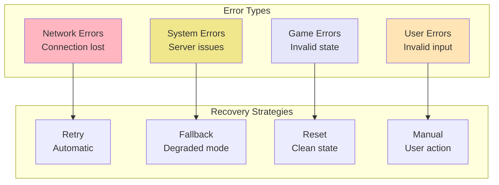

# Error Handling Patterns - Resilience and Recovery Strategies

## Table of Contents
1. [Overview](#overview)
2. [Error Categories](#error-categories)
3. [Backend Error Handling](#backend-error-handling)
4. [Frontend Error Handling](#frontend-error-handling)
5. [Network Error Recovery](#network-error-recovery)
6. [Game State Recovery](#game-state-recovery)
7. [User Feedback Patterns](#user-feedback-patterns)
8. [Logging and Monitoring](#logging-and-monitoring)
9. [Testing Error Scenarios](#testing-error-scenarios)
10. [Best Practices](#best-practices)

## Overview

Error handling in Liap Tui is designed to provide a resilient gaming experience where errors are handled gracefully, state is preserved, and users are kept informed without disrupting gameplay.

### Design Principles

1. **Fail Gracefully**: Never crash, always recover
2. **Preserve State**: Don't lose game progress
3. **Inform Users**: Clear, actionable error messages
4. **Auto-Recovery**: Attempt to fix issues automatically
5. **Learn and Adapt**: Track errors for improvement

## Error Categories

### Error Taxonomy

```python
# Error severity levels
class ErrorSeverity(Enum):
    DEBUG = "debug"       # Development only
    INFO = "info"         # Informational
    WARNING = "warning"   # Potential issue
    ERROR = "error"       # Recoverable error
    CRITICAL = "critical" # Requires intervention

# Error categories
class ErrorCategory(Enum):
    # Network errors
    CONNECTION = "connection"
    TIMEOUT = "timeout"
    
    # Game logic errors
    INVALID_MOVE = "invalid_move"
    GAME_STATE = "game_state"
    
    # Data errors
    VALIDATION = "validation"
    SERIALIZATION = "serialization"
    
    # System errors
    RESOURCE = "resource"
    INTERNAL = "internal"
    
    # User errors
    AUTHENTICATION = "authentication"
    AUTHORIZATION = "authorization"
```

### Error Classification



## Backend Error Handling

### Custom Exception Hierarchy

```python
# backend/exceptions.py
class LiapTuiException(Exception):
    """Base exception for all game errors."""
    
    def __init__(
        self,
        code: str,
        message: str,
        severity: ErrorSeverity = ErrorSeverity.ERROR,
        details: Optional[Dict] = None,
        recoverable: bool = True
    ):
        self.code = code
        self.message = message
        self.severity = severity
        self.details = details or {}
        self.recoverable = recoverable
        super().__init__(message)
    
    def to_dict(self) -> Dict:
        return {
            "code": self.code,
            "message": self.message,
            "severity": self.severity.value,
            "details": self.details,
            "recoverable": self.recoverable,
            "timestamp": time.time()
        }

# Specific exceptions
class GameStateError(LiapTuiException):
    """Game state related errors."""
    
    def __init__(self, message: str, state: Optional[Dict] = None):
        super().__init__(
            code="GAME_STATE_ERROR",
            message=message,
            severity=ErrorSeverity.ERROR,
            details={"current_state": state}
        )

class InvalidPlayError(LiapTuiException):
    """Invalid game play attempt."""
    
    def __init__(
        self,
        message: str,
        player: str,
        play_details: Dict
    ):
        super().__init__(
            code="INVALID_PLAY",
            message=message,
            severity=ErrorSeverity.WARNING,
            details={
                "player": player,
                "play": play_details,
                "suggestion": self._get_suggestion(play_details)
            }
        )
    
    def _get_suggestion(self, play_details: Dict) -> str:
        """Provide helpful suggestion based on error."""
        if "wrong_count" in play_details:
            return f"You must play exactly {play_details['required']} pieces"
        elif "not_your_turn" in play_details:
            return "Wait for your turn"
        return "Check the game rules"

class ConnectionError(LiapTuiException):
    """WebSocket connection errors."""
    
    def __init__(
        self,
        message: str,
        connection_id: str,
        retry_after: Optional[int] = None
    ):
        super().__init__(
            code="CONNECTION_ERROR",
            message=message,
            severity=ErrorSeverity.ERROR,
            details={
                "connection_id": connection_id,
                "retry_after": retry_after
            }
        )
```

### Error Handler Middleware

```python
# backend/middleware/error_handler.py
from fastapi import Request, WebSocket
from fastapi.responses import JSONResponse
import traceback

class ErrorHandlerMiddleware:
    """Global error handler for all requests."""
    
    async def __call__(self, request: Request, call_next):
        try:
            response = await call_next(request)
            return response
            
        except LiapTuiException as e:
            # Handle known game errors
            logger.warning(
                f"Game error: {e.code}",
                extra={
                    "error": e.to_dict(),
                    "path": request.url.path,
                    "method": request.method
                }
            )
            
            return JSONResponse(
                status_code=self._get_status_code(e),
                content={
                    "error": e.to_dict(),
                    "request_id": request.state.request_id
                }
            )
            
        except Exception as e:
            # Handle unexpected errors
            error_id = str(uuid.uuid4())
            logger.error(
                f"Unexpected error: {error_id}",
                exc_info=True,
                extra={
                    "error_id": error_id,
                    "path": request.url.path,
                    "traceback": traceback.format_exc()
                }
            )
            
            return JSONResponse(
                status_code=500,
                content={
                    "error": {
                        "code": "INTERNAL_ERROR",
                        "message": "An unexpected error occurred",
                        "error_id": error_id,
                        "recoverable": False
                    }
                }
            )
    
    def _get_status_code(self, error: LiapTuiException) -> int:
        """Map error to HTTP status code."""
        status_map = {
            "INVALID_PLAY": 400,
            "NOT_YOUR_TURN": 403,
            "GAME_NOT_FOUND": 404,
            "ROOM_FULL": 409,
            "RATE_LIMITED": 429,
            "INTERNAL_ERROR": 500
        }
        return status_map.get(error.code, 400)
```

### WebSocket Error Handling

```python
# backend/websocket/error_handler.py
class WebSocketErrorHandler:
    """Handle errors in WebSocket connections."""
    
    async def handle_error(
        self,
        websocket: WebSocket,
        error: Exception,
        context: Optional[Dict] = None
    ):
        """Handle WebSocket errors appropriately."""
        
        if isinstance(error, WebSocketDisconnect):
            # Normal disconnection
            await self.handle_disconnect(websocket, error.code)
            
        elif isinstance(error, LiapTuiException):
            # Send error to client
            await self.send_error(websocket, error)
            
        elif isinstance(error, ValidationError):
            # Invalid message format
            await self.send_validation_error(websocket, error)
            
        else:
            # Unexpected error
            await self.handle_unexpected_error(websocket, error, context)
    
    async def send_error(
        self,
        websocket: WebSocket,
        error: LiapTuiException
    ):
        """Send error message to client."""
        try:
            await websocket.send_json({
                "event": "error",
                "error": error.to_dict()
            })
        except:
            # Connection might be closed
            pass
    
    async def handle_disconnect(
        self,
        websocket: WebSocket,
        code: int
    ):
        """Handle client disconnection."""
        if code == 1000:
            # Normal closure
            logger.info("Client disconnected normally")
        elif code == 1001:
            # Going away (page closed)
            logger.info("Client went away")
        else:
            # Abnormal closure
            logger.warning(f"Abnormal disconnect: {code}")
        
        # Clean up resources
        await self.cleanup_connection(websocket)
    
    async def handle_unexpected_error(
        self,
        websocket: WebSocket,
        error: Exception,
        context: Optional[Dict]
    ):
        """Handle unexpected errors."""
        error_id = str(uuid.uuid4())
        
        # Log full error details
        logger.error(
            f"WebSocket error: {error_id}",
            exc_info=True,
            extra={
                "error_id": error_id,
                "context": context,
                "connection": self.get_connection_info(websocket)
            }
        )
        
        # Send generic error to client
        try:
            await websocket.send_json({
                "event": "error",
                "error": {
                    "code": "INTERNAL_ERROR",
                    "message": "An error occurred",
                    "error_id": error_id,
                    "recoverable": True
                }
            })
        except:
            pass
```

### Game State Protection

```python
# backend/game/state_protection.py
class StateProtector:
    """Protect game state from corruption."""
    
    def __init__(self):
        self.state_snapshots = {}
        self.max_snapshots = 10
    
    async def protect_operation(
        self,
        game_id: str,
        operation: Callable,
        *args,
        **kwargs
    ):
        """Execute operation with state protection."""
        # Take snapshot before operation
        snapshot = await self.create_snapshot(game_id)
        
        try:
            # Execute operation
            result = await operation(*args, **kwargs)
            
            # Validate state after operation
            if not await self.validate_state(game_id):
                raise GameStateError("State validation failed")
            
            return result
            
        except Exception as e:
            # Restore from snapshot on error
            logger.error(f"Operation failed, restoring state: {e}")
            await self.restore_snapshot(game_id, snapshot)
            raise
    
    async def create_snapshot(self, game_id: str) -> Dict:
        """Create state snapshot."""
        state = await self.get_game_state(game_id)
        snapshot = {
            "timestamp": time.time(),
            "state": copy.deepcopy(state),
            "hash": self.calculate_state_hash(state)
        }
        
        # Store snapshot
        if game_id not in self.state_snapshots:
            self.state_snapshots[game_id] = deque(maxlen=self.max_snapshots)
        self.state_snapshots[game_id].append(snapshot)
        
        return snapshot
    
    async def restore_snapshot(self, game_id: str, snapshot: Dict):
        """Restore game state from snapshot."""
        logger.warning(
            f"Restoring game {game_id} to snapshot from {snapshot['timestamp']}"
        )
        
        # Restore state
        await self.set_game_state(game_id, snapshot['state'])
        
        # Notify players of restoration
        await self.notify_state_restoration(game_id, snapshot)
```

## Frontend Error Handling

### Error Boundary Component

```typescript
// frontend/src/components/ErrorBoundary.tsx
interface ErrorBoundaryState {
    hasError: boolean;
    error: Error | null;
    errorInfo: ErrorInfo | null;
    errorCount: number;
}

export class ErrorBoundary extends React.Component<
    { children: ReactNode },
    ErrorBoundaryState
> {
    constructor(props: { children: ReactNode }) {
        super(props);
        this.state = {
            hasError: false,
            error: null,
            errorInfo: null,
            errorCount: 0
        };
    }
    
    static getDerivedStateFromError(error: Error): Partial<ErrorBoundaryState> {
        return { hasError: true };
    }
    
    componentDidCatch(error: Error, errorInfo: ErrorInfo) {
        // Log to error reporting service
        logger.error('React Error Boundary caught error:', {
            error: error.toString(),
            componentStack: errorInfo.componentStack,
            timestamp: new Date().toISOString()
        });
        
        // Update state with error details
        this.setState(prevState => ({
            error,
            errorInfo,
            errorCount: prevState.errorCount + 1
        }));
        
        // Send to analytics
        if (window.analytics) {
            window.analytics.track('error_boundary_triggered', {
                error: error.toString(),
                component_stack: errorInfo.componentStack
            });
        }
    }
    
    handleReset = () => {
        this.setState({
            hasError: false,
            error: null,
            errorInfo: null
        });
    };
    
    render() {
        if (this.state.hasError) {
            // Check if we should show full error or retry
            if (this.state.errorCount > 3) {
                return <FullErrorPage onReset={this.handleReset} />;
            }
            
            return (
                <ErrorFallback
                    error={this.state.error}
                    resetErrorBoundary={this.handleReset}
                />
            );
        }
        
        return this.props.children;
    }
}

// Error fallback component
const ErrorFallback: React.FC<{
    error: Error | null;
    resetErrorBoundary: () => void;
}> = ({ error, resetErrorBoundary }) => {
    return (
        <div className="error-fallback">
            <h2>Oops! Something went wrong</h2>
            <details style={{ whiteSpace: 'pre-wrap' }}>
                {error && error.toString()}
            </details>
            <button onClick={resetErrorBoundary}>Try again</button>
        </div>
    );
};
```

### Network Error Recovery

```typescript
// frontend/src/services/ErrorRecovery.ts
export class ErrorRecoveryService {
    private retryQueue: Map<string, RetryOperation> = new Map();
    private maxRetries = 3;
    private baseDelay = 1000;
    
    async executeWithRetry<T>(
        operation: () => Promise<T>,
        options: RetryOptions = {}
    ): Promise<T> {
        const {
            maxAttempts = this.maxRetries,
            backoff = 'exponential',
            onRetry = () => {},
            shouldRetry = this.defaultShouldRetry
        } = options;
        
        let lastError: Error;
        
        for (let attempt = 1; attempt <= maxAttempts; attempt++) {
            try {
                return await operation();
            } catch (error) {
                lastError = error as Error;
                
                if (!shouldRetry(error, attempt)) {
                    throw error;
                }
                
                if (attempt < maxAttempts) {
                    const delay = this.calculateDelay(attempt, backoff);
                    await this.delay(delay);
                    onRetry(error, attempt);
                }
            }
        }
        
        throw new MaxRetriesError(
            `Operation failed after ${maxAttempts} attempts`,
            lastError!
        );
    }
    
    private defaultShouldRetry(error: any, attempt: number): boolean {
        // Retry on network errors
        if (error.code === 'NETWORK_ERROR') return true;
        
        // Retry on specific WebSocket errors
        if (error.code === 'CONNECTION_LOST') return true;
        
        // Retry on rate limiting with backoff
        if (error.code === 'RATE_LIMITED') return attempt <= 2;
        
        // Don't retry on game logic errors
        if (error.code?.startsWith('GAME_')) return false;
        
        return false;
    }
    
    private calculateDelay(attempt: number, backoff: string): number {
        switch (backoff) {
            case 'exponential':
                return this.baseDelay * Math.pow(2, attempt - 1);
            case 'linear':
                return this.baseDelay * attempt;
            case 'constant':
            default:
                return this.baseDelay;
        }
    }
    
    private delay(ms: number): Promise<void> {
        return new Promise(resolve => setTimeout(resolve, ms));
    }
}
```

### Global Error Handler

```typescript
// frontend/src/services/GlobalErrorHandler.ts
export class GlobalErrorHandler {
    private errorQueue: ErrorInfo[] = [];
    private listeners: Set<ErrorListener> = new Set();
    
    constructor() {
        this.setupGlobalHandlers();
    }
    
    private setupGlobalHandlers() {
        // Unhandled promise rejections
        window.addEventListener('unhandledrejection', event => {
            this.handleError({
                type: 'unhandled_promise',
                error: event.reason,
                timestamp: Date.now(),
                context: { promise: event.promise }
            });
            
            // Prevent default browser behavior
            event.preventDefault();
        });
        
        // Global error handler
        window.addEventListener('error', event => {
            this.handleError({
                type: 'global_error',
                error: event.error || new Error(event.message),
                timestamp: Date.now(),
                context: {
                    filename: event.filename,
                    lineno: event.lineno,
                    colno: event.colno
                }
            });
            
            // Prevent default browser behavior
            event.preventDefault();
        });
    }
    
    handleError(errorInfo: ErrorInfo) {
        // Add to queue
        this.errorQueue.push(errorInfo);
        
        // Limit queue size
        if (this.errorQueue.length > 100) {
            this.errorQueue.shift();
        }
        
        // Notify listeners
        this.listeners.forEach(listener => {
            try {
                listener(errorInfo);
            } catch (e) {
                console.error('Error in error listener:', e);
            }
        });
        
        // Log to console in development
        if (process.env.NODE_ENV === 'development') {
            console.error('Global error:', errorInfo);
        }
        
        // Send to analytics/logging service
        this.reportError(errorInfo);
    }
    
    private reportError(errorInfo: ErrorInfo) {
        // Send to logging service
        if (window.logService) {
            window.logService.error(errorInfo);
        }
        
        // Send to analytics
        if (window.analytics) {
            window.analytics.track('error', {
                type: errorInfo.type,
                message: errorInfo.error.message,
                stack: errorInfo.error.stack
            });
        }
    }
    
    subscribe(listener: ErrorListener): () => void {
        this.listeners.add(listener);
        return () => this.listeners.delete(listener);
    }
    
    getRecentErrors(count: number = 10): ErrorInfo[] {
        return this.errorQueue.slice(-count);
    }
}
```

## Network Error Recovery

### Connection Recovery Strategy

```typescript
// frontend/src/services/ConnectionRecovery.ts
export class ConnectionRecoveryStrategy {
    private reconnectAttempts = 0;
    private maxReconnectAttempts = 5;
    private reconnectDelay = 1000;
    private maxReconnectDelay = 30000;
    
    async handleDisconnection(
        reason: DisconnectReason,
        context: ConnectionContext
    ): Promise<void> {
        logger.info('Connection lost:', reason);
        
        // Determine recovery strategy
        const strategy = this.determineStrategy(reason);
        
        switch (strategy) {
            case 'immediate':
                await this.reconnectImmediately(context);
                break;
                
            case 'backoff':
                await this.reconnectWithBackoff(context);
                break;
                
            case 'manual':
                await this.promptUserReconnect(context);
                break;
                
            case 'abandon':
                await this.abandonConnection(context);
                break;
        }
    }
    
    private determineStrategy(reason: DisconnectReason): RecoveryStrategy {
        // Network issues - try automatic reconnection
        if (reason.code >= 1006 && reason.code <= 1015) {
            return 'backoff';
        }
        
        // Clean closure - don't reconnect
        if (reason.code === 1000) {
            return 'abandon';
        }
        
        // Authentication failure - manual intervention
        if (reason.code === 4001) {
            return 'manual';
        }
        
        // Server going away - immediate reconnect
        if (reason.code === 1001) {
            return 'immediate';
        }
        
        // Default to backoff
        return 'backoff';
    }
    
    private async reconnectWithBackoff(context: ConnectionContext) {
        while (this.reconnectAttempts < this.maxReconnectAttempts) {
            this.reconnectAttempts++;
            
            const delay = Math.min(
                this.reconnectDelay * Math.pow(2, this.reconnectAttempts - 1),
                this.maxReconnectDelay
            );
            
            logger.info(
                `Reconnection attempt ${this.reconnectAttempts}/${this.maxReconnectAttempts} in ${delay}ms`
            );
            
            // Show reconnection UI
            this.showReconnectionUI(this.reconnectAttempts, delay);
            
            await this.delay(delay);
            
            try {
                await context.reconnect();
                
                // Success - reset attempts
                this.reconnectAttempts = 0;
                this.hideReconnectionUI();
                
                // Resync state
                await this.resyncState(context);
                
                return;
            } catch (error) {
                logger.error('Reconnection failed:', error);
            }
        }
        
        // Max attempts reached
        this.showReconnectionFailedUI();
    }
    
    private async resyncState(context: ConnectionContext) {
        // Request state sync from server
        const syncRequest: SyncRequest = {
            last_sequence: context.lastSequenceNumber,
            client_state_hash: context.stateHash
        };
        
        const syncResponse = await context.requestSync(syncRequest);
        
        // Apply missed events
        for (const event of syncResponse.missed_events) {
            await context.applyEvent(event);
        }
        
        // Verify state consistency
        if (syncResponse.state_hash !== context.calculateStateHash()) {
            // Full state refresh needed
            await context.refreshFullState(syncResponse.full_state);
        }
    }
}
```

## Game State Recovery

### State Recovery Manager

```python
# backend/game/state_recovery.py
class StateRecoveryManager:
    """Manage game state recovery after errors."""
    
    def __init__(self):
        self.recovery_strategies = {
            GamePhase.PREPARATION: self.recover_preparation,
            GamePhase.DECLARATION: self.recover_declaration,
            GamePhase.TURN: self.recover_turn,
            GamePhase.SCORING: self.recover_scoring
        }
    
    async def recover_game_state(
        self,
        game_id: str,
        error: Exception
    ) -> RecoveryResult:
        """Attempt to recover game state after error."""
        
        # Get current state
        state = await self.get_game_state(game_id)
        if not state:
            return RecoveryResult(
                success=False,
                reason="Game state not found"
            )
        
        # Determine recovery strategy
        phase = state.get('phase')
        strategy = self.recovery_strategies.get(phase)
        
        if not strategy:
            return RecoveryResult(
                success=False,
                reason=f"No recovery strategy for phase {phase}"
            )
        
        try:
            # Execute recovery
            recovered_state = await strategy(state, error)
            
            # Validate recovered state
            if not self.validate_state(recovered_state):
                raise ValueError("Invalid recovered state")
            
            # Apply recovered state
            await self.apply_recovered_state(game_id, recovered_state)
            
            # Notify players
            await self.notify_recovery(game_id, recovered_state, error)
            
            return RecoveryResult(
                success=True,
                recovered_state=recovered_state
            )
            
        except Exception as recovery_error:
            logger.error(
                f"Recovery failed for game {game_id}",
                exc_info=True
            )
            
            return RecoveryResult(
                success=False,
                reason=str(recovery_error)
            )
    
    async def recover_turn(
        self,
        state: Dict,
        error: Exception
    ) -> Dict:
        """Recover from turn phase error."""
        phase_data = state['phase_data']
        
        # Check if turn can be replayed
        if self.can_replay_turn(phase_data):
            # Reset current turn
            phase_data['current_plays'] = {}
            phase_data['turn_complete'] = False
            
            logger.info("Resetting current turn for replay")
            
        else:
            # Skip to next turn
            phase_data['current_player'] = self.get_next_player(
                phase_data['current_player'],
                state['players']
            )
            phase_data['turn_number'] += 1
            phase_data['current_plays'] = {}
            
            logger.info("Skipping to next turn due to error")
        
        return state
    
    def validate_state(self, state: Dict) -> bool:
        """Validate recovered state."""
        required_fields = ['phase', 'phase_data', 'players', 'round_number']
        
        # Check required fields
        for field in required_fields:
            if field not in state:
                return False
        
        # Validate phase data
        phase = state['phase']
        phase_data = state['phase_data']
        
        if phase == GamePhase.TURN:
            return all(
                field in phase_data
                for field in ['current_player', 'turn_number']
            )
        
        return True
```

### Client State Recovery

```typescript
// frontend/src/services/StateRecovery.ts
export class ClientStateRecovery {
    private stateCache: StateCache;
    private stateValidator: StateValidator;
    
    async recoverFromError(
        error: GameError,
        currentState: GameState
    ): Promise<GameState | null> {
        logger.info('Attempting state recovery:', error);
        
        // Try recovery strategies in order
        const strategies = [
            () => this.recoverFromCache(),
            () => this.recoverFromServer(),
            () => this.recoverFromLocalStorage(),
            () => this.reconstructFromEvents()
        ];
        
        for (const strategy of strategies) {
            try {
                const recoveredState = await strategy();
                
                if (recoveredState && this.stateValidator.isValid(recoveredState)) {
                    logger.info('State recovered successfully');
                    return recoveredState;
                }
            } catch (e) {
                logger.error('Recovery strategy failed:', e);
            }
        }
        
        // All strategies failed
        return null;
    }
    
    private async recoverFromCache(): Promise<GameState | null> {
        // Get most recent valid state from cache
        const cachedStates = this.stateCache.getRecentStates(5);
        
        for (const cached of cachedStates) {
            if (this.stateValidator.isValid(cached.state)) {
                return cached.state;
            }
        }
        
        return null;
    }
    
    private async recoverFromServer(): Promise<GameState | null> {
        // Request current state from server
        try {
            const response = await networkService.requestStateSync();
            return response.game_state;
        } catch (e) {
            logger.error('Failed to recover from server:', e);
            return null;
        }
    }
    
    private async reconstructFromEvents(): Promise<GameState | null> {
        // Get event history
        const events = await this.getEventHistory();
        
        if (!events || events.length === 0) {
            return null;
        }
        
        // Find last known good state
        let state = this.getInitialState();
        
        // Replay events
        for (const event of events) {
            try {
                state = this.applyEvent(state, event);
            } catch (e) {
                // Stop at first error
                logger.error('Failed to apply event:', e);
                break;
            }
        }
        
        return state;
    }
}
```

## User Feedback Patterns

### Error Notification System

```typescript
// frontend/src/components/ErrorNotification.tsx
export const ErrorNotificationSystem: React.FC = () => {
    const [notifications, setNotifications] = useState<ErrorNotification[]>([]);
    
    useEffect(() => {
        const unsubscribe = errorService.subscribe((error) => {
            const notification = createNotification(error);
            setNotifications(prev => [...prev, notification]);
            
            // Auto-dismiss after timeout
            if (notification.autoDismiss) {
                setTimeout(() => {
                    dismissNotification(notification.id);
                }, notification.duration);
            }
        });
        
        return unsubscribe;
    }, []);
    
    const createNotification = (error: GameError): ErrorNotification => {
        return {
            id: Date.now().toString(),
            type: getNotificationType(error),
            title: getErrorTitle(error),
            message: error.message,
            actions: getErrorActions(error),
            autoDismiss: !error.requiresAction,
            duration: error.severity === 'critical' ? 10000 : 5000
        };
    };
    
    const getErrorActions = (error: GameError): NotificationAction[] => {
        const actions: NotificationAction[] = [];
        
        if (error.recoverable) {
            actions.push({
                label: 'Retry',
                action: () => errorService.retry(error)
            });
        }
        
        if (error.code === 'CONNECTION_LOST') {
            actions.push({
                label: 'Reconnect',
                action: () => connectionService.reconnect()
            });
        }
        
        if (error.details?.suggestion) {
            actions.push({
                label: 'Learn More',
                action: () => showErrorHelp(error)
            });
        }
        
        return actions;
    };
    
    return (
        <div className="error-notifications">
            <TransitionGroup>
                {notifications.map(notification => (
                    <CSSTransition
                        key={notification.id}
                        timeout={300}
                        classNames="notification"
                    >
                        <ErrorNotificationItem
                            notification={notification}
                            onDismiss={() => dismissNotification(notification.id)}
                        />
                    </CSSTransition>
                ))}
            </TransitionGroup>
        </div>
    );
};

// Individual notification component
const ErrorNotificationItem: React.FC<{
    notification: ErrorNotification;
    onDismiss: () => void;
}> = ({ notification, onDismiss }) => {
    const icon = getNotificationIcon(notification.type);
    const className = `notification notification--${notification.type}`;
    
    return (
        <div className={className} role="alert">
            <div className="notification__icon">{icon}</div>
            
            <div className="notification__content">
                <h4 className="notification__title">{notification.title}</h4>
                <p className="notification__message">{notification.message}</p>
                
                {notification.actions.length > 0 && (
                    <div className="notification__actions">
                        {notification.actions.map((action, index) => (
                            <button
                                key={index}
                                className="notification__action"
                                onClick={action.action}
                            >
                                {action.label}
                            </button>
                        ))}
                    </div>
                )}
            </div>
            
            <button
                className="notification__dismiss"
                onClick={onDismiss}
                aria-label="Dismiss"
            >
                ×
            </button>
        </div>
    );
};
```

### Inline Error States

```typescript
// frontend/src/components/InlineError.tsx
export const InlineError: React.FC<{
    error: FieldError;
    fieldName: string;
}> = ({ error, fieldName }) => {
    const [isExpanded, setIsExpanded] = useState(false);
    
    if (!error) return null;
    
    return (
        <div className="inline-error" role="alert">
            <div className="inline-error__message">
                <Icon name="error" />
                <span>{error.message}</span>
            </div>
            
            {error.details && (
                <button
                    className="inline-error__toggle"
                    onClick={() => setIsExpanded(!isExpanded)}
                    aria-expanded={isExpanded}
                >
                    {isExpanded ? 'Less' : 'More'} info
                </button>
            )}
            
            {isExpanded && error.details && (
                <div className="inline-error__details">
                    <p>{error.details}</p>
                    {error.suggestion && (
                        <p className="inline-error__suggestion">
                            <strong>Suggestion:</strong> {error.suggestion}
                        </p>
                    )}
                </div>
            )}
        </div>
    );
};

// Form with inline errors
export const GameForm: React.FC = () => {
    const [errors, setErrors] = useState<Record<string, FieldError>>({});
    
    const handleSubmit = async (data: FormData) => {
        try {
            // Clear previous errors
            setErrors({});
            
            // Validate and submit
            await submitForm(data);
            
        } catch (error) {
            if (error instanceof ValidationError) {
                // Show field-specific errors
                const fieldErrors: Record<string, FieldError> = {};
                
                error.errors.forEach(err => {
                    fieldErrors[err.field] = {
                        message: err.message,
                        details: err.details,
                        suggestion: err.suggestion
                    };
                });
                
                setErrors(fieldErrors);
            } else {
                // Show general error
                showGeneralError(error);
            }
        }
    };
    
    return (
        <form onSubmit={handleSubmit}>
            <div className="form-field">
                <label htmlFor="playerName">Player Name</label>
                <input
                    id="playerName"
                    name="playerName"
                    aria-invalid={!!errors.playerName}
                    aria-describedby={
                        errors.playerName ? 'playerName-error' : undefined
                    }
                />
                <InlineError error={errors.playerName} fieldName="playerName" />
            </div>
            
            {/* Other fields... */}
        </form>
    );
};
```

## Logging and Monitoring

### Structured Logging

```python
# backend/logging/structured_logger.py
import structlog
from typing import Any, Dict

class GameLogger:
    """Structured logging for game events."""
    
    def __init__(self):
        self.logger = structlog.get_logger()
        self.configure_processors()
    
    def configure_processors(self):
        """Configure structlog processors."""
        structlog.configure(
            processors=[
                structlog.stdlib.filter_by_level,
                structlog.stdlib.add_logger_name,
                structlog.stdlib.add_log_level,
                structlog.stdlib.PositionalArgumentsFormatter(),
                structlog.processors.TimeStamper(fmt="iso"),
                structlog.processors.StackInfoRenderer(),
                structlog.processors.format_exc_info,
                structlog.processors.UnicodeDecoder(),
                self.add_game_context,
                self.sanitize_sensitive_data,
                structlog.processors.JSONRenderer()
            ],
            context_class=dict,
            logger_factory=structlog.stdlib.LoggerFactory(),
            cache_logger_on_first_use=True,
        )
    
    def add_game_context(self, logger, log_method, event_dict):
        """Add game-specific context to logs."""
        # Add request ID if available
        if hasattr(g, 'request_id'):
            event_dict['request_id'] = g.request_id
        
        # Add game context
        if hasattr(g, 'game_id'):
            event_dict['game_id'] = g.game_id
        
        if hasattr(g, 'player_id'):
            event_dict['player_id'] = g.player_id
        
        # Add performance metrics
        if hasattr(g, 'start_time'):
            event_dict['duration_ms'] = (time.time() - g.start_time) * 1000
        
        return event_dict
    
    def sanitize_sensitive_data(self, logger, log_method, event_dict):
        """Remove sensitive data from logs."""
        sensitive_fields = [
            'password', 'token', 'session_id',
            'email', 'credit_card', 'ssn'
        ]
        
        def sanitize_dict(d: Dict[str, Any]) -> Dict[str, Any]:
            sanitized = {}
            for key, value in d.items():
                if any(field in key.lower() for field in sensitive_fields):
                    sanitized[key] = '[REDACTED]'
                elif isinstance(value, dict):
                    sanitized[key] = sanitize_dict(value)
                else:
                    sanitized[key] = value
            return sanitized
        
        return sanitize_dict(event_dict)
    
    def log_error(
        self,
        message: str,
        error: Exception,
        context: Optional[Dict] = None
    ):
        """Log error with full context."""
        self.logger.error(
            message,
            error_type=type(error).__name__,
            error_message=str(error),
            error_traceback=traceback.format_exc(),
            context=context or {},
            stack_info=True
        )
    
    def log_game_event(
        self,
        event_type: str,
        game_id: str,
        player_id: Optional[str] = None,
        details: Optional[Dict] = None
    ):
        """Log game-specific events."""
        self.logger.info(
            "game_event",
            event_type=event_type,
            game_id=game_id,
            player_id=player_id,
            details=details or {}
        )

# Usage
logger = GameLogger()

# Log error with context
try:
    result = process_play(player_id, play_data)
except InvalidPlayError as e:
    logger.log_error(
        "Invalid play attempted",
        e,
        context={
            "player_id": player_id,
            "play_data": play_data,
            "game_phase": game.phase
        }
    )
```

### Error Metrics

```python
# backend/monitoring/error_metrics.py
from prometheus_client import Counter, Histogram, Gauge
import time

class ErrorMetrics:
    """Track error metrics for monitoring."""
    
    def __init__(self):
        # Error counters
        self.error_counter = Counter(
            'game_errors_total',
            'Total number of errors',
            ['error_type', 'severity', 'phase']
        )
        
        # Recovery metrics
        self.recovery_attempts = Counter(
            'error_recovery_attempts_total',
            'Total recovery attempts',
            ['strategy', 'phase']
        )
        
        self.recovery_success = Counter(
            'error_recovery_success_total',
            'Successful recoveries',
            ['strategy', 'phase']
        )
        
        # Error rate
        self.error_rate = Gauge(
            'game_error_rate',
            'Current error rate per minute'
        )
        
        # Recovery time
        self.recovery_time = Histogram(
            'error_recovery_duration_seconds',
            'Time taken to recover from errors',
            ['error_type']
        )
        
        # Start error rate calculation
        self.start_error_rate_calculation()
    
    def record_error(
        self,
        error_type: str,
        severity: str,
        phase: str
    ):
        """Record an error occurrence."""
        self.error_counter.labels(
            error_type=error_type,
            severity=severity,
            phase=phase
        ).inc()
    
    def record_recovery_attempt(
        self,
        strategy: str,
        phase: str,
        success: bool,
        duration: float
    ):
        """Record recovery attempt metrics."""
        self.recovery_attempts.labels(
            strategy=strategy,
            phase=phase
        ).inc()
        
        if success:
            self.recovery_success.labels(
                strategy=strategy,
                phase=phase
            ).inc()
        
        self.recovery_time.labels(
            error_type=strategy
        ).observe(duration)
    
    def start_error_rate_calculation(self):
        """Calculate error rate periodically."""
        def calculate_rate():
            window = 60  # 1 minute window
            while True:
                # Get error count in last minute
                # This is simplified - in production use a proper
                # time-series database
                current_rate = self.get_error_rate(window)
                self.error_rate.set(current_rate)
                time.sleep(10)  # Update every 10 seconds
        
        import threading
        thread = threading.Thread(target=calculate_rate, daemon=True)
        thread.start()

# Global metrics instance
error_metrics = ErrorMetrics()
```

## Testing Error Scenarios

### Error Scenario Tests

```python
# tests/test_error_handling.py
import pytest
from unittest.mock import Mock, patch

class TestErrorHandling:
    """Test error handling scenarios."""
    
    @pytest.mark.asyncio
    async def test_game_state_recovery(self):
        """Test game state recovery after error."""
        # Setup
        game = create_test_game()
        original_state = game.get_state()
        
        # Simulate error during play
        with patch.object(game, 'process_play', side_effect=Exception("Test error")):
            with pytest.raises(Exception):
                await game.play_pieces("Alice", ["p1", "p2"])
        
        # Verify state unchanged
        assert game.get_state() == original_state
        
        # Verify recovery logged
        assert_recovery_logged("game_state_recovery", game.id)
    
    @pytest.mark.asyncio
    async def test_network_error_recovery(self):
        """Test recovery from network errors."""
        client = create_test_client()
        
        # Simulate network failure
        with patch.object(client.websocket, 'send', side_effect=ConnectionError()):
            result = await client.send_with_retry({
                "event": "play",
                "data": {"piece_ids": ["p1"]}
            })
        
        # Verify retry attempted
        assert client.websocket.send.call_count >= 2
        
        # Verify exponential backoff
        delays = get_retry_delays(client.websocket.send)
        assert delays == [1000, 2000, 4000]  # Exponential
    
    @pytest.mark.asyncio
    async def test_validation_error_handling(self):
        """Test validation error responses."""
        # Invalid play
        response = await make_play_request(
            player="Alice",
            piece_ids=["invalid_id"]
        )
        
        assert response.status_code == 400
        assert response.json()["error"]["code"] == "INVALID_PLAY"
        assert "suggestion" in response.json()["error"]["details"]
    
    def test_error_boundary_recovery(self):
        """Test React error boundary recovery."""
        # Render component that will error
        const { getByText } = render(
            <ErrorBoundary>
                <BuggyComponent />
            </ErrorBoundary>
        );
        
        // Trigger error
        fireEvent.click(getByText("Trigger Error"));
        
        # Verify error UI shown
        expect(getByText("Something went wrong")).toBeInTheDocument();
        
        # Test recovery
        fireEvent.click(getByText("Try again"));
        
        # Verify component recovered
        expect(getByText("Component loaded")).toBeInTheDocument();
```

### Chaos Testing

```python
# tests/chaos/error_injection.py
class ChaosErrorInjector:
    """Inject errors for chaos testing."""
    
    def __init__(self, probability: float = 0.1):
        self.probability = probability
        self.enabled = False
        self.error_types = [
            NetworkError("Simulated network failure"),
            GameStateError("Simulated state corruption"),
            TimeoutError("Simulated timeout"),
            ValidationError("Simulated validation failure")
        ]
    
    def maybe_inject_error(self):
        """Randomly inject an error."""
        if not self.enabled:
            return
        
        if random.random() < self.probability:
            error = random.choice(self.error_types)
            logger.warning(f"Chaos: Injecting {type(error).__name__}")
            raise error
    
    @contextmanager
    def chaos_mode(self, probability: float = None):
        """Enable chaos mode temporarily."""
        old_probability = self.probability
        old_enabled = self.enabled
        
        self.enabled = True
        if probability:
            self.probability = probability
        
        try:
            yield
        finally:
            self.enabled = old_enabled
            self.probability = old_probability

# Usage in tests
chaos = ChaosErrorInjector()

@pytest.mark.chaos
async def test_game_resilience():
    """Test game resilience under chaos."""
    game = create_test_game()
    
    with chaos.chaos_mode(probability=0.2):
        # Play 100 turns with 20% error probability
        errors = []
        recoveries = []
        
        for i in range(100):
            try:
                await game.play_turn()
            except Exception as e:
                errors.append(e)
                
                # Attempt recovery
                recovered = await game.recover()
                recoveries.append(recovered)
        
        # Verify game still playable
        assert game.is_valid()
        
        # Verify recovery rate
        recovery_rate = sum(recoveries) / len(errors)
        assert recovery_rate > 0.8  # 80% recovery rate
```

## Best Practices

### Error Handling Guidelines

1. **Be Specific**
   ```python
   # ❌ Bad
   except Exception:
       logger.error("Something went wrong")
   
   # ✅ Good
   except InvalidPlayError as e:
       logger.error(f"Invalid play: {e.message}", extra={
           "player": e.player,
           "play_details": e.play_details
       })
   ```

2. **Provide Context**
   ```typescript
   // ❌ Bad
   throw new Error("Invalid move");
   
   // ✅ Good
   throw new GameError({
       code: "INVALID_MOVE",
       message: "Cannot play 3 pieces when 2 are required",
       details: {
           required: 2,
           attempted: 3,
           player: currentPlayer
       },
       suggestion: "Select exactly 2 pieces"
   });
   ```

3. **Make Errors Actionable**
   ```typescript
   // Provide clear actions for users
   const errorActions = {
       CONNECTION_LOST: {
           actions: ["Reconnect", "Refresh Page"],
           message: "Connection lost. Your game is saved."
       },
       INVALID_PLAY: {
           actions: ["Review Rules", "Undo"],
           message: "That play isn't allowed. Check the rules."
       }
   };
   ```

4. **Log Appropriately**
   ```python
   # Use appropriate log levels
   logger.debug("Attempting connection")      # Development
   logger.info("Player joined room")          # Normal flow
   logger.warning("Rate limit approached")    # Potential issue
   logger.error("Play validation failed")     # Recoverable error
   logger.critical("Database connection lost") # System failure
   ```

5. **Test Error Paths**
   ```python
   # Always test error scenarios
   def test_handles_network_timeout():
       with mock_timeout():
           result = await client.make_request()
           assert result.fallback_used
           assert result.error_handled
   ```

### Recovery Strategies

1. **Automatic Retry** - Network and transient errors
2. **Fallback** - Use cached or default values
3. **Graceful Degradation** - Reduce functionality
4. **User Intervention** - When automatic recovery fails
5. **Circuit Breaker** - Prevent cascading failures

## Summary

Comprehensive error handling provides:

1. **Resilience**: Games continue despite errors
2. **Transparency**: Users understand what's happening
3. **Recovery**: Automatic fixes when possible
4. **Learning**: Metrics to improve the system
5. **Trust**: Users feel confident in the platform

This creates a robust gaming experience that handles the unexpected gracefully.