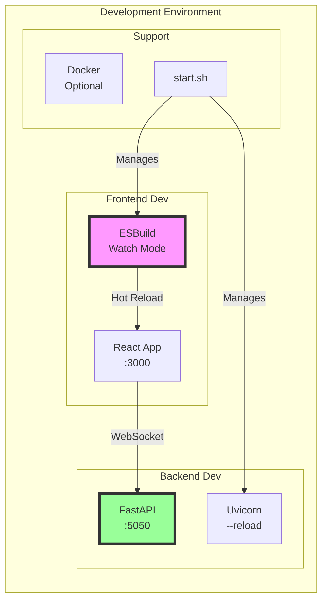
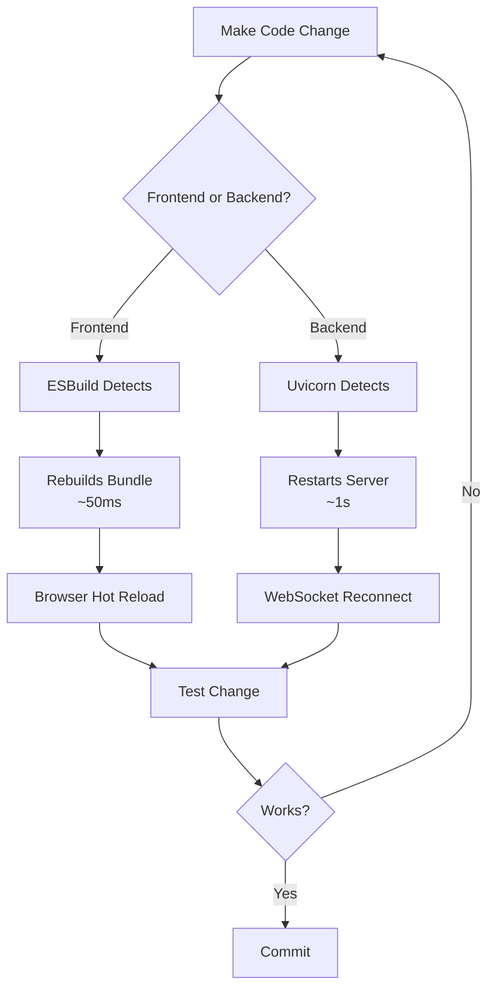

# Local Development Setup Guide

## Table of Contents
1. [Overview](#overview)
2. [Prerequisites](#prerequisites)
3. [Initial Setup](#initial-setup)
4. [Development Workflow](#development-workflow)
5. [Common Tasks](#common-tasks)
6. [Troubleshooting](#troubleshooting)
7. [Development Tools](#development-tools)
8. [Testing Locally](#testing-locally)
9. [Performance Tips](#performance-tips)
10. [Best Practices](#best-practices)

## Overview

This guide walks you through setting up the Liap Tui project for local development. The project uses a modern stack with hot reload for both frontend and backend, making development fast and enjoyable.

### Development Architecture



## Prerequisites

### Required Software

| Software | Version | Check Command | Installation |
|----------|---------|---------------|--------------|
| Node.js | 18+ | `node --version` | [nodejs.org](https://nodejs.org/) |
| Python | 3.11+ | `python --version` | [python.org](https://python.org/) |
| Git | 2.0+ | `git --version` | [git-scm.com](https://git-scm.com/) |
| Docker | Optional | `docker --version` | [docker.com](https://docker.com/) |

### Recommended Tools

- **VS Code**: With Python and ESLint extensions
- **Chrome DevTools**: For WebSocket debugging
- **Postman/Insomnia**: For API testing (limited use)
- **PyCharm**: Alternative to VS Code for Python

## Initial Setup

### 1. Clone the Repository

```bash
# Clone the repository
git clone <repository-url>
cd liap-tui

# Check you're on the right branch
git branch
* main
```

### 2. Frontend Setup

```bash
# Navigate to frontend directory
cd frontend

# Install dependencies
npm install

# Verify installation
npm list react
└── react@19.1.0

# Build once to verify
npm run build
✨ Build completed in 250ms
```

### 3. Backend Setup

```bash
# Navigate to backend directory
cd ../backend

# Create virtual environment (recommended)
python -m venv venv

# Activate virtual environment
# On macOS/Linux:
source venv/bin/activate
# On Windows:
venv\Scripts\activate

# Install dependencies
pip install -r requirements.txt

# Verify installation
python -c "import fastapi; print(fastapi.__version__)"
0.104.1
```

### 4. Environment Configuration

Create a `.env` file in the project root:

```bash
# .env
ENVIRONMENT=development
LOG_LEVEL=DEBUG
ALLOWED_ORIGINS=http://localhost:3000,http://localhost:5050
PYTHONPATH=/path/to/liap-tui

# Optional
ENABLE_DEBUG_ENDPOINTS=true
ENABLE_HOT_RELOAD=true
```

## Development Workflow

### Quick Start

The easiest way to start development:

```bash
# From project root
./start.sh

# This starts:
# - Frontend dev server with hot reload
# - Backend server with auto-reload
# - Monitors both processes
```

### Manual Start (More Control)

#### Terminal 1: Backend
```bash
cd backend
source venv/bin/activate
uvicorn api.main:app --reload --port 5050 --log-level debug

# Output:
INFO:     Uvicorn running on http://127.0.0.1:5050
INFO:     Started reloader process [28720]
INFO:     Started server process [28722]
INFO:     Waiting for application startup.
INFO:     Application startup complete.
```

#### Terminal 2: Frontend
```bash
cd frontend
npm run dev

# Output:
🎮 Starting development server...
✨ Watching for changes...
📦 Bundle size: 420KB
🌐 Server running at http://localhost:3000
```

### Development Flow



## Common Tasks

### Running Code Quality Checks

```bash
# Frontend linting
cd frontend
npm run lint
npm run lint:fix  # Auto-fix issues

# Frontend type checking
npm run type-check

# Backend linting
cd backend
source venv/bin/activate
black .  # Format code
pylint engine/ api/  # Lint code

# Run all checks
npm run check-all  # If configured
```

### Building for Production

```bash
# Frontend production build
cd frontend
npm run build

# Output:
✨ Production build completed
📦 Bundle size: 380KB (minified)
📁 Output: ../backend/static/

# Verify build
ls -la ../backend/static/
index.html
bundle.js
bundle.css
```

### Working with Docker

```bash
# Build development image
docker build -f Dockerfile.dev -t liap-tui-dev .

# Run with volume mounting for hot reload
docker run -it \
  -p 5050:5050 \
  -v $(pwd):/app \
  liap-tui-dev

# Docker Compose alternative
docker-compose -f docker-compose.dev.yml up
```

### Database/State Management

Since the game uses in-memory state:

```python
# Reset game state (backend/api/debug.py)
@router.post("/api/debug/reset-room/{room_id}")
async def reset_room(room_id: str):
    """Reset room to initial state."""
    room_manager.reset_room(room_id)
    return {"status": "reset"}
```

## Troubleshooting

### Common Issues and Solutions

#### 1. Port Already in Use

**Error**: `OSError: [Errno 48] Address already in use`

**Solution**:
```bash
# Find process using port
lsof -i :5050
# or
netstat -tulpn | grep 5050

# Kill process
kill -9 <PID>

# Or use different port
uvicorn api.main:app --port 5051
```

#### 2. Module Import Errors

**Error**: `ModuleNotFoundError: No module named 'backend'`

**Solution**:
```bash
# Set PYTHONPATH
export PYTHONPATH=/path/to/liap-tui:$PYTHONPATH

# Or run from project root
cd /path/to/liap-tui
python -m backend.api.main
```

#### 3. Frontend Build Errors

**Error**: `Cannot find module 'react'`

**Solution**:
```bash
# Clear node_modules and reinstall
cd frontend
rm -rf node_modules package-lock.json
npm install
```

#### 4. WebSocket Connection Failed

**Error**: `WebSocket connection to 'ws://localhost:5050/ws/lobby' failed`

**Solution**:
```bash
# Check backend is running
curl http://localhost:5050/api/health

# Check CORS settings in .env
ALLOWED_ORIGINS=http://localhost:3000

# Check browser console for detailed error
```

#### 5. Hot Reload Not Working

**Frontend**:
```bash
# Check ESBuild is in watch mode
ps aux | grep esbuild
# Should see: node ./esbuild.config.cjs --watch

# Restart dev server
npm run dev
```

**Backend**:
```bash
# Check uvicorn has --reload flag
# Check file is in watched directory
# Try touching the file
touch backend/api/main.py
```

### Debug Mode

Enable detailed logging:

```python
# backend/config/logging_config.py
import logging

logging.basicConfig(
    level=logging.DEBUG,
    format='%(asctime)s - %(name)s - %(levelname)s - %(message)s'
)

# Enable WebSocket frame logging
logging.getLogger("websockets").setLevel(logging.DEBUG)
```

## Development Tools

### VS Code Configuration

`.vscode/settings.json`:
```json
{
  "python.defaultInterpreterPath": "./backend/venv/bin/python",
  "python.linting.enabled": true,
  "python.linting.pylintEnabled": true,
  "python.formatting.provider": "black",
  "editor.formatOnSave": true,
  "editor.codeActionsOnSave": {
    "source.fixAll.eslint": true
  },
  "eslint.validate": [
    "javascript",
    "javascriptreact",
    "typescript",
    "typescriptreact"
  ]
}
```

### Debugging Configuration

`.vscode/launch.json`:
```json
{
  "version": "0.2.0",
  "configurations": [
    {
      "name": "Python: FastAPI",
      "type": "python",
      "request": "launch",
      "module": "uvicorn",
      "args": [
        "backend.api.main:app",
        "--reload",
        "--port",
        "5050"
      ],
      "jinja": true,
      "justMyCode": true
    },
    {
      "name": "Debug Chrome",
      "type": "chrome",
      "request": "launch",
      "url": "http://localhost:3000",
      "webRoot": "${workspaceFolder}/frontend",
      "sourceMaps": true
    }
  ]
}
```

### Git Hooks

`.git/hooks/pre-commit`:
```bash
#!/bin/sh
# Run linting before commit

# Frontend
cd frontend
npm run lint || exit 1

# Backend
cd ../backend
source venv/bin/activate
black --check . || exit 1
pylint engine/ api/ || exit 1

echo "✅ All checks passed!"
```

## Testing Locally

### Running Tests

```bash
# Backend tests
cd backend
pytest tests/ -v

# With coverage
pytest tests/ --cov=engine --cov=api --cov-report=html

# Frontend tests
cd frontend
npm test

# E2E tests (if configured)
npm run test:e2e
```

### Manual Testing Checklist

- [ ] **Connection Flow**
  - [ ] Can create room from lobby
  - [ ] Can join existing room
  - [ ] Reconnection works after refresh

- [ ] **Game Flow**
  - [ ] All 4 players can join
  - [ ] Game starts properly
  - [ ] Cards are dealt
  - [ ] Declarations work
  - [ ] Turns progress correctly
  - [ ] Scoring calculates properly
  - [ ] Game ends at 50 points

- [ ] **Edge Cases**
  - [ ] Player disconnection handling
  - [ ] Bot activation
  - [ ] Weak hand redeal
  - [ ] Network interruption recovery

### Testing Multiple Players

```bash
# Option 1: Multiple browsers
# Open in Chrome, Firefox, Safari, and Chrome Incognito

# Option 2: Multiple profiles
# Chrome: Use different user profiles

# Option 3: Automated (with Playwright)
npm run test:multiplayer
```

## Performance Tips

### Frontend Performance

1. **Bundle Size Monitoring**
   ```bash
   # Check bundle size
   npm run build -- --metafile=meta.json
   npx esbuild-visualizer --metadata ./meta.json
   ```

2. **React DevTools Profiler**
   - Install React DevTools extension
   - Use Profiler tab to find slow components
   - Look for unnecessary re-renders

3. **Network Tab Analysis**
   - Monitor WebSocket frame size
   - Check for message flooding
   - Verify compression is working

### Backend Performance

1. **Profile Slow Endpoints**
   ```python
   import cProfile
   import pstats
   
   profiler = cProfile.Profile()
   profiler.enable()
   # ... code to profile ...
   profiler.disable()
   
   stats = pstats.Stats(profiler)
   stats.sort_stats('cumulative')
   stats.print_stats(10)
   ```

2. **Monitor WebSocket Connections**
   ```python
   # Add to debug endpoint
   @router.get("/api/debug/connections")
   async def get_connections():
       return {
           "total_connections": len(connection_manager.connections),
           "rooms": {
               room_id: len(conns)
               for room_id, conns in connection_manager.room_connections.items()
           }
       }
   ```

## Best Practices

### Code Organization

1. **Keep imports organized**
   ```python
   # Standard library
   import os
   import sys
   
   # Third party
   import fastapi
   import pytest
   
   # Local imports
   from backend.engine import Game
   from backend.api import routes
   ```

2. **Use type hints**
   ```python
   def calculate_score(
       declared: int, 
       captured: int, 
       multiplier: int = 1
   ) -> int:
       """Calculate player score."""
       pass
   ```

3. **Document complex logic**
   ```python
   # The scoring formula is:
   # - Exact match: 3 * declared
   # - Off by 1: 1 * captured
   # - Off by more: -1 * abs(difference)
   ```

### Development Hygiene

1. **Regular dependency updates**
   ```bash
   # Check outdated packages
   npm outdated
   pip list --outdated
   
   # Update carefully
   npm update
   pip install --upgrade -r requirements.txt
   ```

2. **Clean up regularly**
   ```bash
   # Remove unused imports
   autoflake --remove-all-unused-imports -i **/*.py
   
   # Remove console.logs
   eslint . --fix --rule 'no-console: error'
   ```

3. **Monitor performance**
   - Keep frontend bundle under 500KB
   - Keep WebSocket messages under 10KB
   - Keep API response times under 100ms

### Security Considerations

1. **Never commit secrets**
   ```bash
   # Add to .gitignore
   .env
   *.key
   *.pem
   ```

2. **Validate all inputs**
   ```python
   # Always validate WebSocket messages
   if not isinstance(message.get('data'), dict):
       raise ValueError("Invalid message format")
   ```

3. **Use environment variables**
   ```python
   # Good
   SECRET_KEY = os.getenv('SECRET_KEY')
   
   # Bad
   SECRET_KEY = 'hardcoded-secret'
   ```

## Summary

Local development setup provides:

1. **Fast Feedback**: Hot reload for instant updates
2. **Easy Debugging**: Full source maps and logging
3. **Quality Tools**: Linting, formatting, and testing
4. **Flexibility**: Docker or native development
5. **Best Practices**: Patterns for maintainable code

Happy coding! 🚀