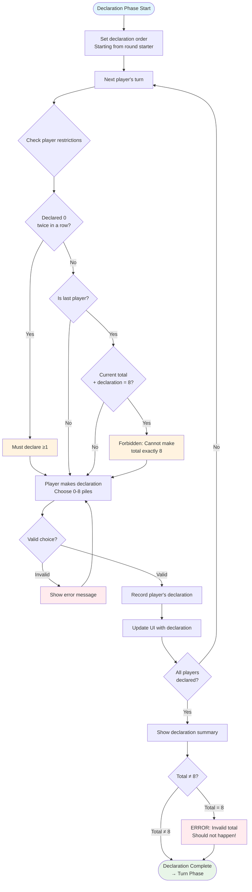
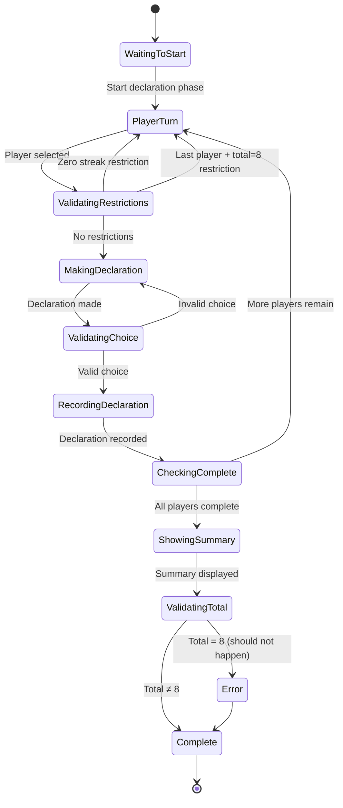
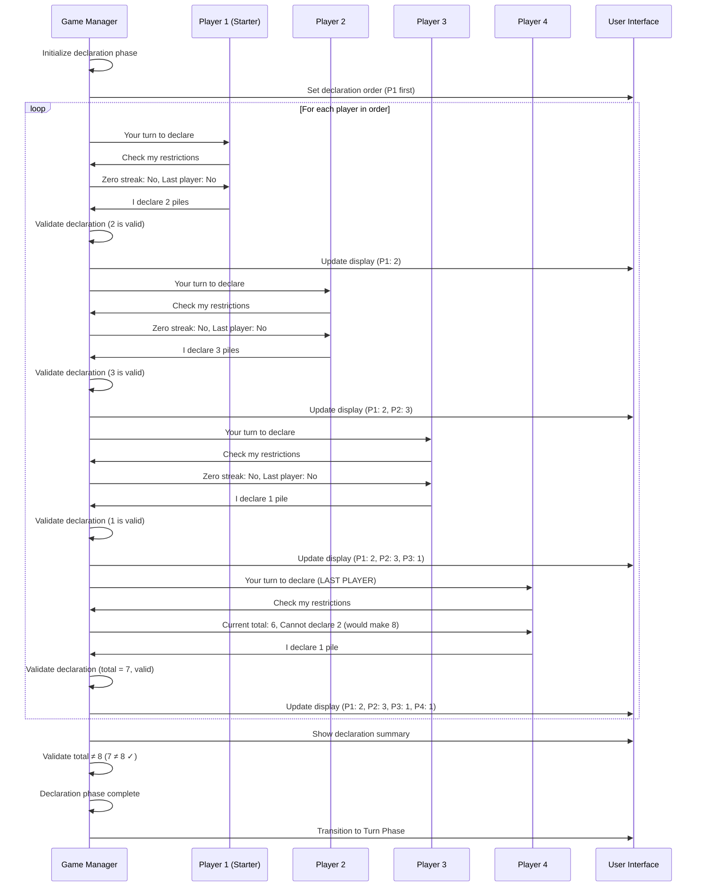

# Declaration Phase Diagrams

## Overview
The Declaration Phase is where players predict how many piles they will win in the upcoming Turn Phase. This phase includes validation rules to prevent total declarations from equaling exactly 8 piles.

## Main Flow Diagram

## State Machine Diagram

## Sequence Diagram

## Key Rules

1. **Zero Streak Rule**: Players cannot declare 0 twice in a row
2. **Total ≠ 8 Rule**: The sum of all declarations cannot equal 8
3. **Last Player Restriction**: The final player cannot make a declaration that would cause the total to equal 8
4. **Declaration Range**: Players can declare 0-8 piles
5. **Turn Order**: Declarations follow the same order as the upcoming Turn Phase

## Error Conditions

- **Invalid Range**: Declaration outside 0-8 range
- **Zero Streak Violation**: Attempting to declare 0 twice consecutively
- **Total = 8**: Last player attempting to make total equal 8
- **System Error**: If total somehow equals 8 after validation (should never happen)