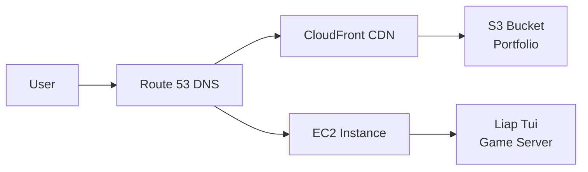

# Domain Configuration and SEO Strategy Guide

## Overview

This guide provides comprehensive instructions for setting up domain configuration and SEO strategy for a portfolio website with progressive content updates. It covers DNS setup, subdomain management, and SEO best practices for handling "Coming Soon" content.

## Table of Contents

1. [Domain Architecture](#domain-architecture)
2. [Route 53 Configuration](#route-53-configuration)
3. [SSL/HTTPS Setup](#sslhttps-setup)
4. [SEO Strategy for Progressive Content](#seo-strategy-for-progressive-content)
5. [Implementation Guide](#implementation-guide)
6. [Monitoring and Maintenance](#monitoring-and-maintenance)
7. [Troubleshooting](#troubleshooting)

## Domain Architecture

### Domain Structure

```
yourdomain.com (root domain)
├── www.yourdomain.com      → Portfolio Website (CloudFront)
├── game.yourdomain.com     → Liap Tui Game (EC2)
├── dev.yourdomain.com      → Development Environment
└── api.yourdomain.com      → Future API endpoint
```

### Traffic Flow



## Route 53 Configuration

### Step 1: Create Hosted Zone

1. **Access Route 53 Console**
   ```
   AWS Console → Route 53 → Hosted zones → Create hosted zone
   ```

2. **Configure Hosted Zone**
   ```
   Domain name: yourdomain.com
   Type: Public hosted zone
   ```

3. **Note Name Servers**
   ```
   ns-1234.awsdns-12.org
   ns-5678.awsdns-34.co.uk
   ns-9012.awsdns-56.com
   ns-3456.awsdns-78.net
   ```

4. **Update Domain Registrar**
   - Go to your domain registrar (GoDaddy, Namecheap, etc.)
   - Update name servers to Route 53 values

### Step 2: Create DNS Records

#### Portfolio Website Records

```bash
# A Record for root domain (ALIAS to CloudFront)
Name: (leave blank)
Type: A - IPv4 address
Alias: Yes
Alias Target: d1234567890.cloudfront.net
Routing Policy: Simple

# A Record for www subdomain (ALIAS to CloudFront)
Name: www
Type: A - IPv4 address
Alias: Yes
Alias Target: d1234567890.cloudfront.net
Routing Policy: Simple
```

#### Game Subdomain Record

```bash
# A Record for game subdomain (Direct to EC2)
Name: game
Type: A - IPv4 address
Value: 34.233.7.20
TTL: 300
Routing Policy: Simple
```

#### Development Subdomain

```bash
# A Record for dev subdomain
Name: dev
Type: A - IPv4 address
Alias: Yes
Alias Target: d0987654321.cloudfront.net
Routing Policy: Simple
```

### Step 3: Configure CloudFront

1. **Add Alternate Domain Names**
   ```
   CloudFront Console → Distribution → Settings → Edit
   Alternate domain names (CNAMEs):
   - yourdomain.com
   - www.yourdomain.com
   ```

2. **Request SSL Certificate**
   ```
   Custom SSL certificate → Request certificate
   Domain names:
   - yourdomain.com
   - www.yourdomain.com
   - *.yourdomain.com (wildcard for subdomains)
   ```

## SSL/HTTPS Setup

### AWS Certificate Manager (ACM)

1. **Request Certificate**
   ```bash
   # Via AWS Console
   ACM → Request certificate → Request a public certificate
   
   Domain names:
   - yourdomain.com
   - www.yourdomain.com
   - *.yourdomain.com
   
   Validation method: DNS validation
   ```

2. **Validate Certificate**
   - ACM provides CNAME records
   - Add these to Route 53
   - Wait for validation (usually 5-30 minutes)

3. **Apply to CloudFront**
   ```
   CloudFront → Distribution → Settings
   Custom SSL certificate → Select ACM certificate
   ```

### EC2 SSL Setup (for game.yourdomain.com)

```bash
# Option 1: Use Let's Encrypt with Certbot
sudo apt-get update
sudo apt-get install certbot
sudo certbot certonly --standalone -d game.yourdomain.com

# Option 2: Use AWS ALB (Application Load Balancer)
# Create ALB with ACM certificate
# Point game.yourdomain.com to ALB
# ALB forwards to EC2
```

## SEO Strategy for Progressive Content

### Meta Tag Strategy

#### 1. Base Layout Meta Tags

```html
<!-- src/layouts/BaseLayout.astro -->
---
export interface Props {
  title: string;
  description: string;
  image?: string;
  noindex?: boolean;
}

const { title, description, image = '/og-default.png', noindex = false } = Astro.props;
const canonicalURL = new URL(Astro.url.pathname, Astro.site);
---

<head>
  <!-- Primary Meta Tags -->
  <title>{title}</title>
  <meta name="title" content={title} />
  <meta name="description" content={description} />
  
  <!-- Robots -->
  <meta name="robots" content={noindex ? 'noindex, follow' : 'index, follow'} />
  
  <!-- Open Graph / Facebook -->
  <meta property="og:type" content="website" />
  <meta property="og:url" content={canonicalURL} />
  <meta property="og:title" content={title} />
  <meta property="og:description" content={description} />
  <meta property="og:image" content={new URL(image, Astro.site)} />
  
  <!-- Twitter -->
  <meta property="twitter:card" content="summary_large_image" />
  <meta property="twitter:url" content={canonicalURL} />
  <meta property="twitter:title" content={title} />
  <meta property="twitter:description" content={description} />
  <meta property="twitter:image" content={new URL(image, Astro.site)} />
  
  <!-- Canonical -->
  <link rel="canonical" href={canonicalURL} />
</head>
```

#### 2. Coming Soon Pages

```astro
---
// src/pages/projects/ai-assistant.astro
import BaseLayout from '../../layouts/BaseLayout.astro';
import ComingSoon from '../../components/ComingSoon.astro';

const project = {
  title: "AI Writing Assistant",
  timeline: "March 2024",
  description: "Chrome extension for AI-powered writing assistance"
};
---

<BaseLayout 
  title={`${project.title} - Coming Soon`}
  description={`${project.description}. Launching ${project.timeline}.`}
  noindex={true}
>
  <ComingSoon {...project} />
</BaseLayout>
```

#### 3. Ready Content Pages

```astro
---
// src/pages/projects/liap-tui.astro
import BaseLayout from '../../layouts/BaseLayout.astro';

const projectData = await import('../../content/projects/liap-tui.json');
---

<BaseLayout 
  title="Liap Tui - Real-Time Multiplayer Board Game"
  description="Production-ready multiplayer game with <100ms latency, enterprise state machine architecture, and comprehensive test coverage."
  image="/images/liap-tui-og.png"
  noindex={false}
>
  <!-- Full project content -->
</BaseLayout>
```

### Dynamic Sitemap Generation

```typescript
// src/pages/sitemap.xml.ts
import type { APIRoute } from 'astro';
import { getCollection } from 'astro:content';

export const get: APIRoute = async ({ site }) => {
  const projects = await getCollection('projects');
  const blogPosts = await getCollection('blog');
  
  // Filter only ready content
  const readyProjects = projects.filter(p => p.data.ready === true);
  const publishedPosts = blogPosts.filter(p => p.data.draft !== true);
  
  const sitemap = `<?xml version="1.0" encoding="UTF-8"?>
<urlset xmlns="http://www.sitemaps.org/schemas/sitemap/0.9">
  <!-- Homepage -->
  <url>
    <loc>${site}</loc>
    <lastmod>${new Date().toISOString()}</lastmod>
    <changefreq>weekly</changefreq>
    <priority>1.0</priority>
  </url>
  
  <!-- Ready Projects -->
  ${readyProjects.map(project => `
  <url>
    <loc>${site}projects/${project.slug}/</loc>
    <lastmod>${project.data.updatedAt || new Date().toISOString()}</lastmod>
    <changefreq>monthly</changefreq>
    <priority>0.9</priority>
  </url>`).join('')}
  
  <!-- Blog Posts -->
  ${publishedPosts.map(post => `
  <url>
    <loc>${site}blog/${post.slug}/</loc>
    <lastmod>${post.data.updatedAt || post.data.publishedAt}</lastmod>
    <changefreq>monthly</changefreq>
    <priority>0.8</priority>
  </url>`).join('')}
  
  <!-- Static Pages -->
  <url>
    <loc>${site}about/</loc>
    <changefreq>monthly</changefreq>
    <priority>0.7</priority>
  </url>
  <url>
    <loc>${site}contact/</loc>
    <changefreq>yearly</changefreq>
    <priority>0.6</priority>
  </url>
</urlset>`;

  return new Response(sitemap, {
    headers: {
      'Content-Type': 'application/xml',
    },
  });
};
```

### Robots.txt Configuration

```txt
# public/robots.txt
User-agent: *
Allow: /

# Block coming soon pages initially
Disallow: /projects/ai-assistant
Disallow: /projects/devops-dashboard
Disallow: /projects/mobile-game

# Sitemap
Sitemap: https://yourdomain.com/sitemap.xml
```

### Structured Data Implementation

```typescript
// src/utils/structured-data.ts
export function generateProjectSchema(project: Project) {
  return {
    "@context": "https://schema.org",
    "@type": "SoftwareApplication",
    "name": project.title,
    "description": project.description,
    "url": project.liveUrl,
    "applicationCategory": project.category,
    "operatingSystem": "Web Browser",
    "offers": {
      "@type": "Offer",
      "price": "0",
      "priceCurrency": "USD"
    },
    "author": {
      "@type": "Person",
      "name": "Your Name",
      "url": "https://yourdomain.com"
    }
  };
}

export function generateBlogPostSchema(post: BlogPost) {
  return {
    "@context": "https://schema.org",
    "@type": "BlogPosting",
    "headline": post.title,
    "description": post.excerpt,
    "datePublished": post.publishedAt,
    "dateModified": post.updatedAt || post.publishedAt,
    "author": {
      "@type": "Person",
      "name": "Your Name"
    },
    "publisher": {
      "@type": "Person",
      "name": "Your Name"
    }
  };
}
```

## Implementation Guide

### 1. SEO Utilities Module

```typescript
// src/utils/seo.ts
interface SEOConfig {
  title: string;
  description: string;
  image?: string;
  noindex?: boolean;
  type?: 'website' | 'article' | 'profile';
}

export function generateMetaTags(config: SEOConfig, url: URL) {
  const tags = [
    { name: 'title', content: config.title },
    { name: 'description', content: config.description },
    { property: 'og:title', content: config.title },
    { property: 'og:description', content: config.description },
    { property: 'og:type', content: config.type || 'website' },
    { property: 'og:url', content: url.toString() },
  ];

  if (config.image) {
    tags.push({ property: 'og:image', content: config.image });
  }

  if (config.noindex) {
    tags.push({ name: 'robots', content: 'noindex, follow' });
  }

  return tags;
}

export function shouldIndexPage(status: 'ready' | 'coming-soon' | 'draft'): boolean {
  return status === 'ready';
}
```

### 2. Progressive Enhancement Workflow

```typescript
// src/utils/content-transition.ts
export async function transitionToReady(projectId: string) {
  // 1. Update project status
  const project = await updateProjectStatus(projectId, 'ready');
  
  // 2. Remove from robots.txt disallow list
  await updateRobotsTxt(projectId, 'allow');
  
  // 3. Regenerate sitemap
  await generateSitemap();
  
  // 4. Submit to search engines
  await submitToSearchEngines(project.url);
  
  // 5. Send notifications to subscribers
  await notifySubscribers(projectId);
  
  return project;
}
```

### 3. Search Console Integration

```typescript
// src/utils/search-console.ts
import { google } from 'googleapis';

const searchconsole = google.searchconsole('v1');

export async function submitUrl(url: string) {
  try {
    await searchconsole.urlInspection.index.inspect({
      siteUrl: 'https://yourdomain.com',
      inspectionUrl: url,
    });
  } catch (error) {
    console.error('Failed to submit URL to Search Console:', error);
  }
}

export async function requestIndexing(url: string) {
  // Use Indexing API for immediate indexing
  const response = await fetch('https://indexing.googleapis.com/v3/urlNotifications:publish', {
    method: 'POST',
    headers: {
      'Content-Type': 'application/json',
      'Authorization': `Bearer ${process.env.GOOGLE_API_TOKEN}`
    },
    body: JSON.stringify({
      url: url,
      type: 'URL_UPDATED'
    })
  });
  
  return response.json();
}
```

## Monitoring and Maintenance

### 1. DNS Health Checks

```bash
# Check DNS propagation
dig yourdomain.com
dig www.yourdomain.com
dig game.yourdomain.com

# Verify Route 53 configuration
aws route53 list-resource-record-sets --hosted-zone-id Z1234567890ABC

# Test SSL certificates
openssl s_client -connect yourdomain.com:443 -servername yourdomain.com
```

### 2. SEO Performance Monitoring

```javascript
// monitoring/seo-monitor.js
const { google } = require('googleapis');

async function checkIndexingStatus() {
  const pages = [
    'https://yourdomain.com',
    'https://yourdomain.com/projects/liap-tui',
    // Add all important pages
  ];
  
  for (const page of pages) {
    const result = await searchconsole.searchanalytics.query({
      siteUrl: 'https://yourdomain.com',
      requestBody: {
        startDate: '2024-01-01',
        endDate: '2024-01-31',
        dimensions: ['page'],
        dimensionFilterGroups: [{
          filters: [{
            dimension: 'page',
            expression: page
          }]
        }]
      }
    });
    
    console.log(`${page}: ${result.data.rows?.[0]?.impressions || 0} impressions`);
  }
}
```

### 3. Content Transition Checklist

When transitioning a "Coming Soon" project to ready:

- [ ] Update project JSON file (`ready: true`)
- [ ] Remove `noindex` meta tag
- [ ] Update robots.txt (remove from Disallow)
- [ ] Regenerate and submit sitemap
- [ ] Request indexing via Search Console
- [ ] Update internal links
- [ ] Announce on social media
- [ ] Send email notifications
- [ ] Monitor indexing progress

### 4. Automated Deployment Script

```bash
#!/bin/bash
# deploy-with-seo.sh

set -e

echo "🏗️  Building portfolio..."
npm run build

echo "🔍 Generating sitemap..."
npm run generate-sitemap

echo "📤 Uploading to S3..."
aws s3 sync dist/ s3://yourname-portfolio-2024 \
  --delete \
  --cache-control "public, max-age=3600" \
  --exclude ".DS_Store"

echo "🔄 Invalidating CloudFront cache..."
aws cloudfront create-invalidation \
  --distribution-id YOUR_DIST_ID \
  --paths "/*"

echo "🔍 Submitting sitemap to search engines..."
curl -s "http://www.google.com/ping?sitemap=https://yourdomain.com/sitemap.xml"
curl -s "http://www.bing.com/ping?sitemap=https://yourdomain.com/sitemap.xml"

echo "✅ Deployment complete with SEO updates!"
```

## Troubleshooting

### Common DNS Issues

#### Domain Not Resolving
```bash
# Check name server propagation
nslookup yourdomain.com 8.8.8.8

# Verify Route 53 hosted zone
aws route53 get-hosted-zone --id Z1234567890ABC

# Solution: Wait 24-48 hours for full propagation
```

#### SSL Certificate Errors
```bash
# Check certificate status
aws acm describe-certificate --certificate-arn arn:aws:acm:region:account:certificate/id

# Common fixes:
# 1. Ensure certificate is in us-east-1 for CloudFront
# 2. Verify DNS validation records are added
# 3. Check certificate matches domain names
```

### SEO Issues

#### Pages Not Indexing
1. Check robots.txt isn't blocking
2. Verify sitemap is accessible
3. Check for noindex meta tags
4. Use URL Inspection tool in Search Console
5. Ensure internal links to new content

#### Coming Soon Pages Appearing in Search
1. Add noindex meta tag immediately
2. Use Search Console removal tool
3. Update robots.txt to disallow
4. Return 404 or 503 status code

### Performance Optimization

#### CloudFront Caching
```yaml
# Cache behavior for different content types
Default (*): 
  Cache: 24 hours
  
Images (*.jpg, *.png, *.webp):
  Cache: 7 days
  
JavaScript/CSS:
  Cache: 7 days
  Headers: Cache-Control: public, max-age=604800
  
HTML:
  Cache: 1 hour
  Headers: Cache-Control: public, max-age=3600
```

## Best Practices

### 1. Domain Strategy
- Use www subdomain for portfolio (better for cookies/performance)
- Keep game on subdomain for isolation
- Use CloudFront for all static content
- Consider API subdomain for future services

### 2. SEO Timeline
- **Week 1**: Basic setup, submit to Search Console
- **Week 2-4**: Monitor indexing, fix issues
- **Month 2**: Start seeing search traffic
- **Month 3+**: Optimize based on data

### 3. Content Strategy
- Launch with 30% real content minimum
- Add new content weekly
- Update meta descriptions regularly
- Build backlinks naturally

### 4. Security
- Always use HTTPS
- Enable HSTS headers
- Use security headers (CSP, X-Frame-Options)
- Regular security audits

## Next Steps

1. **Immediate Actions**:
   - Set up Route 53 hosted zone
   - Configure DNS records
   - Request SSL certificates
   - Deploy initial portfolio

2. **Week 1**:
   - Submit to Google Search Console
   - Create and submit sitemap
   - Set up analytics
   - Monitor DNS propagation

3. **Ongoing**:
   - Weekly content updates
   - Monitor search performance
   - Convert "Coming Soon" to ready
   - Build quality backlinks

---

**Last Updated**: 2025-08-16
**Version**: 1.0