# Liap Tui System Architecture Overview

## High-Level Architecture

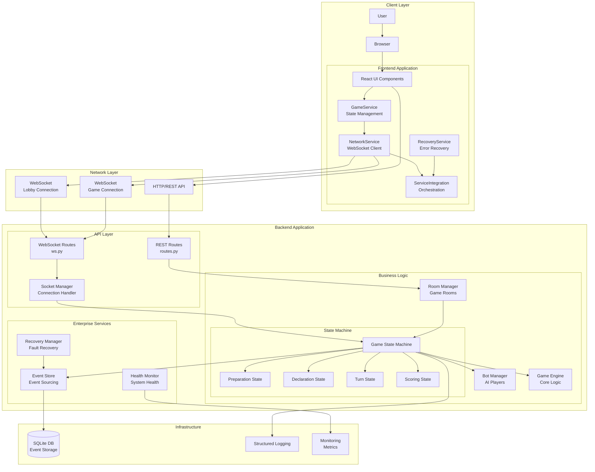

## Component Responsibilities

### Frontend Components

#### **UI Layer (React Components)**
- Pure presentation components
- No business logic
- Receives props from container components
- Handles user interactions

#### **GameService (TypeScript)**
```typescript
class GameService {
  - Single source of truth for game state
  - Processes backend events
  - Validates user actions
  - Notifies UI of state changes
}
```

#### **NetworkService (TypeScript)**
```typescript
class NetworkService {
  - Manages WebSocket connections
  - Handles reconnection logic
  - Message queuing
  - Connection health monitoring
}
```

#### **RecoveryService (TypeScript)**
```typescript
class RecoveryService {
  - Detects connection failures
  - Implements recovery strategies
  - Synchronizes missed events
  - Maintains service health
}
```

### Backend Components

#### **State Machine (Python)**
```python
class GameStateMachine:
    """
    Enterprise architecture with:
    - Automatic state broadcasting
    - Event sourcing
    - Action queue processing
    - Thread-safe operations
    """
```

#### **Bot Manager (Python)**
```python
class BotManager:
    """
    Autonomous bot system:
    - Receives phase_change events
    - Makes intelligent decisions
    - Acts through state machine
    - No frontend dependency
    """
```

#### **Event Store (Python)**
```python
class EventStore:
    """
    Event sourcing system:
    - Persists all game events
    - Enables state reconstruction
    - Supports client recovery
    - Provides audit trail
    """
```

## Data Flow Patterns

### 1. **User Action Flow**
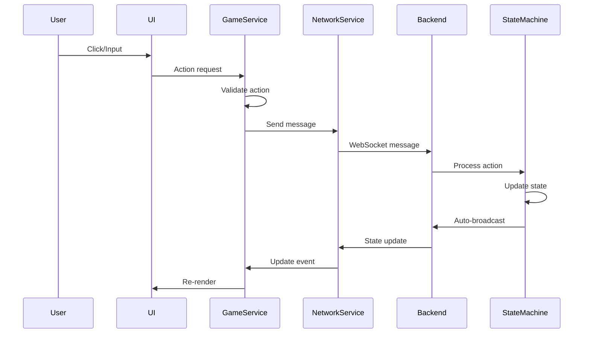

### 2. **Bot Action Flow**
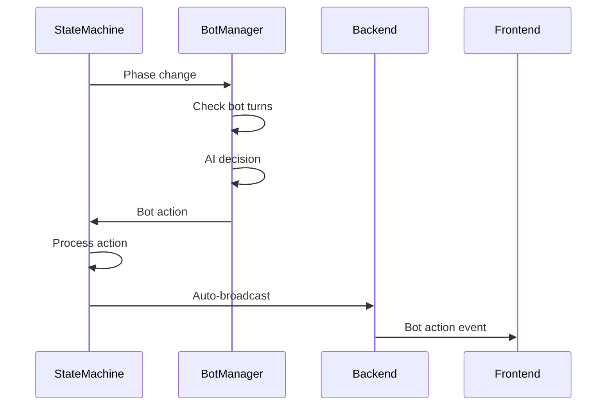

### 3. **Recovery Flow**
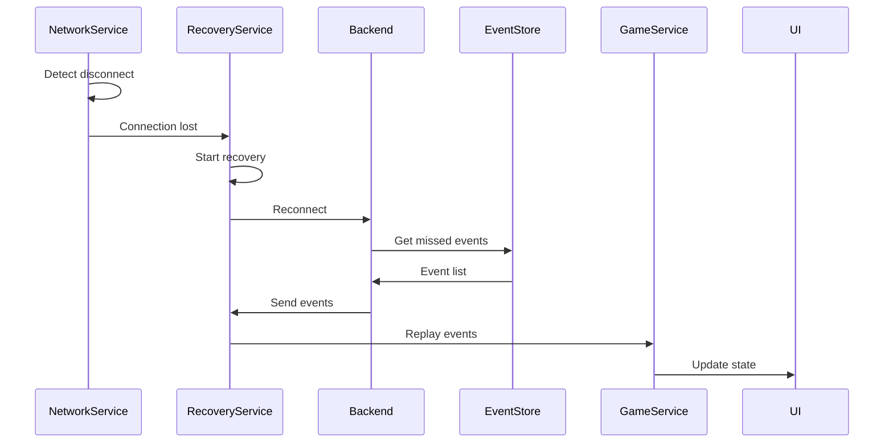

## Key Design Patterns

### 1. **Enterprise State Machine Pattern**
- Single source of truth
- Automatic broadcasting
- No manual state manipulation
- Complete audit trail

### 2. **Event Sourcing Pattern**
- All state changes as events
- Complete history retention
- State reconstruction capability
- Debugging and audit support

### 3. **Command Pattern (Actions)**
```python
class GameAction:
    player_name: str
    action_type: ActionType
    payload: Dict[str, Any]
    timestamp: float
    sequence_id: int
```

### 4. **Observer Pattern**
- Frontend services observe state changes
- UI components observe GameService
- Decoupled event notification

### 5. **Singleton Pattern**
- NetworkService instance
- GameService instance
- BotManager instance
- Ensures single source of truth

## Technology Stack

### Frontend
- **React 19.1.0** - UI framework
- **TypeScript** - Type safety
- **ESBuild** - Fast bundling
- **Tailwind CSS** - Styling
- **PixiJS** - Game graphics

### Backend
- **Python 3.9+** - Core language
- **FastAPI** - Web framework
- **WebSockets** - Real-time communication
- **SQLite** - Event storage
- **asyncio** - Asynchronous processing

### Infrastructure
- **Docker** - Containerization
- **Poetry** - Python dependency management
- **npm** - JavaScript dependency management

## Security & Performance

### Security Measures
- Input validation at all layers
- WebSocket message validation
- Action authorization checks
- Rate limiting consideration

### Performance Optimizations
- Event-driven architecture (no polling)
- Efficient WebSocket protocol
- Message batching for recovery
- Lazy loading of game assets
- Connection pooling

## Scalability Considerations

### Horizontal Scaling
- Stateless REST API
- Room-based isolation
- Independent game instances
- Load balancer ready

### Vertical Scaling
- Async/await throughout
- Efficient data structures
- Minimal memory footprint
- Optimized algorithms

## Monitoring & Observability

### Health Monitoring
```python
/health          # Basic health check
/health/detailed # Comprehensive status
/health/metrics  # Prometheus metrics
```

### Logging
- Structured JSON logs
- Correlation IDs
- Event tracking
- Error aggregation

### Metrics
- WebSocket connections
- Active games
- Message throughput
- Error rates
- Recovery attempts

# Liap Tui Data Flow Sequence Diagrams

## Overview

This document contains comprehensive sequence diagrams showing the data flow in the Liap Tui multiplayer board game system. The system uses WebSocket communication, an enterprise state machine architecture, and automatic bot management.

## 1. Connection & Room Management Flow

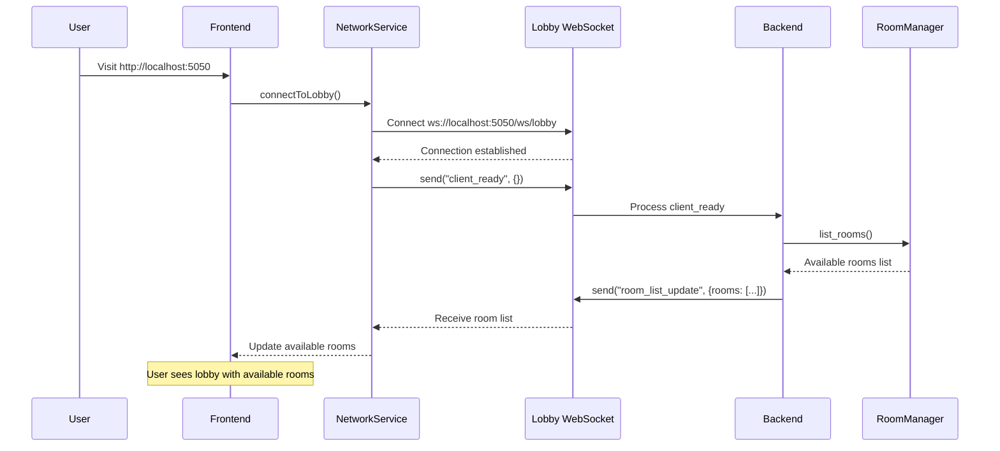

## 2. Game Creation & Starting Flow

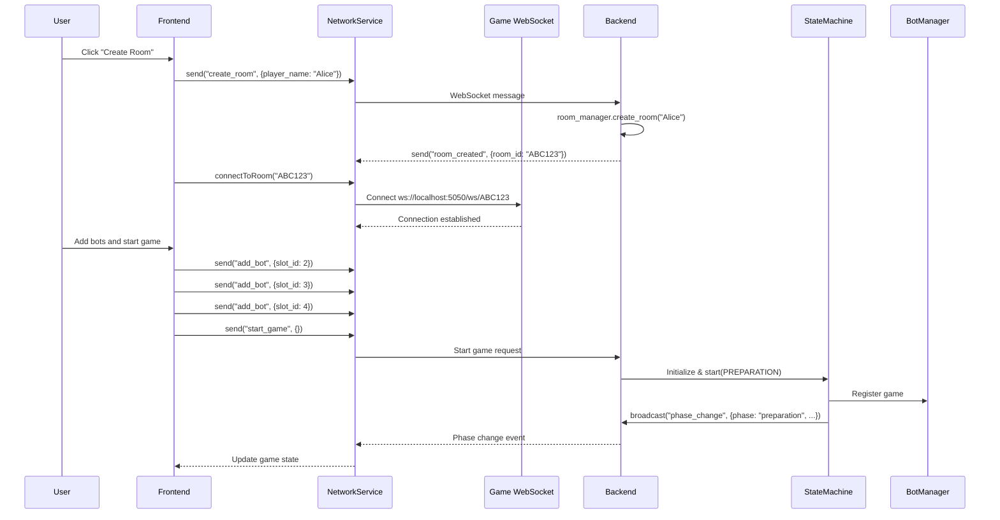

## 3. Preparation Phase Flow (with Weak Hand/Redeal)

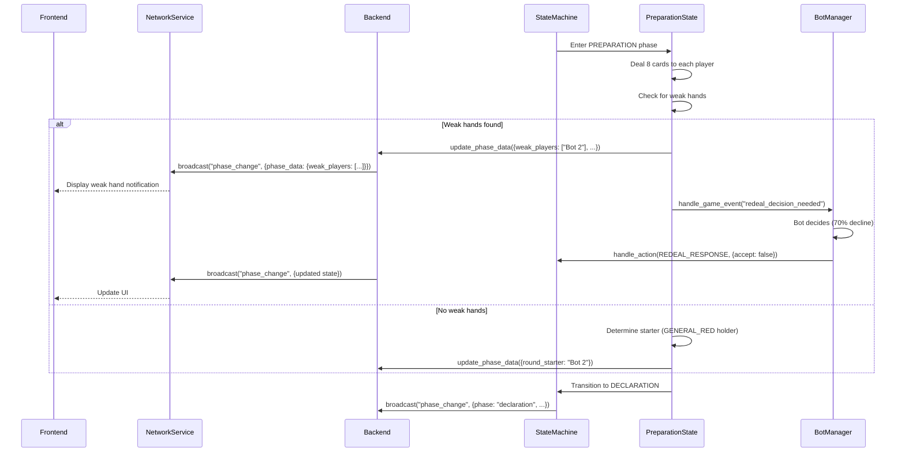

## 4. Declaration Phase Flow

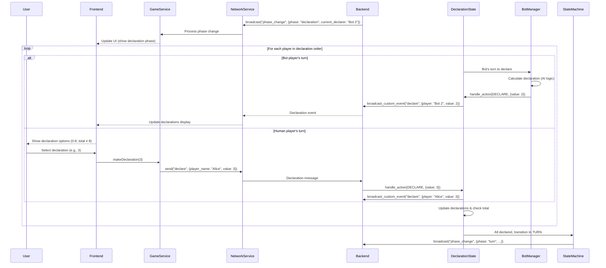

## 5. Turn Phase Flow

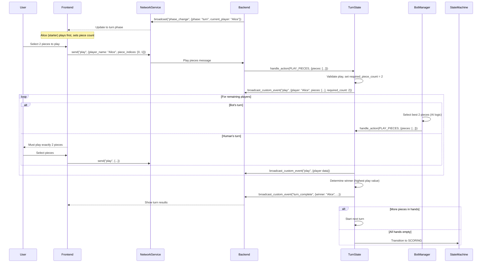

## 6. Scoring Phase Flow

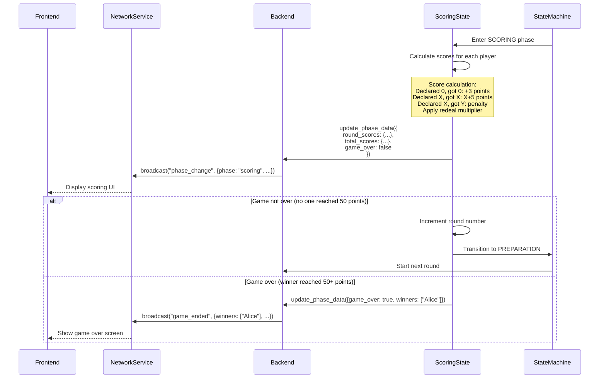

## 7. Error Recovery & Reconnection Flow

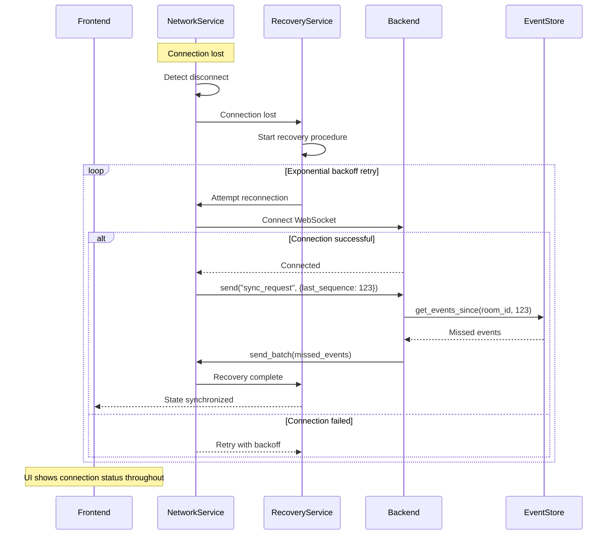

## 8. Bot Interaction Flow

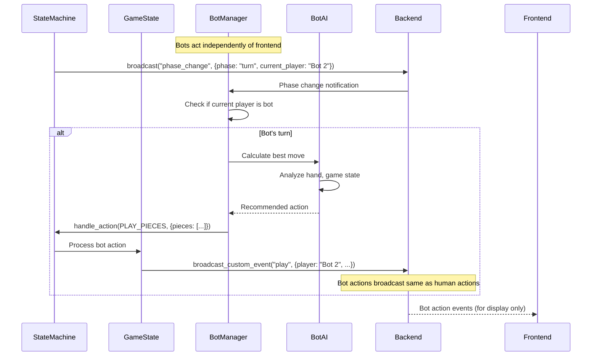

## Key Architectural Patterns

### 1. **Enterprise State Machine**
- Single source of truth for game state
- Automatic broadcasting on all state changes
- Event sourcing with complete audit trail
- No manual broadcast calls needed

### 2. **WebSocket Message Protocol**
```javascript
// Standard message format
{
  event: "event_name",
  data: { /* event-specific payload */ },
  sequence: 123,        // For ordered delivery
  timestamp: 1234567890 // For synchronization
}
```

### 3. **Phase Change Events**
The most important event type, containing complete game state:
```javascript
{
  event: "phase_change",
  data: {
    phase: "turn",
    phase_data: { /* phase-specific data */ },
    players: { /* player hands and info */ },
    allowed_actions: ["play_pieces"],
    sequence: 456,
    timestamp: 1234567890,
    reason: "All players declared"
  }
}
```

### 4. **Action Queue Pattern**
- Prevents race conditions
- Ensures ordered processing
- Thread-safe state updates

### 5. **Automatic Bot Behavior**
- Bots receive same events as humans
- Act through same state machine
- No special bot handling in frontend
- AI decisions made server-side

## Error Handling

All errors follow consistent pattern:
```javascript
{
  event: "error",
  data: {
    message: "Descriptive error message",
    type: "error_category",
    context: { /* relevant context */ }
  }
}
```

## Summary

This architecture ensures:
- **Reliability**: Enterprise patterns prevent sync bugs
- **Scalability**: Event-driven design supports many concurrent games
- **Maintainability**: Single source of truth, clear separation of concerns
- **Performance**: Efficient WebSocket communication, no polling
- **Robustness**: Automatic recovery, comprehensive error handling

# WebSocket Events Reference

## Event Flow Diagram

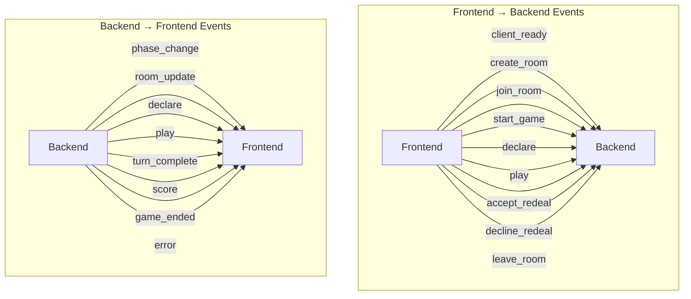

## Event Details

### Frontend → Backend Events

#### 1. **client_ready**
```javascript
{
  event: "client_ready",
  data: {}
}
```
Sent when WebSocket connection is established.

#### 2. **create_room**
```javascript
{
  event: "create_room",
  data: {
    player_name: "Alice"
  }
}
```

#### 3. **join_room**
```javascript
{
  event: "join_room",
  data: {
    room_id: "ABC123",
    player_name: "Bob"
  }
}
```

#### 4. **start_game**
```javascript
{
  event: "start_game",
  data: {}
}
```

#### 5. **declare** (Declaration Phase)
```javascript
{
  event: "declare",
  data: {
    player_name: "Alice",
    value: 3  // 0-8, total of all declarations ≠ 8
  }
}
```

#### 6. **play** (Turn Phase)
```javascript
{
  event: "play",
  data: {
    player_name: "Alice",
    piece_indices: [0, 1, 2]  // Indices of pieces in hand
  }
}
```

#### 7. **accept_redeal** / **decline_redeal**
```javascript
{
  event: "accept_redeal",
  data: {
    player_name: "Alice"
  }
}
```

### Backend → Frontend Events

#### 1. **phase_change** (Most Important)
```javascript
{
  event: "phase_change",
  data: {
    phase: "preparation" | "declaration" | "turn" | "scoring",
    round: 1,
    allowed_actions: ["declare", "play_pieces"],
    phase_data: {
      // Phase-specific data (see below)
    },
    players: {
      "Alice": {
        hand: ["GENERAL_RED(14)", "SOLDIER_BLACK(1)"],
        hand_size: 8,
        is_bot: false
      },
      "Bot 2": {
        hand: ["ELEPHANT_RED(10)", "CHARIOT_BLACK(7)"],
        hand_size: 8,
        is_bot: true
      }
    },
    sequence: 123,
    timestamp: 1735234567890,
    reason: "All players declared"
  }
}
```

##### Phase-Specific Data:

**Preparation Phase:**
```javascript
phase_data: {
  weak_players: ["Bot 2"],
  current_weak_player: "Bot 2",
  redeal_multiplier: 1,
  round_starter: "Alice"
}
```

**Declaration Phase:**
```javascript
phase_data: {
  declaration_order: ["Alice", "Bot 2", "Bot 3", "Bot 4"],
  current_declarer: "Bot 2",
  declarations: {
    "Alice": 3
  },
  declaration_total: 3
}
```

**Turn Phase:**
```javascript
phase_data: {
  current_turn_starter: "Alice",
  turn_order: ["Alice", "Bot 2", "Bot 3", "Bot 4"],
  current_player: "Bot 2",
  required_piece_count: 2,  // Set by first player
  turn_plays: {
    "Alice": {
      pieces: ["GENERAL_RED(14)", "ELEPHANT_RED(10)"],
      play_type: "PAIR",
      play_value: 24,
      is_valid: true
    }
  },
  current_turn_number: 1
}
```

**Scoring Phase:**
```javascript
phase_data: {
  round_scores: {
    "Alice": { declared: 3, actual: 2, final_score: -2 },
    "Bot 2": { declared: 2, actual: 2, final_score: 14 }  // 7 × 2 multiplier
  },
  total_scores: {
    "Alice": 23,
    "Bot 2": 28
  },
  redeal_multiplier: 2,
  game_over: false,
  winners: []
}
```

#### 2. **room_update**
```javascript
{
  event: "room_update",
  data: {
    players: {
      P1: {name: "Alice", is_bot: false, is_host: true},
      P2: {name: "Bob", is_bot: false, is_host: false},
      P3: {name: "Bot 3", is_bot: true, is_host: false},
      P4: null
    },
    host_name: "Alice",
    room_id: "ABC123",
    started: false
  }
}
```

#### 3. **declare** (Broadcast)
```javascript
{
  event: "declare",
  data: {
    player: "Bot 2",
    value: 2,
    is_bot: true
  }
}
```

#### 4. **play** (Broadcast)
```javascript
{
  event: "play",
  data: {
    player: "Alice",
    pieces: ["GENERAL_RED(14)", "ELEPHANT_RED(10)"],
    play_type: "STRAIGHT",
    play_value: 24,
    is_valid: true,
    next_player: "Bot 2",
    required_count: 2
  }
}
```

#### 5. **turn_complete**
```javascript
{
  event: "turn_complete",
  data: {
    winner: "Alice",
    winning_play: {
      pieces: ["GENERAL_RED(14)", "ELEPHANT_RED(10)"],
      play_type: "STRAIGHT",
      play_value: 24
    },
    player_piles: {
      "Alice": 3,
      "Bot 2": 0,
      "Bot 3": 1,
      "Bot 4": 0
    },
    turn_number: 1,
    next_starter: "Alice",
    all_hands_empty: false,
    will_continue: true
  }
}
```

#### 6. **game_ended**
```javascript
{
  event: "game_ended",
  data: {
    winners: ["Alice"],
    final_scores: {
      "Alice": 52,
      "Bot 2": 38,
      "Bot 3": 25,
      "Bot 4": 19
    },
    reason: "50_points_reached"
  }
}
```

#### 7. **error**
```javascript
{
  event: "error",
  data: {
    message: "Room is full",
    type: "join_room_error",
    details: {
      room_id: "ABC123",
      current_players: 4,
      max_players: 4
    }
  }
}
```

## Connection Architecture

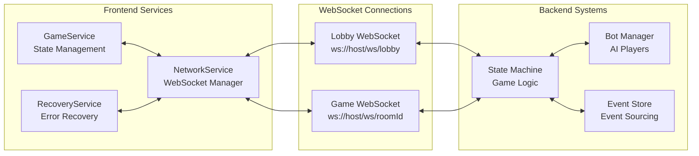

## Key Principles

1. **Single Source of Truth**: The `phase_change` event contains the complete authoritative game state
2. **No Polling**: All updates are event-driven via WebSocket
3. **Automatic Broadcasting**: State machine automatically broadcasts all changes
4. **Bot Integration**: Bots act through the same event system as humans
5. **Error Recovery**: Sequence numbers enable missed event recovery
6. **Type Safety**: Frontend TypeScript services provide full type checking