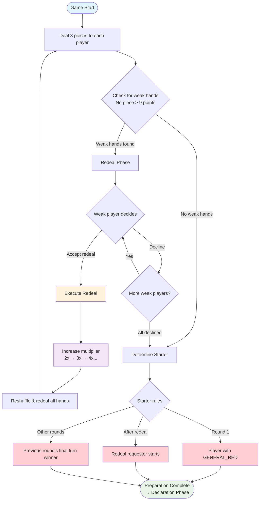
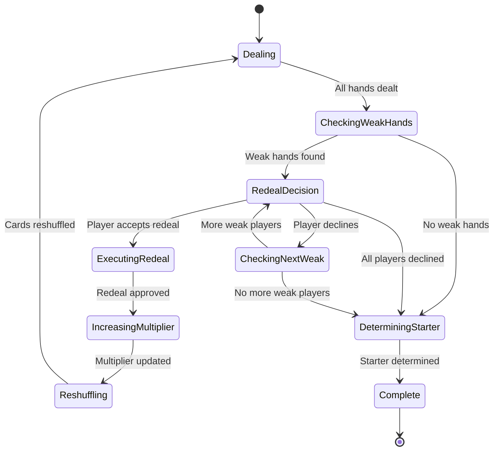
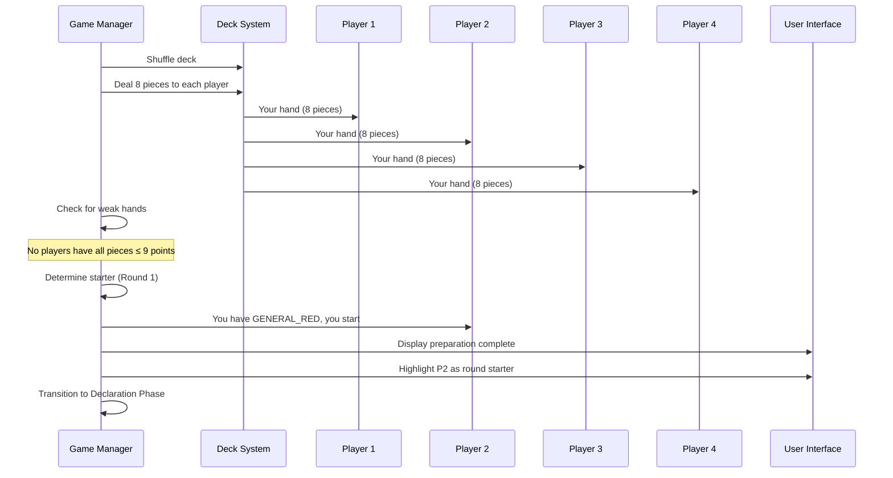
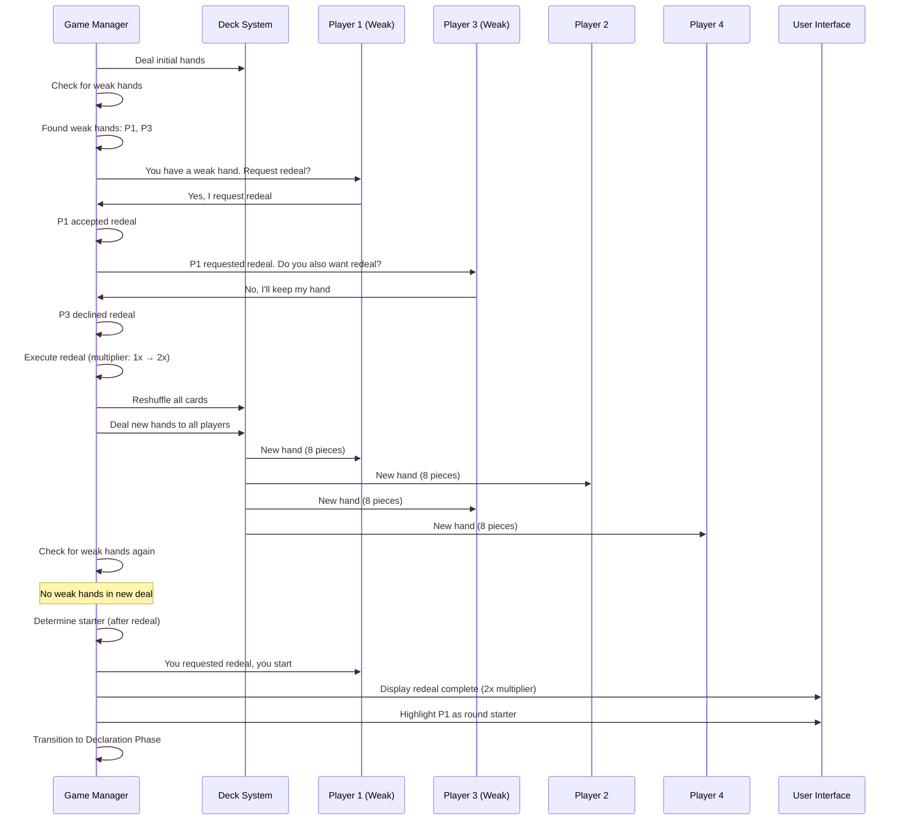
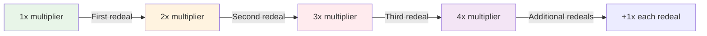

# Preparation Phase Diagrams

## Overview
The Preparation Phase handles initial game setup, piece dealing, weak hand detection, redeal mechanics, and starter determination. This phase ensures fair gameplay by allowing players with weak hands to request redeals.

## Main Flow Diagram

## State Machine Diagram

## Sequence Diagram - Normal Flow (No Weak Hands)

## Sequence Diagram - Redeal Flow

## Redeal Mechanics

### Weak Hand Definition
A weak hand contains **no pieces with value > 9 points**:
- Contains only: 1-9 point pieces
- Missing: 10, 11, 12, 13, General pieces

### Redeal Process
1. **Detection**: Identify all players with weak hands
2. **Decision**: Each weak player decides independently
3. **Execution**: If any player accepts, redeal for everyone
4. **Multiplier**: Increase score multiplier (2x, 3x, 4x...)
5. **Restart**: Return to dealing phase with new multiplier

### Starter Determination Rules

| Condition | Starter |
|-----------|---------|
| Round 1, no redeal | Player with GENERAL_RED piece |
| After redeal | Player who requested the redeal |
| Subsequent rounds | Winner of previous round's final turn |

## Multiplier System

## Error Conditions

- **Invalid Hand Size**: Player receives ≠ 8 pieces
- **Deck Exhaustion**: Not enough cards for redeal (should never happen)
- **Missing GENERAL_RED**: No player has GENERAL_RED in Round 1
- **Invalid Starter**: Cannot determine starter based on rules