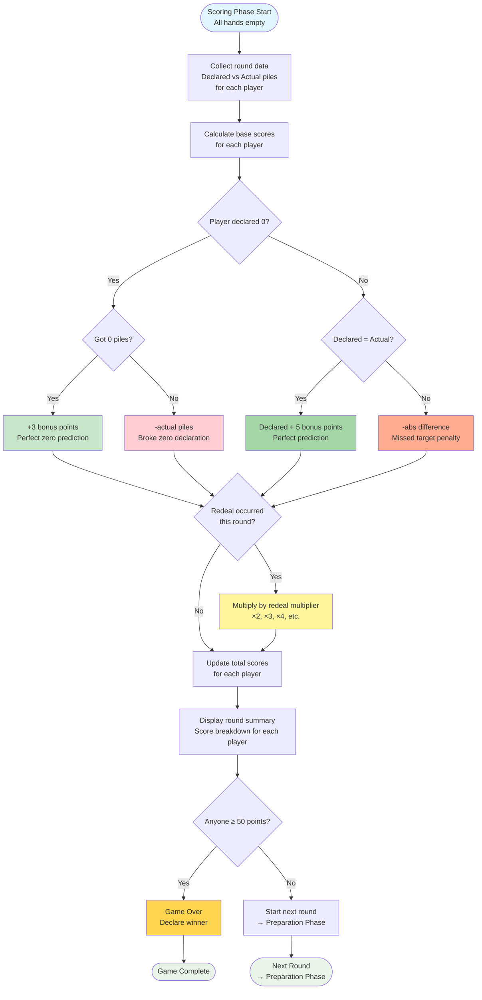
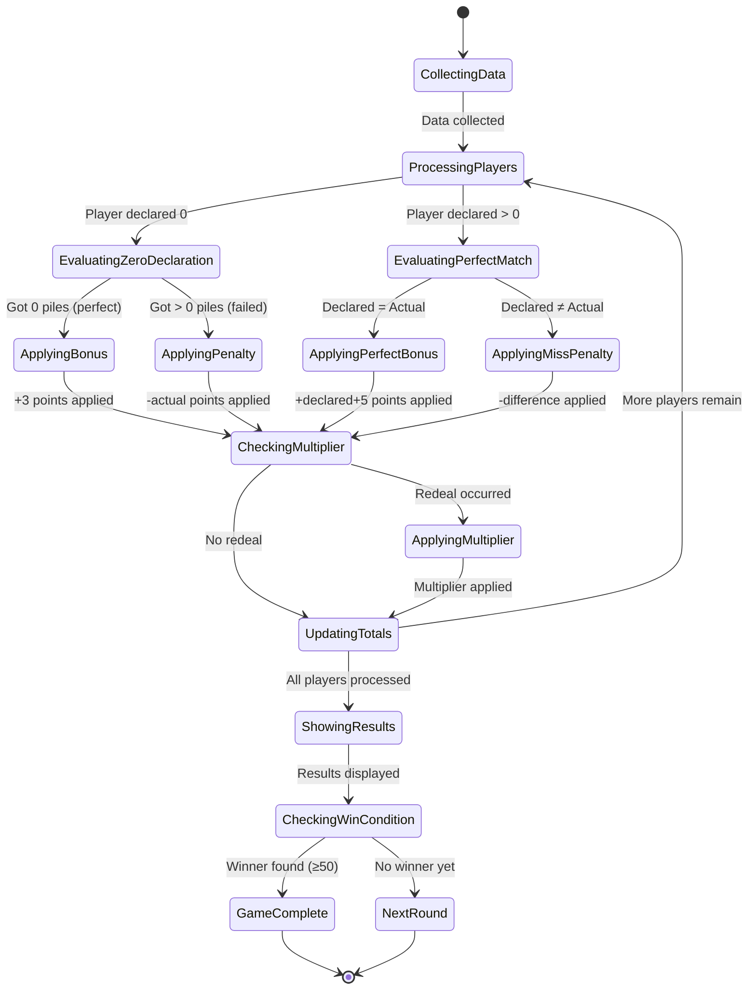
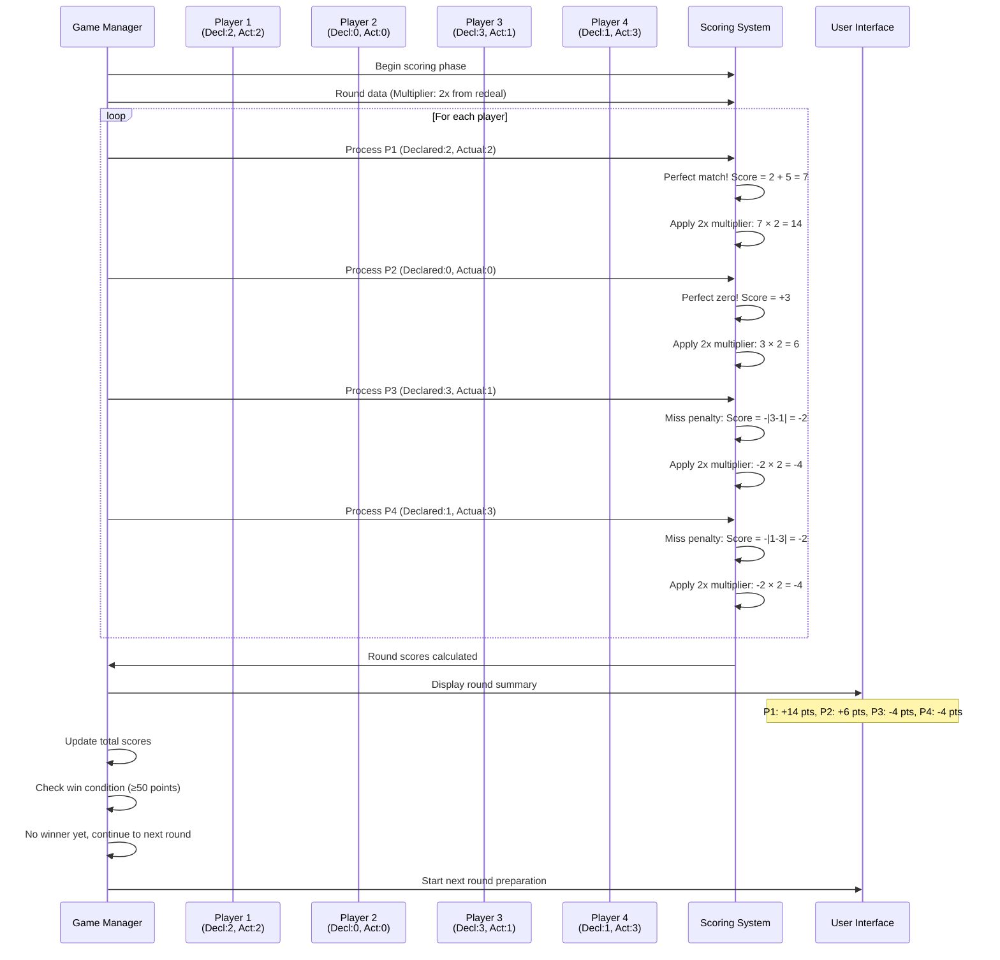
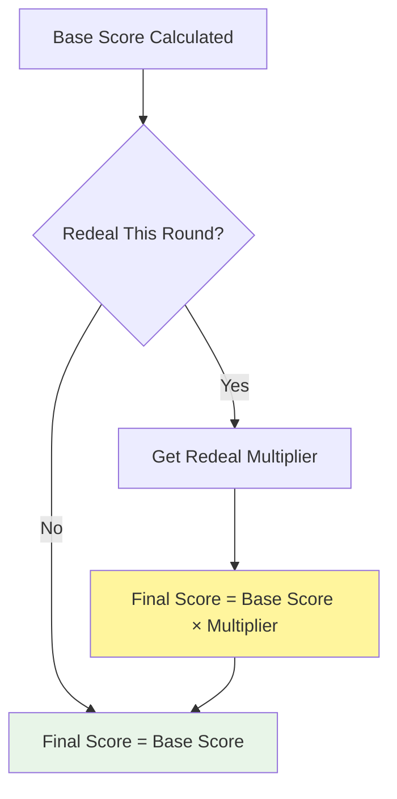

# Scoring Phase Diagrams

## Overview
The Scoring Phase calculates points based on declared vs actual pile counts, applies bonuses/penalties, handles redeal multipliers, and determines game completion. This phase implements the core scoring mechanics that drive strategic gameplay.

## Main Flow Diagram



## State Machine Diagram



## Scoring Algorithm Flowchart

```mermaid
flowchart TD
    PlayerData[Player: Declared=2, Actual=3] --> ZeroCheck{Declared = 0?}
    
    ZeroCheck -->|No| PerfectCheck{Declared = Actual?}
    ZeroCheck -->|Yes| ZeroActual{Actual = 0?}
    
    ZeroActual -->|Yes| ZeroBonus[Score = +3]
    ZeroActual -->|No| ZeroPenalty[Score = -Actual]
    
    PerfectCheck -->|Yes| PerfectBonus[Score = Declared + 5]
    PerfectCheck -->|No| MissPenalty[Score = -|Declared - Actual|]
    
    ZeroBonus --> MultCheck
    ZeroPenalty --> MultCheck
    PerfectBonus --> MultCheck
    MissPenalty --> MultCheck{Redeal Multiplier?}
    
    MultCheck -->|Yes| ApplyMult[Score × Multiplier]
    MultCheck -->|No| FinalScore[Final Score]
    
    ApplyMult --> FinalScore
    
    %% Example calculation
    MissPenalty --> ExampleCalc[Score = -|2 - 3| = -1]
    ExampleCalc --> MultCheck
    
    style ZeroBonus fill:#c8e6c9
    style PerfectBonus fill:#a5d6a7
    style ZeroPenalty fill:#ffcdd2
    style MissPenalty fill:#ffab91
    style ApplyMult fill:#fff59d
```

## Sequence Diagram - Scoring Calculation



## Scoring Rules Reference

### Base Scoring Rules

| Scenario | Calculation | Example |
|----------|-------------|---------|
| **Perfect Zero** | Declared 0, Got 0 | +3 points |
| **Failed Zero** | Declared 0, Got X | -X points |
| **Perfect Match** | Declared = Actual | Declared + 5 points |
| **Miss Penalty** | Declared ≠ Actual | -\|Declared - Actual\| points |

### Multiplier Application



### Win Condition

- **Target**: First player to reach **≥50 total points**
- **Check Timing**: After each round's scoring
- **Tie Resolution**: Multiple players can win simultaneously
- **Game End**: Immediate upon reaching 50+ points

## Example Scoring Scenarios

### Scenario 1: Perfect Round
- **Player**: Declared 3, Actual 3, Multiplier 1x
- **Calculation**: 3 + 5 = 8 points
- **Result**: +8 points

### Scenario 2: Zero Success with Multiplier
- **Player**: Declared 0, Actual 0, Multiplier 3x
- **Calculation**: 3 × 3 = 9 points
- **Result**: +9 points

### Scenario 3: Major Miss with Penalty
- **Player**: Declared 1, Actual 5, Multiplier 2x
- **Calculation**: -|1-5| × 2 = -8 points
- **Result**: -8 points

### Scenario 4: Failed Zero
- **Player**: Declared 0, Actual 2, Multiplier 1x
- **Calculation**: -2 points
- **Result**: -2 points

## Error Conditions

- **Invalid Declaration Data**: Missing or corrupted declaration records
- **Invalid Actual Data**: Pile counts don't match game state
- **Multiplier Error**: Invalid or missing redeal multiplier
- **Score Overflow**: Player score exceeds system limits
- **Win Detection Failure**: Multiple winners not handled properly