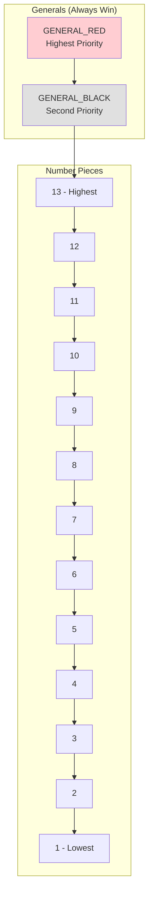

# Turn Phase Diagrams

## Overview
The Turn Phase is the core gameplay where players compete by playing pieces. The starter determines the number of pieces for each turn, and the winner takes piles while becoming the next starter. This continues until all hands are empty.

## Main Flow Diagram

## State Machine Diagram

## Sequence Diagram - Single Turn

## Sequence Diagram - Complete Turn Phase

## Turn Resolution Algorithm

## Piece Value Hierarchy

## Turn Examples

### Example 1: General vs Numbers
- **P1**: GENERAL_RED (value: special)
- **P2**: 13 + 12 = 25
- **P3**: 11 + 10 = 21  
- **P4**: 9 + 8 = 17
- **Winner**: P1 (generals always beat numbers)

### Example 2: Number Competition
- **P1**: 11 + 10 = 21
- **P2**: 13 + 7 = 20
- **P3**: 12 + 9 = 21 (tie!)
- **P4**: 8 + 6 = 14
- **Tie Breaker**: P1 has 11, P3 has 12 → P3 wins (highest single piece)

### Example 3: Multiple Generals
- **P1**: GENERAL_BLACK
- **P2**: 13 + 12 = 25
- **P3**: GENERAL_RED
- **P4**: 11 + 10 = 21
- **Winner**: P3 (GENERAL_RED beats GENERAL_BLACK)

## Game Flow Rules

### Starter Rules
1. **First Turn**: Round starter (from Preparation Phase)
2. **Subsequent Turns**: Previous turn winner
3. **Invalid Play**: Starter must replay until valid

### Piece Count Rules
1. **Starter Choice**: 1-6 pieces (or remaining hand size)
2. **Others Must Match**: Exact same number of pieces
3. **No Choice**: Once starter plays, count is fixed

### Winning Rules
1. **Generals**: Always beat number pieces
2. **General Hierarchy**: RED > BLACK
3. **Number Competition**: Highest total wins
4. **Tie Breaking**: Highest single piece value

### Pile Distribution
- **Winner Gets**: Number of piles = pieces played per person
- **Example**: 3-piece turn → winner gets 3 piles
- **Accumulation**: Piles accumulate for final scoring

## Error Conditions

- **Invalid Starter Play**: Starter plays invalid piece combination
- **Wrong Piece Count**: Player plays ≠ required pieces
- **Invalid Pieces**: Player plays pieces they don't have
- **Turn Resolution Error**: Cannot determine winner
- **Pile Distribution Error**: Incorrect pile count assignment