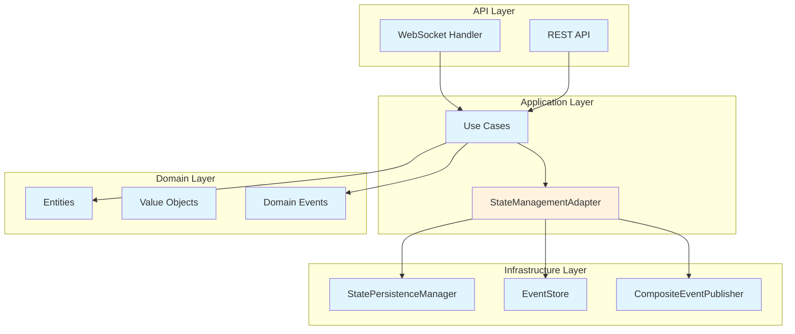
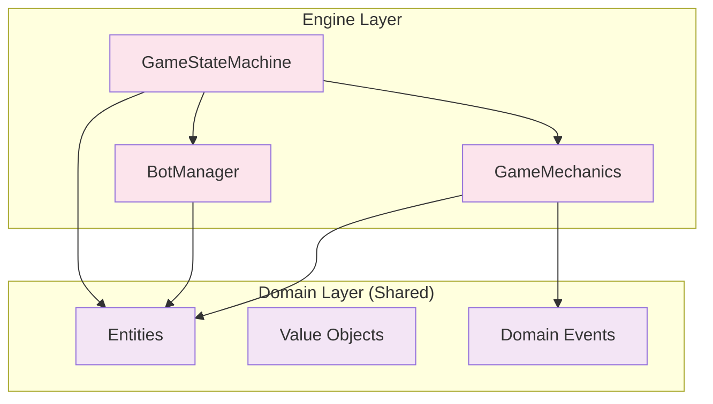
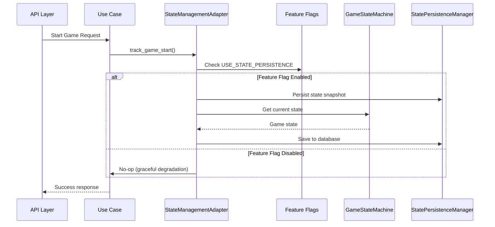
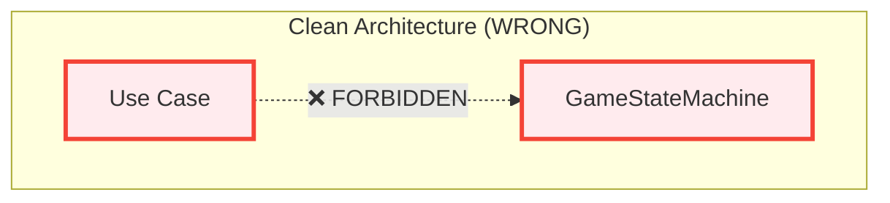
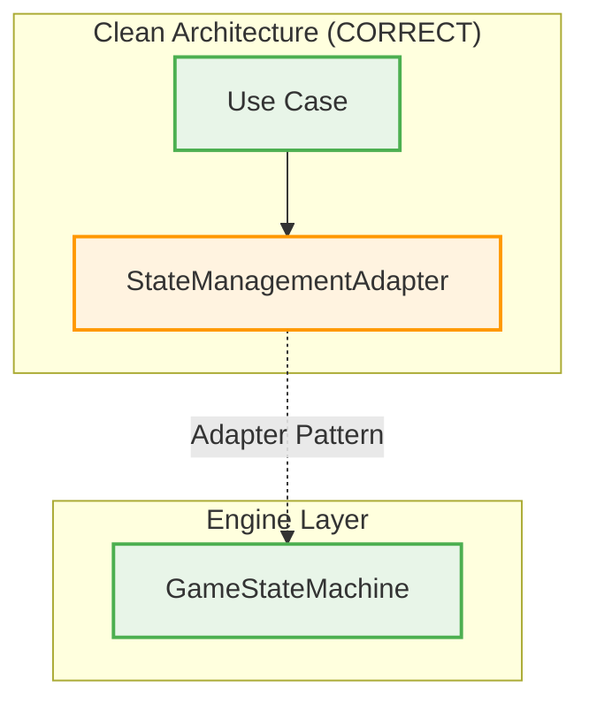
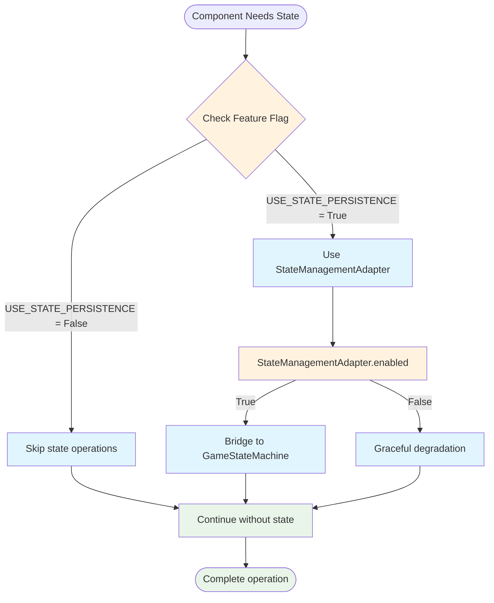
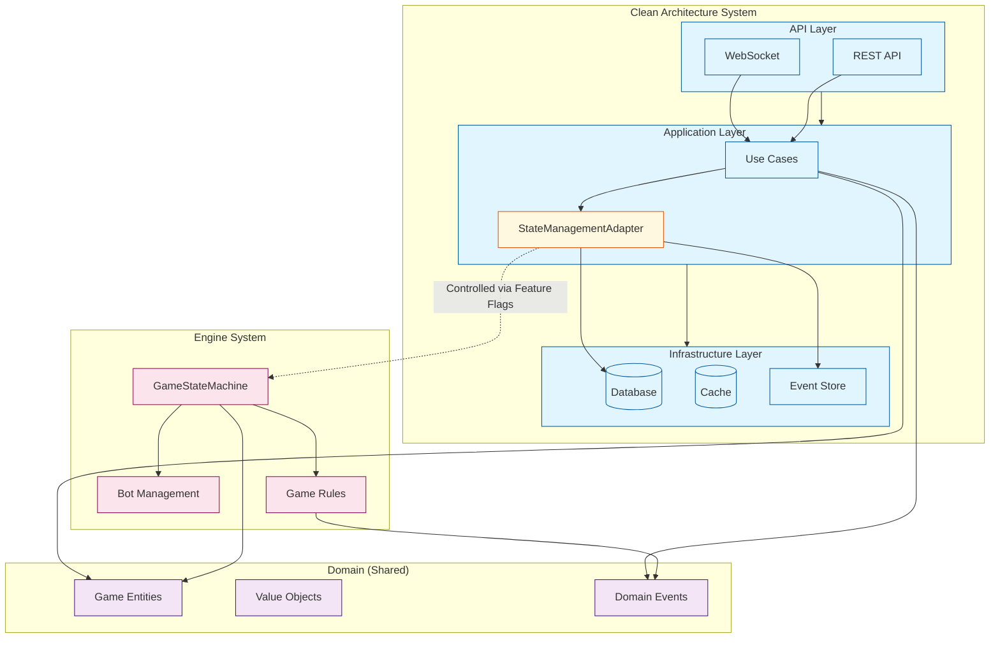

# Component Interaction Diagrams

## Overview

This document provides visual representations of how components interact across the Clean Architecture and Engine Layer boundary. These diagrams help prevent architectural confusion by clearly showing proper interaction patterns.

## Clean Architecture Flow (State Persistence)



## Engine Layer Flow (State Machine)



## Cross-System Integration via Adapter Pattern



## Forbidden Interaction Pattern (WRONG)



## Correct Interaction Pattern (RIGHT)



## Feature Flag Decision Flow



## State Management Architecture Overview



## Component Responsibility Matrix

| Layer | Components | Responsibilities | Can Import From | Cannot Import From |
|-------|------------|------------------|-----------------|-------------------|
| **Domain** | Entities, Value Objects, Events | Core business logic | Nothing | All other layers |
| **Application** | Use Cases, Adapters | Application logic, orchestration | Domain | Infrastructure, API, Engine |
| **Infrastructure** | Persistence, Event Store | External concerns | Domain, Application | API, Engine |
| **API** | WebSocket, REST | External interfaces | Domain, Application, Infrastructure | Engine |
| **Engine** | StateMachine, Bots, Rules | Game mechanics | Domain (minimal) | Application, Infrastructure, API |

## Validation Checkpoints

Each interaction must pass these checkpoints:

1. **Import Direction Check**: Verify dependency flow follows Clean Architecture rules
2. **Feature Flag Check**: Ensure feature flags control cross-system interactions
3. **Adapter Pattern Check**: Verify adapters mediate between systems
4. **Null Safety Check**: Confirm graceful handling when features are disabled
5. **Boundary Respect Check**: Ensure each system maintains its responsibilities

## Common Anti-Patterns to Avoid

### ❌ Direct Engine Import in Use Case
```python
# WRONG - Use case directly importing Engine
from backend.engine.game_state_machine import GameStateMachine

class StartGameUseCase:
    def __init__(self, game_machine: GameStateMachine):  # ❌ Direct dependency
        self._game_machine = game_machine
```

### ✅ Correct Adapter Pattern
```python
# CORRECT - Use case with adapter
from backend.application.adapters.state_management_adapter import StateManagementAdapter

class StartGameUseCase:
    def __init__(self, state_adapter: StateManagementAdapter):  # ✅ Adapter dependency
        self._state_adapter = state_adapter
        
    def execute(self, game_id: str):
        if self._state_adapter and self._state_adapter.enabled:  # ✅ Feature flag check
            self._state_adapter.track_game_start(game_id)
```

## Integration Points Summary

- **Domain Events**: Shared communication mechanism between systems
- **StateManagementAdapter**: Clean Architecture's bridge to Engine Layer
- **Feature Flags**: Runtime control over system integration
- **Graceful Degradation**: Systems work independently when features disabled

This architecture prevents tight coupling while enabling controlled interaction between Clean Architecture and Engine Layer systems.