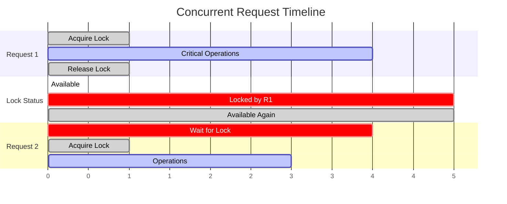

# Atomic Room Operations

```mermaid
gantt
    title Concurrent Request Timeline
    dateFormat X
    axisFormat %s

    section Request 1
    Acquire Lock          :done, r1lock, 0, 1
    Critical Operations   :active, r1ops, 1, 4
    Release Lock         :done, r1rel, 5, 1

    section Lock Status
    Available            :done, avail1, 0, 0
    Locked by R1         :crit, locked1, 0, 5
    Available Again      :done, avail2, 5, 5

    section Request 2
    Wait for Lock        :crit, r2wait, 1, 4
    Acquire Lock         :done, r2lock, 5, 1
    Operations           :active, r2ops, 6, 3
```
