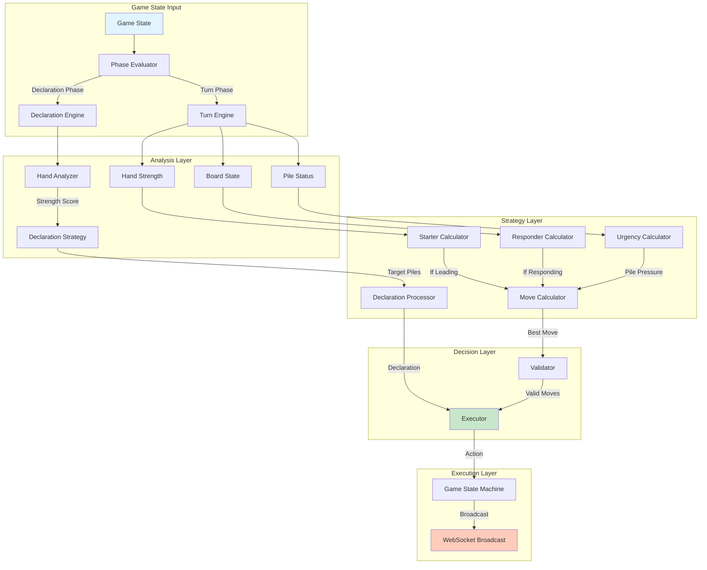
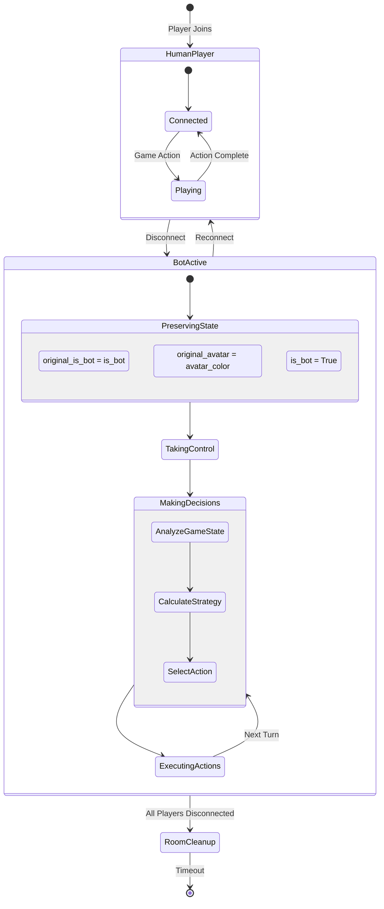
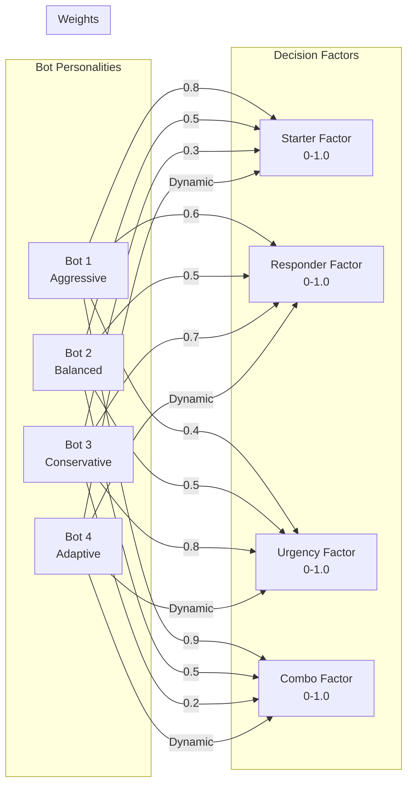
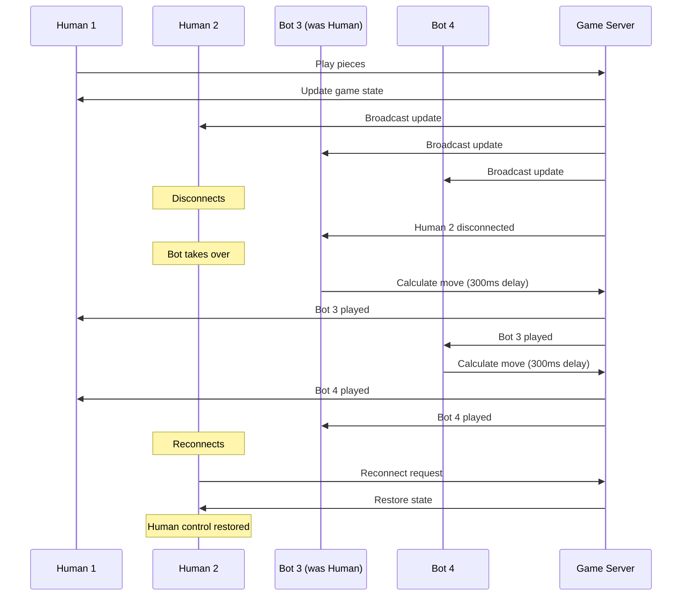
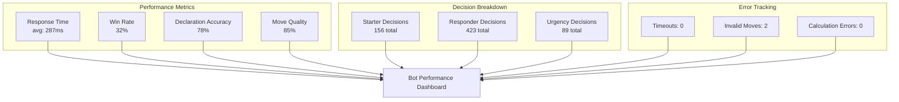

# Bot Architecture Diagram Proposals

## 1. **Bot Decision-Making Flow** (Most Comprehensive)
Shows the complete AI decision process from game state analysis to action execution.

## 2. **Bot Lifecycle Diagram** (Best for Operations)
Shows bot activation, deactivation, and state transitions.

## 3. **Bot Strategy Matrix** (Best for AI Logic)
Shows different bot personalities and their decision weights.

## 4. **Bot-Human Interaction Flow** (Best for UX)
Shows how bots interact with human players seamlessly.

## 5. **Bot Performance Dashboard** (Best for Monitoring)
Shows bot performance metrics and decision quality.

## Recommendation

For the Liap Tui documentation, I recommend using **Option 1 (Bot Decision-Making Flow)** as the primary diagram because:

1. **Technical Clarity**: Shows the complete AI architecture from input to output
2. **Debugging Aid**: Developers can trace decision paths
3. **Comprehensive**: Covers all phases (Declaration, Turn, Execution)
4. **Modular Design**: Shows clear separation of concerns

You could supplement with **Option 4 (Bot-Human Interaction)** to show the seamless takeover functionality, as this is a key feature of the system.

## Implementation Notes

- Use **Option 1** in the AI Architecture documentation
- Use **Option 4** in the Disconnect/Reconnect documentation
- Include **Option 2** in the Operations guide
- Consider **Option 5** for monitoring documentation
