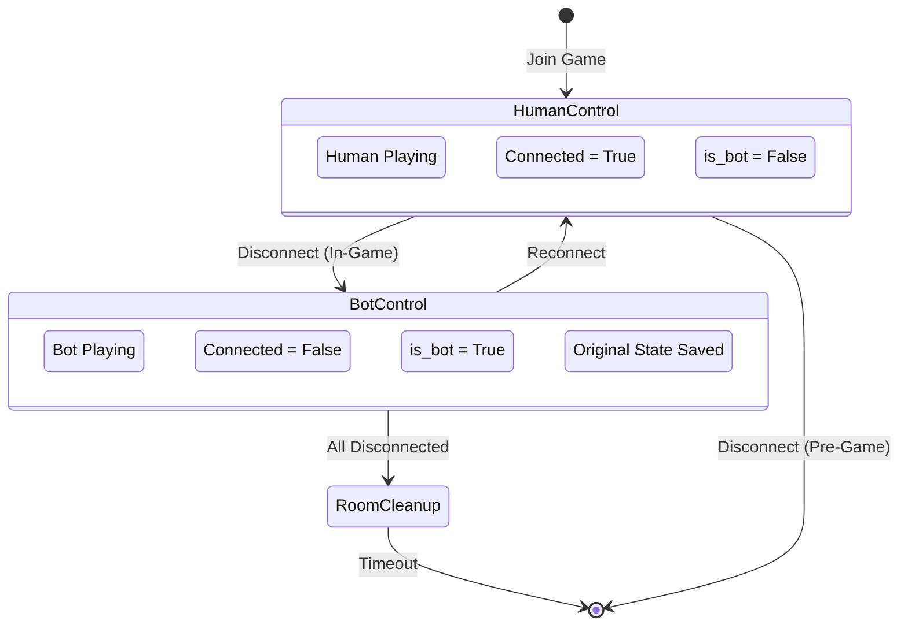

# Bot State Machine Diagram

Clean state representation showing bot activation and deactivation during player disconnects.



## State Descriptions

### HumanControl State
The normal playing state when a human player is actively connected:
- **Human Playing**: Player has full control of their actions
- **Connected = True**: WebSocket connection is active
- **is_bot = False**: Player flag indicates human control

### BotControl State
The temporary state when a player disconnects during an active game:
- **Bot Playing**: AI takes over player decisions
- **Connected = False**: WebSocket connection is lost
- **is_bot = True**: Player flag indicates bot control
- **Original State Saved**: Player's original bot/human status preserved

### RoomCleanup State
Transitional state when all players have disconnected:
- Room marked for cleanup
- Cleanup timer starts
- Resources freed after timeout

## Transition Conditions

### HumanControl → BotControl
- **Trigger**: Player disconnects while game is in progress
- **Actions**:
  1. Save original player state
  2. Set is_bot = True
  3. Mark as disconnected
  4. Create message queue
  5. Broadcast disconnect event

### HumanControl → [End]
- **Trigger**: Player disconnects before game starts
- **Actions**:
  1. Remove player from room
  2. Migrate host if necessary
  3. Delete room if empty

### BotControl → HumanControl
- **Trigger**: Player reconnects with valid session
- **Actions**:
  1. Verify session credentials
  2. Restore original is_bot state
  3. Mark as connected
  4. Send current game state
  5. Deliver queued messages

### BotControl → RoomCleanup
- **Trigger**: All remaining players are bots
- **Actions**:
  1. Mark room for cleanup
  2. Start cleanup timer
  3. Continue game until timeout

## Implementation Details

```python
# State transitions in code

# HumanControl -> BotControl
if room and room.started and not player.is_bot:
    # Save state
    player.original_is_bot = player.is_bot
    player.original_avatar_color = player.avatar_color

    # Transition to bot control
    player.is_bot = True
    player.is_connected = False
    player.disconnect_time = datetime.now()

# BotControl -> HumanControl
if is_reconnecting and player:
    # Restore state
    player.is_bot = player.original_is_bot
    player.is_connected = True
    player.disconnect_time = None

# BotControl -> RoomCleanup
if not room.has_any_human_players():
    room.mark_for_cleanup()
```

## Key Features

1. **State Preservation**: Original player state is never lost
2. **Seamless Transitions**: No game interruption during state changes
3. **Automatic Cleanup**: Prevents zombie rooms with only bots
4. **Reconnection Support**: Players can return to their original state
5. **Clear State Boundaries**: Each state has well-defined properties
