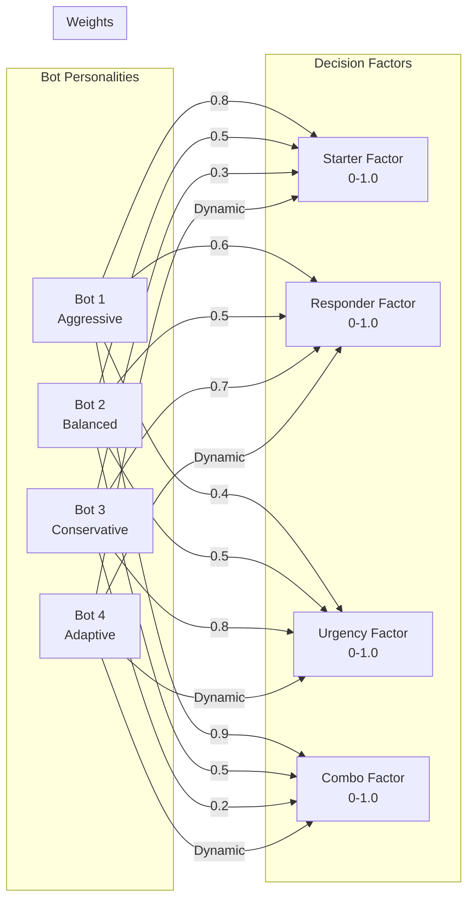

# Bot Strategy Matrix - AI Decision Logic

This diagram shows different bot personalities and their decision weights for various game factors.



## Bot Personality Descriptions

### Bot 1 - Aggressive
- **Starter Factor (0.8)**: Strongly prefers to lead and control the pace
- **Responder Factor (0.6)**: Moderate response to opponent moves
- **Urgency Factor (0.4)**: Less concerned about pile pressure
- **Combo Factor (0.9)**: Heavily favors playing strong combinations

### Bot 2 - Balanced
- **All Factors (0.5)**: Equal weight to all decision factors
- **Consistent play style across all game situations
- **No strong preferences, adapts to game flow

### Bot 3 - Conservative
- **Starter Factor (0.3)**: Prefers to respond rather than lead
- **Responder Factor (0.7)**: Strong reactive play
- **Urgency Factor (0.8)**: Very sensitive to pile pressure
- **Combo Factor (0.2)**: Saves strong combinations

### Bot 4 - Adaptive
- **Dynamic Weights**: Adjusts strategy based on:
  - Current game state
  - Opponent behavior
  - Score differential
  - Round progression

## Decision Factor Explanations

### Starter Factor
- Measures willingness to play first in a turn
- Higher values = more aggressive opening plays
- Lower values = wait-and-see approach

### Responder Factor
- Influences response strength to opponent plays
- Higher values = stronger counter-plays
- Lower values = minimal responses

### Urgency Factor
- Sensitivity to pile count pressure
- Higher values = play more pieces when behind
- Lower values = maintain steady pace

### Combo Factor
- Preference for playing strong combinations
- Higher values = use best combos early
- Lower values = save combos for critical moments

## Implementation Example

```python
class BotPersonality:
    def __init__(self, starter_weight, responder_weight, urgency_weight, combo_weight):
        self.weights = {
            'starter': starter_weight,
            'responder': responder_weight,
            'urgency': urgency_weight,
            'combo': combo_weight
        }

    def calculate_move_score(self, move, game_context):
        score = 0
        score += move.starter_value * self.weights['starter']
        score += move.responder_value * self.weights['responder']
        score += move.urgency_value * self.weights['urgency']
        score += move.combo_value * self.weights['combo']
        return score

# Bot personalities
bot_personalities = {
    1: BotPersonality(0.8, 0.6, 0.4, 0.9),  # Aggressive
    2: BotPersonality(0.5, 0.5, 0.5, 0.5),  # Balanced
    3: BotPersonality(0.3, 0.7, 0.8, 0.2),  # Conservative
    4: BotPersonality(*adaptive_weights())   # Adaptive
}
```
