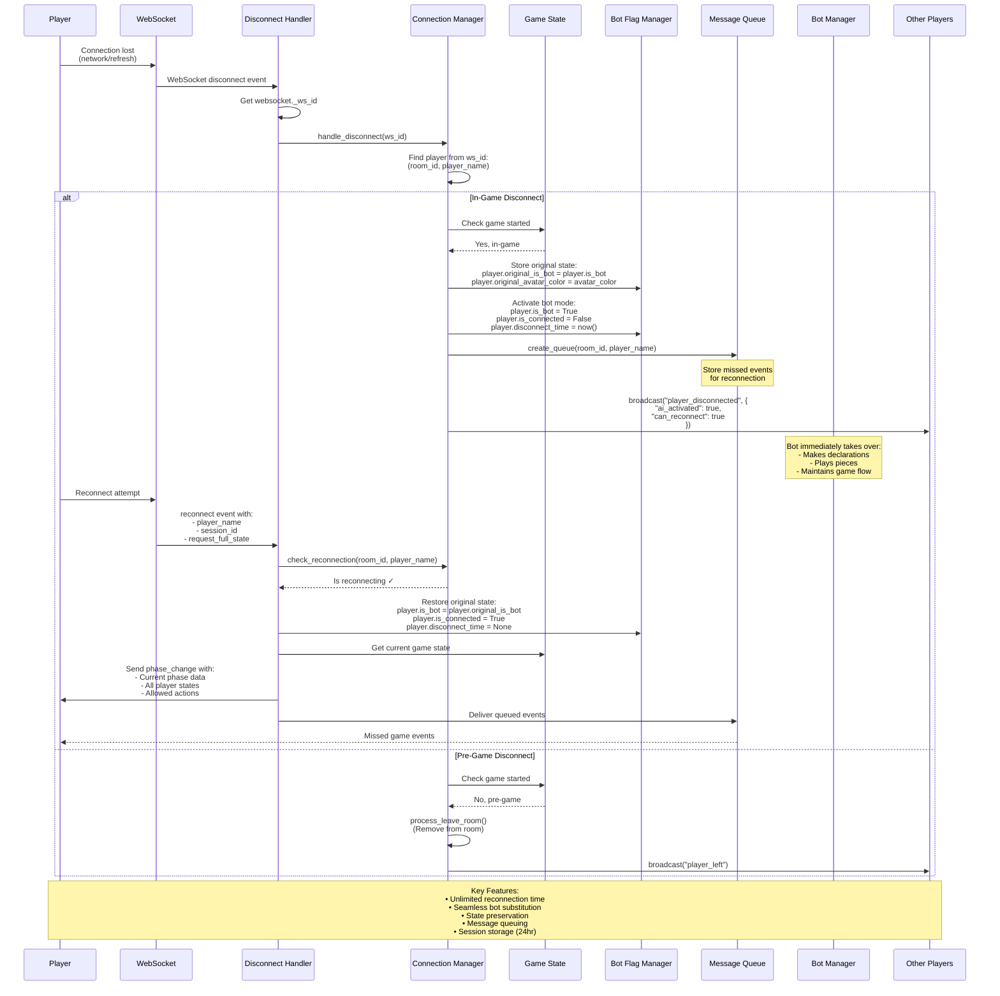

# Bot Takeover Flow - Seamless Player Substitution

This diagram illustrates how the system seamlessly handles player disconnections with automatic bot substitution.



## Key Components

### 1. WebSocket ID Tracking
```python
# Each WebSocket gets a unique ID
websocket._ws_id = str(uuid.uuid4())

# Mapping maintained in ConnectionManager
self.websocket_to_player[ws_id] = (room_id, player_name)
```

### 2. State Preservation
```python
# Store original state before bot takeover
player.original_is_bot = player.is_bot
player.original_avatar_color = player.avatar_color

# Activate bot mode
player.is_bot = True
player.is_connected = False
player.disconnect_time = datetime.now()
```

### 3. Message Queue System
```python
# Create queue for disconnected player
await message_queue_manager.create_queue(room_id, player_name)

# On reconnection, deliver missed events
queued_messages = await message_queue_manager.get_messages(room_id, player_name)
```

### 4. Session Storage (Frontend)
```javascript
// Store session data in localStorage
const sessionData = {
    roomId,
    playerName,
    sessionId,
    createdAt: Date.now(),
    lastActivity: Date.now(),
    gamePhase,
};
localStorage.setItem('gameSession', JSON.stringify(sessionData));
```

## Disconnect Scenarios

### In-Game Disconnect
1. Player marked as disconnected but remains in game
2. Bot immediately takes control
3. Game continues without interruption
4. Player can reconnect anytime
5. Full state restored on reconnection

### Pre-Game Disconnect
1. Player removed from room
2. No bot activation
3. Host migration if necessary
4. Room deleted if empty

## Benefits

1. **Zero Game Interruption**: Bots maintain game flow during disconnects
2. **Unlimited Reconnection**: Players can return anytime during active game
3. **State Consistency**: Original player state perfectly preserved
4. **Message Integrity**: No game events lost during disconnect
5. **Browser Refresh Support**: Session survives page reloads
6. **Automatic Cleanup**: Rooms with only bots are cleaned up after timeout
