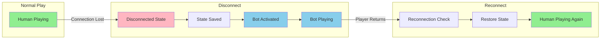
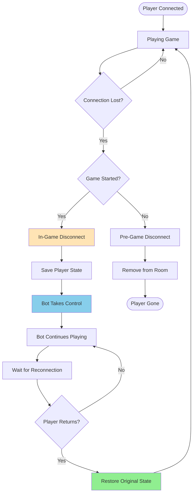
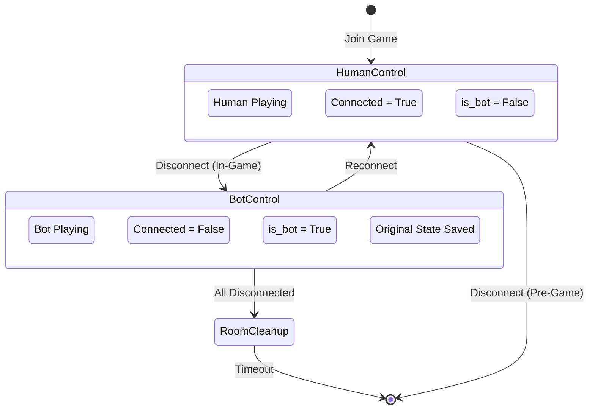
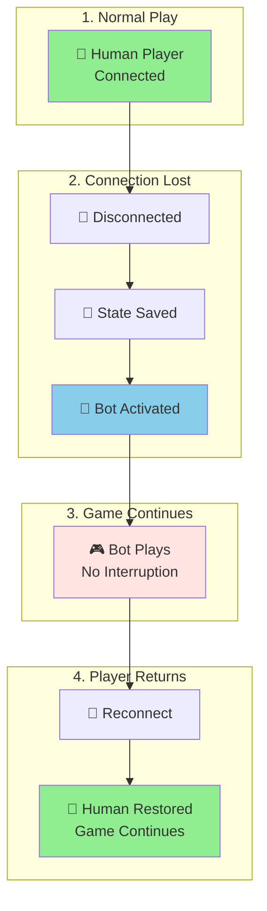

# Bot Takeover Flow - Simplified Alternatives

## Option 1: High-Level State Transition (Recommended)

Simple and clear, focuses on the player's perspective.

## Option 2: Timeline View

Shows the seamless transition over time.

```mermaid
gantt
    title Player Connection Timeline
    dateFormat X
    axisFormat %s

    section Human Player
    Active Play           :done, human1, 0, 30
    Reconnected          :done, human2, 70, 30

    section Connection
    Connected            :done, conn1, 0, 30
    Disconnected         :crit, disc, 30, 40
    Connected Again      :done, conn2, 70, 30

    section Bot Control
    Inactive             :done, bot1, 0, 30
    Bot Takes Over       :active, bot2, 30, 40
    Inactive Again       :done, bot3, 70, 30

    section Game State
    Playing              :done, game1, 0, 100
```

## Option 3: Simple Flow Chart

Focus on the key decision point and actions.

## Option 4: State Machine Diagram

Clean state representation.

## Option 5: Visual Metaphor

Using icons and minimal text for clarity.

## Recommendation

I recommend **Option 3 (Simple Flow Chart)** because it:
- Shows both disconnect scenarios clearly
- Easy to follow the logic flow
- Highlights the key decision points
- Not overwhelming with technical details
- Still includes all important states

For technical documentation, you could use **Option 1** as a companion diagram showing the high-level state transitions without the implementation details.
