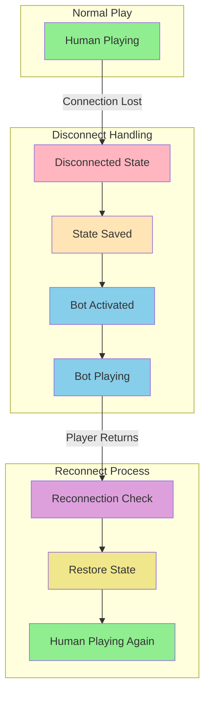
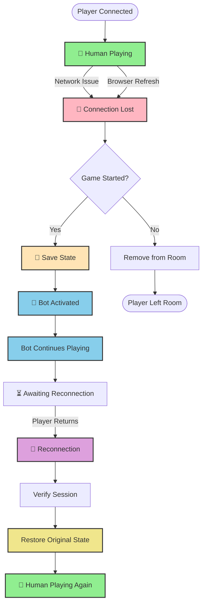
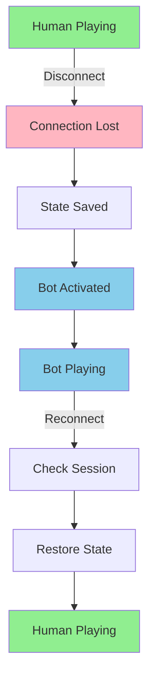

# Bot Takeover Flow - Vertical State Transition

Simple and clear vertical flow, focusing on the player's journey through disconnect and reconnect.

## Alternative Vertical Layout (With More Detail)

## Compact Vertical Version

The vertical layout makes it easier to follow the flow from top to bottom, showing the natural progression of states during a disconnect/reconnect cycle.
