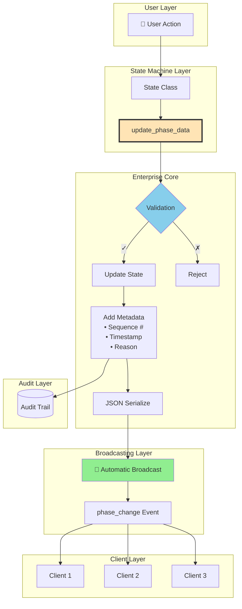

# Enterprise State Machine Architecture

```mermaid
graph TD
    subgraph UL[User Layer]
        U[👤 User Action]
    end

    subgraph SML[State Machine Layer]
        U --> SC[State Class]
        SC --> UPD[update_phase_data]
    end

    subgraph EC[Enterprise Core]
        UPD --> VAL{Validation}
        VAL -->|✓| STORE[Update State]
        VAL -->|✗| ERR[Reject]

        STORE --> META[Add Metadata<br/>• Sequence #<br/>• Timestamp<br/>• Reason]
        META --> JSON[JSON Serialize]
    end

    subgraph BL[Broadcasting Layer]
        JSON --> AUTO[🔄 Automatic Broadcast]
        AUTO --> EVT[phase_change Event]
    end

    subgraph CL[Client Layer]
        EVT --> C1[Client 1]
        EVT --> C2[Client 2]
        EVT --> C3[Client 3]
    end

    subgraph AL[Audit Layer]
        META --> AUDIT[(Audit Trail)]
    end

    style UPD fill:#FFE4B5,stroke:#333,stroke-width:3px
    style AUTO fill:#90EE90
    style VAL fill:#87CEEB
```
