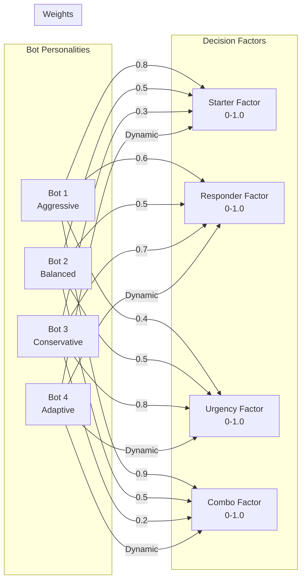

# Human-like AI Behavior

```mermaid
graph LR
    subgraph "Bot Personalities"
        B1[Bot 1<br/>Aggressive]
        B2[Bot 2<br/>Balanced]
        B3[Bot 3<br/>Conservative]
        B4[Bot 4<br/>Adaptive]
    end

    subgraph "Decision Factors"
        SF[Starter Factor<br/>0-1.0]
        RF[Responder Factor<br/>0-1.0]
        UF[Urgency Factor<br/>0-1.0]
        CF[Combo Factor<br/>0-1.0]
    end

    subgraph "Weights"
        B1 --> |0.8| SF
        B1 --> |0.6| RF
        B1 --> |0.4| UF
        B1 --> |0.9| CF

        B2 --> |0.5| SF
        B2 --> |0.5| RF
        B2 --> |0.5| UF
        B2 --> |0.5| CF

        B3 --> |0.3| SF
        B3 --> |0.7| RF
        B3 --> |0.8| UF
        B3 --> |0.2| CF

        B4 --> |Dynamic| SF
        B4 --> |Dynamic| RF
        B4 --> |Dynamic| UF
        B4 --> |Dynamic| CF
    end
```
